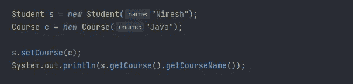
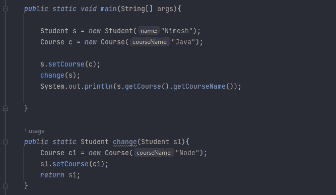
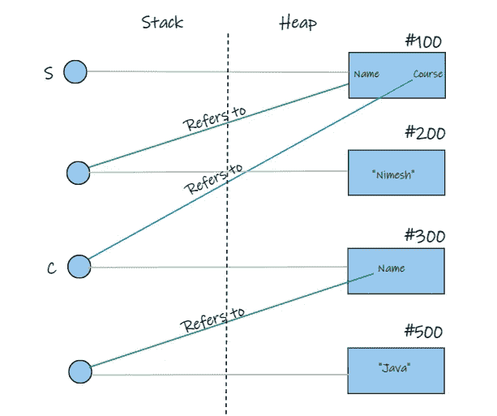
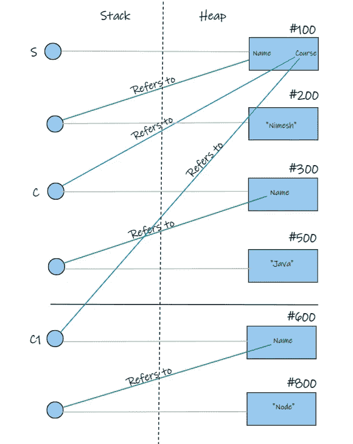

# Java 是按值传递还是按引用传递

> 原文：<https://blog.devgenius.io/is-java-pass-by-value-or-pass-by-reference-9924acde8d3?source=collection_archive---------1----------------------->

读者们好，

java 编程语言最大的困惑之一就是 Java 到底是**传值**还是**传引用**。当我们面对一次面试时，这个问题被许多面试官问到，仍然可以看到被面试者对此感到困惑。所以我想写一篇关于它的文章来澄清围绕它的所有困惑。

首先要明白什么是按值传递，什么是按引用传递。

*   **传值**:将方法参数值复制到另一个变量，然后传递复制的对象，所以叫传值。
*   **通过引用传递**:实际参数的别名或引用被传递给方法，这就是为什么它被称为通过引用传递。

Java 总是按值传递，而不是按引用传递。在我们开始这个故事之前，让我们先看一些代码，

与上面的代码一样，“Java”被打印为课程。如果我们修改如下所示的代码，

那么，你认为结果如何？是“节点”，对，**没错**。最后，我们得出结论，引用类型是通过引用传递的。这是真的吗？让我们看一张图，看看在上面的例子中实际发生了什么。

上图显示了第一个代码块是如何组合在一起的。s 生成两个变量和一个对象。第一个有标题 Sting 对象。第二个是关于课程对象的。您可以看到 s. Course()引用了 C 和对象“Java”，后者位于位置 **#500** 。让我们看看执行第二个代码块时会发生什么。

如上图所示，当我们创建一个 **c1** 对象时，当我们运行第二个块时，它被保存在一个不同的地址。当我们使用 **s.setCourse()** 函数时， **s** 的参考地址从 **c** 变为 **c1** 。结果，你可以看到 c 的值保持不变。推荐地址是这里唯一改变的项目。它指的是 **c1** 而不是 **c** 。

我们可以由此得出结论，Java 总是按值传递。

本文中使用的代码片段可以在。[主 black hawk 1212/learn-with-krish(github.com)](https://github.com/BlackHawk1212/learn-with-krish/tree/main/Essential_Java/Java_Pass_by_Value_or_Reference)

谢谢大家！