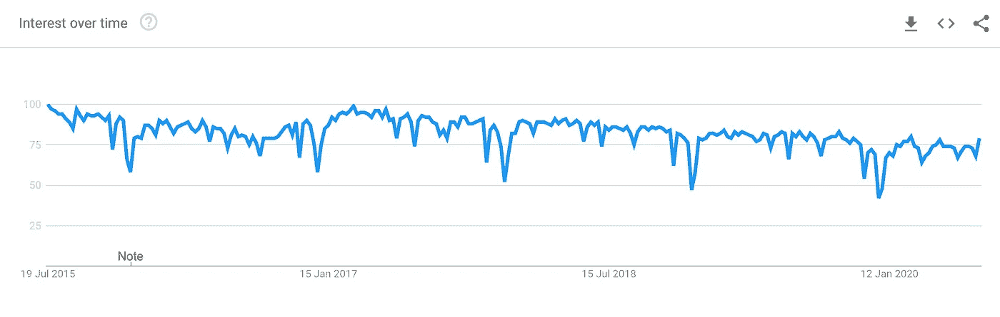
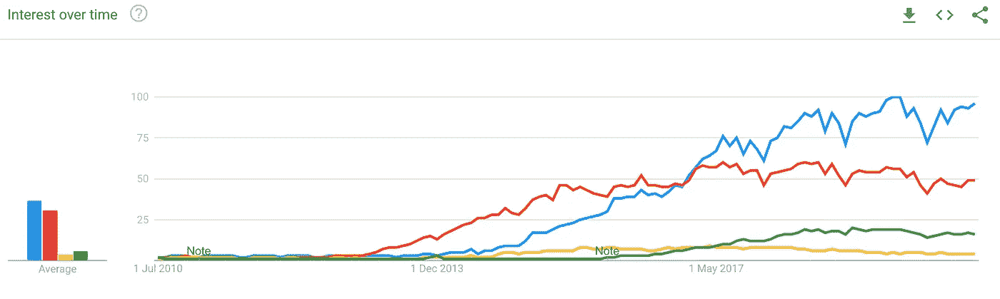
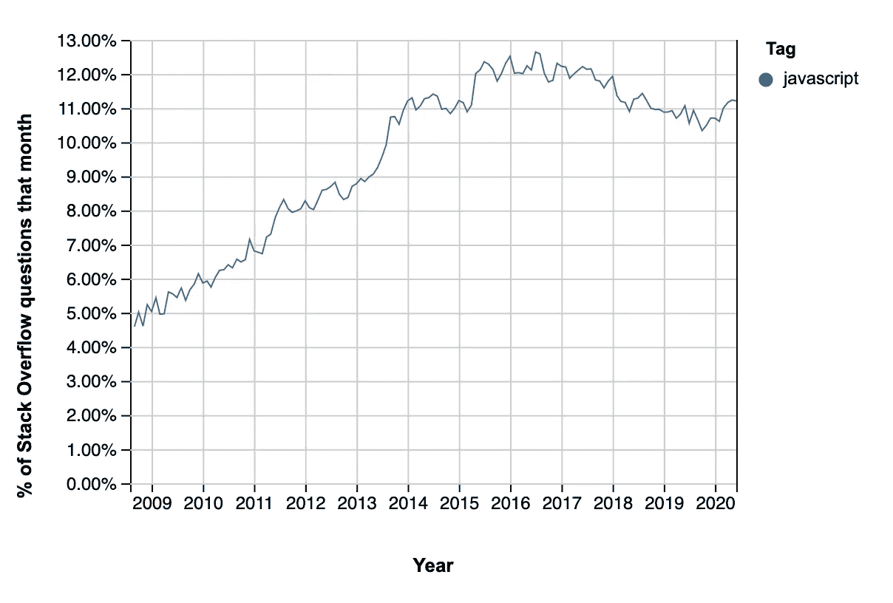

# JavaScript 的未来:为什么它是未来 10 年的语言

> 原文：<https://blog.devgenius.io/is-javascript-development-dying-1dbce0094fc0?source=collection_archive---------0----------------------->

## java 描述语言

亚历克西斯·克洛伊在 [Unsplash](https://unsplash.com/s/photos/dead?utm_source=unsplash&utm_medium=referral&utm_content=creditCopyText) 上的照片

JavaScript 死了吗？

我在许多不同的网站上读过这个问题几次(最近一次是在 [Quora](https://www.quora.com/Is-Javascript-dying) )，我一直想知道这是真是假。我在 2018 年才开始 web 开发，所以我不了解 JavaScript 的历史以及它在开发世界中的现状。

所以我做了一些研究，看看 JavaScript 在过去和现在是怎样的，我发现的结果相当令人震惊。

> 我们所知道的 JavaScript 已经死了。

JavaScript 在 1995 年首次建立后的这些年里有一大堆问题。尽管有一些更新，许多主要问题仍然没有解决。

JavaScript 的一些问题包括:

*   缺乏模块系统
*   松散的打字
*   高度依赖于全局变量
*   由于语法的原因，更难发现错误

即使在过去的 10 年里，用这种语言创建框架仍然很困难。AngularJS 最初是一个基于 JavaScript 的框架，直到他们在扩展框架时遇到问题，所以他们决定使用 TypeScript(JavaScript 的一种变体)重新编码整个框架，并将其重命名为 Angular。

人们对 JavaScript 的兴趣似乎也在下降。找到关于在过去 5 年里有多少人用谷歌搜索“JavaScript”这个词的信息，似乎这种语言正在慢慢走向衰落。

[过去 5 年中 JavaScript 搜索的谷歌趋势](https://trends.google.com/trends/explore?date=today%205-y&geo=US&q=%2Fm%2F02p97)

## 那么这意味着什么呢？JavaScript 真的要死了吗？

我也这样认为。2018 年第一次学 JavaScript 的时候，

JavaScript 已经扩展到不仅仅是客户端应用程序的编程语言。JavaScript 已经扩展到涉及应用程序周期许多其他方面的框架。

还有以下框架:

*   前端应用(Angular、React、Vue.js)
*   后端应用程序(Node.js、Express.js、Meteor.js)
*   Android/iOS (React Native、NativeScript、Ionic)
*   机器学习(张量流)

JavaScript 库的完整列表可以在[这里](https://en.wikipedia.org/wiki/List_of_JavaScript_libraries)找到。

上面列表中的 JavaScript 库有很大一部分是在过去 10 年中创建的。这些库有大量的社区支持，并得到一致的更新(平均每 6 个月 Angular 更新一次)。这些库在很大程度上被开发人员采用(尤其是前端框架)，并在保持 JavaScript 的相关性方面发挥了巨大作用。

这也可以解释为什么上面显示的谷歌趋势图呈下降趋势。对“JavaScript”这个词的实际搜索呈下降趋势，但对 JavaScript 库的搜索呈上升趋势*。*

**

*[谷歌 Angular、React、Vue.js 和 Ionic 的趋势](https://trends.google.com/trends/explore?date=2010-06-12%202020-07-12&geo=US&q=%2Fm%2F012l1vxv,%2Fg%2F11c6w0ddw9,%2Fg%2F1q6l_n0n0,%2Fg%2F11c0vmgx5d)*

*随着 JavaScript 库的兴起，也有越来越多的用户询问与这些库相关的问题。StackOverflow 趋势记录了他们的问题中与某个标签相关的百分比。看看在过去的 10 年中，有多少关于 JavaScript 的问题被问到:*

**

*[过去 10 年的 StackOverflow 趋势](https://insights.stackoverflow.com/trends?tags=javascript)*

## *这解决了 JavaScript 的相关性问题，但是语言本身呢？*

*多年来，很多抱怨主要是关于 JavaScript 糟糕的语言特性。令人欣慰的是，我们正看到一个旧标准的复苏，这有助于使语言更加具体和有效。*

*[ECMAScript](https://en.wikipedia.org/wiki/ECMAScript) 是一种编程语言，根据 Ecma International，Inc .创建的 [ECMA-262](https://www.ecma-international.org/publications/standards/Ecma-262.htm) 文档进行标准化。该文档包含 JavaScript 作为编程语言必须遵循的标准列表。*

*ECMAScript 创建于 1997 年，从 1997 年到 2011 年只更新了 5 次。这使得 JavaScript 在 21 世纪的第一个十年里一直保留着旧的和过时的标准。直到 2015 年 ECMAScript 6 发布，这是对 JavaScript 的一个重大改变，并允许它被许多类似的库所采用。*

*ECMAScript 已经发布了 5 个版本，从 2015 年到 2020 年每年一个，现在也不会停止。随着其一致的发布，JavaScript 开始接受多年来的更新，使其更加健壮、高效和适应性更强。*

## *说了这么多，JavaScript 真的死了吗？*

*有些人会怀疑这是不是真的，现在开始学习是不是太晚了。正确答案是 JavaScript **从未像今天**这样充满活力。*

*随着对这种语言的贡献和支持达到空前的高度，学习这种语言对你来说将是一笔巨大的财富，因为有如此多的库可以让你使用这种语言。您可以让整个堆栈只包含 JavaScript 框架。*

*要求拥有 React 和 Angular 经验的开发人员的公司数量正在大幅上升，而且没有放缓。*

*我建议你花时间学习 JavaScript。不管你是打算从事 it 行业，还是仅仅为了好玩而学习它，我知道在未来的应用程序中你可能会需要用到 JavaScript。这种语言越来越多地被应用到框架中。这是未来，而且来得相当快。*