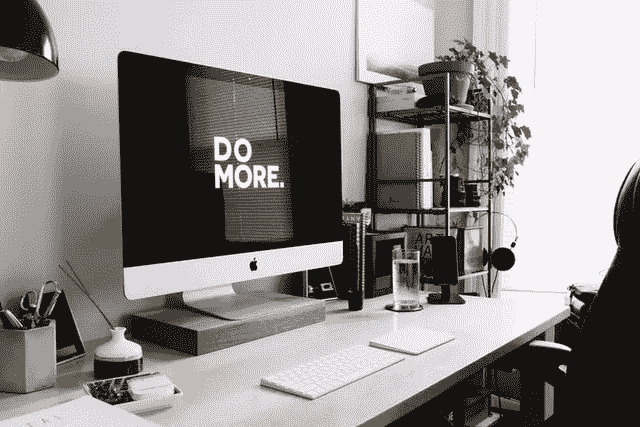
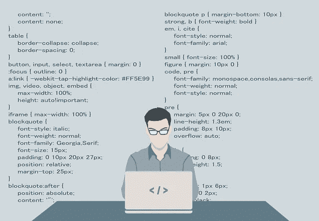

# 编程其实很难吗？

> 原文：<https://blog.devgenius.io/is-programming-hard-102a960394af?source=collection_archive---------19----------------------->

Jasmin Sessler 在 [Unsplash](https://unsplash.com/?utm_source=unsplash&utm_medium=referral&utm_content=creditCopyText) 上拍摄的照片

不是你想的那样…

[*原载于 Dev.to*](https://dev.to/damsalem/is-programming-actually-hard-1j89)

2018 年 9 月，**我开始了为期 90 天的软件开发人员训练营**的第一天。我最近刚满 28 岁，生活中最近发生的事情帮助我决定辞去工作(作为一名电子商务品牌经理)，转而成为一名开发人员。

**我唯一的遗憾？我希望我早点做它。**

当我还是个孩子的时候，**我曾经认为成为一名开发者很难**。我认为这需要很多很多的努力去学习。我想象着强迫自己阅读技术手册和文档。我梦想通过学习数学和公式来发展高超的思维技能。

幸运的是，我大错特错了。

最近，我回顾了我的先入之见，并认识到它们是有根本缺陷的思维。这并不难，不应该很复杂，也不需要高超的智力。

## **我发现成为一名开发人员有三个要求:**

1.  **理解单词和符号**(有几个)
2.  理解语法(开发者称之为“句法”,它是单词组合在一起交流思想的方式)
3.  了解如何谷歌你不知道的东西(如此重要)

卡尔·海尔达尔在 [Unsplash](https://unsplash.com/?utm_source=unsplash&utm_medium=referral&utm_content=creditCopyText) 上拍摄的照片

# 训练营

我在俄勒冈州的波特兰参加了一个非常有趣的训练营。有趣的不是课程的多样性，而是每个项目开始的第一门课程。

你上的第一堂课定义了编程的每个单词和符号。

从链接(URL)中使用的符号，到像“计算机”和“开发者”这样的基本词汇，以及更深层次的技术术语，一切都被定义了。

随着我继续完成训练营的课程，我开始学习更多的语法知识。幸运的是，**许多语言使用相似的语法**(又名句法)，最终这成为第二天性。

**训练营强调的一件事是能够自己做研究。**

起初，理清我自己的困惑是非常困难的。随着我继续努力，我发现使用**我的新词汇对我如何进行研究产生了重大而积极的影响。**

我开始使用某些关键词和短语，其他开发人员在试图解决与我类似的问题时也会使用这些关键词和短语。

在某个时候，**我意识到我知道如何谷歌我的编码问题**。

> 最终，我从训练营得到的是对自己的信心。

我知道如何编码，我知道如何继续学习和成长，我知道如何把自己从混乱中解救出来。

由 [KOBU 机构](https://unsplash.com/@kobuagency?utm_source=unsplash&utm_medium=referral&utm_content=creditCopyText)在 [Unsplash](https://unsplash.com/s/photos/hello-world?utm_source=unsplash&utm_medium=referral&utm_content=creditCopyText) 上拍摄的照片

# 我的第一份工作

在数百份申请、多次电话面试(和拒绝)以及几次编码挑战之后，我在纽约的一家机构找到了我的第一份工作，成为一名网页开发员。

报酬不高，工作也很有挑战性，但我喜欢。

我不断地学习和研究，因为我作为 WordPress 开发者的角色意味着我要学习一门新的语言。不仅如此，在 web 开发的基础方面，我还有很多东西要学。

幸运的是，我有我需要的所有工具

1.  对常用术语和符号的理解。
2.  对语法(句法)的理解。
3.  研究和解决自己问题的能力。

> 当你有了工作，学习和记住你所学的东西就容易多了。

当编程成为你的工作时，你必须学习新的做事方法。

当你和其他开发人员一起工作时，你对开发的理解自然会增长。每个开发人员对于语法、使用的工具以及应该如何开始都有不同的观点。

> 编程不是重复解决同一个问题，而是寻找新的更好的方法来解决问题。

例如:

*   你可以找到所有的边和角，然后组装起来，开始拼图。或者你可以从主要的兴趣点开始，建立你的出路。
*   你可以通过发现杀死你的东西来开始一个视频游戏，或者你可以探索地图，甚至通过阅读论坛。
*   **你可以从主人公的角度**，从叙述者的角度，或者从朋友的角度写一个小故事。

解决谜题、视频游戏和生活挑战的方法有很多，同样，**你会发现许多编码的方法**。

照片由[200 度](https://pixabay.com/users/200degrees-2051452/)在[像素点](https://pixabay.com/vectors/programmer-programming-code-work-1653351/)上拍摄

# 概括起来

综上所述，在我从事网页开发一年半多的时间里，我认识到了一些我希望年轻的 20 多岁的自己已经知道的事情:

1.  编程并不难，至少不像你想象的那样。它需要的只是好的学习材料，以及足够的坚持每天坚持下去，即使只有一个小时。
2.  **编程不应该是复杂的**，我阅读和研究的越多——我每天都这么做——我就越发现所有高级开发人员和专家都建议我们编写简单、人类可读的代码。
3.  **编程不应该回避**，只是因为不懂。其实远比看起来简单。你所要做的就是把它分解成单个的、简单的组件。

如果你想成为一名软件开发人员或者其他类型的专家，不要因为这一切看起来有多“困难”或者看起来有多复杂而气馁。

> 通常情况下，这些复杂性只是由于对单词、符号和语法的误解。

如果你有这些基础知识，并对自己的研究有一些指导，我相信只要有一点坚持，任何课题都可以被征服。

# **参考文献**

如果你想知道我参加了什么训练营，或者我推荐了什么学习材料，看看这些:

1.  我参加了科技学院训练营，他们有在线和面对面的课程，你可以在[learncodinganywhere.com](https://www.learncodinganywhere.com/)找到他们(如果你告诉他们是我推荐你的，我可能会赚一点佣金)。
2.  科技学院还出版了一本科技词典，里面有有史以来最简单、最好的定义。你可以在亚马逊上找到这本字典，这里是 T21。
3.  完成 bootcamp 后，我浏览了 FreeCodeCamp 的大部分课程。虽然它们不包括你需要知道的单词和符号，但它们确实有很多信息，最重要的是，它们是免费的。在 freecodecamp.org 了解更多信息
4.  如果你正在努力学习，我对应用学者的[学习技术的评价再高也不为过。这里有一段引言:](http://www.appliedscholastics.org/study-tech.html)

> 基本的事实是，学生学不到东西，因为从来没有人教过他们**如何学习**——也就是说，如何识别学习的障碍以及如何克服这些障碍。

如果您有任何问题或反馈，请在下面分享您的想法。