# Spring WebFlux 是神话吗？

> 原文：<https://blog.devgenius.io/is-spring-webflux-a-myth-4526c2f92413?source=collection_archive---------0----------------------->

## 真的胜过 Spring Servlet 吗？让我们找出真相


Boris Stefanik 在 [Unsplash](https://unsplash.com/?utm_source=unsplash&utm_medium=referral&utm_content=creditCopyText) 上拍摄的照片

如何构建一个高性能的系统一直是开发者感兴趣的话题。许多业内人士倡导非阻塞编程的范式，认为基于非阻塞编程的应用比传统的命令式编程(一种阻塞技术)更有效地利用资源，实现更高的性能。

许多文章解释了非阻塞编程的好处，它似乎是一个优越的、面向未来的解决方案。然而，在没有第一手经验证明的情况下，我并不信服。为了找出真相，我使用两种不同的框架构建了同一个 Java 应用程序——Spring web flux(非阻塞)和 Spring Servlet(阻塞),然后运行了一系列实验来比较这两种实现的系统性能。令人惊讶的是，研究结果表明，在某些环境设置中，非阻塞编程并不总是比阻塞编程好。

在本文中，您将了解 Spring WebFlux 的真相。我将与你分享我的实验细节和性能测试结果的分析。

## 什么是堵和不堵？

回到基础。什么是屏蔽？在传统的计算机编程中，每一行程序代码都是一条同步执行的指令。换句话说，机器一个接一个地运行程序逻辑，直到当前指令被完全执行，下一行代码才被执行。

这种使用模块化编程实现的系统通常表现很好。然而，如果任何进程的执行需要时间来完成，系统线程就会被卡住，如果情况恶化，就会导致系统崩溃。

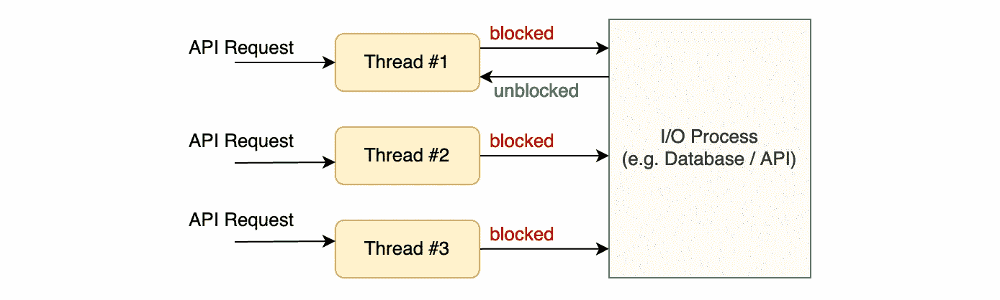

基于线程的阻塞过程

相反，非阻塞编程以发布-订阅模式实现程序逻辑。主程序流运行该流程并订阅结果。主程序没有被当前的进程执行“阻塞”，而是继续流程，并立即运行下一个进程。在进程执行完成后，通过回调通知主程序，以便继续执行程序逻辑。

理论上，非阻塞编程实现了并发。更重要的是，它不阻塞任何不是专用于任何请求的系统线程，线程池处理任何发布的回调。

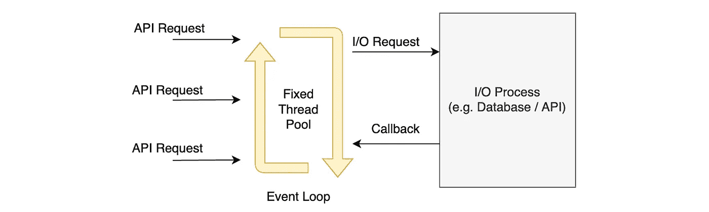

非阻塞编程的事件循环

## Java Spring 是如何支持两种范式的？

Java Spring 在两个独立的技术栈中支持阻塞和非阻塞编程——Spring Servlet(阻塞)和 Spring WebFlux(非阻塞)。由于系统线程模型的不同机制，这两种实现的底层技术有很大的不同。

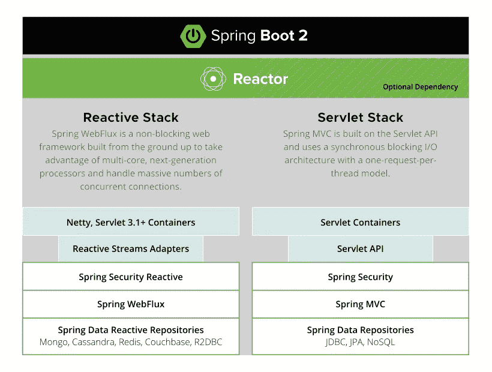

反应式堆栈与 Servlet 堆栈([https://spring.io/reactive](https://spring.io/reactive))

# 关于应用程序—外汇应用程序

示例应用程序是一个 Spring Boot API，它提供了外汇汇率查询和外汇交易的功能。该系统依赖外部 API 来获取最新汇率，并提供货币对的买入和卖出价格。

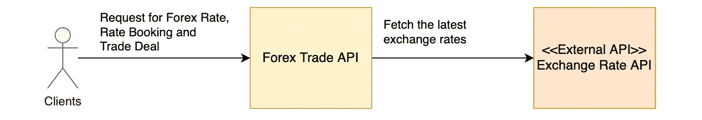

外汇交易 API

如果你有兴趣了解更多关于这个应用的信息，请参考[这篇文章](/spring-a-faster-way-to-build-production-ready-api-in-a-well-defined-structure-5b1730fa81dd)。另外，你可以在[这篇文章](/uplift-your-java-spring-boot-to-webflux-non-blocking-application-7b207999e669)中找到关于 Spring WebFlux 实现的细节。

# 性能测试实现

现在，让我们看看性能测试设计。负载测试是使用强大的工具 Gatling 构建的。容积曲线设计是在 30 秒内将每秒用户注入量从 10 增加到 40，然后在 30 秒内保持每秒 40 个用户的恒定注入量。

为了模拟真实的情况，每个用户都被分配了一个用户旅程来提交 API 请求，以进行汇率查询、汇率预订和交易提交。

关于测试场景设计以及如何使用 Gatling 构建负载测试的细节，请参考本文。

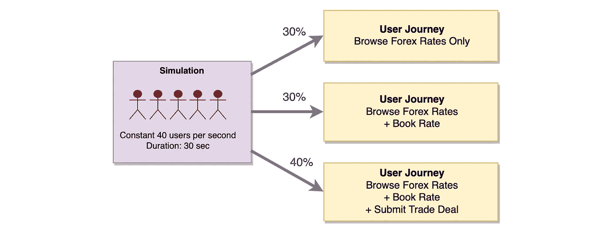

加特林负载测试场景

## 测试环境设置

负载测试运行程序和测试目标(即 Spring Boot 外汇交易 API)驻留在不同的机器上。外汇交易 API 将在 docker 容器中运行；准备了不同版本的 docker 映像来模拟以下部分中提到的一系列场景。

要执行 Gatling 负载测试，从这个 GitHub 存储库中克隆源代码。在我们讨论每个测试场景时，将提供命令行。

[](https://github.com/gavinklfong/forex-trade-gatling) [## GitHub-gavinklfong/forex-trade-Gatling:对外汇交易 API 进行负载测试

### 这是 Forex Trade API 的负载测试实现。参考这篇文章一步一步的指导加特林…

github.com](https://github.com/gavinklfong/forex-trade-gatling) 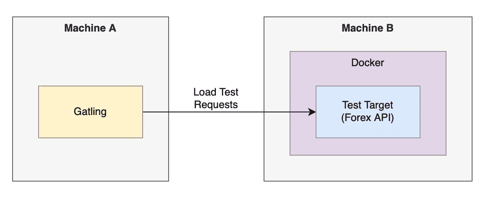

负载测试环境设置

# 性能测试场景和结果

为了实验外部 API 的响应时间和请求量这些因素如何影响 Spring Servlet 和 Spring WebFlux 的系统性能，我们进行了一系列测试。

1.  理想情况—快速的外部 API
2.  缓慢的外部 API
3.  一个非常慢的外部 API
4.  非常慢的外部 API +双倍请求量

## 实验# 1——当 I/O 过程很快时，Spring WebFlux 实现了更快的响应吗？

在每秒 40 个用户的请求量和 10ms 内的外部 API 响应时间的情况下，Spring WebFlux 并没有胜过 Spring Servlet。两个版本的平均响应时间都在 20 毫秒到 50 毫秒之间。这表明非阻塞编程并不总是优于阻塞编程。

为什么？在正常情况下，当一切正常时，外部 API 等 I/O 进程的性能会很快。WebFlux 和 Servlet 在响应时间上的差异是微不足道的，因为两个版本的程序逻辑都可以很快从 I/O 进程获得响应并触发下一个进程。

在 docker 中运行这个 **Spring Servlet** 外汇交易 API

```
docker run — rm -p 8080:8080 whalebig27/servlet-spring-forex-trade
```

在 docker 中运行这个 **Spring WebFlux** 外汇交易 API

```
docker run — rm -p 8080:8080 whalebig27/reactive-spring-forex-trade
```

运行此命令行来触发上面每个 API 版本的负载测试。API_HOST 的参数是测试目标(即外汇交易 API)的 IP 地址

```
mvn gatling:test -DAPI_HOST=<IP Address of Forex Trade API>
```

**Spring Servlet 的响应时间**

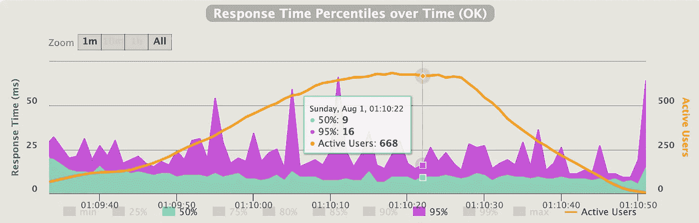

响应时间— Spring Servlet —理想情况

**弹簧流量响应时间**

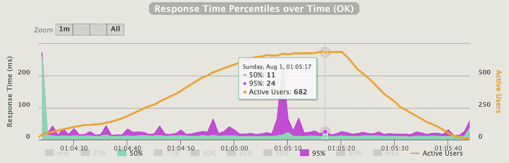

响应时间— Spring WebFlux—理想情况

## 实验 2——如果外部 API 有点慢怎么办？

实际上，外部 API 的性能和稳定性超出了我们的控制范围。由于网络延迟、系统不稳定或其他原因，速度可能会很慢。让我们通过添加 3 秒钟的延迟来模拟一个缓慢的外部 API，看看系统性能如何。

使用这两个 docker 映像分别运行 Spring Servlet 和 Spring WebFlux，以 3 秒的延迟模拟外部 API:

*   whalebig 27/servlet-spring-forex-trade:slow
*   whalebig 27/无功-春季-外汇-贸易:缓慢

Spring WebFlux 的性能非常出色，它的响应比 Spring Servlet 快得多。Spring WebFlux 的第 90 百分位大约是 6 秒，而 Spring Servlet 慢了 2 倍多，大约 20 秒。

在这个实验中，您可以看到非阻塞编程的强大功能，资源利用更加高效，从而带来更好的性能。

**Spring Servlet 的响应时间**

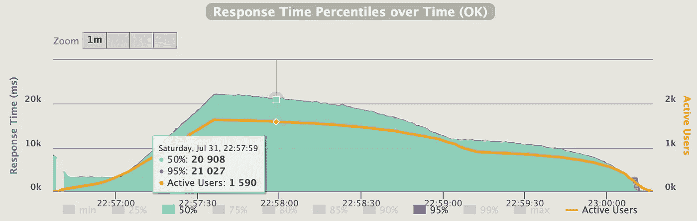

响应时间— Spring Servlet —一个缓慢的外部 API

**弹簧流量响应时间**

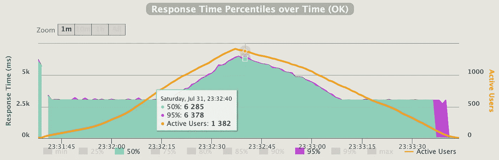

响应时间— Spring WebFlux —一个缓慢的外部 API

## 实验 3——如果外部 API 更慢，性能会如何？

让我们看看如果外部 API 非常慢，比如说延迟 6 秒，会发生什么。两个版本的响应时间都是之前测试的两倍，延迟 3 秒。Spring Servlet 的响应时间大约是 45 秒，而 Spring WebFlux 能够将响应时间保持在 15 秒以内。尽管如此，Spring WebFlux 比 Spring Servlet 有更好的性能。

使用这两个 docker 映像分别运行 Spring Servlet 和 Spring WebFlux，以模拟具有 6 秒延迟的外部 API

*   whalebig 27/servlet-spring-forex-trade:非常慢
*   whalebig 27/reactive-spring-外汇交易:非常缓慢

**Spring Servlet 的响应时间**

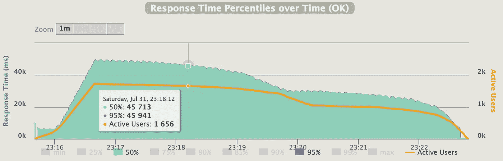

响应时间— Spring Servlet—一个非常慢的外部 API

**Spring web flux 的响应时间**

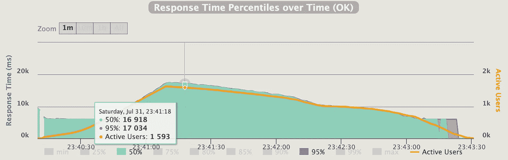

响应时间— Spring WebFlux —一个非常慢的外部 API

## 实验 4——给定一个非常慢的外部 API，在较重的工作负载下会有什么不同？

预计当工作负载加倍而外部 API 仍然非常慢时，情况会恶化。哪种实现能够在严峻的形势下生存下来？

要加倍工作负载，运行以下命令行来触发 Gatling 负载测试，并使用参数来指定每秒的初始用户数和每秒的目标用户数:

```
mvn gatling:test -DAPI_HOST=<IP Address of Forex Trade API> -DINITIAL_USER_PER_SEC=20 -DTARGET_USER_PER_SEC=80
```

结果显示，Spring Servlet 无法处理大多数请求，失败率高达 89%。相反，Spring WebFlux 仍然可以在恶劣的条件下生存，尽管故障率增加到 17%，响应时间大约为 30 秒。

**Spring Servlet 的测试结果**

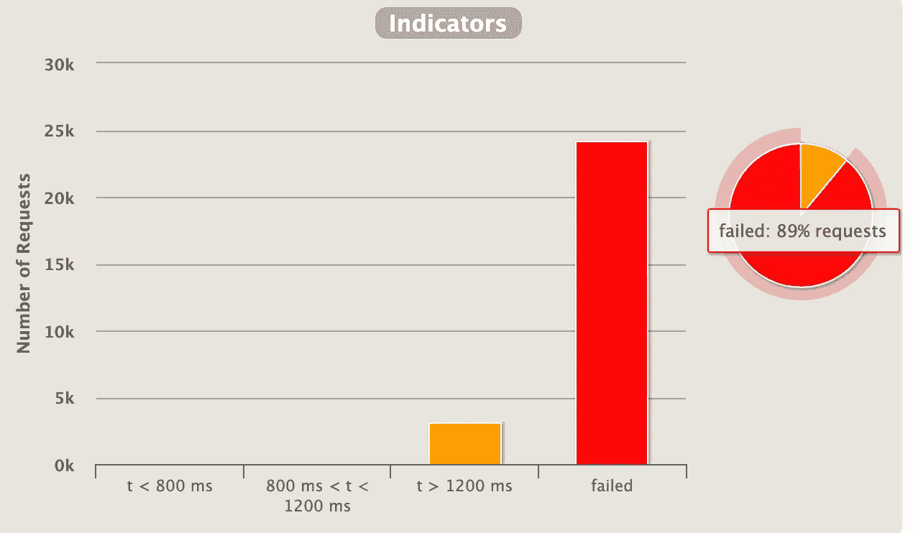

spring Servlet——极端环境中的故障率

**测试结果 Spring WebFlux**

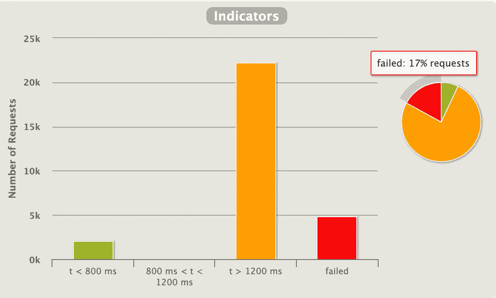

Spring WebFlux—极端环境下的故障率


响应时间— Spring WebFlux —非常慢的外部 API +高请求量

# 结论

测试证明，基于非阻塞技术的应用程序总体上优于传统的阻塞技术。虽然在 I/O 处理速度很快的理想环境中看不到非阻塞技术的威力，但这种技术是有优势的，在现实生活中肯定可以实现更快的响应时间和更低的故障率，因为外部 API 和持久性存储可能由于各种原因而不总是达到预期的服务级别，尤其是服务被大量的传入流量所淹没。

因此，在使用 Java 进行 API 开发时，Spring WebFlux 是一个优于 Spring Servlet 的推荐框架。在新的 API 开发中投入时间和资源来采用这个框架是值得的。

# 参考

[](/spring-a-faster-way-to-build-production-ready-api-in-a-well-defined-structure-5b1730fa81dd) [## spring——一种在定义良好的结构中构建生产就绪 API 的更快方法

### 以可维护且一致的结构构建您的应用程序

blog.devgenius.io](/spring-a-faster-way-to-build-production-ready-api-in-a-well-defined-structure-5b1730fa81dd) [](/uplift-your-java-spring-boot-to-webflux-non-blocking-application-7b207999e669) [## 将您的 Java Spring Boot 升级到 WebFlux 非阻塞应用程序

### 构建反应式 Spring WebFlux 快速指南

blog.devgenius.io](/uplift-your-java-spring-boot-to-webflux-non-blocking-application-7b207999e669) [](https://medium.com/devtechtoday/how-to-build-performance-tests-to-validate-your-apis-using-gatling-b91adaf08222) [## 如何使用 Gatling 构建性能测试来验证您的 API

### 负载测试设计和实现的权威指南

medium.com](https://medium.com/devtechtoday/how-to-build-performance-tests-to-validate-your-apis-using-gatling-b91adaf08222)