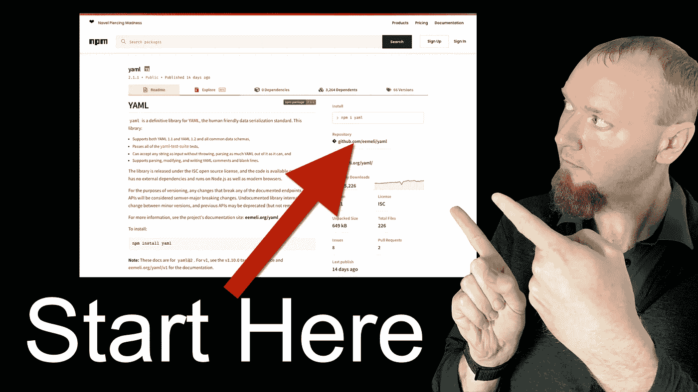

# 使用开源项目安全吗？—以下是如何知道的方法

> 原文：<https://blog.devgenius.io/is-that-open-source-project-safe-to-use-heres-how-to-know-b6151249530f?source=collection_archive---------14----------------------->

开发任何类型的软件都不可避免地涉及到开源依赖。但是，假设有数百万个开源项目，而您个人对它们的源代码或安全实践一无所知，那么您如何知道您刚刚引入到项目中的代码是否安全呢？

说到安全性，没有绝对安全的软件。这都是关于管理风险和对您选择包含在项目中的软件做出明智的决定。对我来说，坐在这里说“你需要检查进入你的项目的每一行代码”是非常容易的，但是简单的事实是这实际上是不可能的。因此，我想与你分享我在评估开源包、API 和 SDK 时遵循的软件评审的五个阶段。

## **回顾的第一部分，我称之为“它受欢迎吗”阶段**

因为，老实说，如果项目被大量使用，它更有可能得到很好的维护，其他人可能会发现、报告和修复项目中的安全问题，否则这些问题将不会得到纠正。

几乎所有今天编写的语言都有某种引入依赖关系的系统。对于围棋来说，就是围棋模块。对于 javascript 项目，这是 NPM。对于 Php，它是 composer，对于 java，它是 maven 或 Gradle 或任何其他你可能从木制品中取出的 java 垃圾(我是在和 java 人开玩笑。互联网还是爱你的)。这些包管理器的网站是一个很好的地方，可以让你开始研究你的依赖的安全性和行为。

看看使用这个包的其他项目的数量。这个数字并不总是 100%准确，但是如果它是一个很大的数字，那么与您在互联网的角落里找到的有 5 个用户和 0 个报告问题的随机包相比，您使用依赖关系会好得多。0 报告问题不是一件好事，我保证！

此外，确保该软件包最近被使用过。一年前下载了一万次，但在过去的六个月中没有一次，这是一个明确的信号，表明这个软件包已经过时或无人维护，你可能想在其他地方寻找替代品。

 [## 加里 M -中等

### 阅读加里·M 在媒体上的文章。首席开发人员、系统架构师和终身学习者。每天，加里 M 和…

medium.com](https://medium.com/@askcloudarchitech) 

## **好了，现在你可以看到这个项目有多受欢迎了。下一步是“它被维护了吗？”阶段**

从项目页面中，找到源代码的链接。单击链接并转到源 repo。大多数项目将使用 GitHub，所以这就是我要用的例子，但你可以在几乎任何 git 回购网站如 bitbucket 或 GitLab 上找到许多相同的细节。

在该项目的 GitHub 页面上有一些关键的东西需要检查。

首先，项目上列出了多少贡献者。这也是项目活动的一个很好的指示器。

接下来，它有多少星星和守望者？有很多人把这个项目加入书签，这样他们就可以回到源代码了吗？

接下来，项目是否有公开可用的问题队列？如果是的话，看一看。看看有什么东西。总是会有错误和特性请求，但是有什么事情是可疑的吗？有没有未解决的安全问题，或者有没有开发人员抱怨已经几个月没有人合并他们的东西了？这些都是需要注意的迹象。

在您离开问题队列之前，快速浏览一下已关闭的问题。查看自问题关闭以来有多长时间了。查看哪些类型的问题已经解决。你特别寻找项目中健康的活动量，这表明它是积极维护的，人们实际上关心包的安全性和功能性。

## **下一步是“是否考虑过安全性？”阶段**

看看这个项目是否在他们的项目上激活了“安全”标签。有些会公开展示已知的漏洞。其他人会有一个安全建议列表或安全策略。该选项卡中的任何内容都可能是维护者关心安全性的好迹象。

一些项目甚至会在自述文件中注明如何报告安全问题。大多数开源项目更愿意在问题公开宣布之前尝试修复它(有充分的理由)。如果你正在审查的项目有这个，那也是一个非常好的迹象。

作为最后一步，您还可以检查项目的实际源代码。现在，我知道有时这些项目是巨大的，你不可能回顾整个事情，但是看看你想要使用的部分是没有坏处的。尤其是如果您需要的功能是任务关键型的。

作为最后一步，这并不适用于每个项目，你可以检查第三方网站的奖金计划。像 [https://huntr.dev](https://huntr.dev) 这样的网站报告了需要解决的已知问题。

最后，也许也是最重要的，在互联网上众多的 CVE 数据库中找一个。我最喜欢的是 https://osv.dev/的。只需键入包的名称，就可以看到针对该项目的 CVEs 历史记录，最重要的是，它是否被修复，以及花费了多长时间。该网站将列出原始报告的 URL，以便您可以查看更多细节和解决方案。

## **最后一步是“这有必要吗？”阶段**

嗯，这个问题问得好，值得研究。刚才我提到过，许多依赖项都很大，有大量的功能。一般来说，引入另一个项目的目的是利用它的能力，而不是重新发明轮子。在这种情况下，项目越大越好，因为如果项目很小，你可能甚至不需要它。

如果你发现一些你认为你需要的东西，因为你不知道如何自己去做，也许你可以只看那个项目的源代码，挑出你需要的部分，然后自己写，不那么复杂。比如:如果只需要做一个简单的 POST，真的需要整个 Axios javascript 包吗？大概不会。

## **最后，现在我们进入了“维护”阶段**

好了，现在你已经完成了你的功课并安装了软件包。现在怎么办？嗯，安全永远不会结束，所以请确保您正在做一些事情来监控您已经安装的所有依赖项。最简单的方法是在您的项目上启用 Dependabot 警报。它将自动扫描您的锁文件，以获得您使用的所有项目的列表，并生成一份报告，报告您的依赖关系中任何已知的安全问题。它甚至会自动将您的项目更新到项目的最新版本，并为您解决安全问题。

好的，我想我会把它留在那里。如果您能在导入包之前花一点时间完成这些步骤，可能会在将来为您省去一大堆麻烦。如果你对开源感兴趣，也许可以看看[的这篇文章](https://medium.com/dev-genius/contributing-to-open-source-can-change-your-life-heres-how-to-do-it-31bf60855bdd)。下次再见，快乐编码！

