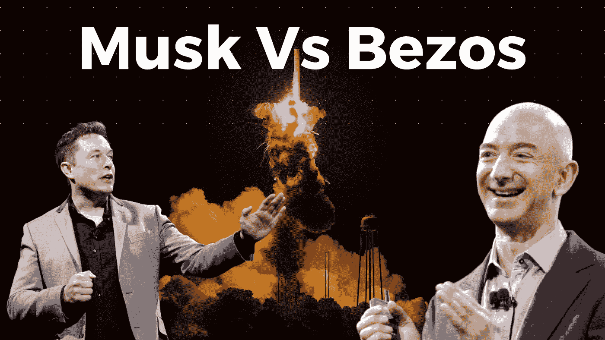
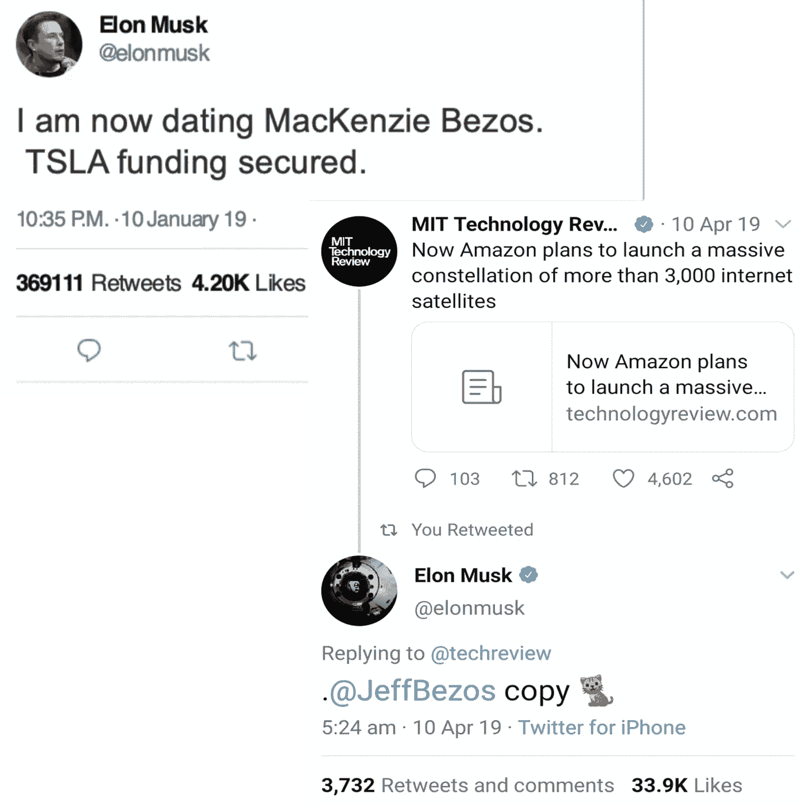
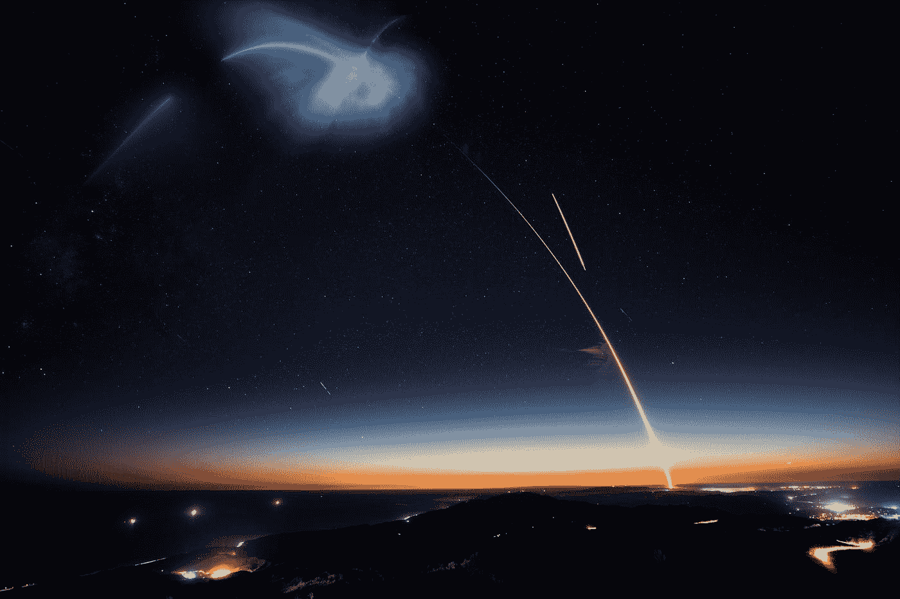
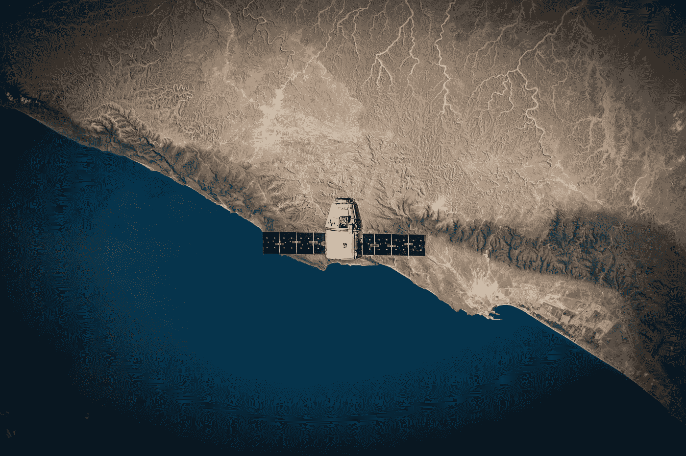

# 自从 FCC 批准亚马逊“柯伊伯”以来，这对 SpaceX 的 StarLink 来说是个坏消息吗？

> 原文：<https://blog.devgenius.io/is-this-bad-news-for-spacexs-starlink-since-fcc-approves-amazon-kuiper-bc363a349924?source=collection_archive---------5----------------------->

## 在亚马逊发布“柯伊伯”之后，Spacex 和亚马逊在太空中首先发射互联网星座的权力斗争日趋白热化。

作者编辑

埃隆·马斯克和杰夫·贝索斯之间的口水战并不令人惊讶。因为之前有很多例子表明埃隆·马斯克挖苦了杰夫·贝索斯的推文。

埃隆·马斯克从不错过取笑他的机会，无论是关于杰夫·贝索斯离婚还是他抄袭马斯克的想法。

埃隆·马斯克推特

敌意由来已久，并且仍在继续。埃隆·马斯克一直声称贝佐斯复制了他。无论是贝佐斯对自动驾驶汽车 Zoox 的投资，还是太空探索公司 Blue Origin 的投资。

来源 Twitter，由作者编辑

## 关于 StarLink？

基本上，它是 SpaceX 正在构建的一个卫星星座，为那些由于缺乏互联网连接而落后的地区提供卫星互联网接入。它将由数千颗在低地球轨道运行的小卫星组成，与地面接收器一起工作。StarLink 的基本目标是提供 1gbps 的速度和零延迟。

产品开发始于 2015 年，经过近 3 年的测试，它于 2018 年 2 月进行了首次试飞，发射了 2 颗卫星。

截至目前的 2020 年，SpaceX 正在连续一次发射 60 颗卫星。目前，StarLink 中有 540 颗工作卫星，预计到 2021 年底将部署 260 公斤(570 磅)中的 1584 颗。正如 Starlink 官方网站上所述，他们将在 2020 年底之前将服务目标锁定在美国北部和加拿大，因此到 2021 年将扩展到全球范围。
StarLink 还计划出售一些特殊用途的卫星，如军事、探索和科学研究。

由 [SpaceX](https://unsplash.com/@spacex?utm_source=medium&utm_medium=referral) 在 [Unsplash](https://unsplash.com?utm_source=medium&utm_medium=referral) 拍摄的照片

SPACEX 的 STARLINK 正在获得一个替代者，一个钱多得用不完的竞争对手。亚马逊已经获得了联邦通信委员会(FCC)的批准，开始构建其互联网星座，命名为 **Kuiper** 。在上周的绿灯之后，这家科技巨头没有浪费时间，宣布将投资 100 亿美元用于星座的创造。
FCC 小组在一份声明中以 5 比 0 的一致投票结果宣布，“通过授权一个旨在向政府、企业和消费者提供超高速互联网宽带服务的系统，Kuiper 的申请将促进公众利益。”

**那么亚马逊柯伊伯是什么？**
以冥王星周围的**遥远的冰冻太空岩石带命名，美国宇航局将其描述为太空的“前沿”。亚马逊预计其柯伊伯系统将包含 3236 颗绕地球轨道运行的卫星，这些卫星被命名为低地球轨道(LEO)，将在 367 英里(590 公里)至 391 英里(630 公里)的高度绕地球运行。**

亚马逊表示，Kuiper 将专门在美国境内提供基于卫星的宽带服务。亚马逊高级副总裁戴夫·林普(Dave Limp)预计，在互联网宽带速度较慢的领域，柯伊伯将是一个游戏规则的改变者。

**柯伊伯起始日期！！！**
2019 年，亚马逊透露了一项在华盛顿州雷德蒙市开设巨型工厂的计划，用于开发和测试柯伊伯卫星。但是这仍然只是纸上谈兵。FCC 还给亚马逊设定了截止日期，即 2026 年 7 月 30 日，提供 50%的运行卫星，并在 2029 年 7 月 30 日之前完全完成其舰队。否则，它将失去在空间网络中运行的许可。
Amazon Kuiper 只需在 LEO 发射 578 颗卫星就可以开始其互联网服务，而 Starlink 需要 700 多颗卫星才能开始其针对加拿大和美国北部的初始互联网宽带服务。

由 [SpaceX](https://unsplash.com/@spacex?utm_source=medium&utm_medium=referral) 在 [Unsplash](https://unsplash.com?utm_source=medium&utm_medium=referral) 上拍摄的照片

像 SpaceX 一样，亚马逊表示，柯伊伯卫星服务将为传统有线光纤和无线网络提供商无法到达的地方提供低延迟、高速宽带服务。
该服务将包括最新的 5G 技术、地球站、最终用户地面部分和卫星运营中心。

**柯伊伯:和星联有什么不同？**

SpaceX 正在开发的互联网连接星座预计将在 2020 年底之前接管一项试验。
自 2019 年 5 月以来，该公司一直在发射每批约 60 颗卫星，目的是在距离地球 550 公里的相对较低的轨道上运行。SpaceX 已申请发射多达 42，000 颗 Starlink 卫星，远远超过 2019 年初在轨运行的大约 5000 颗卫星。Starlink 已经进入太空，而且看起来每天都在进步。另一方面，亚马逊的柯伊伯仍在纸上，尚未决定其发射模块是否是蓝色起源或其他。

## 谁拥有这个空间？

继 SpaceX、亚马逊、OneWeb 和波音之后，未来几天还有哪些公司将投资太空互联网星座？

好吧，三星在 2015 年发布了一项提案，概述了一个由 4600 颗卫星组成的星座，轨道距离为 1400 公里(900 英里)，可能会在全球范围内提供每月 1 吉字节的容量。现在看来，这只是一个提议，还没有关于三星星座的公开信息发布。感觉他们不再竞争了。

OneWeb 的 10 亿美元投资拯救了他们免于破产，他们也重返竞争。嗯，它也是 SpaceX 最大的竞争对手，并没有因为最近的破产状态而消失。让我们进一步看看这场竞争在未来会发生什么变化。

这也是新闻，现在脸书可能很快会投资这项业务。

嗯，有一件事是肯定的，谁先拥有这个空间，谁就将获得每年 5000 亿美元的市场，谁将成为第一个万亿富翁。

## 优势:

*   如果太空中有这么多卫星，它将覆盖那些由于没有互联网连接而落后的地区。
*   这肯定会让互联网用户以最低的成本访问该表。
*   根据研究，他们说速度将更快，超过每秒千兆字节(Gbps)，网络延迟将在 20-40 毫秒之间。
*   没有延迟的现场直播将成为可能，在未来几年，从太空进行现场直播也将成为可能。

**缺点:**

*   这将被证明是天文学家的祸根，因为卫星的数量将是巨大的，当然这些卫星将位于较低的轨道上，这将使得从望远镜中跟踪恒星、行星、彗星、星系的位置变得更加困难。
*   这将产生大量的碎片，包括在低地球轨道上损坏和磨损的卫星。

由 [NASA](https://unsplash.com/@nasa?utm_source=medium&utm_medium=referral) 在 [Unsplash](https://unsplash.com?utm_source=medium&utm_medium=referral) 上拍摄的照片

**结论:**

毫无疑问，SpaceX 是革命性的，十年来一直在围绕其项目开展工作，而亚马逊主要是以商业为导向的，只想通过涉足太空来扩大业务。

但这也是一个事实，亚马逊已经吃掉了所有的小初创公司，因为它发布了一个替代品，比如网飞，它发布了亚马逊 prime 和 approximate 的副本。扼杀了它的生意。

有一点是肯定的，那就是这将会非常有趣，因为两家公司首席执行官之间存在竞争。埃隆·马斯克尚未对此发表任何评论，但正如我们所知，过去马斯克称贝佐斯为“抄袭之猫”。因此，当埃隆·马斯克公开谈论柯伊伯时，似乎会产生火花。

请在评论中告诉我，你们有什么想法？

您可以通过以下方式联系我:

1.  跟我上 [**中**](https://medium.com/@yogeshyadav)
2.  通过 [**LinkedIn**](https://www.linkedin.com/in/YogeshJournal) 联系我