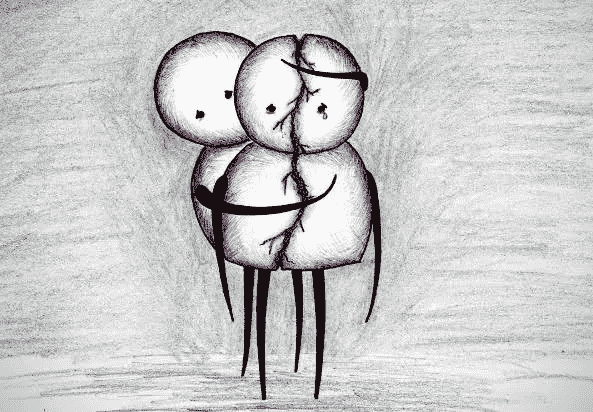

# 人们的变化真奇怪…

> 原文：<https://blog.devgenius.io/it-is-weird-how-people-change-e620fa76662e?source=collection_archive---------4----------------------->

## 生活课

## 现实远比电影不同。我们有时会忘记作家、人物和整个剧本。

我不知道我应该从哪里开始写，因为我选择写的主题是如此深刻和痛苦。但是我很想表达我对这个现实的感受，比如人怎么会变？。有时候事情比我们想象的要奇怪得多，尤其是当这个人变了，而我们以为这个人会保持不变的时候。我们有多傻？，我们判断未来的全部仅仅是一小段叫做现在的时间。

# 为什么？

我只是不明白为什么改变一个人会影响我们？。他的生活，他的选择为什么我们在乎，但在内心深处我们确实很在乎。为什么这样..我们是疯了还是疯了？我就是不明白，因为每件事都有问题，为什么？。想象一下，关心一个根本不想你的人。右疼！。其实不止这些。感觉就像在你体内。你在和我们自己进行一场殊死的斗争..我不知道为什么只有我们受伤，即使我们是对的..我不知道为什么即使我们努力了，我们还是会哭。我不知道为什么我们埋，即使我们致力于建设。不知道为什么有人不理我们？他忘了还是她忘了，我们曾经是他/她微笑背后的原因。每当我想到这些，我就心痛。这让我越来越难过。但是人是会变的。变了的人就像另一个人，不是你以前认识的那个人。这感觉就像当一个人改变了他以前的数据，默认情况下会被永久删除，但这是可悲的。

当我年轻的时候，电影给了我很大的启发，因为大多数电影都有一个美好的结局。但是随着我的成长，我开始意识到一些事情，比如你必须面对的悲伤的现实，除非你非常幸运。但就我而言，我感到幸运，但以一种中性的方式，因为我经历了这么多艰难的时刻，失去了很多人，扼杀了数百万个梦想。但我仍然愚蠢到继续伤害自己，去想那些已经逝去的东西。现在的日子，人就像时间。一旦它走了，就再也不会回来了。这是现实。生活和电影有很大不同。有时候我觉得这个世界已经结束了。就像我们这些人应该互相帮助，互相理解，互相尊重。我们所做的只是为了我们的利益而互相利用。好痛！。我不知道为什么人们会对伤害他们的人做出这样的行为，他们知道他们从一开始就做错了，但是为什么？。为什么那些他们知道是错的事情？。这不公平。他们不相信因果报应吗，或者他们没有分辨对错的能力。这个东西不是火箭科学。每个人只需要开始像他希望别人对待他那样对待别人。就是这样。想想吧。我的读者告诉我你的意见作为回应。

谢谢你。