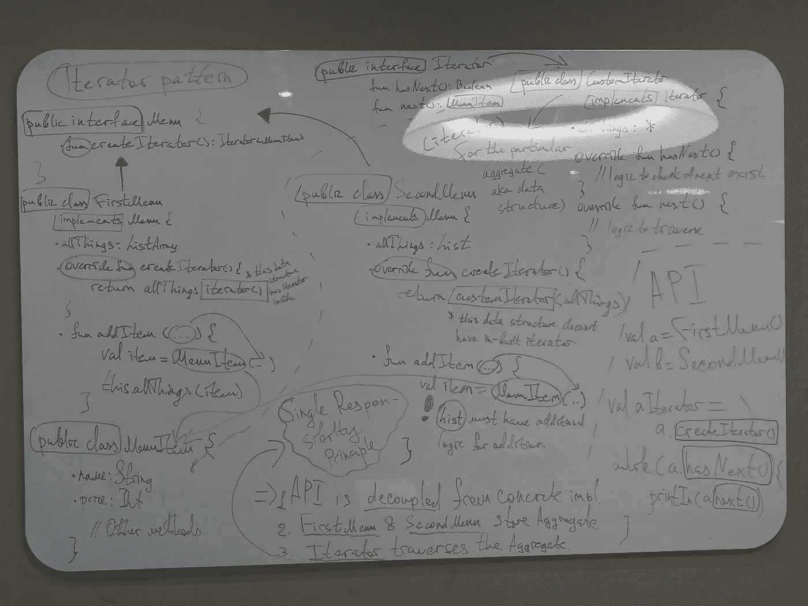
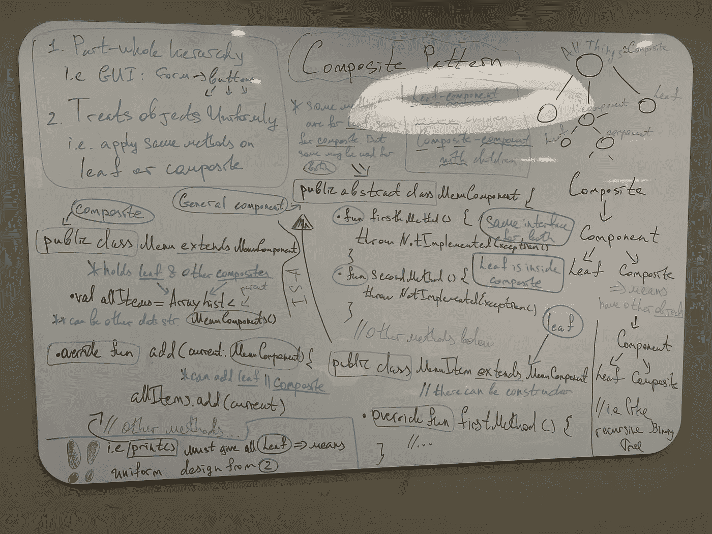

# 迭代器&管理聚合的复合模式

> 原文：<https://blog.devgenius.io/iterator-composite-patterns-for-managing-collection-kotlin-fda036ffda9f?source=collection_archive---------11----------------------->

W 欢迎回到致力于**设计模式的老牌系列**🙌。如果你是第一次来这里:这是一系列的文章，其中我分解了每个模式&提供代码解决方案、设计原则、绘图——以使模式在你的 brain🧠中很好地堆叠

下面你可以看到发表的文章。请务必深入研究，因为其中包含大量信息:

*   策略模式:[https://medium . com/toward sdev/strategy-pattern-for-independent-algorithms-kot Lin-70 ed 24 c 7 BD 8 b](/towardsdev/strategy-pattern-for-independent-algorithms-kotlin-70ed24c7bd8b)
*   观察者模式:[https://medium . com/toward sdev/observer-pattern-for-loose-coupling-kot Lin-f5ab 804609 bb](/towardsdev/observer-pattern-for-loose-coupling-kotlin-f5ab804609bb)
*   装饰模式:[https://medium . com/toward sdev/decorator-decorator-pattern-for-object-composition-kot Lin-7 CEC 92 cbaf 7b](/towardsdev/decorator-decorator-pattern-for-object-composition-kotlin-7cec92cbaf7b)
*   工厂模式:[https://medium . com/dev-genius/factory-patternS-to-hide-instantiation-kot Lin-D5 f 01 cf 01921](/dev-genius/factory-patterns-to-hide-instantiation-kotlin-d5f01cf01921)
*   单例模式:[https://medium . com/dev-genius/singleton-pattern-for-one-of-a-class-objects-Java-a63c 774 d9d 4](/dev-genius/singleton-pattern-for-one-of-a-kind-objects-java-a63c774d9d4)
*   命令模式:[https://medium . com/dev-genius/command-pattern-for-encapsulated-invocation-kot Lin-4338 EB 23 D2 ca](/dev-genius/command-pattern-for-encapsulated-invocation-kotlin-4338eb23d2ca)
*   适配器和外观模式:[https://medium . com/dev-genius/adapter-Facade-pattern-for-perfect-adapting-kot Lin-ccbc 8 f 8 cfcd 6](/dev-genius/adapter-facade-pattern-for-perfect-adapting-kotlin-ccbc8f8cfcd6)
*   模板模式:[https://medium . com/dev-genius/template-pattern-for-encapsulating-algorithms-kot Lin-3d ed 81377 fc 5](https://medium.com/dev-genius/template-pattern-for-encapsulating-algorithms-kotlin-3ded81377fc5)

像往常一样，感谢[奥莱利传媒](https://medium.com/u/fbfa235a954c?source=post_page-----fda036ffda9f--------------------------------)创作出这样一部恒星书:[https://www . oreilly . com/library/view/head-first-design/9781492077992/](https://www.oreilly.com/library/view/head-first-design/9781492077992/)

结构:

*   介绍
*   问题:迭代器模式
*   题外话第一节
*   要遵循的设计原则
*   题外话第二节
*   最终解决方案代码:迭代器模式
*   问题:复合模式
*   最终解决方案代码:复合模式
*   图画

# 迭代器和复合模式

## 介绍

有许多数据结构允许你存储数据💼。每一种都有它的优点和缺点。我们有数组、链表、各种类型的树、哈希表、哈希集、图表等等…

> 嘿，看看我的关于 AVL 树的文章，在那里我讨论了各种数据结构，然后分解了 AVL 树🌲:[https://medium . com/dev-genius/run-down-of-AVL-trees-full-run-down-e 8551 a5 fc 981](https://medium.com/dev-genius/run-down-of-avl-trees-full-run-down-e8551a5fc981)

但是，如果我们的服务需要与具有不同数据结构的系统进行交互，该怎么办呢？你可能会问什么问题🤔？

例如，一个系统将数据保存在**数组**中，而另一个保存在**数组列表**中。请看下面它们是如何被穿越的:

假设我们有 10 多个系统与我们的服务进行交互。这会是巨大的痛苦😓

解决方案？->用一些熟练的 technique⚡️统一遍历

## 问题:迭代器模式

继续我在上一节中提到的扣人心弦的话题。很明显，我们需要一些模式，特别是这里的——**迭代器** ➰.

但是在之前的设计中有什么不好的地方(当我们需要有多个循环的时候):

*   我们编码到**实现**，而不是**接口**
*   新数据结构将促使我们重新开放服务，并添加代码来遍历特定的结构
*   服务需要知道**如何**遍历数据结构——违反封装原则
*   重复代码——相同的迭代(好的，不完全相同，但是非常相似)

解决所有 mess❓的方法-> **封装迭代**。(不能不提**封装调用**的命令模式。是的，如果你对我的文章感到困惑，可以看看🤷🏻‍♂️:[https://medium . com/dev-genius/command-pattern-for-encapsulated-invocation-kot Lin-4338 EB 23 D2 ca](/dev-genius/command-pattern-for-encapsulated-invocation-kotlin-4338eb23d2ca)

在大多数情况下，我们使用迭代器的`interface`，它公开了两个方法:`hasNext()` & `next()`。前者是检查当前数据结构是否有下一个元素，后者是完成遍历。

接下来，我们创建*自定义迭代器*，它继承自那个`interface`。它实现了这两种方法，这两种方法包含了特定数据结构上的迭代方式。不要惊慌🤚，我将在代码部分进行详细的运行。

因此，我们的服务与 classes⚙️.系统内部的具体实现是分离的

> 数据结构可以命名为**聚合**。也记住这个单词

理想情况下，这些系统应该有一些支配性的`interface`,我们可以在我们的服务中使用这些系统，以便进一步解耦。当然，这并不总是可能的，但是要记住这一点👌🏼

## 题外话第一节🎏

如果我告诉你我们并不总是需要从头开始实现**迭代器**呢？有些数据结构有内置的迭代器，比如`ArrayList()`。我们只需调用`currArrayList.iterator()`，一切都像 charm🪄一样工作。你可以看看下面的代码示例，看看它是如何在 Java 中完成的:

另外，看看`Iterator<MenuItem>`:它属于迭代器类型，在聚合中有**的内容。这是什么意思？我尽量锤家的是，不要写:`Iterator<ArrayList<MenuItem>>` **不！** ⛔️我们指定那个**集合**里面是什么。**

因此，在理想情况下，我们有以下结构:

```
Interface for systems   <-  Our Service  -> Interface for Iterator
      /     \                                  /            
SomeSystem1 SomeSystem2             Implemented Interface 
```

**只是重复一下**😬 **:** 当我们使用内置接口时，不需要为迭代器实现那个`interface`。

❗️byway❗️，如果你错过了:系统**必须提供**方法，我们的服务用它来接收迭代器对象。这意味着:系统为它们的**集合**实现**迭代器**，并赋予那个**迭代器**。我们知道，有 2 种方法:`hasNext()` & `next()`。所以，我们用它们来遍历数据结构。

这就引出了非常重要的**设计原则** …

## 要遵循的设计原则

1.  **单一责任原则** ☝️: a 类应该只有一个改变的理由。

*   如果我们允许一个类**保持** **聚合** &来**遍历**它会怎么样？- >糟糕👎🏼如果我们想改变数据结构= >改变的 2 个原因:第一是**聚合**本身&第二是**我们迭代**的方式。
*   **迭代器模式**帮助我们:**系统**保持聚合& **迭代器**遍历它= >关注点是分开的

> 内聚性:类被构造的方式。如果围绕类似功能:*高内聚*。如果不是:*衔接度低* = >非常不好

## 题外话第二节👣

本节涵盖了一点侧面:

*   `Iterator`->-`Iterable`->-`Collections`是链条中第一个是所有的父。这是什么意思？`Iterable`提供增强的`for`循环，如果您确定只有这种类型的**聚集**，这可能会简化您的模式。然而，`Array`不是一个`iterable`，因此在我们的代码中，我们不会以它作为模式的基础。而且，如果我们有集合，那么我们肯定能够在它上面调用`iterator()`。
*   `HashMap`有所谓的创建迭代器的隐式方式:`ourHashMap.values().iterator()`作为`values()`代码返回**集合**。所以，我们可以使用内置的**迭代器**，因为**集合**继承自**可迭代**，后者又继承自**迭代器**。

## 最终解决方案代码:迭代器模式

现在，让我们深入代码，观察一切是如何匹配的。像往常一样，我的回购，我会描述如下:

[](https://github.com/SleeplessChallenger/KotlinDesignPatterns/tree/main/src/main/kotlin/Iterator_Composite/IteratorPattern) [## KotlinDesignPatterns/src/main/kotlin/Iterator _ Composite/Iterator pattern at main…

### Kotlin + Medium 文章中的设计模式。通过以下方式为 sleep less challenger/KotlinDesignPatterns 开发做出贡献…

github.com](https://github.com/SleeplessChallenger/KotlinDesignPatterns/tree/main/src/main/kotlin/Iterator_Composite/IteratorPattern) 

1.  `OurService.kt`是我们的服务，它获取具体的系统类，我们对它们进行迭代:
    *我们提供我们想要迭代的对象
    * `createIterator()`应用于它们以获取迭代器。
    *我们调用方法，该方法使用`hasNext()`来检查集合& `next()`中是否还有一些元素，以实际单步执行
    *我们在所有系统(`interface`)上提供从那个**抽象**继承的对象。如果你有这样的选择就好了——代码变得更加**解耦**。
2.  `Iterator.kt`、`CustomIteratorArrayList.kt`、`CustomIterator.kt`是文件，其中:`interface`用于所有迭代器&具体迭代器实现具体数据结构迭代的逻辑

❗️Attention:❗️我没有故意在数组列表上使用`iterator()`，因为 Kotlin 和 Java 有些不同。此外，为了简单起见，我使用了`List`，这也是因为 Java & Kotlin 之间的一些差异，我不想在这里公开。

3.`Menu.kt`是我们的`interface`对于拥有它的系统来说是件好事(我之前已经提到过几次了)

4.`MenuWithArray.kt`、`MenuWithArrayList.kt`是我们在系统中的具体类

5.`MenuItem.kt`是我们在&之上的那些类中创建的内容，是放在**聚合**中的内容。所以，当使用**迭代器**时，我们得到这个对象。

当然，如果你仔细考虑一下我们向服务添加新元素的方式——这并不是最好的方式，因为我们违反了"**开放封闭原则**"(我在专门讨论"装饰模式"的文章中讨论过这一点—[https://medium . com/towardsdev/Decorator-Decorator-pattern-for-object-composition-kot Lin-7 CEC 92 cbaf 7b](https://medium.com/towardsdev/decorator-decorator-pattern-for-object-composition-kotlin-7cec92cbaf7b))。在这种特殊情况下，这并不坏，因为这可能是我们要坚持的设计的怪癖(是的，并不是所有的模式指南都应该被视为必要的东西。有时我们会为了适应现在的 design🧑‍而离开💻)

因此，我们需要解决更多的问题，但是让我们在下一部分讨论它🤟🏼

## 问题:复合模式

因此，假设我们不仅想为我们的**集合**提供元素，还想为我们的系统提供包含元素的子类:

```
 System
                     /      |    
                element   sub-system
                           |       \
                         element  element
```

*   其中`element`可以不是简单的`Int`、`String`，而是某个类的实例，比如**迭代器模式** — `MenuItem`的例子

嗯，我们可能在这里利用迭代器，但这将是某种混乱🌪如果我们有单独的模式，致力于这样的任务，为什么要这样做呢？

相遇👐🏽:**复合图案**

此模式允许您:

*   统一处理系统**中的对象**
*   代表部分-整体结构(系统-元素)

**一律**🧐是什么意思？—我们可以对两者都应用方法:系统&元素，而不必在意。所以，我们可以忽略&系统元素之间的差异。

嘿，让我们使用与模式相关的词汇👻：

*   所有元件都是**组件**
*   由其他元素组成的元素— **复合**
*   没有其他元素的元素——**叶子**

哦，听起来对树形结构很熟悉？事实上，它是👀。这种模式通常以树的形式表示🌳：

```
 All Systems /       |          \
               System    System      System
              /   |         |  \           \
        element1 element2 sub-system     element1
                          /    \
                     element1 element2
```

*   其中*系统*是一个**复合** & *元素*是一个**叶**
*   但是它们都被认为是**组件**

现在，我给了你模式的整体结构&告诉你它的实现方式。让我们继续到代码部分，在那里我将展示一切应该如何实现&哪些时刻需要注意🌝

## 最终解决方案代码:复合模式

和以前一样，这里是我的回购的链接:

[](https://github.com/SleeplessChallenger/KotlinDesignPatterns/tree/main/src/main/kotlin/Iterator_Composite/Composite) [## KotlinDesignPatterns/src/main/kotlin/Iterator _ Composite/Composite at main…

### Kotlin + Medium 文章中的设计模式。通过以下方式为 sleep less challenger/KotlinDesignPatterns 开发做出贡献…

github.com](https://github.com/SleeplessChallenger/KotlinDesignPatterns/tree/main/src/main/kotlin/Iterator_Composite/Composite) 

1.  我们需要基本的**组件**，它将是**复合** & **叶
    *** 文件:`MenuComponent.kt`
    *使用`abstract class`作为我们提供的默认实现:`throw`异常
    *一些方法将被**叶**覆盖/实现，一些被**复合**覆盖/实现

2.`MenuItem.kt`是一片**叶子**。实际上，您可以从**迭代器**部分回忆起这个类。这里它从`MenuComponent`继承并实现了一些方法

3.`Menu.kt`是一个**复合**，它也继承自`MenuComponent`。它有一个由类型`MenuComponent` = >组成的**集合**，这意味着我们可以放置两者:**复合** & **叶**。它还实现/覆盖了`abstract class`中的一些方法

4.在`main.kt`中，我们创建`allMenus`，在那里我们转储由**叶**或**复合**(子菜单)组成的**复合**

接下来，关于来自`abstract class`的方法:

*   有些只在**叶**中实现，有些—只在**复合**中实现。但是，这两个类中都实现了一些方法。因此，如果它们在两者中都实现了——统一处理对象**和**
*   如果我们没有实现某些方法，而用户最终使用了它们，就会弹出异常
*   *`print()`是一种我们将在下面详细讨论的方法*

*关于`print()`:*

*   *它遍历一个**复合**的集合中的项目，并执行以下操作:
    *如果**叶**:打印**叶**
    *如果**复合**:输入**复合**并打印该**复合**的**叶**的信息。然后回到初始合成:如果满足 **leaf** - >打印其信息，如果满足**composite**-重复上述过程*
*   *此外，对于集合，我使用`iterator pattern`而不是`for loop`来遍历复合(`Menu.kt` )中的元素，因为我们可能会在某些**复合**中遇到**数组**，这将使我们处于不利的位置。这里我们把每个元素一个一个的&应用`print()`在上面。然后，该过程将如上所述——取决于组件:**叶** || **复合***
*   *是的，如果你在目前的情况下不想/需要一个单独的`interface`,你需要或者为这个**聚合**迭代器实现`interface`,或者在**聚合**上使用`.iterator()`*

*还有就是**复合迭代器**这种东西。它类似于普通的，但有它自己的怪癖。然而，我想在本文中跳过它🚵🏼‍♂️*

## *图画🏮*

***迭代器模式***

**

***复合图案***

**

*在这里，你可以看到两个独立的图形，分别对应于每一种图案💫*

*尝试分解设计，但是如果有不清楚的地方——留下评论&我会来回答的👋🏻*

## *结尾部分🤙*

> ***迭代器模式**的学术定义:提供了一种在不暴露数据结构内部机制的情况下访问特定聚合内部元素的方法*
> 
> ***复合模式**的学术定义:允许您以树形结构的形式组合对象，以表示部分-整体层次结构。在大多数情况下，复合材料叶片可以统一处理*

*我想，一次消化两种模式是很难的🤯这就是为什么你需要读多少遍就读多少遍&如果你想让我帮助 you✌️，就不要发表评论*

*你可以找到我:*

*   *领英:[www.linkedin.com/in/sleeplesschallenger](http://www.linkedin.com/in/sleeplesschallenger)*
*   *GitHub:[https://github.com/SleeplessChallenger](https://github.com/SleeplessChallenger)*
*   *leet code:【https://leetcode.com/SleeplessChallenger/】T21*
*   *电报:@无眠挑战者*