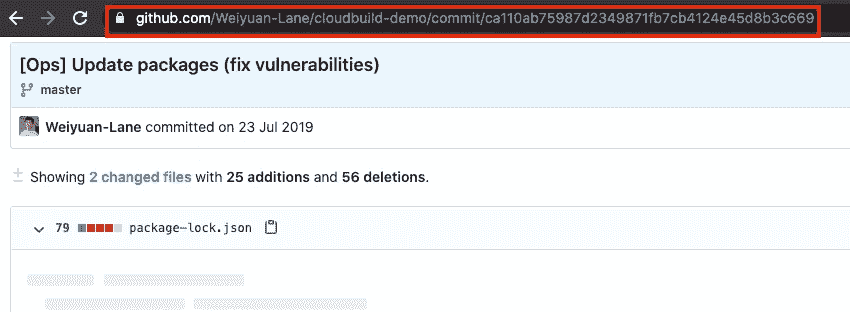
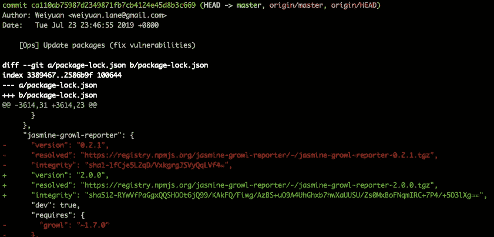
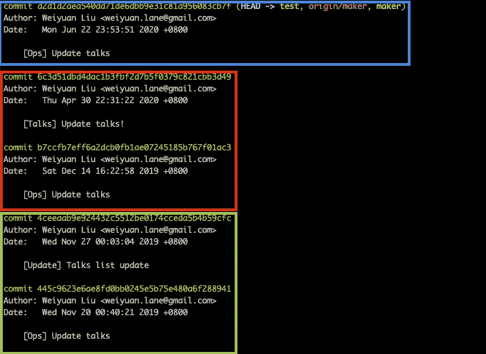
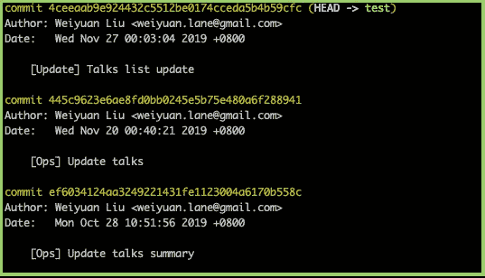
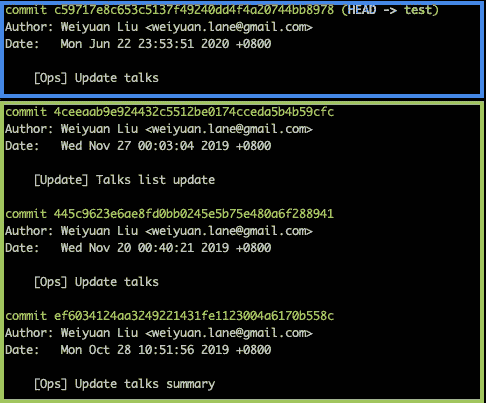
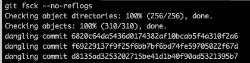
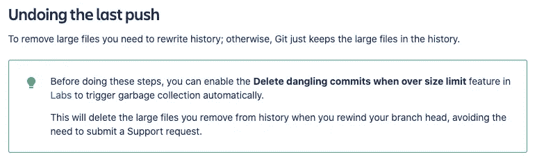

# 将秘密提交给代码库，并修复错误

> 原文：<https://blog.devgenius.io/its-a-trap-committing-bad-stuff-to-github-and-fixing-the-mistake-12ccb080fa02?source=collection_archive---------12----------------------->


错误是不可避免的，但我们该如何弥补呢？—来源: [pixabay](https://pixabay.com/photos/sword-man-weapon-figure-male-4335918/) ，作者:[temperature age](https://pixabay.com/users/TemperateSage-13030917/)

**“我们都会犯错误”**——这是我作为开发人员的口头禅之一。虽然这不是犯错误的借口，但它可能是一个作为开发人员成长的机会。

不幸的是，其中一个错误是意外地将文件提交到代码库中。这可能有两种形式，提交机密和/或提交大文件到您的存储库中。秘密对您和您工作的组织来说绝对是重要的，这可以表现为第三方 API 密钥的货币成本，或者如果泄露会影响组织完整性的数据库密码。

作为一名开发人员，我站在两边——无意中添加了错误的内容，也是“清理”小组的一员。然而，每当我进行这种“清理”时，我发现的说明通常只是整个解决方案的一部分。因此，我想分享一下你能做些什么，从你的 GitHub 库或其他 git 版本控制系统中彻底清除**这些内容。**

我们开始吧！

# **简介:了解期望的结果**

总而言之，最终的结果是确保有问题的文件从目标存储库的本地和远程源中删除。

要做到这一点，我们首先需要在某些方面，视觉上，了解要删除什么。让我们首先从“远程”内容开始。



GitHub 上的提交示例，以及带有提交散列的 URL

在上面，你可以看到我们有一个直接从我们的远程资源库 GitHub 引用的 commit。如果您仔细观察，可以看到在地址栏中，提交散列在 URL 中被直接引用。

由此我们可以推断，只要我们知道提交散列，在 GitHub 这样的远程存储库上获得引用的提交是一件简单的任务。这适用于每一个提交，不管它是否存在于一个分支中(是的，直接删除本地或远程分支没有帮助。这可能会使跟踪要删除的有问题的文件的提交变得更加困难)。



在控制台上为本地存储库运行“git show ca110ab…”

接下来，我们需要考虑从您的本地存储库中删除提交。这适用于第一次添加有问题的文件时与您的远程存储库同步的每台计算机。(同样，分支删除不会删除提交)。运行`git show *commit-hash*`将显示该提交的变更集，类似于我们从想要移除的 URL 中看到的内容。

# 两个略有不同的场景，一个计划

您的清理工作可能会遇到两种情况:

*   **“轻度清理”**:这个问题是在您的分支机构最近一次 X 次提交时才发现的。受影响的提交很容易被识别和删除。
*   **【深度清理】**:受影响的提交可能是在一周前添加的，并且/或者被合并到您的存储库的主分支，在那里它已经被复制到多个分支。这将需要更多的努力来删除这些文件。

我将步骤 2 中的指令分开，以反映两种场景之间的差异。一般来说，剩下的步骤都是一样的。

# 步骤 0:隐藏你当前的改变，停止所有的开发

哦，是的，我们从第 0 步开始！如果你正在做某件发现点的事情，隐藏你当前的改变，这样你就不会丢失你当前的进展。

让您的团队了解这个问题并停止向同一个分支推进也很重要，这可能会影响您的清理工作。

# 步骤 1:记下您想要保留的提交

在您想要删除的提交之间，到您的分支中的当前“头”，记下您想要保留的所有提交散列。如果没有，可以跳过这一步。

这可以通过在终端中运行以下命令来完成，并记录下各个提交散列:

```
git log
```

您应该会得到如下所示的内容:



请注意，彩色框是我添加的。**蓝色**表示我想要保留的提交散列，而**红色**表示要删除。这里要注意的提交散列是`commit d2d1d2a...`

# 步骤 2a(轻度清理):删除提交

参考上图，我们要做的是首先移除红色**和蓝色**中的提交。因为它们总共有三次提交，所以您可以在终端中运行以下命令来删除这三次提交:

```
git reset --hard HEAD~3
```

完成上述操作后，再次运行`git log`以确保分支中的**头**符合预期:



# 步骤 2b(深度清理):删除文件

然而，如果您的更改不仅限于几个提交，而是在您的存储库中的几个不同的分支上，那么上面的指令可能就不够了。

GitHub 建议使用开源工具， [BFG 回购清理器](https://rtyley.github.io/bfg-repo-cleaner/)或`git filter-branch`。您可以按照这里的详细说明[进行操作](https://help.github.com/en/enterprise/2.17/user/github/authenticating-to-github/removing-sensitive-data-from-a-repository)。

# 步骤 3:恢复您想要的提交

如果步骤 1 中没有要恢复的提交，请跳过此步骤。

要恢复之前的提交，只需对每个提交哈希运行以下命令:

```
git cherry-pick %commit-hash%
```

一旦您成功地完成了这一步，运行`git log`，您将再次看到以下内容:



请注意，虽然哈希已经更改，但内容仍然相同。这里的一个提示是，冲突很可能发生在 cherrypicking 之后——就像处理其他合并冲突一样简单地解决它，然后运行`git cherry-pick --continue`继续 cherry picking。

# 步骤 4:检查目标提交不在其他分支上

运行以下命令，确保您的目标提交不在任何其他分支上:

```
git fsck --no-reflogs
```

然后，您应该会看到以下内容:



注意以悬空提交开始的行。这些应该是您刚刚要删除的提交。如果这里没有观察到您的提交，并且运行`git show %commit-hash%`仍然显示提交，那么您可能必须返回到**步骤 2b** 进行彻底的清理

# 第五步:垃圾收集悬挂的树枝

运行以下命令删除悬空提交(“gc”代表垃圾收集):

```
git gc --prune=now
```

一旦完成，您可以运行上一步中讨论的`git fsck`或`git show`方法，以确保提交确实完成了。

内容现已从您的本地存储库中删除。让我们继续从远程存储库中删除

# 步骤 6:“强制推送”您的分支上的变更到您的远程存储库中

下一步是与您的远程存储库同步。为此，我强烈建议使用以下命令:

```
git push --force-with-lease
```

上述命令仅在同一分支上没有任何变化的情况下执行强制推送(返回参考**步骤#0** )。这样我们就可以知道是否有人已经推进到同一个分支，并验证新的更改是否值得保留。

同步相关分支后，让您的团队成员也知道更新他们的本地存储库。这也应该从它们的本地存储库中移除有问题的内容，除非如果有分支，这些变更没有与远程存储库同步。在这种情况下，请你的队友在本地删除这些分支，这将有所帮助，因为它还没有被同步。

一旦分支被同步，我们的噩梦就结束了吗？真的没有。如果你访问那个提交的 URL，原来你还能看到！我们在这里能做什么？

# 步骤 7:让 GitHub 也运行他们的垃圾收集

提交仍然存在于 GitHub 中的原因，尽管不存在于任何分支上，与我们在本地存储库中经历的原因是一样的…它仍然作为悬空提交存在！

要解决这个问题，只需写信给[https://support.github.com/contact](https://support.github.com/contact)，请求对提交进行垃圾收集。之前的某个时候我也提出了同样的请求，不到两天，它就被删除了！

如果你对`git gc`在 GitHub 中出现的频率感到好奇，也可以看看下面的推文。

如果你使用的是 Bitbucket 之类的其他存储库，你也可以查看他们的支持论坛，了解他们删除悬空提交的频率。



# 额外:旋转你的秘密

在这次清理中，您组织的秘密可能已经被泄露。这可能是真的，即使该存储库是私有的(任何成员都可以下载该存储库，并且其内容可能已经在他们的任何设备上遭到破坏)。由于您组织的机密已经遭到破坏，请确保尽快轮换您的机密！

# 除了清理

作为我所在团队的技术负责人，我从我的队友那里体验到了这一点。当这样的问题发生时，贯穿人们的第一情绪通常是恐惧。害怕被训斥，害怕不知道如何解决问题，最糟糕的是，害怕可能的后果和未知的后果。

首先，当类似这样的事情发生时，花些时间安抚工程师并减轻他们的恐惧，因为这个问题在某些方面可以被认为是一个系统故障。确保工程师也参与修复问题，例如秘密的轮换，以灌输责任感，并获得经验以在未来帮助其他队友。

除了解决问题之外，从系统故障的角度考虑其他措施来防止这种情况再次发生。例如，我们可以使用 [git 预提交钩子](https://medium.com/@weiyuan.liu/stranger-danger-prevent-the-leaking-of-secrets-when-committing-code-12c13ebbc336)在提交到代码库的远程源之前扫描每个提交。

这就是我今天的全部。Ciao~