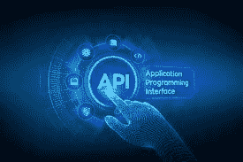

# 现在是 API 时间！

> 原文：<https://blog.devgenius.io/its-api-time-a9e36ff8d796?source=collection_archive---------3----------------------->

了解 APIs..

[https://startup biz . co . zw/middlemen-business-ideas-for-津巴布韦/](https://startupbiz.co.zw/middlemen-business-ideas-for-zimbabwe/)

很多时候，学生们会忘记或者混淆什么是 API，所以在这篇文章中，我将告诉你什么是 API。

在开始什么是 API 之前，我先给大家讲个故事。故事是这样的，

从前有一个叫杰克的人，他住在一所小房子里。现在他在一家公司找到了一份高薪的工作，所以他决定搬到一个比他现在的房子更好更大的新房子。由于繁忙的日程和工作，杰克没有足够的时间出去寻找新房子。

那么你认为杰克应该怎么做呢？？

想了很多，杰克还是想不出该如何寻找他的新房子。所以他和他的朋友吉尔讨论了这个问题，如果他有任何解决方案的话，所以在听到杰克的问题后，吉尔花了一分钟时间思考并想出了一个解决方案。
那么对此有什么解决办法呢？杰克问。

吉尔说，如果你没有足够的时间去寻找一个新的房子，去请房地产经纪人为你做，他会为你寻找最好的房子，你不必担心。
牛逼！杰克说:吉尔:这个主意太棒了，我会联系那个代理人，他会帮我的。

所以现在杰克联系了经纪人鲍勃，说他想要一个比他现在的房子更大的新房子。鲍勃说不用担心！我有一栋房子，比你现在的房子大。你可以买下这栋房子，杰克看了房子，他很喜欢，就买下了房子，很高兴搬到他的新房子。

现在假设你想开发一个软件或网站来检查你的打字速度，或者想开发一个应用程序来检查你所在城市的天气……但是……但是您没有足够的数据来呈现段落，同时检查或测试您的打字速度，或者您没有足够的数据和仪器来检查您所在城市的天气。那你会怎么做？

知道吗？

这很简单，就像杰克联系鲍勃为他找房子一样，你也可以联系那些可以为你提供这些数据的人，这就是 API 的作用所在。

【https://www.opus.software/api-gateway/ 

API 代表应用程序编程接口。
API 是一种软件/计算接口，有助于两个或多个应用程序/软件之间的交互。每当我们使用聊天应用或脸书之类的应用时，我们都在使用 API。

例如，假设我想创建一个显示未来 15 天天气的应用程序，但现在我不知道如何测量天气，所以现在我将联系预测天气的公司，请他们帮助我处理数据，他们将帮助我处理数据库，在其中我可以获得我的应用程序所需的所有数据。

这里可以了解更多 API [。](https://www.ibm.com/cloud/learn/api)