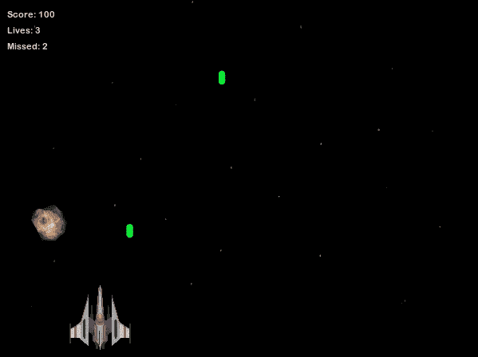
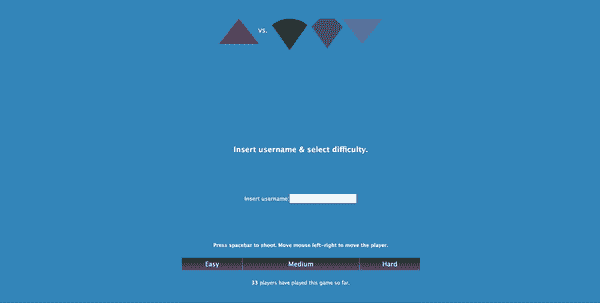
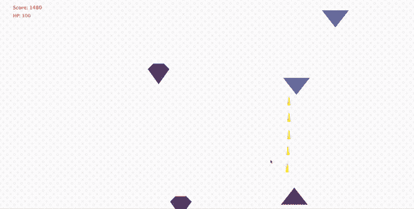

# 我已经创建了一个简单的射击游戏，并得到了第一份工作(你也可以)

> 原文：<https://blog.devgenius.io/ive-created-a-simple-shooter-game-and-got-first-job-and-how-you-can-too-adc54f5c451e?source=collection_archive---------8----------------------->

## 使用本指南探索 RxJS 的可能性，并获得你的第一份工作


卡斯帕·卡米尔·鲁宾在 [Unsplash](https://unsplash.com?utm_source=medium&utm_medium=referral) 上的照片

我大学快毕业的时候。不知道我应该先做什么。我知道我需要一些东西来展示我的技能。我的目标工作是前端开发人员，所以这个项目需要解决这些技能。

每个雇主都会通过你的第一个项目看到你的热情。这就是为什么你需要脱颖而出。你需要投入一些时间，让你的游戏或商业应用给人留下深刻印象。

> 投入的时间等于项目质量。

一定要研究每一个边缘案例。质疑一切。创建广泛的测试。找到愿意尝试你的应用的人。

# 想法

我有了创造一个射击游戏的想法。一些简单但复杂的东西。我需要给老板留下深刻印象，但几乎没有时间投资。

我喜欢在射击物体时将玩家从左向右移动的想法。子弹也需要某种物理学。游戏中的敌人也是需要的，所以我也可以展示一下我的 OOP 技能。

敌人会有不同的力量，有些会更快被杀死。玩家也可能死于碰撞。子弹击中目标后需要渲染和删除。

似乎很简单，直到我把手弄脏了。



你以前玩过这些吗？

# 技术堆栈

我也想有一些后端，所以用了 [json-server](https://github.com/typicode/json-server) 。想表明我知道如何从前端处理 REST。这用于提供分数和选择游戏的配置。

我需要一种方法来跟踪玩家的移动、碰撞和其他有意义的事件。这就是 [RxJS](https://www.learnrxjs.io/) 发挥作用的地方。库提供了 JS 的反应式编程，这正是我所需要的。我需要对不断变化的球员移动，碰撞，子弹乱飞做出反应。

为了把它们粘在一起，我使用了 [webpack](https://webpack.js.org/) 。为了在我的浏览器中托管更改，我使用了 [webpack-dev-server](https://github.com/webpack/webpack-dev-server) 。这在今天可能已经过时了，有了新的发展，但这只是为了教育的目的。

我使用了 ES6 语法，给这个应用创造了一点 OOP 的感觉。敌人和玩家是从 ES6 职业中创造出来的。我想给每个敌人增加一点难度，这需要逻辑分离。

# 密码

我将在这里浏览一些代码。回购的链接会留在底部。你可以评判我的代码，我不会生气的:)

## 敌人

敌人对于任何射击游戏都是必不可少的。我的敌人的骨架是用 CSS 创建的，JavaScript 给了他们运动。我选择了最简单的形状，圆锥形，菱形，三角形。把他们分成几类，有特殊的生命值和速度。

```
**export** **class** EnemyDiamond **extends** Enemy {
    constructor(node)
    {
        **super**(node);
        **this**.health_points = 300;
        **this**.dom_element.className = *"enemy enemy_diamond_fill"*;
    }
    startMoving(speed)
    {
        **super**.startMoving(speed/2);
    }}
```

为了让他们在屏幕上移动，我增加了他们移动的间隔。这个区间会从配置里取，为了让游戏更难。在敌人被杀死或者离开屏幕后，我会把它从 DOM 中移除。

```
Rx.Observable.interval(speed).subscribe(**function**()
        {

            TOP_OFFSET+=MOVEMENT_SPEED;
            that.dom_element.style.top = `${TOP_OFFSET}px`;

            **let** off_bottom_edge = TOP_OFFSET >= windowHeight - 50;

            **let** alive_and_off_the_screen = off_bottom_edge && that.health_points > 0 ;

            **if**(alive_and_off_the_screen)
            {
                **this**.unsubscribe();
                removeDomElement(that.dom_element);
                **return**;
            }
        });
```

## 子弹

子弹只是玩家射出的三角形。每颗子弹都被绑在玩家身上，并以一定的频率检查碰撞情况。根据不同的配置，破坏会有所不同，在硬水平子弹只是接触敌人。

为了得到子弹和敌人的位置，我使用了`getBoundingClientRect`功能。如果那两个在同一个位置，删除子弹，在分数上加上毁灭，去掉敌人的 HP。

## 运动员

在 RxJS 鼠标事件处理的帮助下，玩家从左向右移动。按空格键发射子弹，并从屏幕底部移动到顶部。发射一颗子弹后，我增加了后坐力，使它更真实。

玩家类负责碰撞的轨迹、玩家的分数以及玩家的健康。玩家被杀后，游戏结束，我们移除玩家并显示分数表。

```
**// mouse movement handling
const** mouse_move_events = Rx.Observable.fromEvent(document,*'mousemove'*);

        **let** mouse_moved = (event)=>{

            **let** cursor_not_close_to_right_edge
                = event.clientX < window.innerWidth - 250;

            **if**(cursor_not_close_to_right_edge)
                **this**.dom_element.style.left = event.clientX + 50;
            **else**   

                **this**.dom_element.style.left = window.innerWidth - 200;

        }

        mouse_move_events.subscribe(mouse_moved);
```

## 环境

首先，你需要创建你的游戏环境。这可以从你登陆的第一页开始。插入你的用户名并选择你的难度。设置好之后，你就可以开始游戏了。

下一页是游戏区，敌人将从屏幕上方开始飞行。你可以随时在左上角查看你的分数和 HP。开始用鼠标移动你的玩家，并用空格键击落敌人。

游戏结束后，记分牌会出现。这是你可以看到排名和保存你的分数的地方。你也可以不用保存就能看到你的分数。

## 最终结果



# 想法和错误:)

也许我会更多地分离关注点，但这是我的第一个项目。我有一些 bug，由于代码混乱，它们很难被发现。

测试是我没有做的一件事。这就是我错过的，在那个时间点不知道怎么写测试。从这个角度来看，根据目前的知识，测试将提高代码质量并揭示一些错误。

感谢阅读！希望这能启发你做点什么。

[](https://github.com/zivce/rxjs-playground) [## zivce/rxjs-游乐场

### 此时您不能执行该操作。您已使用另一个标签页或窗口登录。您已在另一个选项卡中注销，或者…

github.com](https://github.com/zivce/rxjs-playground)