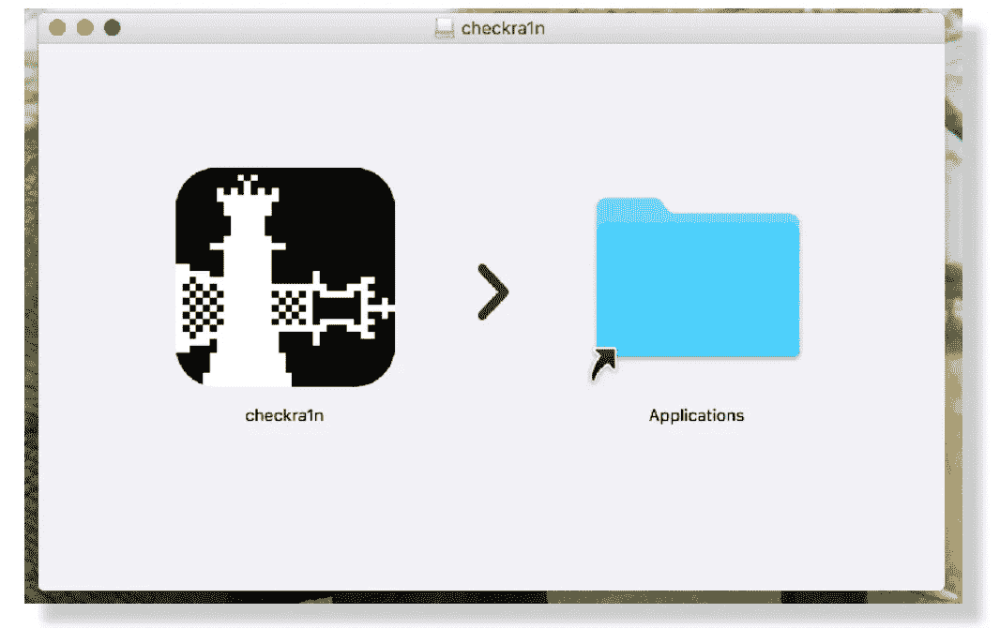
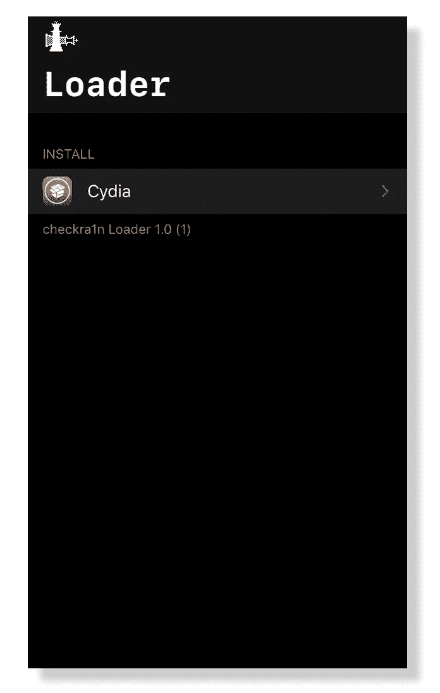

# 越狱 iOS 14.6

> 原文：<https://blog.devgenius.io/jailbreak-ios-14-6-ee267dcdd035?source=collection_archive---------0----------------------->

你可以从这个页面获得关于 iOS 14.6 越狱可用性的所有信息。

Unc0ver 和 Checkra1n 支持 iOS 14.6 越狱。下载链接可以在下面找到

# iOS 14.6 版 Checkra1n 工具

Checkra1n 是唯一支持 iOS 14.6 版本安装 Cydia 的工具。目前，Checkra1n 官方支持 iOS 12 到 iOS 14 版本，但 checkra1n 非官方支持最新的 iOS 14 到 iOS 14.6 运行 A9/A9x/A10/A10x/A11 设备。

使用前，iOS 14.6 的 Checkra1n 工具，检查设备兼容性。

# A9/A9x/A10/A10x 支持设备列表。

*   iPhone 6s、6s Plus、SE、7 和 7 Plus
*   iPad 第五、第六和第七代
*   iPad Air 2
*   iPad mini 4
*   iPad Pro 第一代和第二代
*   iPod touch 7

## A11 支持设备列表

*   iPhone 8 和 8 Plus
*   iPhone X

# Checkra1n iOS 14.6 越狱步骤指南

请注意— Checkra1n 只支持 Mac 操作系统，Windows 版本即将推出。

步骤 01。从 [**这里**](https://checkra.in/) 下载 Checkra1n 最新版本

步骤 02。将 DMG 文件拖放到 Mac 应用程序文件夹中

检查 ra1n 应用和 Mac 应用文件夹

步骤 03。完成后，从 Mac 打开 Checkra1n

步骤 04。将您的设备连接到 Mac

步骤 05。点击开始按钮

请注意:-

*   轻按“允许不受信任的 iOS/iPadOS/tvOS 版本”
*   Phone X、iPhone 8 和 8 Plus 用户应该启用“跳过 A11 BPR 检查选项”

检查功能

步骤 06。点击“下一步”按钮，使您的设备进入 DFU 模式

步骤 07。请按照屏幕指示将您的设备输入 DFU

第 08 步**。**完成所有流程后，您的设备上将安装 Checkra1n 应用程序。

步骤 09。从设备主屏幕打开 Checkra1n 应用程序，点击 Cydia 图标进行安装

Chexckra1n Cydia 安装

# 适用于 iOS 14.6 的 Unc0ver

Unc0ver 越狱团队发布了新版本的工具，为 iOS/iPadOS 14.6 版本安装 Cydia。

但是 Unc0ver 最新版本只支持 A12 到 A13 运行 14.6 设备。

目前，Unc0ver 支持 Online 和 AltStore 方法

您可以从以下链接获得所有下载链接以及如何安装指南

[un cover 在线下载链接和指南](https://silzee.com/unc0ver/)

[Unc0ver AltStore 安装链接和指南。](https://silzee.com/unc0ver/)

# iOS 14.6 版 zJailbreak

Checkra1n 越狱工具只支持有限的设备，但是 zJailbreak 工具支持每一台运行 iOS 14.6 的 iOS 设备。请注意 zJailbreak 不是一个越狱工具，但它允许你安装一些流行的越狱应用程序和 Cydia 应用程序。

# iOS 14.6 如何安装 zJailbreak

zJailbreak 半越狱 app 可以直接从 zJailbreak 网站安装。按照以下说明安装 zJailbreak。

步骤 01。从手机 Safari 打开 [**zJailbreak 网站**](https://zjailbreak.com/)

步骤 02。点击下载按钮，然后点击允许安装

步骤 03。一旦下载>进入设置并打开它

步骤 04。点击安装按钮

步骤 05。输入设备密码。如果您尚未设置密码，可以跳过此步骤。

步骤 06。点击完成

步骤 07。从主屏幕打开 zJailbreak

步骤 08。现在您可以使用 zJailbreak 应用程序来安装越狱应用程序。

# iOS 14.6 的 zJailbreak 特性

Cydia Lite 版本—一旦安装了 zJailbreak，您就可以安装 zJailbreak lite 版本。你不需要越狱你的设备来安装 Cydia Lite 版本。

iOS 14.6 用户可以从 zJailbreak lite 版本安装 Tweak 应用/ ++应用/被黑游戏/越狱应用。

Zeon full——一旦安装了 zJailbreak 应用程序，你就可以免费安装 Zeon 完整版。

第三方应用商店——一旦你安装了 zJailbreak，你将会安装许多第三方应用，因为免费的 FlekStore/CyrusHub/iPa-Apps/Tpo Store/Shark App/vSahare Pro/Zeus/Tweak door/IOs haven/EconHubApp/TuTu App/Ignition/IOs gods App/Tweak Box/App valley/App zule 是 zJailbreak 的第三方应用商店

zJailbreak 的定制应用程序——您可以从 Ela 主题商店更改您的主屏幕主题。有大量的主题可供选择。

除了 Ela 商店，还有其他一些商店可以定制您的家 in fty/Flemino/Dream Store/iface skins/GoogiOS

Metaw 壁纸—您可以使用 Metaw 壁纸将您的设备转换为下一代 iPhone。

# iOS 14.6 版 Appcake

Appcake 是另一个为 iOS 14.6 安装越狱应用的伟大应用。

Appcake 支持所有运行 iOS 14.6 版本的 iOS 设备。检查下面以安装 iOS 14.6 版本的 Appcake。

步骤 01。请确保从 Mobile Safari 打开此页面，并且下面的 Appcake 安装链接可能不适用于电脑操作系统。

[安装 app cake](https://silzee.com/appcake/jbplist/AppCake_pilist-01.php)

步骤 03。点击允许安装弹出窗口

步骤 04。安装后，请转到设备设置页面

步骤 05。从“设置”中打开配置文件，然后点击“安装”

步骤 06。请输入您的设备密码进行安装

现在你可以使用 Appcake 为 iOS 14.6 安装越狱应用了

# Ela 主题商店

iOS 14.6 用户可以从 zJailbreak 主题商店更改主屏幕主题。Ela 主题商店有超过 70 个主题。

Ela 主题商店

以下是 Ela 主题商店的几个主题

