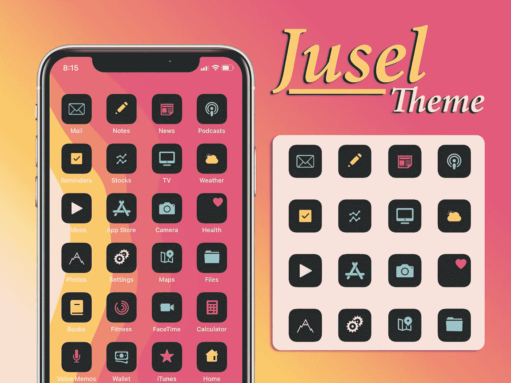
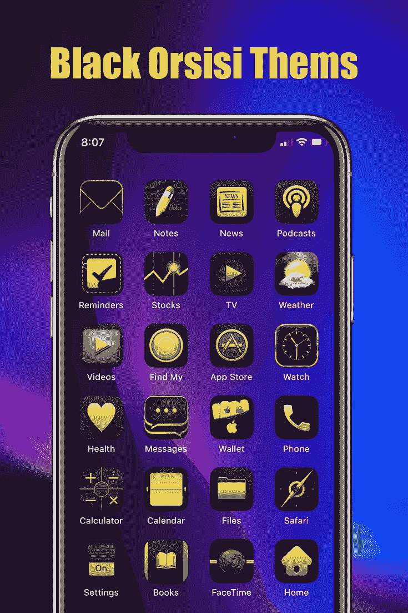
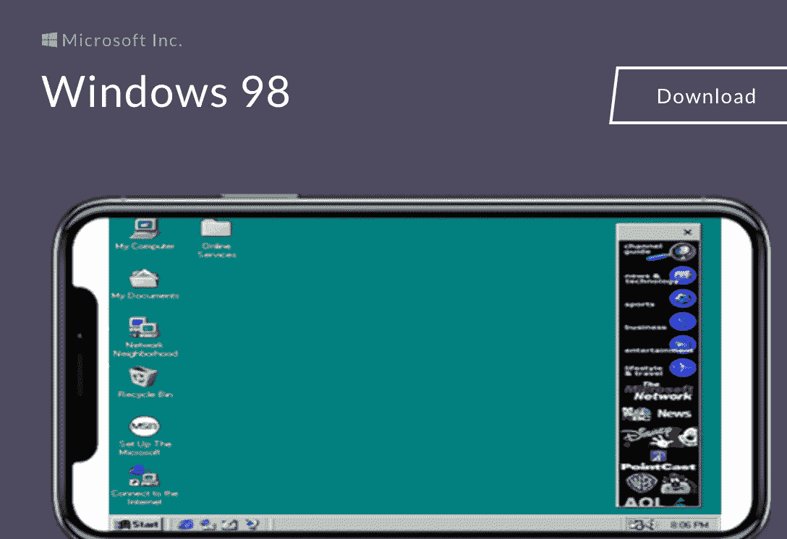
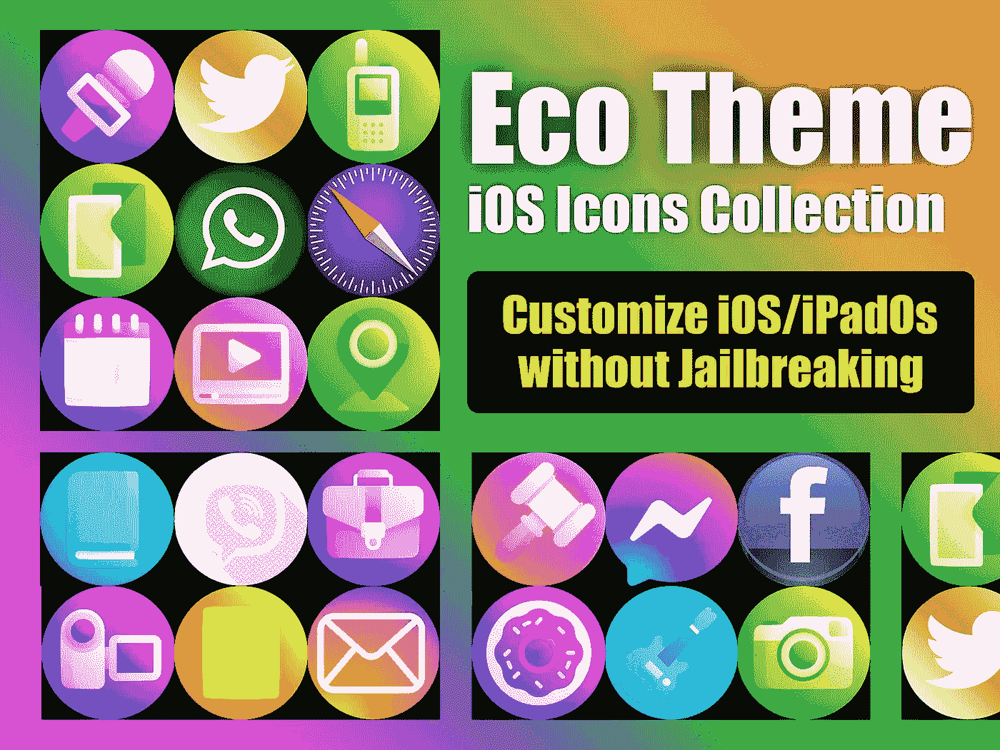

# 越狱 iOS 15-I bundles 和其他一些可用的方法

> 原文：<https://blog.devgenius.io/jailbreak-ios-15-ibundles-and-few-other-methods-available-5342e9d35483?source=collection_archive---------1----------------------->

iBundles 服务和少数其他解决方案可用于为运行每台 iPhone 和 iPad 设备的 iOS 15 获得越狱功能。

# 为什么 iBundles 适用于 iOS 15

Checkra1n / Unc0ver 和牛磺酸全越狱解决方案依然没有针对 iOS 15 版本进行更新。甚至一些第三方应用商店也不像 Tweak Box 一样更新到 iOS 15

iBundles 包含 18 个 web 服务，iOS 15 用户可以从中获得牛逼的功能。

所以 iBundles 是唯一感受 iOS 14.8 越狱功能的解决方案。

## [安装 iBundles](https://ibundles.org/af1025/)

## iBundles 功能回顾视频

# I 捆绑 iOS 15 的全部功能列表

**越狱解决方案网站-**

越狱在 iOS 用户中变得不受欢迎主要是因为假冒/诈骗越狱工具和被黑的 repos。

一些被黑的回购可能包含恶意软件文件和有害文件。问题通常是，iOS 用户在安装前无法识别。

所以越狱解决方案网站是它的答案。越狱解决方案背后的团队在手动检查后列出了所有越狱工具/ Cydia repos。

**iTweaks 网站**

基于 Siri 的快捷方式是安装越狱和 Cydia 功能的趋势方式。

你可以在网上找到这么多 Siri 快捷应用。但是 iTweaks 是不同的。

他们列出了为非越狱设备获得越狱功能的令人敬畏的新快捷方式。

**Ela 主题网站-**

通常 iOS 主屏幕定制只针对越狱用户。但 Ele 主题开发者去除了这一限制，为非越狱设备开发了丰富多彩、令人惊叹的主题。

这是其中的一些。

**弗莱明诺网站**

Flemino 是一项允许你在 iPhone 和 iPad 设备上运行电脑操作系统的服务。

Windows XP /MacOS lion / Linux 是 Flemino 网站的热门操作系统。此外，您不需要使用任何其他第三方下载服务来运行 Flemino 操作系统。只需从 iPhone 或 iPad 上打开 Flemino 网站，然后点击“安装”。

**苏杜莫网站**

Sudumo 是一项允许在没有完全越狱的情况下改变 iPhone 和 iPad 主屏幕图标的服务。

Sudumo 基于 Siri 脚本方法，你可以从 sudumo 获得丰富多彩且独特的图标设计。

**Sheeqa 网站**

越狱并不是像 Android / Windows 一样在 iPhone 上运行其他移动操作系统的唯一方式。

iOS 15 用户可以从 Sheeqa 网站感受三星 One Plus 和 Note 操作系统。

还有，你可以从 Sheeqa 安装一些修改过的 iOS 版本。

**梦想主题网站**

梦想板主题是越狱设备流行的主题改变方法。但是，梦想板并没有针对最新的 iOS 版本进行更新。

此时，梦想主题是梦想板主题的唯一选择。

**Zyrome 网站**

应用内购买是苹果商店游戏的主要关注点。但是如果你想在没有应用内购买的情况下玩游戏，升级游戏的舞台，Zyrome 是最好的方式。

你可以从 zyrome 网站免费玩最受欢迎的苹果商店游戏。

**卡尔尼姆网站**

一些流行的游戏需要更高的存储空间来下载游戏。但是 Calnim 允许你不用下载就能玩游戏。相反，只需从 iOS 设备上打开 Calnim 网站，在线玩游戏。

**Exxumo 网站**

iOS 15 用户甚至可以在没有完全越狱的情况下，从 Exxumo 网站修改设备默认设置。

示例-您可以在 Exxumo 网站上隐藏照片应用程序/阻止屏幕截图/阻止弹出窗口/密码等。

**元武网站**

Metawu 是一个非常棒的基于 iOS 15 屏幕和主屏幕定制的壁纸集合。可以从网上弄壁纸，但是 Metawu 壁纸不一样

甚至你可以从 Metawu 壁纸中隐藏主屏幕 dock。

**Selonio 网站**

iOS 15 用户可以从 Selonio 网站更改默认的 boring boot logo。

但为此，你需要全面越狱。Selonio 网站上有大量定制的 boot logo 集合。

## **iOS 15 的 Cydia 和 Sileo 精简版**

iOS 15 用户可以安装运行 iPhone 和 iPad 运行设备的 iOS 15 的精简版 Cydia 和 Sileo 第三方应用安装程序。

请注意—仅提供精简版和有限的功能。

[安装 Cydia 和 Sileo lite 版本](https://silzee.com/jailbreak/cydia/)

## **iOS 15 第三方应用商店**

zJailbreak/Zeon/app cake/TuTuBox/TuTuApp 是 iOS 15 运行设备最受欢迎的应用商店。

一旦获得 iBundles，就可以免费获得 zJailbreak/hex xa Plus/Zeon/zy long/Xabsi 和 bregxi 应用商店。

[为 iOS 15 安装第三方应用](https://silzee.com/tweaked-apps/)