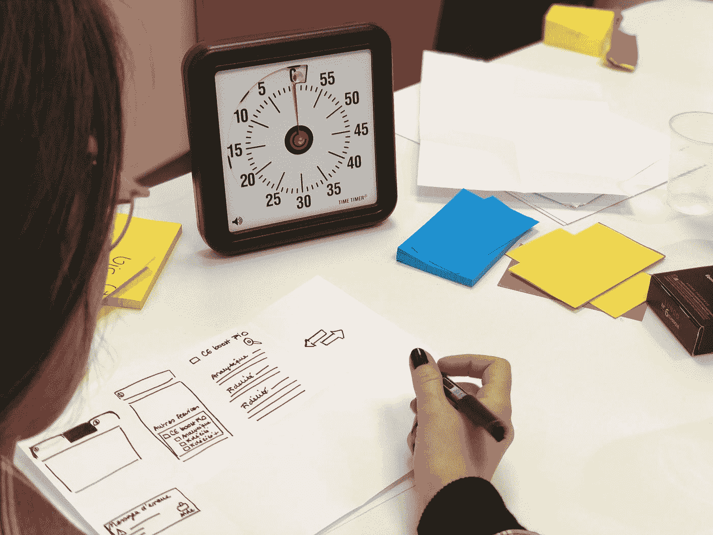

# Jasmine —定时器和异步测试

> 原文：<https://blog.devgenius.io/jasmine-timer-and-async-tests-dc0565572b75?source=collection_archive---------4----------------------->



照片由 [Bonneval Sebastien](https://unsplash.com/@gentlestache?utm_source=medium&utm_medium=referral) 在 [Unsplash](https://unsplash.com?utm_source=medium&utm_medium=referral) 上拍摄

测试是 JavaScript 的一个重要部分。

在本文中，我们将看看如何用 Jasmine 创建更复杂的测试。

# 测试 JavaScript 超时函数

我们可以使用 Jasmine 来测试 JavaScript 超时功能。

我们可以使用`jasmine.clock()`方法来做到这一点。

例如，我们可以写:

```
describe("Manually ticking the Jasmine Clock", function () {
  let timerCallback; beforeEach(function () {
    timerCallback = jasmine.createSpy("timerCallback");
    jasmine.clock().install();
  }); afterEach(function () {
    jasmine.clock().uninstall();
  }); it("causes a timeout to be called synchronously", function () {
    setTimeout(function () {
      timerCallback();
    }, 100); expect(timerCallback).not.toHaveBeenCalled();
    jasmine.clock().tick(101);
    expect(timerCallback).toHaveBeenCalled();
  });
});
```

创造一个我们可以观看的`timerCallback`间谍。

我们调用`jasmine.clock().install()`来创建茉莉花定时器。

而我们在最后调用`jasmine.clock().uninstall()`来移除它。

然后我们给`tick`打电话，把时间改成我们想要的时间。

这样，我们可以检查我们的`setTimeout`回调是否被调用。

同样，我们可以用它来测试`setInterval`。

例如，我们可以写:

```
describe("Manually ticking the Jasmine Clock", function () {
  let timerCallback; beforeEach(function () {
    timerCallback = jasmine.createSpy("timerCallback");
    jasmine.clock().install();
  }); afterEach(function () {
    jasmine.clock().uninstall();
  }); it("causes a timeout to be called synchronously", function () {
    setInterval(function () {
      timerCallback();
    }, 100); expect(timerCallback).not.toHaveBeenCalled(); jasmine.clock().tick(101);
    expect(timerCallback.calls.count()).toEqual(1); jasmine.clock().tick(102);
    expect(timerCallback.calls.count()).toEqual(2);
  });
});
```

像使用`setTimeout`测试一样，我们使用`tick`方法将时钟更改为我们想要的时间。

该时间相对于最后一个`tick`被调用的时间而改变。

# 嘲笑日期

我们可以使用`mockDate`方法来模拟我们想要的日期。

例如，我们可以写:

```
describe("Manually ticking the Jasmine Clock", function () {
  let timerCallback; beforeEach(function () {
    timerCallback = jasmine.createSpy("timerCallback");
    jasmine.clock().install();
  }); afterEach(function () {
    jasmine.clock().uninstall();
  }); it("mocks time time", function () {
    const baseTime = new Date(2020, 0, 1); jasmine.clock().mockDate(baseTime); jasmine.clock().tick(50);
    expect(new Date().getTime()).toEqual(baseTime.getTime() + 50);
  });
});
```

我们将`baseTime`设置为`Date`实例，然后使用`mockDate`将日期设置为我们想要的时间。

然后我们调用`tick`来移动时间。

然后在调用`tick`之后，我们使用`getTime`来获取当前时间。

# 异步支持

Jasmine 支持测试异步代码。

我们可以用以下方式测试异步代码:

```
describe("Using callbacks", function () {
  beforeEach(function (done) {
    setTimeout(function () {
      value = 0;
      done();
    }, 1);
  }); it("supports sequential execution of async code", function (done) {
    value++;
    expect(value).toBeGreaterThan(0);
    done();
  });
});
```

我们有一个`beforeEach`回调，它有一个`setTimeout`函数调用。

我们在回调中调用`done`,以便运行测试代码。

在测试代码中，回调使用`done`参数让我们调用`done`来表示测试已经完成。

要使测试失败，我们可以使用`done.fail`来使测试失败。

例如，我们可以写:

```
describe("Using callbacks", function () {
  var foo = function (x, callBack1, callBack2) {
    if (x) {
      setTimeout(callBack1, 0);
    } else {
      setTimeout(callBack2, 0);
    }
  }; it("should not call the second callBack", function (done) {
    foo(true,
      done,
      function () {
        done.fail("Second callback has been called");
      }
    );
  });
});
```

我们在第二次回调中调用了`done.fail`，这样如果它运行，测试将会失败。


Utsman 媒体在 [Unsplash](https://unsplash.com?utm_source=medium&utm_medium=referral) 上拍摄的照片

# 结论

我们可以用 Jasmine 运行各种带有定时器和异步代码的测试。