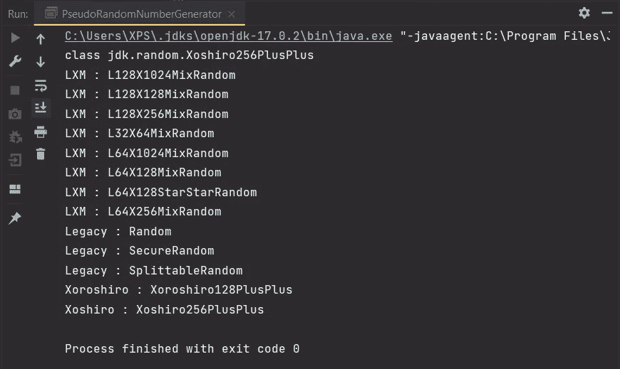
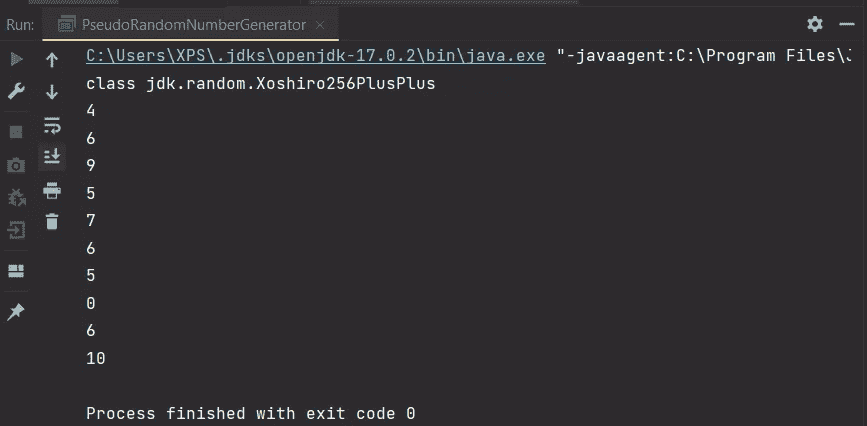
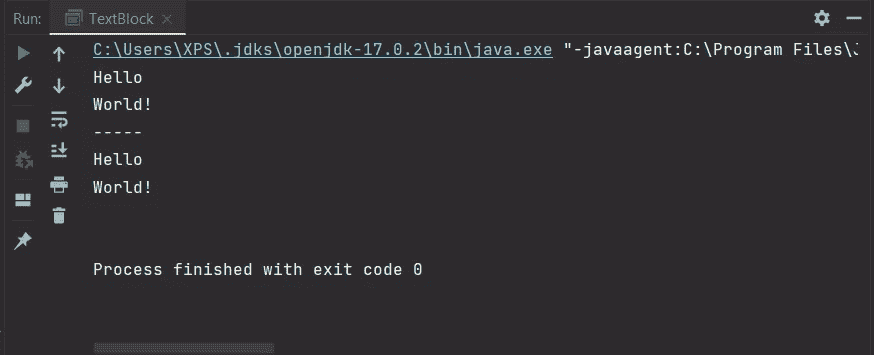
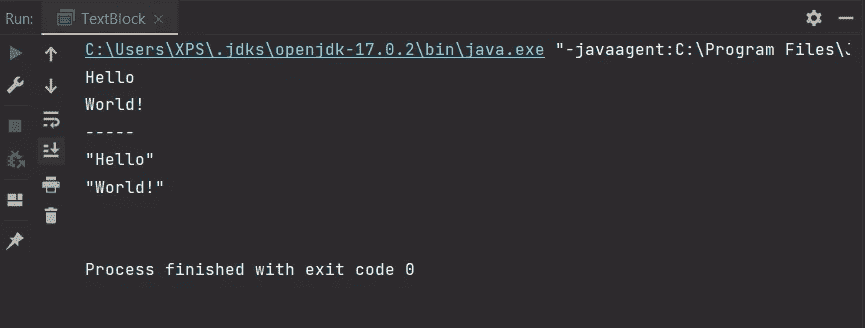
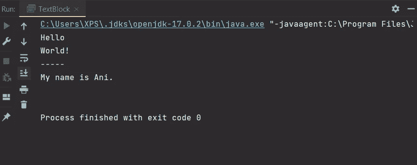

# Java 12 到 17 —您需要知道的一切

> 原文：<https://blog.devgenius.io/java-12-to-17-all-you-need-to-know-7e1152f86829?source=collection_archive---------8----------------------->


从博客 [GeeksForGeeks](https://www.geeksforgeeks.org/jdk-17-new-features-in-java-17/) 下载的 Java 插图

如果你一直推迟使用 Java 17，我有一些好消息要告诉你。您将能够在一个地方了解从 ***Java 12 到 Java 17*** 的最时尚的顶级特性 ***，并与我一起尝试编码。***

首先，Java 17 将是一个 ***长期支持*** (LTS)的版本，类似于 Java 11 和 Java 8。它于 2021 年 9 月引入 Java 社区，包括几个新特性和升级。你可以在这里 看到所有特性的列表 [***，但是在本教程中，我将重点介绍几个我特别感兴趣的特性。***](https://openjdk.java.net/projects/jdk/17/)

如果有兴趣，可以访问我的[***GitHub repo***](https://github.com/anitalakhadze/java17features)查看这里给出的所有例子的源代码。

## 密封类[Java 17]

*密封类是一种执行继承规则的新方法。它们允许开发人员*显式声明类型*允许的子类型，从而防止其他人无意中扩展或实现它。*

*当您将`**sealed**` 关键字添加到类或接口的声明中时，您也添加了一个可以`**extend**` 或`**implement**` 它的类列表。预定义批处理之外的任何内容都将无法编译。*

*例如，假设您创建了一个类`**Animal**` ，并且您只想要类`**Cat**` 和`**Dog**` 来扩展它:*

```
*public abstract sealed class Animal permits *Cat*, *Dog* {
}*
```

*子类必须是`**final**`、`**sealed**`、**或`**non-sealed**`:***

```
*public final class *Cat* extends Animal{
}*
```

*密封的类不仅 ***保护你的代码安全*** 不让外人看到，而且它们还 ***向你永远不会遇到的人表达你的目的*** 。当你密封一个类时，你表明只有某些类被允许扩展它。*

## *记录类[Java 16]*

****记录*** 是纯数据类，*负责 POJO*的所有样板代码。自动实现`**equals()**`和`**hashcode()**`方法，以及`**toString()**`和`**getter**` 方法。*

*您可以通过以下方式 ***申报一条记录*** :*

```
*public record *PersonRecord*(*String* name, *Integer* age) {
}*
```

*记录有 ***期末*** 和 ***不可变。*** 在一条记录中，你可以同时指定*和*两种静态方法:***

```
***public record *PersonRecord*(*String* name, *Integer* age) {
    public boolean isOver18() {
        return age() > 18;
    } public static boolean isOver18(*PersonRecord personRecord*) {
        return *personRecord*.age() > 18;
    }
}***
```

**记录可以有 ***多个构造函数。*** 另外值得注意的是，如果你在记录内指定一个 ***自定义构造函数*** ，它必须调用默认构造函数。否则，记录将无法确定如何处理其值:**

```
**public record *PersonRecord*(*String* name, *Integer* age) {    
    public PersonRecord() {
        this("Name", 18);
    }
}**
```

**如果您的构造函数与默认的相同，这是可以接受的，只要您还*初始化记录的所有字段*:**

```
**public record *PersonRecord*(*String* name, *Integer* age) {
    // Will replace the default constructor
    public PersonRecord(*String name*, *Integer age*) {
        this.name = *name*;
        this.age = *age*; 
    }
}**
```

**记录是一个巨大的变化，但在适当的情况下，它们可能非常有益。我没有涵盖所有内容，但是这应该会让您对它们的能力有一个很好的了解。**

## **模式匹配[Java 16]**

***是一种手段，在一个`**instanceof**` 条件满足后 ***消除不必要的铸造*** 。***

**我们都很熟悉这种情况:**

```
**public class *PatternMatching* {
    public static void main(*String*[] *args*) {
        *Animal* animal = new Cat();
        if (animal instanceof *Cat*) {
            *System*.out.println(((*Cat) animal)*.meow());
        }
    }
}**
```

**话虽如此，毫无疑问，第二行的动物是一个`**Cat**`**—**已经证实了这一点。与 ***图案匹配*** ，稍加调整即可:******

```
******if (animal instanceof *Cat cat*) {
    *System*.out.println(*cat*.meow());
}******
```

******编译器现在**处理对象**造型的所有细节。它可能看起来很少，但是它减少了许多样板代码。******

******当你输入一个 ***条件分支*** 时，对象的类型是显而易见的:******

```
******if (!(animal instanceof *Cat cat*)) {
    *System*.out.println("This isn't a cat!");
} else {
    *System*.out.println(*cat*.meow());
}******
```

******模式匹配甚至可以在`**instanceof**` 本身所在的同一行上使用*:*******

```
******public static boolean isCat(*Object animal*) {
    return *animal* instanceof *Cat cat* && *cat*.meow().equals("meow");
}******
```

******因此，模式匹配为常见的代码噪声问题提供了有效的解决方案。******

## ******切换表达式[Java 14]******

******该语言特性增加了根据类型 切换 ***的能力，类似于`**instanceof**`的模式匹配给出的语法。*********

****以前，如果您想根据对象的*动态类型*执行各种操作，您必须使用`**instanceof**` 检查创建一个`**if — else if**`链，例如:****

```
****public class *SwitchExpression* {
    private static *String* ifElseIfSwitch(*Object o*) {
        if (*o* instanceof *Cat*) {
            return "This is a cat";
        } else if (*o* instanceof *Dog*) {
            return "This is a dog";
        } else {
            return "This is some other animal";
        }
    }
}****
```

****或者`**switch**` 例:****

```
****private static *String* legacySwitch(*Object* o) {
    switch (*o*) {
        case *Cat*:
            return "This is a cat";
            break;
        case *Dog*:
            return "This is a dog";
            break;
        default:
            return "This is some other animal";
            break;
    }
}****
```

****他们非常容易出现人为错误。Switch 表达式很好地解决了这个问题，它允许你用逗号分隔同一个块 中的所有值。****

****上面的例子可以将*简化为*如下:****

```
****private static *String* modernSwitch(*Object* o) {
    return switch (*o*) {
        case *Cat cat* -> "This is a cat";
        case *Dog dog* -> "This is a dog";
        default -> "This is some other animal";
    };
}****
```

****正如您可能已经观察到的，检查 ***还包括一个变量声明*** ，它与`**instanceof**`的模式匹配一样，表明对象已经过*类型检查、*和*类型转换，现在可以从其作用域*内的变量*获得*。****

****他们还增加了一个***null***的特例，这样你就不用再检查 null 了。****

****新增的`**yield**` 关键字也是一大特色。如果您的一个案例进入代码块，yield 将用作 switch 表达式的返回语句。例如，考虑上面的代码块，它已经被稍微修改了:****

```
*****String* whichAnimal = switch (*o*) {
    case *Cat cat* -> "This is a cat";
    case *Dog dog* -> "This is a dog";
    default -> {
        *System*.out.println("This is some other animal");
        yield "Unknown animal";
    }
};****
```

****在默认情况下，将执行`**System.out.println()**`方法，而`**whichAnimal**`变量最终仍然是“*未知动物*”，因为 yield 表达式返回的就是这个。****

****一般来说， ***的 Switch 语句更简洁，*** 的 switch 语句更简洁。但是，它们不能代替 switch 语句，两者仍然可以访问。****

## ****有用的空指针[Java 14]****

*******有用的空指针*** 当然是对语言的一个很好的补充。他们通过*发布抛出异常的调用*的名字，以及*空变量*的名字，使得空指针异常( ***NPEs*** )更容易理解。****

****例如，如果您调用了`**person.getAge()**`并且未定义`**age**` 参数:****

```
****public class *NullPointer* {
    public static void main(*String*[] *args*) {
        *Person* ani = new Person("Ani", "Talakhadze", null);
        int i = ani.getAge().compareTo(23);
        *System*.out.println(i);
    }
}****
```

****错误的堆栈跟踪将声明`**getAge()**`失败，因为`**age**` 参数为空:****

```
****Exception in thread "main" java.lang.NullPointerException: Cannot invoke "java.lang.Integer.compareTo(java.lang.Integer)" because the return value of "nullPointers.Person.getAge()" is null
 at nullPointers.NullPointer.main(NullPointer.java:6)Process finished with exit code 1****
```

****npe 非常常见，虽然大多数时候很容易找出问题所在，但偶尔也会遇到两三个变量起作用的情况。现在，一旦出现错误，您就拥有了解决问题所需的一切。****

## ****增强型伪随机数生成器[Java 17]****

****为了使未来的*伪随机数发生器(PRNG)* 技术更容易开发或使用，引入了一个名为`**RandomGenerator**`的新接口。以下代码生成所有 Java 17 PRNG 算法:****

```
****RandomGeneratorFactory.all()
        .map(fac -> fac.group()+ " : " + fac.name())
        .sorted()
        .forEach(*System*.out::println);****
```

********

*****运行伪随机数生成器*后的输出****

****以下示例利用新的 Java 17 `**RandomGeneratorFactory**`使用`**Xoshiro256PlusPlus**` PRNG 算法创建 0 到 10 之间的随机数。将相同的种子传递给 random，然后调用它，将得到相同的一组数字:****

```
****public class *PseudoRandomNumberGenerator* {
    public static void main(*String*[] *args*) { *RandomGenerator* randomGenerator1 = *RandomGeneratorFactory*.*of*("Xoshiro256PlusPlus").create(999);*System*.out.println(randomGenerator1.getClass());for (int i = 0; i < 10; i++) {
            *System*.out.println(randomGenerator1.nextInt(11));
        }
    }
}****
```

********

*****运行伪随机数生成器*后的输出****

****像`**java.util.Random**`、`**SplittableRandom**`和`**SecureRandom**` 这样的遗留随机类也被重构以扩展新的`**RandomGenerator**` 接口。****

## ****文本块[Java 15]****

****文本块是一种使 ***编写多行字符串*** 更容易的方法，它允许*新行被解释*和 ***缩进被保持*** 而不需要转义字符。这个值仍然是一个字符串，但是它包含了新的行和制表符。****

****要创建文本块，只需使用以下语法:****

```
****package *textBlocks*;public class *TextBlock* {
    public static void main(*String*[] *args*) {
        *String* text = """
                Hello
                World!
                -----
                Hello
                World!
                """;
        *System*.out.println(text);
    }
}****
```

********

****运行 TextBlock 后的输出****

****同样，如果您希望使用引号，也不需要任何转义字符。该程序将无任何抱怨地运行:****

```
*****String* text = """
        Hello
        World!
        -----
        "Hello"
        "World!"
        """;****
```

********

****运行 TextBlock 后的输出****

****除此之外，您可以使用字符串的`**format()**`函数来格式化您键入的内容，允许您使用动态值快速更改文本块中的数据:****

```
*****String* name = "Ani";
*String* text = *String*.*format*("""
        Hello
        World!
        -----
        My name is %s.
        """, name);****
```

********

****运行 TextBlock 后的输出****

****文本块使得 ***将代码粘贴到字符串*** 中变得非常容易，此外，它还能够 ***明显地在格式*** 中烘焙一大块单词。因为保留了缩进，所以你可以创建一个 HTML 或 Python 的块，或者任何其他语言的块，然后把它包装在" "。文本块也可以用来创建 JSON，而`**format()**`函数可以用来简单地填充数据。****

## ****弃用、删除和限制[Java 17]****

****Java 的最新版本也带来了几个*弃用*、*移除*、*增加限制*。****

****JDK 内部 的 ***封装是一个已经被移除的东西。如果用户试图使用反射或类似方法来避免访问正常内部 API 的典型约束，这将在 *Java 9* 中发出*运行时警告*。Java 16* 中的默认行为从警告变为*通过引发异常*禁止访问，但是修改行为的命令行参数被保留。在 *Java 17* 中已经删除了*命令行参数*，并且这个限制不能再被取消，这意味着对那些内部 API 的任何非法访问现在都被强有力地封装了。******

***Java 17 去掉了之前的默认语义，所有的 ***浮点运算*** 现在都做为严格。关键字`strictfp`仍然存在，但没有任何效果，并产生一个编译时警告*。****

******【提前(AOT)*** ***编译*** 和 ***RMI 激活*** 被删除。 ***Applet API*** 已被标记为删除，当试图从命令行或在运行时动态设置 ***安全管理器*** 时，JVM 将生成运行时警告。***

***迁移到 Java 17 *宜早不宜迟*通常是最好的选择，因为它未来的 ***减少了迁移费用*** 。您还将从近年来取得的所有进步 中获益**，包括 ***增加了对容器中操作的支持*** 和新的 ***低延迟垃圾收集器*** 实现。*****

***即使你不打算从以前的版本迁移到这个版本，跟上语言中开发的新特性 也是一个好主意。***

***当然，这些并不是从 Java 12 到 Java 17 的唯一变化，但是它们引起了我的注意。如果你的顶级功能列表与我的不同，请在下面的评论区 与我们分享。***

******敬请关注，不要错过以下教程！******