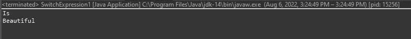

# Java 14: 5 你必须知道的新特性

> 原文：<https://blog.devgenius.io/java-14-5-new-features-you-must-know-51f49edb12b?source=collection_archive---------3----------------------->

## 软件工程之旅

## 作为软件工程师，您必须了解的 Java 14 : 5 新特性

照片由 [**特雷西·亚当斯**](https://unsplash.com/@tracycodes) 在 Unsplash 上拍摄

# 概观

Java 14 于 2020 年 3 月 17 日发布。该版本引入了一些新功能作为预览，以便为将来的版本标准化这些功能。本文通过示例代码列出了 Java 14 的重要特性。我们开始吧！

# Java 14 新特性

## #1 开关表达式(标准)

这是这个版本中唯一的标准化特性，它是 Java 13 和 Java 12 中的预览特性。

在 Java 14 之前，当使用 switch 语句时，我们只将其用作检查变量值的语句。根据这个变量的值，我们可以根据需要定义一组不同的语句来执行。

代码的输出:

通过以上写作，我们将遇到如下 3 个常见问题:

1.我们可以忘记声明一个 break 语句，让代码一直运行到下一个 case，而不是匹配上一个 case 就停止。

代码的输出:

2.如果要检查的变量值不同，但其内部处理是相同的，这将导致代码重复

3.使用 switch 语句来定义值肯定是冗长的，会使代码变得混乱。您必须写下以下内容:

从 Java 14 标准版开始，它帮助解决了上述问题:

1.新语法使用->操作符，而不是我们习惯的冒号。没有 break 关键字:你不需要 break 语句来防止失败。

代码的输出:

2.我们还建议每个案例允许多个变量，用逗号分隔。这有助于我们将多个有效表达式组合到同一个代码块中。避免创建多段相同的代码

代码的输出:

3.使用“yield”关键字处理每种情况下的切换表达式的业务逻辑。它有一个参数，即“case”标签在 switch 表达式中产生的值。它将返回我们期望的值:

代码的输出:

新开关表达式的好处包括由于没有失败行为而减少了 bug 的范围。

我们可以将开关表达式赋给变量，或者将它们放在 Java 代码中需要表达式的任何地方。

## #2 有用的 null pointer 异常

Java 14 通过精确显示哪个变量为空，帮助开发人员理解是什么导致了 NullPointerException。我们可以通过下面的代码看出区别:

Java 14 之前的输出:

不使用调试器很难确定哪个变量为空。此外，JVM 将只打印出导致异常的方法、文件名和行号。

Java 14 之后的输出:

它通过更清楚地将动态异常与静态程序代码联系起来，极大地提高了对程序的理解。

## #3“实例 of”的模式匹配(预览)

通常，用 Java 开发应用程序时。对于应用程序，当我们需要处理一个特定类型的类，但是我们有一个超类类型的引用，那么我们需要检查那个实例的类型。如果结果为真，下一步就是将它转换为我们用来比较它的类型

下面这段代码有重复:compare totype—if true—cast totype。

代码的输出:

“instanceof”操作符在 Java 14 中得到改进，可以测试参数并将其分配给具有适当类型的绑定变量。

在“instanceof”语句之后，我们现在可以指定一个变量名。如果 object 是指定的类型，则它被绑定到新的变量名；这个新变量是指定的目标类型，并且在“then 块”中可见。

结果也将返回相同的

这是一种语言特性，可以帮助进一步减少冗长，从而减少出现错误的可能性。

## #4 记录(预览)

通常，要声明一个不可变的类，我们应该:

*   将此类声明为 final，这样任何类都不能从它扩展。
*   将该类的字段声明为私有的和最终的
*   没有 Setter 方法，只有 Getter 方法
*   如果该类的一个字段是一个对象，那么当我们获取该字段的信息时，我们需要返回该对象的一个副本。

下面是一个不可变类的例子。

从 Java 14 开始，通过在声明类时使用 record 关键字，我们可以更快、更简单地做到这一点。除了构造函数和 getters 之外，这个特性还自动生成“equals”、“hashCode”和“toString”的实现。

我们只需要一行代码来实现上面不可变的“Employee”类，如下所示:

现在，我们可以初始化并获取雇员对象的信息，如下所示:

代码的输出:

这个特性顺应了减少 Java 冗长的趋势，帮助开发人员编写更简洁的代码。

## #5 文本块(第二次预览)

以前，当在 Java 中声明一个多行文本时，我们通常这样做:

代码的输出:

文本块使得处理多行字符串更加容易。我们可以使用三个双引号字符(" ")在 Java 中声明多行字符串

它允许我们包含 HTML、JSON 或任何我们需要的文字片段

它还提供了两个额外的方法来支持文本块。

*   **\ <行尾>** 抑制行终止。
*   **\s** 翻译成单个空格。

# 摘要

这些是 Java 14 中最重要的 5 个必须知道的特性。我希望这篇文章能帮助您理解这些新特性。您可以使用本文中的示例作为一个很好的切入点，来探索关于 Java 14 的更多细节。

*如果你喜欢这个故事，你也会喜欢:*

*   [你必须知道的 Java 18: 4 特性](/java-18-top-4-features-you-must-know-1f36ee23e2ab)
*   [你必须知道的 Java 11: 8 特性](https://medium.com/@techisbeautiful/new-features-you-must-know-in-java-11-and-examples-3fda2ad26def)
*   [你必须知道的 Java 8 : 7 特性](/java-8-seven-features-you-must-know-and-examples-1c3964ae7fe8)

*喜欢这篇文章吗？给我弄个* [*Ko-fi*](https://ko-fi.com/techisbeautiful) *。*

*爱我的文字？加入我的* [*邮箱列表*](https://medium.com/subscribe/@techisbeautiful) *。*

*爱读书？加入* [*中*](https://medium.com/@techisbeautiful/membership) *(如果你用这个链接，也是支持我的，因为我有中少的提成)。*