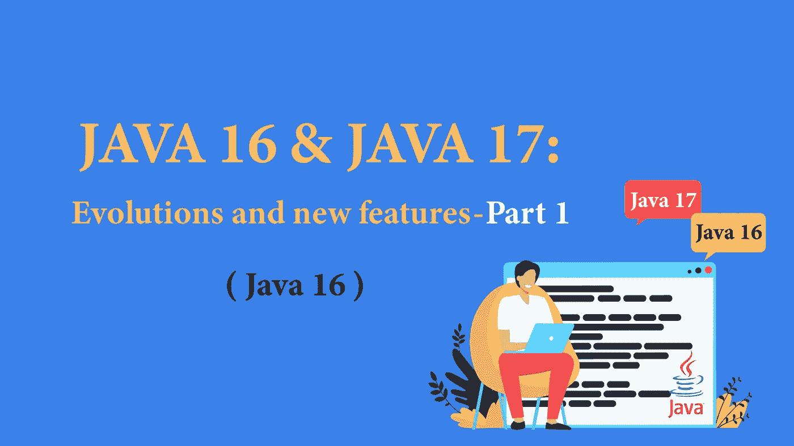

# JAVA 16 和 17:发展和新特性—第 1 部分

> 原文：<https://blog.devgenius.io/java-16-and-17-evolutions-and-new-features-part-1-d008e1d8f6de?source=collection_archive---------6----------------------->

## 每个 Java 开发者都应该知道的 Java 版本进化链。



“Java 17 已经来了！呃…我们又要迁徙了吗？选择哪个版本？迁移到 Java X 或者最新的 LTS 版本？”。

事实上，一段时间以来，Oracle 一直在加快发布 Java 更新的步伐，以便开发人员可以依靠可预测的发布时间表。为了不断提高语言的性能、稳定性和安全性，每六个月发布一个新版本。另一方面，开发人员必须跟上新语言的发展，以便作为 it 专业人员充分利用它。

在本文中，我们将介绍 JDK 16 & 17 提供的新特性和语言改进。

> 如果你想对从 JAVA 9 到 JAVA 15 的演进有一个大概的了解，[你可以参考这篇文章](/from-java-9-to-java-15-evolutions-and-new-features-part-1-c249947b7513)。

# JAVA 16:

## 1.Stream.toList()

从 Java 8 开始，我们经常调用终端操作。collect(Collectors.toList())。这种相当常见的做法看起来像样板代码。

```
List<String> colors = Stream.of("Blue ", "Yellow", "RED")
                            .map(String::toLowerCase)
                            .filter(s -> s.contains(" "))
                            .collect(Collectors.toList());
```

在 Java 16 中，一个新的 toList()终端操作已被添加到流 API 中，这将允许我们替换前面的代码，如下所示:

```
List<String> colors = Stream.of("Blue ", "Yellow", "RED")
                            .map(String::toLowerCase)
                            .filter(s -> s.contains(" "))
                            .toList();
```

但是，这里应该注意两种操作之间的区别:

`Stream.toList()`返回一个不可变的列表(不能改变，排序…)。该列表上的任何`add()`、`sort()` …类型操作返回`java.lang.UnsupportedOperationException`。

不像`Stream.collect(Collectors.toList())`返回一个可变的数组列表(可以改变，排序…)。

## 2.Stream.mapMulti()

**Java 16 中引入的 mapMulti()** ，是一个中间流操作，允许用多个元素替换流中的元素。

`<R> Stream<R> mapMulti(BiConsumer<T, Consumer<R>> mapper)`

这个方法与`Stream::flatMap`相似，它将一对多转换应用于流的元素，并将结果元素展平为一个新的流。

在以下情况下，此方法优于**平面图**:

*   当用少量(可能为零)元素替换每个流元素时。使用这种方法避免了为每组结果项创建新的**流**实例的开销，正如**平面图**所要求的。
*   当使用命令式方法生成结果项比将它们作为**流**返回更容易时。

示例:

```
Stream.of("Lion", "Jaguar", "Tiger").mapMulti((dtr, consumer) -> {
consumer.accept(str.toUpperCase()); consumer.accept(str.toLowerCase());}).forEach(System.out::println);Output:LION
lion
JAGUAR
jaguar
TIGER
tiger
```

## 3.记录

Java 16 合并了以前在 Java 14 的 preview 中引入的记录终结。java 中的记录(java.lang.Record)是一种特殊形式的类，只包含数据(类似于数据库中元组的概念)。

记录是**不可变的**，并且没有类似 setter 的方法。一旦记录用某些值实例化，就不能修改。记录类是最终的，因此可以很好地模拟数据类

示例:

```
public record Person(String name, int age, String gender) { }
```

***创纪录的好处？一旦我们有了一个记录的声明，我们就得到了一个类，它有一个隐式的规范构造函数来接受记录的所有组成部分的值。我们自动获取 equals()、hashCode()和 toString()方法的实现，以及记录中每个组件的访问器方法(参考上面的例子:name()、age()、gender())。***

例如，记录可用于创建数据传输对象( **DTO** s)，因为这些对象不需要任何身份或行为，只用于传输数据。

**记录可以:**

*   重定义构造函数:紧凑规范，完全规范，自定义。
*   重新定义 equals()和 hashCode()。
*   对生成的方法有自己的实现(必须
    遵守不变量/规则)。
*   有额外的方法。
*   拥有静态字段和方法。
*   实现接口。
*   泛泛而谈。

**记录不能:**

*   从其他类继承或被扩展。
*   有 setters。
*   拥有“额外的”实例字段。
*   具有“不太明显”的规范构造函数。
*   声明本机方法。
*   在紧凑构造函数中分配组件。
*   没有 copy()方法。

## 4.使用实例的模式匹配

JDK 16 特别为`instanceof`操作符集成了模式匹配(模式过滤)的终结。

我们经常编写程序，将使用`instanceof`操作符的测试与显式强制转换结合起来，以便对正在讨论的对象进行进一步的处理。

示例:

```
if (object instanceof Integer){
   Integer i = (Integer) object;
   if (i % 2 == 0)
    System.out.println(" You’re an even number");
}
```

这里发生了三件事:一个测试(对象是整数吗？)、转换(对象转换为整数)以及新局部变量(整数)的声明，因此出现了 3 次整数类型。

这个模型不是最优的。为了解决这个问题，Java 像许多语言一样采用了模式匹配，从 **Haskell** 到 **C#** 都采用了模式匹配，这是因为它的简洁和安全。

模式匹配用于简明地表达对象的期望“形状”(模式)，并用于各种语句和表达式，以对照其输入来测试该“形状”(匹配)。因此，我们称之为智能转换(同时进行测试、声明和转换)。

这给出了我们的例子:

```
if (object instanceof Integer i){
   if (i % 2 == 0)
      System.out.println(" You’re an even number");
}
```

或者:

```
if (object instanceof Integer i && i % 2 == 0){
   System.out.println(" You’re an even number");
}
```

## 5.基于值的类(折旧)

基于值的类是表示不可变对象的类，这些对象的身份与类的行为无关。因此，它们是按值(equals())而不是按标识(==)进行比较的。

> 示例:整数、双精度等的包装器。基元

在 java 16 中，会为这些类生成警告，并且不推荐使用它们的构造函数来鼓励删除它们。这一改进是 Valhalla 项目的一部分，旨在预测基于值的某些类的迁移，在未来版本中成为原始类。这种未来迁移的候选对象是:

*   包装:{字节，短整型，长整型，浮点型，双精度型，布尔型，字符}
*   java.util 中的“可选”类:optional、OptionalInt、OptionalLong 和 OptionalDouble
*   java.time.{Instant，ZonedDateTime，Duration，…}中的许多类
*   List.of()、List.copyOf()、Set.of()、…、Map.entry()的实现
*   任何具有 jdk.internal. [@ValueBase](http://twitter.com/ValueBase) 注释的类

基于值的类的客户通常不会受到基本类迁移的影响，除非他们违反了那些类的使用建议。特别是，当在迁移发生的未来 Java 版本上运行时:

*   这些相等的类的实例(通过**等于**)也可以被认为是相同的(通过 **==** )，这有破坏依赖于一个**！=** )正确行为的结果。
*   尝试用新的整数、新的双精度数等创建包装类实例。，而不是隐式装箱或调用 valueOf factory 方法，将产生 LinkageErrors 类型的异常。
*   尝试同步这些类的实例也会产生异常。

## 6.内存管理改进

为了进一步提高性能，JDK 16 中引入了以下功能:

*   **弹性元空间**

-XX:metaspacereakpolicy =(平衡|主动|无)

引入这一新选项的目的是允许操作系统更快地返回未使用的热点内存(即元空间)，减少元空间占用空间，并简化该空间中的代码以降低维护成本。

*   **ZGC 垃圾收集器:线程堆栈的同时处理**

从 Java 16 开始，为了减少花费在**安全点**内的时间，ZGC 垃圾收集器将 GC 线程栈的处理从**安全点**转移到并发阶段。

这项工作消除了并发堆栈处理的最后一个重要瓶颈。我们谈论的是标准机器在 **ZGC 安全点**上花费的时间不到 1 毫秒。

## **7。网络改进:UNIX 域套接字通道**

为了提高开发人员的灵活性和生产力，除了套接字通道和服务器套接字通道**API**之外，Java 16 还集成了所有的 **Unix** 域套接字特性(Windows 和更大的 Unix 平台通用的)。在`java.nio.channels`包里。此外，Unix 域套接字用于同一主机上的**进程间通信** ( **IPC** )。

它们与 **TCP/IP** 套接字非常相似，除了它们由文件系统路径名而不是**互联网协议** ( **IP** )地址和端口号来寻址。

## 8.打包工具:`**jpackage**`

工具`**jpackage**`，是一个打包自包含 Java 应用程序的工具。这意味着这个包包含了所有必要的依赖项以及一个 Java 运行时环境。应用程序可以作为常规 **JAR** 文件的集合或者模块的集合来交付。支持的特定于平台的包格式有:

*   Linux : **debetrpm**
*   macOS : **pkgetdmg**
*   windows:**msietex**

示例:

**使用非模块化应用**

```
$ jpackage –name myapp –input lib –main-jar main.jar \ –main-class myapp.Main
```

**使用模块化应用**

```
$ jpackage –name myapp –module-path lib -m myapp/myapp.Main
```

## 9.启用 C++14 语言

该功能的目的是正式授权对 **JDK** 中的 **C++** 源代码进行更改，以利用 **C++14** 语言功能，并提供关于如何在**热点**代码中使用这些功能的清晰说明。

我们将在即将发表的第二篇文章中讨论 **JAVA 17** 的发展和新颖之处，订阅我们的时事通讯，当有新文章发布时我们会通知您。

下一部:[第二部](/java-16-and-17-evolutions-and-new-features-part-2-f2eb30c89a80)。