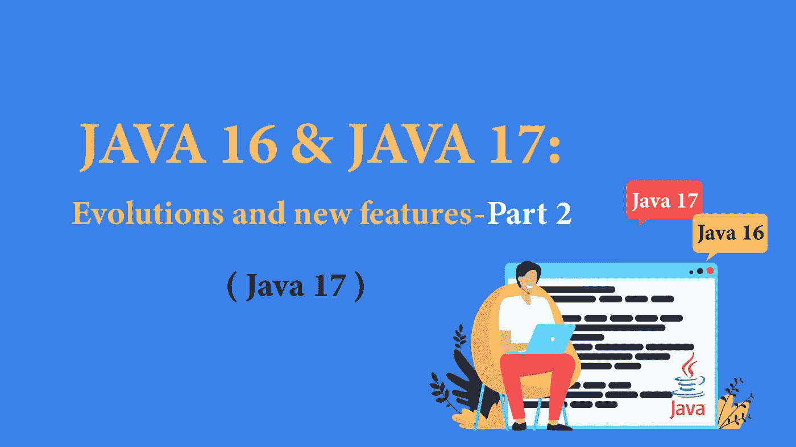

# JAVA 16 和 17:发展和新特性—第 2 部分

> 原文：<https://blog.devgenius.io/java-16-and-17-evolutions-and-new-features-part-2-f2eb30c89a80?source=collection_archive---------8----------------------->

## 每个 Java 开发者都应该知道的 Java 版本进化链。



下一部:[第一部](/java-16-and-17-evolutions-and-new-features-part-1-d008e1d8f6de)

在本文的第一部分中，我们解释了 **JAVA 16** 的变化和新特性。在第二部分中，我们将讨论 **JAVA 17** 的变化和新特性。

# JAVA 17

## 1.交换机的模式匹配(在预览中)

这项功能在 **JDK 17** 的预览版中引入，将模式匹配集成到开关中。我们现在可以切换变量的类型(包括枚举、记录和数组)。
除了模式匹配之外，该开关还被丰富为允许在 ***案例*** 中包含一个条件，并管理一个特殊的空案例；请注意，在 java 17 之前，null switch 变量会导致一个 **NullPointerException** 。

示例:

```
switch(obj) {
  case null -> System.out.println("obj is null");
  case Integer i -> System.out.println("obj is an integer");
  case String s -> System.out.println("obj is a string");
  case Car c && c.getNoOfWindows() > 4 -> System.out.println("obj is a limousine");
  case Car c -> System.out.println("obj is a regular car");
  default -> System.out.println("obj is another data type");
}
```

## 2.密封类

**密封类**允许你控制你的继承层次。

请注意，这是 **Java 16** 中的**预览**特性，虽然在 **Java 17** 中已经定型(标准特性)。您必须在编译器调用和 JVM 调用上传递-enable-preview 选项，以便在 Java 16 中使用该特性。

当我们想防止其他类从密封类继承，并且不想使用 final 关键字或降低类的可见性时，我们经常使用这个特性。只有在 permissions 关键字之后定义的类才允许扩展密封类。

示例:

```
sealed interface Vehicle permits Car, Motorbike {}record Car (String model, String vendor, String color, int price) implements Vehicle { }record Motorbike (String model, String vendor, String color, int price) implements Vehicle { }
```

许可列表意味着只有`Car`和`Motorbike`可以实现`Vehicle`。任何其他试图扩展`Vehicle`的类或接口都会收到一个编译时或运行时错误。

```
record Bus (String model, String vendor, String color, int price) implements Vehicle { } //this doesn’t work
```

## 3.伪随机数发生器

JDK 17 包括一个新的 **RandomGenerator** 接口，和一个 **RandomGeneratorFactory** ，它们提供了新的、更安全、更高效的随机数生成器实现(小心，它们不再是线程安全的)。旧的生成器如 **Random** 、 **SecureRandom** 、 **SplittableRandom** 、**threadlocalrrandom**现在实现了这个接口，它还增加了对随机数流的访问(*Random generator::doubles()*、*Random generator::ints()*、…)。

## 4.JDK 内部类的严格封装

Java 9 中引入了一些内部模块和 API，以提供一种统一的方式来执行最常用的任务。为了阻止开发人员使用这些内部类，生成了非法访问类型的警告。

还临时添加了命令行参数来规避这个**"*–非法访问=许可"*** 限制。

具体来说，封装模式已经从 Java 15 中的**–非法访问=允许**变为 Java 16 中的**–非法访问=拒绝**，并且可以更改配置选项。在 Java 17 中，非法访问消失了，对内部 JDK 类(不包括 Unsafe)的访问也不再可能。

## 5.贬值和删除

*   **Applet API 弃用:**

过去，Applet API 允许开发人员将动画或 Java AWT/Swing 控件嵌入到网页中。除了现在没有现代浏览器支持这一点，这意味着小程序在过去的十年中基本上是不可访问的，因此不赞成删除 API。

*   **安全管理器弃用**

JDK 17 中最重要的贬值与自 Java 1.0 以来使用的安全管理器(security manager)有关，它限制 Java 可以在机器上本地做什么(访问网络、文件等)。).最初，创建它是为了保护 Applet，根据定义，Applet 运行不可信的代码，因此在不再包含 Applet API 的 JVM 中不再有意义。

*   **删除**
*   RMI 激活
*   实验性 AOT 和 JIT 编译器
*   javadoc 的更改
*   对 Oracle JDK 许可证的更改
*   每两年一次 LTS
*   对 G1 和平行 GC 的更改
*   最终确定外部 API

## 6.矢量 API

孵化器模块 Vector API(dk . Incubator . Vector . Vector<e>及其子类)允许开发人员定义向量计算，然后 JIT 编译器会将其转换为与 JVM 运行的 CPU 架构兼容的向量指令，从而消除了在 JVM 中维护和编写多个特定于平台的实现的需要。</e>

这个特性在 java 16 中引入，在 java 17 中继续，可以用于以下领域:机器学习、线性代数、密码学、金融和 JDK 本身。

## 7.外部函数和内存 API(孵化)

它是 Java 16 的另外两个孵化器模块的演化和融合，这两个模块是外来链接器 API ( [JEP 389](https://openjdk.java.net/jeps/389) )和外来内存访问 API 外来内存 API ( [JEP 393](https://openjdk.java.net/jeps/393) )。

外部函数和内存 API:

*   提供对内存的访问，并允许直接访问地址、段、内存布局…
*   允许从 java 调用本地语言，反之亦然。

为 C 语言(x64 和 AArch64)提供支持，并有可能扩展(C++，x86，…)

## 8.始终严格的浮点语义

默认情况下，对 double 或 float 类型的数字的计算是在类、接口或方法中以非严格方式执行的。

为了使浮点运算始终严格，在 Java 17 中，在需要严格语义的类和方法中添加了 ***strictfp*** 关键字。这个关键字将使得控制浮点的行为成为可能，一旦它被放在类、接口或方法的声明前面…

*   `strictfp class MyClass {...}`
*   `strictfp interface MyInterface {...}`
*   `strictfp type myMethod(){...}`

各种类型的指令集也被引入到 CPU 中，以允许使用这些严格的语义。正因为如此，先前的默认语义被移除，所有浮点运算现在都被严格执行。然而，术语**、和、仍然存在。但是，它没有效果，使用它会导致警告。**

## 9.macOS 和 AArch64 支持

Java 17 特别引入了对在 ***上的 *macOS* 的改进支持，以及使用 [**JEP 391**](https://openjdk.java.net/jeps/391) 的架构。相比之下，Java 9 增加了对 AArch64 架构的 Linux 平台支持，Java 16 增加了对 **Windows/AArch64** 的支持。***

# 结论:

## LTS 概念:

用最新版本的 Java 更新几个应用程序或服务器有时会很复杂，尤其是在 2019 年底已经发布了 5 个应用程序或服务器的情况下。这就是为什么 LTS 的概念被创造出来。Java LTS(长期支持)版本是 Java 的一个版本，它将在几年内保持行业标准。

例如，2014 年发布的 Java 8 将继续接收更新，直到 2020 年，扩展支持将在 2025 年结束。目前，唯一一个 LTS 版本的 Java 是 2018 年发布的 Java 11。

这并不影响非 LTS 版本的稳定性，因为这些版本在不影响整体语言的情况下，改进了最新 LTS 版本中引入的一些或所有功能。

## 迁移到 Java 17？

迁移到 Java 17 肯定需要努力来充分利用新的 JVM 特性和改进。为了用最少的努力和时间轻松升级到 Java 17，可以使用 **Docker** 来实现这个目的。开发人员将能够定义他们的**连续集成/部署(CI/CD)** 管道，并在与 JDK 17 一起运行的 **Docker 映像中运行所有内容。**

这并不影响使用旧版本 Java 的其他应用程序/团队。

## 迁移到 Java X 还是最新的 LTS 版本？

是的，总是建议升级到最新版本，但不是从第一天开始。您正在使用的软件和库可能没有更新到包括与 Java 17 的兼容性，最好等待一段时间，直到完成。因为这是一个长期维护版本，所以您的生产环境很可能最终会更新到 Java 17。

如果您正在开始一个全新的项目，选择 Java 17 可能是最明智的选择，因为它降低了迁移成本。它还允许开发人员利用所有最新的特性，例如对 Java 上运行的容器的改进支持，以及新的低延迟垃圾收集实现。

对于非 LTS 版本，迁移始终是可能的。我们特别建议禁用**预览**功能，尤其是在生产中。这意味着这些特性必须在下一个版本中重新编译，但它允许为 java 团队提供更好的反馈，以便完善这些在 preview 中引入的特性，或者在未来的版本中取消它们。