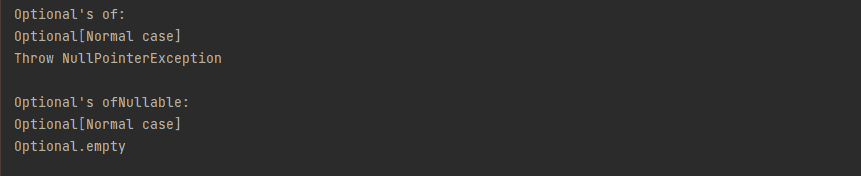
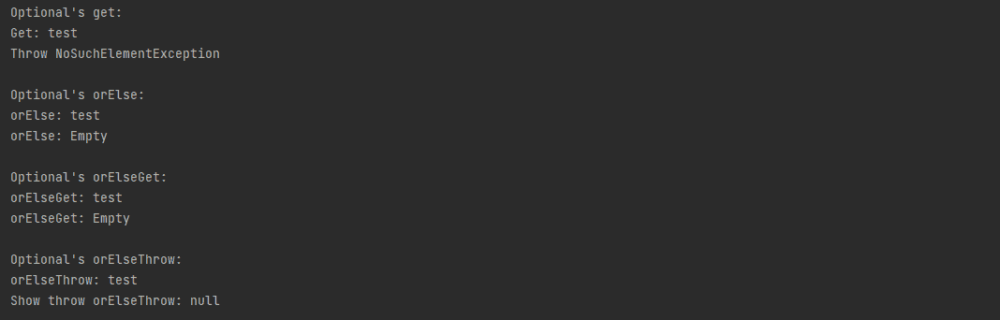

# Java 8: 3 关于可选的你必须知道的事情

> 原文：<https://blog.devgenius.io/java-8-3-things-you-must-know-about-optional-a96485c0d2be?source=collection_archive---------8----------------------->

## **软件工程之旅**

## 软件工程师更好地理解 Java 中的可选性


来自 unsplash.com[的](https://unsplash.com/)[阿克塞尔·鲁芬尼](https://unsplash.com/@4xel)的照片

# 概观

在这篇文章中，我将介绍 Java 中的可选。通过使用 Optional，您总是可以为您的方法返回一个结果，这也有助于我们避免在 Java 应用程序中经常遇到的 NullPointerException。

# #1 可选创作

像 Java 中的许多其他对象一样，要使用 Optional 我们需要创建它的实例。为了创建可选的实例，我们有两种方法。如下例所示:

```
import java.util.Optional;

public class Creation {

    /**
     * Example using Optional's of
     */
    private static void optionalOf() {
        System.out.println("Optional's of:");
        String s1 = "Normal case";
        String s2 = null;

        System.out.println(Optional.of(s1));

        try {
            System.out.println(Optional.of(s2));
        } catch (NullPointerException ex) {
            System.out.println("Throw NullPointerException");
        }

    }

    /**
     * Example using Optional's ofNullable
     */
    private static void optionalOfNullable() {
        System.out.println("Optional's ofNullable:");
        String s1 = "Normal case";
        String s2 = null;
        System.out.println(Optional.ofNullable(s1));
        System.out.println(Optional.ofNullable(s2));

    }

    public static void main(String[] args) {
        optionalOf();
        System.out.println();
        optionalOfNullable();
    }
}
```

下面是上面代码的结果:



在为 optional 创建实例时，of 和 ofNullable 之间的区别在于，第一个会在值为 Null 的情况下给出一个 NullPointerException，第二个会给出一个空的 optional。因此，它取决于你想得到的值，你可以决定你想用哪种方式。

# #2 可选值返回

通过使用 Optional，我们有 4 种方法从 Optional 中获取返回值。每种方式都会给出相应的数据选项。让我们深入下面的例子来弄清楚它。

```
import java.util.NoSuchElementException;
import java.util.Optional;

public class ValueGetBack {
    /**
     * Example using Optional's get
     */
    private static void optionalGet() {
        System.out.println("Optional's get:");
        Optional<String> op1 = Optional.ofNullable("test");
        Optional<String> op2 = Optional.ofNullable(null);

        System.out.println("Get: " + op1.get());
        try {
            op2.get();
        } catch (NoSuchElementException ex) {
            System.out.println("Throw NoSuchElementException");
        }

    }

    /**
     * Example using Optional's orElse
     */
    private static void optionalOrElse() {
        System.out.println("Optional's orElse:");
        Optional<String> op1 = Optional.ofNullable("test");
        Optional<String> op2 = Optional.ofNullable(null);
        System.out.println("orElse: " + op1.orElse("Empty"));
        System.out.println("orElse: " + op2.orElse("Empty"));
    }

    /**
     * Example using Optional's orElseGet
     */
    private static void optionalOrElseGet() {
        System.out.println("Optional's orElseGet:");
        String empty = "Empty";
        Optional<String> op1 = Optional.ofNullable("test");
        Optional<String> op2 = Optional.ofNullable(null);
        System.out.println("orElseGet: " + op1.orElseGet(empty::toString));
        System.out.println("orElseGet: " + op2.orElseGet(empty::toString));
    }

    /**
     * Example using Optional's orElseThrow
     */
    private static void optionalOrElseThrow() {
        Throwable emptyThrow = new Throwable("Empty data");
        System.out.println("Optional's orElseThrow:");
        Optional<String> op1 = Optional.ofNullable("test");
        Optional<String> op2 = Optional.ofNullable(null);
        try {
            System.out.println("orElseThrow: " + op1.orElseThrow(emptyThrow::getCause));
            System.out.println("orElseThrow: " + op2.orElseThrow(emptyThrow::getCause));

        } catch (Throwable e) {
            System.out.println("Show throw orElseThrow: " + e.getMessage());
        }

    }

    public static void main(String[] args) {
        optionalGet();
        System.out.println();
        optionalOrElse();
        System.out.println();
        optionalOrElseGet();
        System.out.println();
        optionalOrElseThrow();
    }
}
```

下面是上面代码的结果:



以下是使用上述可选功能的一些详细说明:

- get:如果这个可选中存在一个值，则返回该值，否则抛出 NoSuchElementException。

- orElse:如果存在，则返回该值，否则返回另一个。

- orElseGet:如果存在，则返回值，否则调用另一个并返回该调用的结果。

-orelsthrow:返回包含的值(如果存在)，否则抛出一个由提供的供应商创建的异常。

# #3 可选功能

除了创造和价值，可选的还提供了一些额外的功能。现在，让我们通过例子来看看可选作品中的功能。

```
import java.util.Optional;
import java.util.function.Consumer;
import java.util.function.Function;
import java.util.function.Predicate;

public class AdditionalFunctions {
    /**
     * Example using Optional's filter
     */
    private static void optionalFilter() {
        System.out.println("Optional's filter:");
        Predicate<String> filterCondition = str -> "test".equals(str);
        Optional<String> op1 = Optional.ofNullable("test");
        System.out.println("Filter: " + op1.filter(filterCondition).orElse("Optional empty"));
        System.out.println("Filter: " +op1.filter(filterCondition.negate()).orElse("Optional empty"));

    }

    /**
     * Example using Optional's flatMap
     */
    private static void optionalFlatMap() {
        System.out.println("Optional's flatMap:");
        Function<String, Optional<Integer>> optionalLength = x -> Optional.ofNullable(x.length());
        Optional<String> op1 = Optional.ofNullable("test");
        System.out.println("Flatmap for string length: " + op1.flatMap(optionalLength).get());
    }

    /**
     * Example using Optional's ifPresent
     */
    private static void optionalIfPresent() {
        System.out.println("Optional's ifPresent:");
        Consumer<String> printConsumer =  System.out::println;
        Optional<String> op1 = Optional.ofNullable("test");
        Optional<String> op2 = Optional.ofNullable(null);
        op1.ifPresent(printConsumer);
        op2.ifPresent(printConsumer);
    }

    /**
     * Example using Optional's isPresent
     */
    private static void optionalIsPresent() {
        System.out.println("Optional's isPresent:");
        Optional<String> op1 = Optional.ofNullable("test");
        Optional<String> op2 = Optional.ofNullable(null);
        if (op1.isPresent()) {
            System.out.println("isPresent:" + op1.get());
        }

        if (op2.isPresent()) {
            System.out.println("isPresent:" + op2.get());
        }

    }

    /**
     * Example using Optional's map
     */
    private static void optionalMap() {
        System.out.println("Optional's map:");
        Function<String, Integer> toInteger = x -> Integer.valueOf(x);
        Optional<String> op1 = Optional.ofNullable("55");
        System.out.println("It's an integer value: " + (1 + op1.map(toInteger).get()));
    }

    public static void main(String[] args) {
        optionalFilter();
        System.out.println();
        optionalFlatMap();
        System.out.println();
        optionalIfPresent();
        System.out.println();
        optionalIsPresent();
        System.out.println();
        optionalMap();
    }
}
```

下面是上面代码的结果:


同样，下面是对上述功能的详细描述:

- filter:如果存在一个值，并且该值与给定的谓词匹配，则返回一个描述该值的可选值，否则返回一个空可选值。

- flatMap:如果存在一个值，则将提供的可选映射函数应用于该值，返回结果，否则返回一个空的可选值。

- ifPresent:如果值存在，则使用该值调用指定的使用者，否则不执行任何操作。

- isPresent:如果存在值，则返回 true，否则返回 false。

- map:如果存在一个值，则对其应用提供的映射函数，如果结果为非空，则返回一个描述结果的可选值。

# 摘要

为了在你的代码中频繁地应用可选，你需要很好的了解它。通过这篇文章，我认为你已经对可选的有了更好的了解，并且可以很容易地把它应用到你的代码中。希望这些内容对你有所帮助，让你更好地掌握 java 技能。谢谢大家！

*如果你喜欢这个故事，你也会喜欢:*

*   [*Java 18: 4 特性你必须知道*](/java-18-top-4-features-you-must-know-1f36ee23e2ab)
*   [*你必须知道的 Java 11: 8 特性*](https://medium.com/@techisbeautiful/new-features-you-must-know-in-java-11-and-examples-3fda2ad26def)
*   [*你必须知道的 Java 8 : 7 特性*](/java-8-seven-features-you-must-know-and-examples-1c3964ae7fe8)

*喜欢这篇文章？给我拿个*[*Ko-fi*](https://ko-fi.com/techisbeautiful)*。*

*爱我的文字？加入我的* [*邮箱列表*](https://medium.com/subscribe/@techisbeautiful) *。*

*爱读书？加入* [*中等*](https://medium.com/@techisbeautiful/membership) *(如果你用这个链接，也是支持我的，因为我有来自中等的小提成)。*