# Java 8 面试问答-1

> 原文：<https://blog.devgenius.io/java-8-interview-questions-and-answers-1-19ad105123f7?source=collection_archive---------0----------------------->

# 嘿读者，

如果您正在准备 Java 面试，那么这篇文章会非常有用。因为，在 Java 版本不断升级之后，面试问题也越来越多。在这里，我列出了 Java 8 上最有用、最常被问到的面试问题。

# 文章内容包括以下主题的面试问题及示例:

1.  λ表达式
2.  方法参考
3.  功能接口

# λ表达式

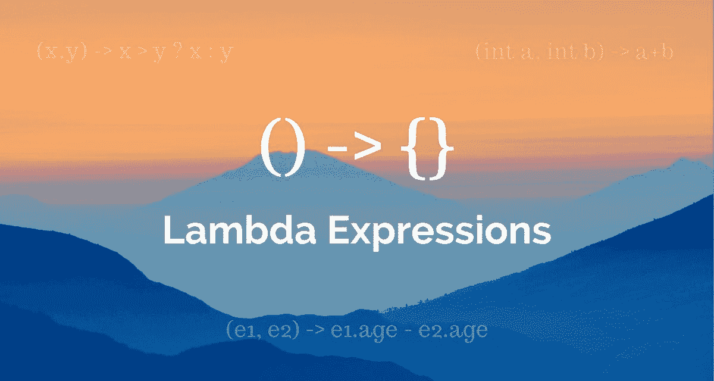

**1。什么是 lambda 表达式？**

Lambda 表达式是行为类似于常规方法的代码段。它们被设计成接受一组参数作为输入，并返回一个值作为输出。与方法不同，lambda 表达式不强制要求特定的名称。

**2。为什么我们需要 lambda 表达式？**

*   Lambda 可以在不实例化类的情况下创建
*   Lambda 可以被视为一个对象
*   它支持函数式编程并减少编码行数

**Lambda 表达式语法:**

**(参数列表)->{正文}**

Java lambda 表达式由三部分组成。

**参数列表:**可以为空，也可以不为空。

**箭头标记:**用于连接参数列表和表达式体。

**Body:** 包含 lambda 表达式的表达式和语句。

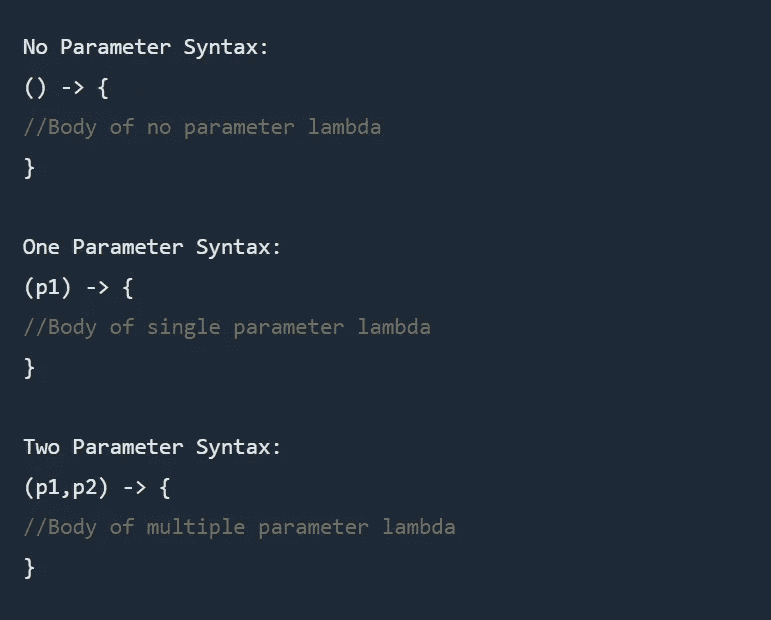

**3。lambda 表达式和函数接口是如何关联的？**

函数接口是 java 的一个接口，带有一个抽象方法。除了通过声明和实例化一个类来创建一个接口实例之外，还可以用 lambda 表达式来创建函数接口的实例。

**4。lambda 表达式在执行时会创建一个对象吗？**

*   不，只创建一个实例，它为所有不获取值的表达式创建单例。
*   每次求值时，不需要分配新的对象。
*   由不同 lambda 表达式创建的对象不一定属于同一个类。
*   通过评估创建的每个对象不必属于同一类。
*   如果现有实例已经存在，则没有必要创建先前的 lambda 评估。

# 方法引用

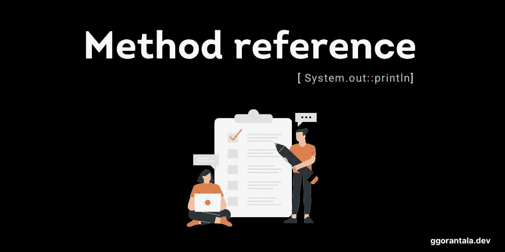

**1。什么是方法引用？**

方法引用是 lambda 表达式的一种特殊类型。它们用于通过引用现有方法来创建简单的 lambda 表达式。

**2。方法引用的类型有哪些？**

有 4 种方法参考。

*   静态方法引用
*   特定对象的实例方法。
*   特定类型的任意对象的实例方法
*   构造器

**静态方法的引用:**

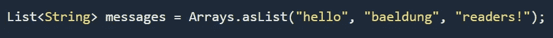

或者，我们可以使用方法引用来简单地引用大写静态方法:

对特定对象的实例方法的引用

为了演示这种类型的方法引用，让我们考虑两个类:

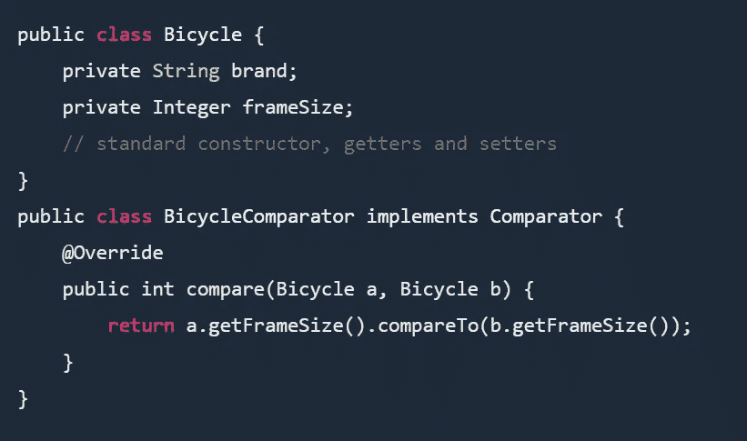

并且，让我们创建一个 BicycleComparator 对象来比较自行车的车架尺寸:

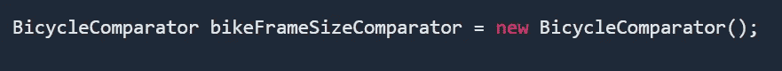

我们可以使用 lambda 表达式按车架大小对自行车进行排序，但是我们需要指定两辆自行车进行比较:

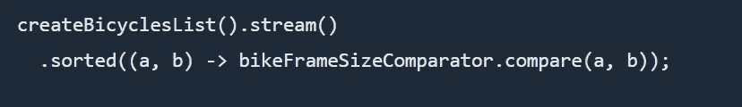

相反，我们可以使用方法引用让编译器为我们处理参数传递:

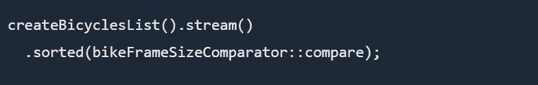

方法引用更加清晰，可读性更好，因为代码清楚地表明了我们的意图。

**引用特定类型的任意对象的实例方法**

这种类型的方法引用类似于前面的示例，但是不需要创建自定义对象来执行比较。让我们创建一个要排序的整数列表:

List numbers = Arrays.asList(5，3，50，24，40，2，9，18)；

如果我们使用经典的 lambda 表达式，两个参数都需要显式传递，而使用方法引用要简单得多:

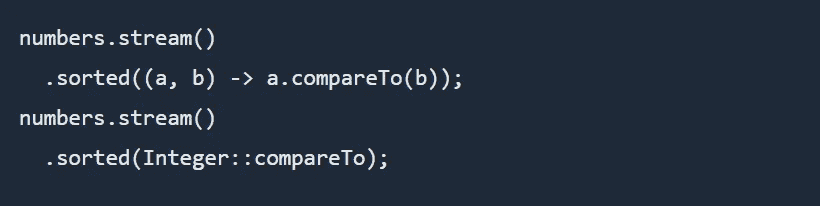

尽管它仍然是一行程序，但是方法参考更容易阅读和理解。

**引用一个构造函数**

我们可以像在第一个例子中引用静态方法一样引用构造函数。唯一的区别是我们将使用新的关键字。

让我们用不同品牌的字符串列表创建一个自行车数组:

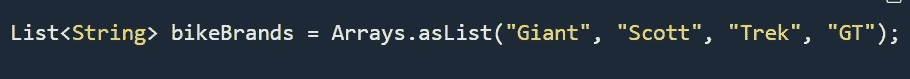

首先，我们将向自行车类添加一个新的构造函数:

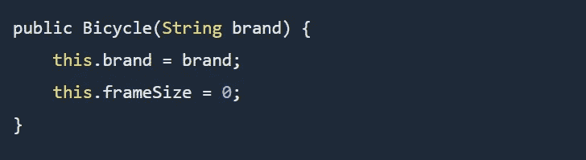

接下来，我们将从方法引用中使用新的构造函数，并从原始字符串列表中创建一个自行车数组:

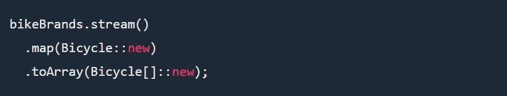

注意我们是如何使用方法引用来调用 Bicycle 和 Array 构造函数的，这使得我们的代码看起来更加简洁明了。

# 功能接口

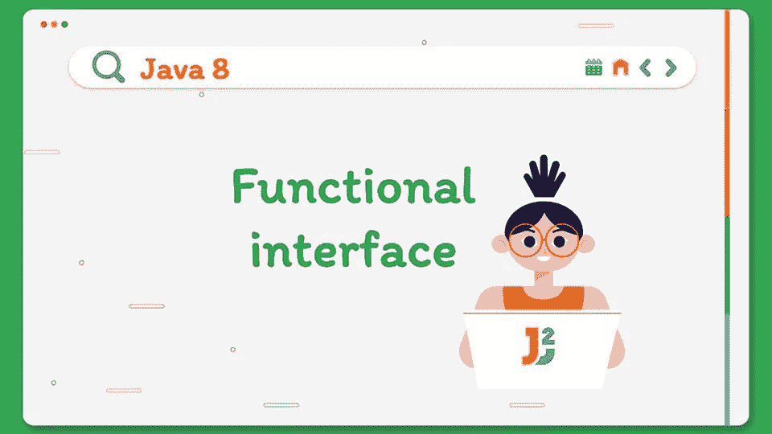

**1。什么是功能界面？**

只包含一个抽象方法的接口称为函数接口。它可以有任意数量的默认和静态方法。它还可以声明对象类的方法。它可以有任意数量的默认和静态方法。它还可以声明对象类的方法。

函数接口也称为单一抽象方法接口(SAM 接口)。只有当一个函数接口没有任何抽象方法时，它才能扩展另一个接口。

**2。Java 8 之前已有的功能接口有哪些？**

1.  可追捕的
2.  动作监听器
3.  可比较的

**3。命名并解释 Java 8 预定义的函数接口？**

有 4 个主要的功能接口，可用于不同的场景。

**1。消费者:**它表示接受单个参数并且不返回结果的操作

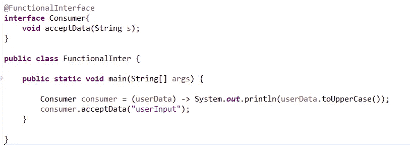

**a. BiConsumer:** 表示接受两个输入参数，不返回结果的操作。它是消费者的一个子类。

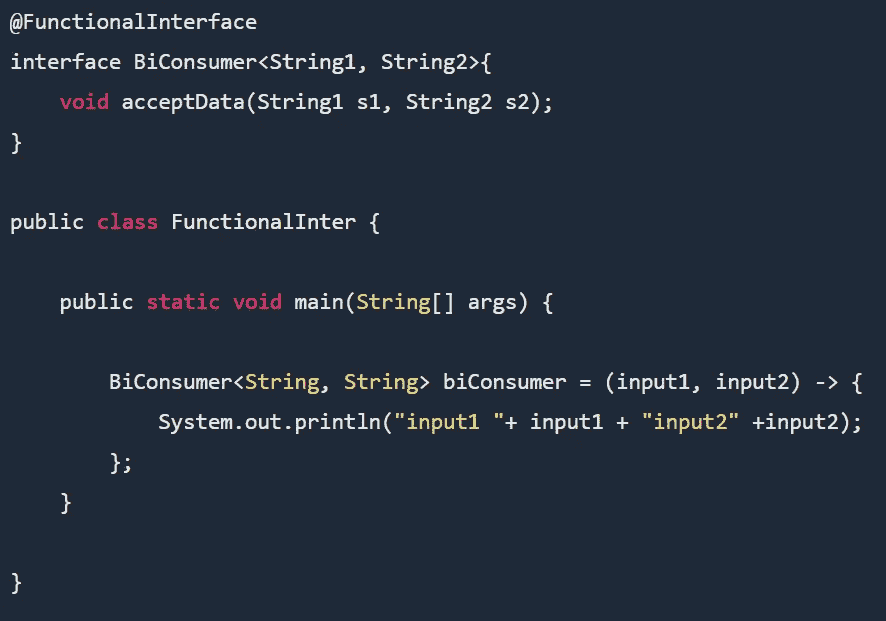

**2。谓词**

谓词将接受一个参数，进行一些处理，然后返回布尔值

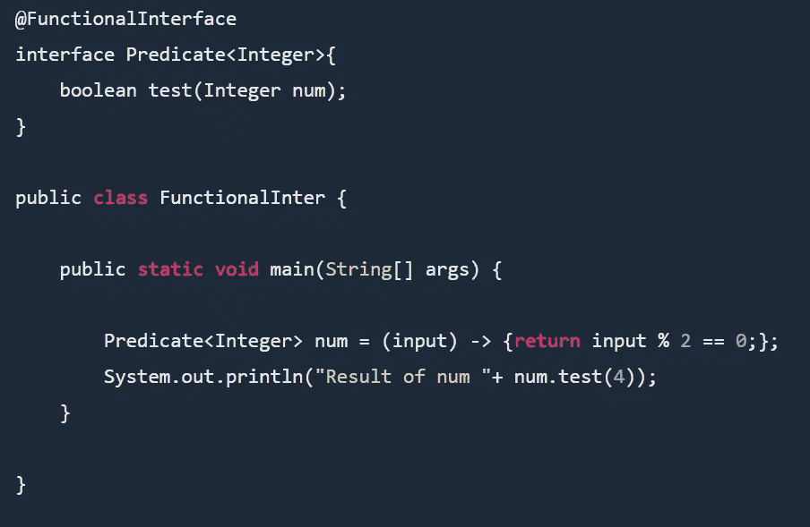

**a . BiPredicate**BiPredicate 将接受两个参数并返回布尔值，而不是一个参数。双谓词是谓词的一个亚型。

**3。功能**

该接口接受一个参数，并在所需的处理后返回值。其定义如下。所需的处理逻辑将在调用 apply 方法时执行。

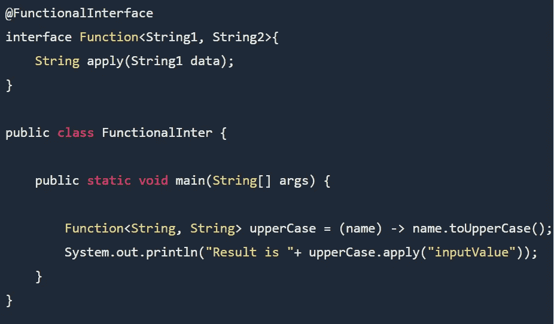

**a . bi Function:**bi Function 类似于 Function，只是它接受两个输入，而 Function 接受一个参数。

**b .一元运算符和二元运算符**

一元运算符和二元运算符，分别扩展了 Function 和 BiFunction。

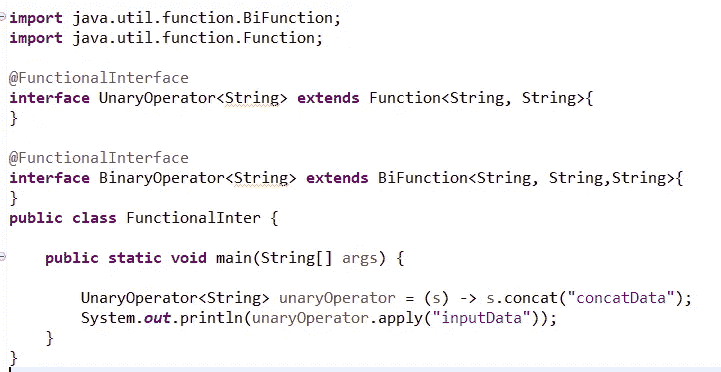

从上面的接口很容易理解，一元运算符接受单个参数并返回单个参数，但输入和输出参数应该是相同或相似的类型。

另一方面，BinaryOperator 接受两个参数并返回一个类似于 BiFunction 的参数，但所有输入和输出参数的类型都应该是类似的类型。

**4。供应商:**供应商功能界面不接受任何输入；而是返回一个输出。为了便于理解，给出以下接口代码。

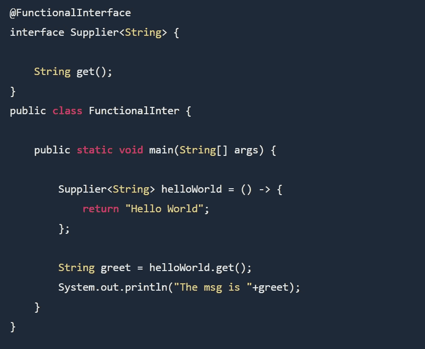

*感谢您的阅读和在此度过的时光。如果你喜欢这篇文章，请鼓掌，它会鼓励我写更多这样的文章。请分享您的宝贵建议，感谢您的真诚反馈！！*