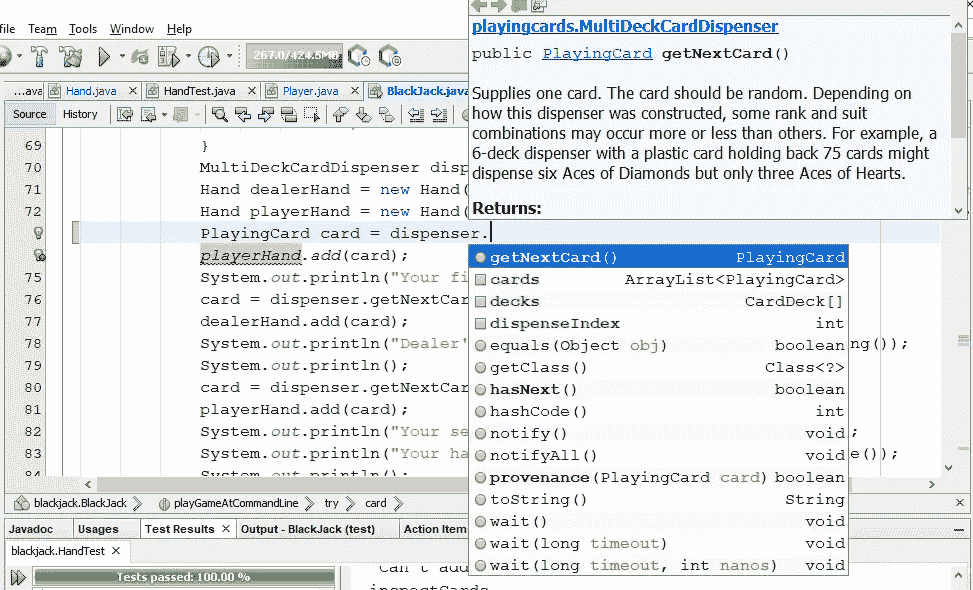
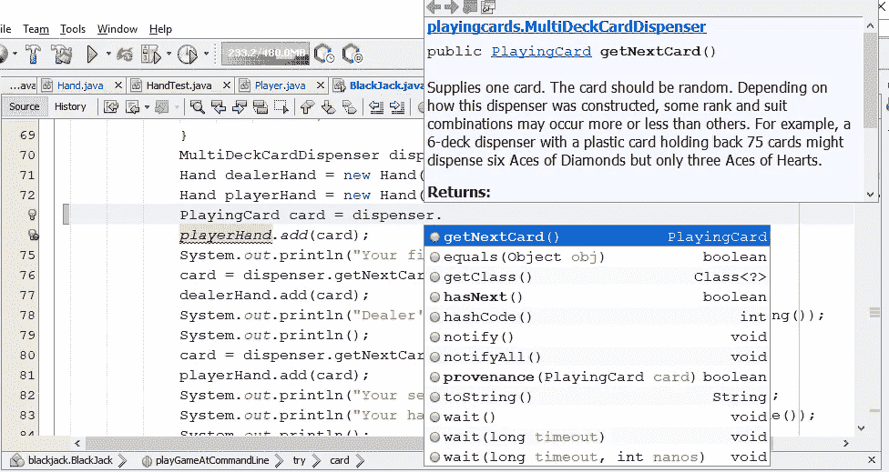
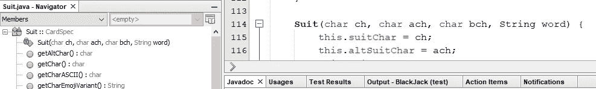
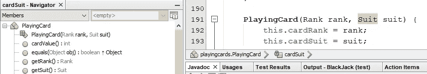

# Java 访问修饰词:一个游戏的例子

> 原文：<https://blog.devgenius.io/java-access-modifiers-examples-from-a-game-f31f97c50b06?source=collection_archive---------6----------------------->


[Markus Spiske](https://unsplash.com/@markusspiske?utm_source=medium&utm_medium=referral) 在 [Unsplash](https://unsplash.com?utm_source=medium&utm_medium=referral) 上拍摄

使用不同的访问修饰符组合，Java 程序员可以在他们的 Java 项目中创建一个非常细粒度的访问控制系统。这是一件好事，它简化了编程。

访问修饰符使程序员能够声明他们关于封装的意图，然后将这些意图的强制执行卸载给计算机，这在跟踪这些事情方面几乎总是比人类的思维更好。

如果你在 Hello World 之外稍微学习了一点 Java，你可能已经记住了访问修饰词以及它们之间的区别。我们不妨简单回顾一下:

*   Public ( `public`)是指可以从任何地方访问，但模块需要注意(Java 9 和更高版本)。
*   Protected ( `protected`)是指可从任何子类以及同一包中的类和接口访问。
*   Package private(类中的默认访问修饰词)意味着只能从同一个包中的类和接口访问。
*   类 private ( `private`)意味着只能在定义类中访问(从 Java 9 开始，还有一个接口 private，具有与类 private 相同的访问修饰符)。

列举型别本质上是具有特殊语法的特殊类别。跟普通阶层没什么不同。

我写了一篇文章详细探讨了这些问题，但只使用了一些对实际程序没有明显适用性的玩具示例。

通过玩具示例，作者可以将分散注意力的无关细节拒之门外。但玩具的例子也可以给人的印象，一个特定的概念没有任何实际用途。

因此，我认为我应该用一些严重和众所周知的例子，如支票和储蓄账户。话说回来，任何一个例子都有可能让人觉得不切实际。

而来自看似不那么严重的东西(比如游戏)的示例，可以避免玩具示例的陷阱，方法是实际实现一个相当知名的东西，这让读者更容易看到所说明的概念对他们自己的实际项目的适用性。

比如 21 点。即使你不知道如何玩 21 点，你可能知道，它涉及到一些牌面朝上和一些牌面朝下。所以不用我来解释。

我一直致力于用 Java 实现 21 点(源代码和测试[在 GitHub](https://github.com/Alonso-del-Arte/blackjack) 上)。它最终会有一个图形用户界面，但现在你可以在命令行上玩。

它缺少分牌和双倍下注的能力，主类需要大量的重构，但我认为我已经很好地完成了基本的游戏。

关于访问修饰符，初学 Java 的学生通常认为修饰符与信息安全有关；他们没有。

如果你有一个程序的源代码，比如我的 21 点程序的最新提交，你可以修改任何你想要的访问修饰符。当然，这不会改变我的存储库和我的本地文件。

这个程序可能仍然可以编译和运行，但是这样的改变不会帮助你在游戏中作弊。访问修饰符与您能否看到庄家的牌面朝下的牌是什么以及下一张牌是什么没有任何关系。

下面是我的 21 点程序的实际游戏示例:

> 扑克牌的二十一点
> 
> 输入整美元的赌注:$100
> 
> 你的第一张牌是黑桃六
> 庄家的平手牌是黑桃皇后
> 
> 你的第二张牌是方块 8
> 你手牌的价值是 14
> 
> 庄家面朝下的牌是？？？？？
> 
> 打还是站？击中
> 你的下一张牌是黑桃王
> 你这手牌的价值是 24
> 
> 庄家面朝下的牌是方块 10
> 庄家的手牌值是 20
> 庄家收你 100 美元
> 祝你下次好运…

请注意，本文中提到的所有金额都是游戏币。如果你赌的真钱超过了你的承受能力，联系适当的公共健康组织。

我想知道庄家有 10 对我没有任何帮助。我不能拆分 6♠和 8，因为我还没有实现拆分，而且即使我实现了，程序也不应该允许这样的拆分。

我本来可以站在 14，但如果庄家的牌面朝下的牌很低(例如，2)，他们有义务听牌达到或超过 16，冒着破产的风险。我当时赢的唯一方法就是拿到一张 7。

事实上，当我在自行车网站上重读规则[时，我想我可能在执行中犯了一个错误:如果我站在 14，但经销商超过了 21，我就会赢得我的赌注，因为我现在理解了规则。](https://bicyclecards.com/how-to-play/blackjack/)

但在这种特殊情况下，即使知道庄家的牌面朝下，我可能还是会要求另一张牌，因为如果我拿到 6，我仍然有机会离开，如果我拿到 7，我也有机会赢，而不是我的 14 一定会输给庄家的 20。

这是另一轮:

> 扑克牌的二十一点
> 
> 输入整美元的赌注:$100
> 
> 你的第一张牌是红心五
> 庄家的面朝上的牌是梅花王
> 
> 你的第二张牌是方块 9
> 你手牌的价值是 14
> 
> 庄家面朝下的牌是？？？？？
> 
> 打还是站？站立
> 
> 庄家面朝下的牌是方块 7
> 庄家的手牌值是 17
> 庄家收你 100 美元
> 祝你下次好运…

知道这张牌正面朝下会更有帮助。庄家必须站在 17，通过得到 4、5、6 或 7，给我更多赢的可能性。

下面是程序如何“编辑”庄家面朝下的牌:

```
 PlayingCard faceDownCard = dispenser.getNextCard();
            dealerHand.add(faceDownCard);
            System.out.println(**"Dealer's face-down card is ?????"**);
            System.out.println();
```

缩进级别表明我需要重构来降低圈复杂度。这是玩具示例中不会出现的令人分心的无关细节之一。

我可以很容易地把它改成

```
 PlayingCard faceDownCard = dispenser.getNextCard();
            dealerHand.add(faceDownCard);
            System.out.println(**"Dealer's face-down card is " 
                    + faceDownCard.toASCIIString**);
            System.out.println();
```

这有点像但不太像一种叫做 Zweikartenspiel(字面意思是“两张牌游戏”)的 21 点游戏。这是另一个分散注意力的无关细节。

一个更有用的骗局可能是提前知道鞋子里的下一张牌是什么。这种欺骗很容易实现，不需要在项目的任何地方更改任何访问修饰符。

如果你正在查看我的 GitHub 库，或者如果你把它拉到你的本地机器上并加载到你最喜欢的集成开发环境(IDE)中，你可以看到`dispenser`是来自`playingcards`包的`MultiDeckCardDispenser`的一个实例。

下面的源代码清单省略了所有 Javadoc 注释，没有任何这种省略的迹象。还指出了其他遗漏。

我应该提到这是一个 Java 8 项目。如果你用 Java 9 或更高版本来做这个，这个项目的所有包都放在默认的未命名模块中，我相信你不需要做任何特殊的事情来访问`java.util`包。如果不是这样，请告诉我。

所以你可以从项目的任何包中访问`MultiDeckCardDispenser`，因为它被标记为 public。`CardSupplier`接口也是如此。

主`MultiDeckCardDispenser`构造器取一副或多副牌，分别洗牌，将每张牌放入私有`cards`数组列表，然后洗牌。

要得到一张卡，其他包中的类和接口都是要调用`getNextCard()`的，当然是公有的。

提前知道一张卡对作弊有很大帮助。所以我在`getNextCard()`中插入四行:

```
 @Override
    public PlayingCard getNextCard() {
        if (this.dispenseIndex == this.cards.size()) {
            throw new RanOutOfCardsException("Ran out of cards");
        }
 **      // TODO: Remove this line and next three after demonstration
        System.out.println("CHEAT: Card " 
                + this.cards.get(dispenseIndex + 1).toASCIIString()
                + " is coming up soon...");**
        return this.cards.get(this.dispenseIndex++);
    }
```

如果您没有在 IDE 中打开自动保存，请确保明确地保存它(例如，默认情况下在 IntelliJ 中)。

> 扑克牌的二十一点
> 
> 输入整美元的赌注:$100
> 
> 诈牌:黑桃六快到了…
> 你的第一张牌是黑桃十
> 诈牌:黑桃皇后快到了…
> 庄家面朝上的牌是黑桃六
> 
> 诈牌:方块 a 即将出现…
> 你的第二张牌是黑桃皇后
> 你的牌值是 20
> 
> 诈牌:红桃二快到了……
> 庄家面朝下的牌是？？？？？
> 
> 打还是站？站立
> 
> 庄家面朝下的牌是方块 a
> 庄家的手牌值是 17
> 因为你的分数更高，
> ***你赢得$100 ****

我觉得我的运气变好了。当然，在正常的游戏中，站在 20 点是明智的决定，因为在庄家展示 6♠的情况下，庄家拿到 21 点的可能性要比你拿到 a 作为下一张牌的可能性大得多。

与其作弊，我还不如赌更多的游戏币。

> 扑克牌的二十一点
> 
> 输入整美元的赌注:1000 美元
> 
> 诈牌:红桃 7 即将出现…
> 你的第一张牌是红桃 3
> 诈牌:红桃 3 即将出现…
> 庄家的平手牌是红桃 7
> 
> 诈牌:红心 2 马上就要出了…
> 你的第二张牌是红心 3
> 你这手牌的价值是 6
> 
> 诈牌:梅花二快到了…
> 庄家面朝下的牌是？？？？？

记得庄家洗了多副牌到分发器里，所以我得到两张都是 3♥的牌是完全正常和有效的。

我前阵子解开了代用的 Zweikartenspiel 零钱，但是由于当前的作弊，我知道庄家的面朝下的牌实际上是 2♥.只有 6 点，我站在这一点没有意义，因为庄家在 9 点，必须到 17 点或更高。

> 打还是站？击中
> 作弊:梅花杰克即将到来…
> 你的下一张牌是梅花 2
> 你手牌的价值是 8
> 
> 打还是站？作弊:梅花 4 即将出现…
> 你的下一张牌是梅花 j
> 你的牌值是 18

通常，当你知道庄家有低牌时，站在 18 是合理的。你更有可能破产，而不是活到 19 岁、20 岁或 21 岁。但在这里，我可以肯定地说，如果我拿了正在酝酿中 4♣奖，我会在 22 岁时破产。

我还知道，当庄家拿到 4♣时，他们至少需要再拿一张牌，他们有可能会破产。用 21 点的话来说，庄家有一手“硬牌”

> 打还是站？站立
> 
> 庄家面朝下的牌是红桃二
> 庄家的手牌值是 9
> 诈牌:红桃十即将出现……
> 庄家拿梅花四
> 庄家的手牌值是 13
> 
> 诈牌:梅花 5 快到了…
> 庄家拿红心 10
> 庄家手牌值 23
> 
> 因为你站了起来，庄家破产了，
> ***你赢了$1，000 ****

再说一遍，这是游戏币，不是真钱。

我发现所有这些关于即将到来的卡的提示都很分散注意力，我的游戏速度也慢了很多。

如果我试图在一个真实的赌场里算牌，我怀疑没有人会注意到(因为即使我赢了，我也不会赢得比平常多)。因此，我正在恢复作弊，如 TODO 注释所示。

太多的自动完成建议也会让人分心。例如，假设`MultiDeckCardDispenser`的字段都是公共的。然后，在使用 NetBeans 处理另一个包中的类时，我可能会看到如下内容:



第一个完成“`PlayingCard card = dispenser.`”的选项当然是“`getNextCard();`”，应该是这样的。但是还有选择“T3”的选项，然后我必须选择“T4”。

但是在什么指数上呢？可能是`dispenser.dispenseIndex`。然后调用者将不得不前进`dispenseIndex`或者拥有自己的变量来跟踪下一张卡的索引。

如果只是让其他类直接访问`cards`数组列表，确保`getNextCard()`正常工作将是浪费我的时间。所以最好保密。

然后，当处理导入`MultiDeckCardDispenser`的类时，当类型为`PlayingCard`时，`getNextCard()`函数仍将位于自动完成的建议的顶部，但是建议列表现在将限于由`CardSupplier`授权的三个函数以及从`Object`继承的函数和过程。



对于调用者来说，`MultiDeckCardDispenser`如何管理它的`PlayingCard`实例并不重要。由于对调用者隐藏了`cards`数组列表、`decks`数组和交易索引，所以调用者并不在乎。

明明`PlayingCard`也是公共类。但是它的构造函数是包私有的，所以它只能被`playingcards`包中的类和接口调用。

请记住，在不是枚举类型的类的上下文中，没有构造函数的访问修饰符意味着包是私有的。字段`cardRank`和`cardSuit`当然是私有的和最终的。

这意味着新的`PlayingCard`实例只能在`playingcards`包中创建。

我不指望这能让玩家放心，这是一个诚实的游戏，程序不能在关键时刻给玩家制造一张坏卡。事实上，我们可以重写程序来做类似的事情，而不需要修改任何访问修饰符。

在`playingcards`包中，但是归档在测试包下，我写了`CardServer`类，它实现了`CardSupplier`接口。除了`getNextCard()`，`CardServer`还提供了一个给特定等级卡片的功能，以及一个给特定花色卡片的功能。

更容易的是，我可以写

```
 public PlayingCard giveCard(Rank rank, Suit suit) {
        return new PlayingCard(rank, suit);
    }
```

对于 21 点来说，只有参数`Rank`的先前的`giveCard()`就足够了，当庄家可能破产时，给他们一张漂亮的低牌，给玩家一张不好的高牌，以确保玩家确实破产。

在`CardServer` Javadoc 中，我写道“这个类应该只能被测试类访问，以方便手工评分的测试。”对于源代码包中的`blackjack.Dealer`，唯一可用的`CardSupplier`实现应该是不允许提前查看的实现。

正如我前面提到的，我不指望这能让最终用户放心，但我希望它能让其他程序员放心，独立的关注点已经被正确地分离和封装了。

类型`Rank`和`Suit`都是实现`CardSpec`接口的枚举类型。在源代码中，它们似乎有包私有构造函数。但是编译器会为它们编写类私有构造函数，NetBeans 也会这样识别它们。

以下截图显示:



真正的包私有构造函数在 NetBeans Navigator 中会显示一个略有不同但明显不同的图标:



嗯…我也许可以使用`CardSpec`来消除`CardServer`中`Rank`和`Suit`的独立`giveCard()`功能的冗余…

这让我质疑为什么`CardSpec`接口是公共的。不需要公开。所以我改成了包私。

NetBeans 扫描了项目，并通知我在`playingcards.matchers`子包(就 Java 运行时而言，它是一个单独的包)中有编译错误。

这再一次证明，在记录这些细节方面，计算机比人脑更好。在这种情况下，我实际上已经忘记了我最初编写`CardSpec`界面的动机是什么。

但是由于它是在测试包中而不是在源码包中(可以认为是“生产包”)，所以它对我来说不是一个大的优先事项。

我在这个项目中没有任何受保护的访问。在我最早的 Java 项目中，我确实使用了受保护的访问，你仍然可以在我的 GitHub 存储库中找到它(尽管在几乎所有的情况下，我最终都会抽出时间来重构它)。

这并不是因为我对此过于武断，我承认受保护的访问是有时间和地点的。只是 public、package private 和 class private 对于大多数项目来说已经足够了。