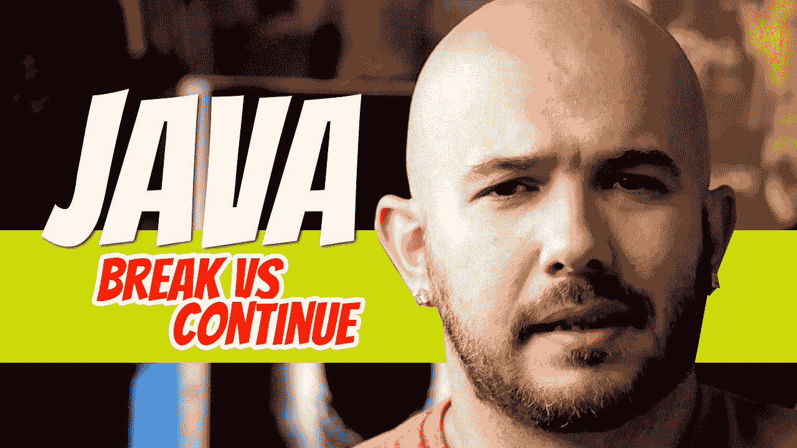

# Java:中断还是继续

> 原文：<https://blog.devgenius.io/java-break-vs-continue-b9f87f9ea2f3?source=collection_archive---------11----------------------->

有几种方法可以中断循环:我们将探索*中断*和*继续*。

## 破裂

在下面的例子中，设置了一个*循环继续条件*来测试数字是否小于 20。如果为真，变量 number 将递增 1，变量 number 的当前值将添加到变量 *sum* 定义的总数中。

因此，如果我们让下面的循环没有任何中断地继续，则数字将是 **20** 并且*和*将是 **210** 。

但是，如果*和*等于或大于 100，在 while 循环中执行测试后添加关键字 *break* 将导致循环停止。

数字*变量*的输出将是 **14** 和*和*变量 **105** 。

1.  整数变量初始化为 0: *总和*和*数*。
2.  *而*循环从第 12 行开始。它检查*数字*变量内的值是否小于 20。如果是，则进入循环体。
3.  *数字*变量递增并加到*总和*变量上。
4.  检查*和*变量内的当前值是否大于或等于 100。
5.  当*数字*变量小于 13 时，*总和*变量内的值将小于 100。当*数= 14* 时，*和*变量将为 105。一旦发生这种情况，条件评估为真，调用*中断*命令，终止*同时*循环。
6.  第 20 和 21 行显示了*数字*和*总和*变量中的值。

## 继续

下一个例子处理关键字*继续*。

我们通过测试数字是否小于 20 来开始循环。如果是，则*号*变量增加 1。它检查的下一个条件是*号*变量是否设置为 10 或 11。如果是，则 *continue* 关键字会导致循环跳过该条件之后的任何代码，并从循环的开始处重新开始，测试变量编号是否小于 20。在这种情况下，10 和 11 都不会添加到总和中。

如果在没有 *continue* 关键字的情况下执行代码， *sum* 将等于 210。

但是，由于测试和*继续*关键字在*和*之前被执行，输出将是 189。

1 + 2 + 3 + 4 + 5 + 6 + 7 + 8 + 9 + 12 + 13 + 14 + 15 + 16 + 17 + 18 + 19 + 20 = 189

迪诺·卡伊奇目前是 [LSBio(生命周期生物科学公司)](https://www.lsbio.com/)、[绝对抗体](https://absoluteantibody.com/)、 [Kerafast](https://www.kerafast.com/) 、[珠穆朗玛生物](https://everestbiotech.com/)、[北欧 MUbio](https://www.nordicmubio.com/) 和 [Exalpha](https://www.exalpha.com/) 的 IT 主管。他还担任我的自动系统的首席执行官。他有十多年的软件工程经验。他拥有计算机科学学士学位，辅修生物学。他的背景包括创建企业级电子商务应用程序、执行基于研究的软件开发，以及通过写作促进知识的传播。

你可以在 [LinkedIn](https://www.linkedin.com/in/dinocajic/) 上联系他，在 [Instagram](https://instagram.com/think.dino) 上关注他，或者[订阅他的媒体出版物](https://dinocajic.medium.com/subscribe)。

[*阅读迪诺·卡吉克(以及媒体上成千上万其他作家)的每一个故事。你的会员费直接支持迪诺·卡吉克和你阅读的其他作家。你也可以在媒体上看到所有的故事。*](https://dinocajic.medium.com/membership)