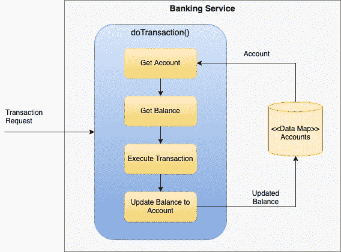
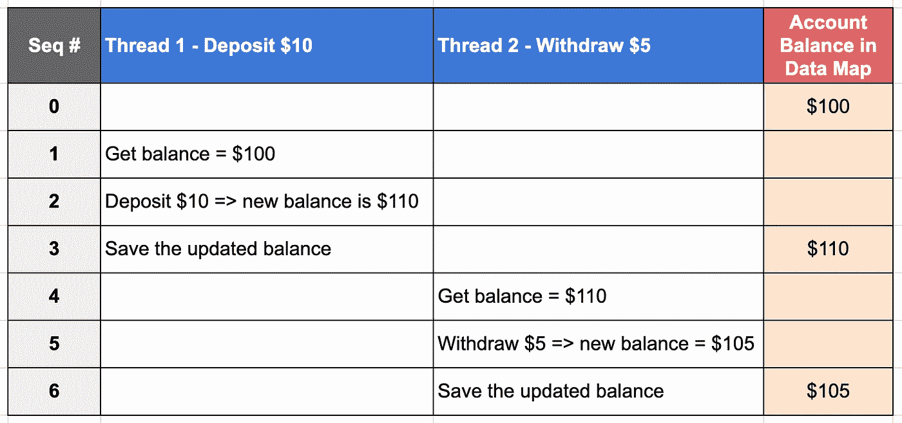
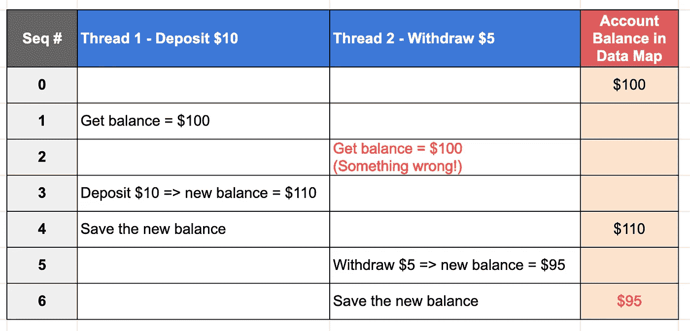
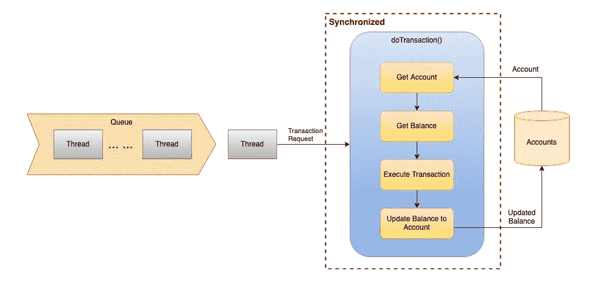
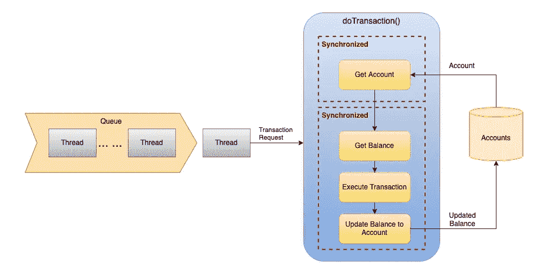
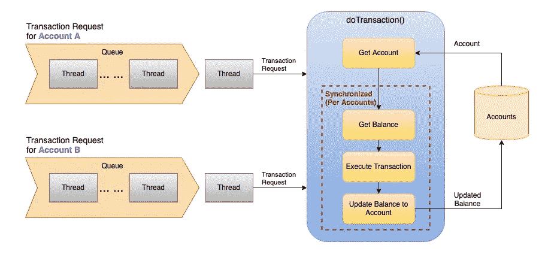
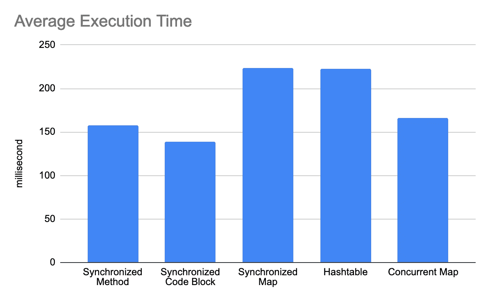

# Java 并发——如何构建线程安全的系统

> 原文：<https://blog.devgenius.io/java-concurrency-how-to-build-thread-safe-systems-487ec1715e9e?source=collection_archive---------1----------------------->

## 展示如何使用 synchronized、synchronized map、Hashtable、ConcurrentMap 来确保线程安全的数据处理

瑞安·斯通在 [Unsplash](https://unsplash.com?utm_source=medium&utm_medium=referral) 拍摄的照片

多线程系统的发明极大地提高了系统性能，因为系统创建线程来同时处理多个请求，而不是逐个处理它们。但是，如果对共享数据存储的访问没有适当的控制，多线程的处理可能会使数据处于不一致的状态。这可能会给金融系统等应用带来灾难性的后果。

下面让我们看一个简单的银行服务的例子，当服务收到交易请求时，它触发`*doTransaction()*`方法调用。它首先从数据映射中获取目标帐户记录和最新余额，然后执行交易(如存款/取款)。然后，更新后的余额被保存到帐户记录中。

银行服务

下面的示例代码是银行服务的一个示例实现

比方说，10 美元的存款和 5 美元的取款分别由两个独立的线程执行。初始账户余额为 100 美元，在完成两笔交易后，最终账户余额应为 105 美元。

如果您在单元测试中一个接一个地运行事务，一切都会好的。下表显示了连续的事务执行。

顺序事务执行

然而，在现实生活环境中，线程以交错的方式运行，这意味着可能会发生争用情况，并且多个线程会同时尝试更新帐户余额。

下面的执行序列显示线程 2 获得了帐户余额$100，但是帐户余额后来被线程 1 更新为存款交易。结果，由于线程 2 基于过时的余额执行事务，所以帐户记录中保存了错误的帐户余额$95。

线程以交错的方式运行

上面的例子表明，由于并发问题导致的系统缺陷可能会导致严重的后果。在开发 web 应用程序和后端服务时，并发编程是一项基本技能。与桌面或移动设备上的应用程序不同，在线系统通过访问共享数据存储的多个线程同时处理大量传入请求。

基于银行服务的示例，我将向您展示以下技术，说明如何通过控制对共享数据的访问来处理多线程环境中的竞争情况:

*   对方法调用应用同步
*   同步地图包装
*   散列表
*   并发地图
*   对代码块应用同步

对于上面列出的技术，我还将向您展示负载测试结果，并展示性能比较。

# 选项 1 —同步方法调用

Java 编程语言在方法签名上提供了一个关键字`***synchronized***`。这是一个强大的特性，它一次强制一个线程执行一个方法调用。其他线程在等待方法调用执行时被挂起。

线程一个接一个地执行`*doTransaction()*`，它通过消除基于过期余额的事务执行的可能性来解决这个问题。

整个方法调用的同步

# 选项 2 —同步数据映射包装器

**HashMap** 是数据映射的默认实现。它不是线程安全的，因为它不强制数据映射上的串行访问。多个线程访问 **HashMap** 可能会导致数据不一致。为了将 **HashMap** 转换成同步数据映射，实用程序类 **Collections** 提供了一个方法调用`*synchronizedMap()*` ，该方法简单地将输入数据映射包装成同步数据映射。

这个示例代码展示了如何使用`*Collections.synchronizedMap()*`将账户数据映射包装成一个同步的数据映射。

应用同步映射包装后，在任何给定时间，只允许一个线程对帐户数据映射执行读或写操作。

对数据映射访问的同步

# 选项 3 —哈希表

这一备选方案与备选方案 2 的想法相同。就是让账户数据映射成为一个**同步的**映射。这个选项不是使用`*Collections.synchronizedMap()*`来创建包装器，而是用**散列表**替换**散列表**。**哈希表**是线程安全的，但不是低效的。您将在后面的部分看到性能的差异。

# 选项 4 —并发地图

虽然 **Hashtable** 是自 Java 1.0 以来最早的数据映射实现，但是 **ConcurrentMap** 是在 1.5 中引入的另一个线程安全的数据映射实现。你可以把它看作是**哈希表**的“改进”版本，因为它更加高效和线程安全。

# 选项 5-同步帐户对象

关键字 ***同步*** 不仅可以应用于方法签名，也可以应用于代码块。下面的示例代码演示了如何使用 synchronized 块进行余额计算。通过帐号从数据映射中提取帐户对象，然后将帐户对象作为输入参数提供给同步块，使得每个帐户对象仅允许一个线程运行代码块。换句话说，同步应用于每个帐户级别。

该选项支持每个帐户的队列，而不是只有一个事务执行队列。因此，不同账户的交易可以并行执行。毫无疑问，这个选项实现了事务执行的高性能。

对每个帐户的代码块进行同步

# 性能比较

哪个选项最有效？让我们看看下面的负载测试结果。负载测试的设计是运行 3 个线程来执行总共 100 万个事务。代码块上的同步选项是最快的，因为它允许在不同帐户上并发执行事务。第二个最好的选择是方法级同步，然后使用**并发映射**。此外，不建议使用**哈希表**，因为它的性能很差。虽然使用`*Collections.synchronizedMap()*`很方便，但是使用这个选项的银行服务是所有选项中最慢的。很可能，包装器的使用引入了开销，因为它在底层数据映射前面添加了一个同步层。

尽管代码块的同步具有最佳效率，但由于实现更复杂，因此存在折衷。为了确保实现正确，需要在对象锁定的设计和测试上付出额外的努力。

负载测试结果

# 最后的想法

应用程序开发中最常见的陷阱之一是处理多线程系统中对共享数据的并发访问。尽管所有单元测试都通过了，但是如果数据访问不是线程安全的，当系统几乎同时接收多个请求时，会遇到意外的系统错误。在 Java 编程语言中，有许多方法可以同步数据访问。实现简单明了，既可以应用 synchronized 关键字，也可以利用现成的数据结构。

## GitHub 知识库

从这个库中获取源代码，你会发现所有选项的实现。如果您想详细了解性能，它为负载测试代码提供了测试数据。

 [## GitHub-gavinklfong/Java-Concurrent-Map-Demo:Java 并发映射演示

### 这个项目提供了一个关于如何在多线程环境中对共享数据应用同步的选项列表…

github.com](https://github.com/gavinklfong/java-concurrent-map-demo)