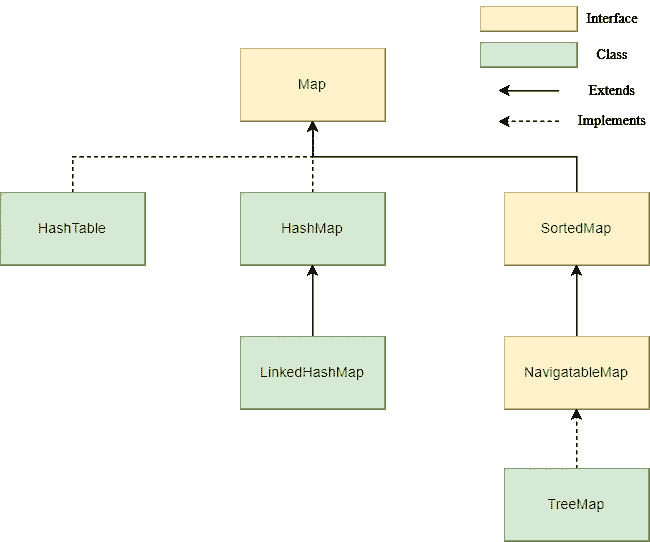
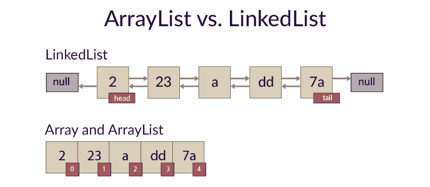
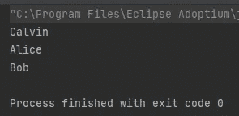

# Java 数据结构一瞥——集合与映射

> 原文：<https://blog.devgenius.io/java-data-structure-collection-map-79f5d5b14dc3?source=collection_archive---------12----------------------->


在本文中，我们将研究常见的 java 数据结构接口和类。我们不会涵盖每个类及其特定的用例。不过，我总结了一些工作经验和想法作为参考，希望能对你适用。

开发人员在日常开发中最常使用的接口主要有 4 种——列表、队列、集合和映射。其中，List、Queue 和 Set 扩展了集合接口，Map 不扩展集合接口。

下面是每个接口及其用例的简要总结。

*   **列表**在处理**订单**时很有用。列表中存储的元素是有序的和可重复的。
*   **队列**可用于 **FIFO** (先进先出)处理。添加的元素总是在队列的末尾。
*   **集合**关注的是元素的**唯一性**，是无序的，不可重复的。
*   **映射**使用**键值对**来存储元素。它类似于数学中的 y=f(x)，其中 x 代表键，y 代表值。键是无序且不可重复的，而值是无序但可重复的。

在下面的图中，你可以从上面的接口中更清楚地了解到常见的 Java 实现类，比如 ArrayList、HashMap 等。


集合框架



地图框架

## 如何选择存储数据的类？

应该根据类别的特征做出决定。例如，如果我们想使用一个键来检索/存储一个元素，我们可以使用 Map 接口下的类。如果我们需要对键值对进行排序，我们可以使用 TreeMap。如果不需要排序，可以用 HashMap。如果想保证线程安全，可以使用 ConcurrentHashMap。或者，在另一种情况下，当我们想要存储唯一的元素时，我们可以只使用 TreeSet 或 HashSet。如果重点是顺序而不是唯一性，我们可以使用 ArrayList 或者 LinkedList，然后再进一步决定。

## 数组列表与链接列表



[https://code gym . cc/quests/lectures/quest syntax . level 08 . lecture 05](https://codegym.cc/quests/lectures/questsyntax.level08.lecture05)

**元素检索**

假设我们想在索引 *i* 处获取一个元素。在 ArrayList 中，通过调用 *get* ()方法并返回该元素，帮助我们直接定位元素，给出 O(1)的时间复杂度。相反，LinkedList 需要从索引 0 遍历到 *i* 并返回元素，平均时间复杂度为 O(n)。

**元素插入/删除**

假设我们想要在长度为 *n* 的列表中的索引 *i* 处插入一个元素。底层数组列表，我们首先将索引 *i* 后的元素向右移动，并将新元素放在 *i* 处。在 LinkedList 中，我们需要将列表遍历到 index *i* 之前的元素，并将节点 *i-1* 中的 **next** 值更改为新节点。此外，新节点中的*上一个/下一个*值以及索引 *i* 处的原始节点中的*上一个*值也被更新，但其余节点保持不变。

对于删除的情况，我们将对 ArrayList 做相反的操作，将 *i* 之后的其余元素都向左移动。在 LinkedList 中，我们仍然从索引 0 开始遍历，删除索引 *i* 处的元素，并更新相邻节点。对于元素插入和删除，由于 LinkedList 影响列表中的一小部分，所以与 ArrayList 相比，它的操作开销更少。

简而言之，如果列表很小，这两个类的性能是相似的。如果列表很大，并且我们知道它是动态的(不断地添加/删除)，LinkedList 可能是更好的选择。相反，如果列表保持相对静态，我们只需要检索值，那么 ArrayList 是更好的方法。

## 哈希表 vs 哈希表

*   空键/值支持:HashMap 可以存储空键和空值。但是 HashMap 最多只能有一个 null 键。HashTable 不允许空键和空值。
*   线程安全:HashMap 是线程不安全的，但是 HashTable 是线程安全的。这是因为 HashTable 中的方法是用 synchronized 关键字修饰的。
*   效率:由于同步的关键字，HashTable 在操作上不如 HashMap 高效。

现在，HashMap 是默认的，也是使用 Map 的首选方式。ConcurrentHashMap 代替 HashTable 提供了更好的同步访问性能。

## 什么是 TreeMap？

与 HashMap 相比，TreeMap 通常较少使用。TreeMap 的主要特性是允许根据键对元素进行排序，这是 HashMap 所没有的。我们可以定义在构建树形图的过程中如何对元素进行排序。

例如，我们有一个*用户*类，它只有两个字段——年龄和姓名。我们希望创建一个树形图，能够根据用户的年龄以升序排序。

```
public void createTreeMap() {
    final TreeMap<User, String> userMap = new TreeMap<>(
            new Comparator<User>() {
                @Override
                public int compare(User u1, User u2) {
                    return Integer.*compare*(u1.getAge(), u2.getAge());
                }
            }
    );
    final User user1 = new User(15, "Alice");
    final User user2 = new User(16, "Bob");
    final User user3 = new User(13, "Calvin");

    userMap.put(user1, user1.getName());
    userMap.put(user2, user2.getName());
    userMap.put(user3, user3.getName());

    userMap.entrySet()
            .stream()
            .map(userEntry -> userEntry.getValue())
            .forEach(System.*out*::println);

}
```

树形图使用*用户*对象作为键，用户名作为值。当我们在代码中定义一个树形图时，我们创建了一个*比较器*，它接收两个用户并在整数类中比较他们的年龄。这样，当插入新用户时，TreeMap 将进行比较，并将其放在合适的位置。

然后我们用他们的年龄和名字创建一些用户，并把它们放入树形图中——“Calvin”是最年轻的，“Bob”是最年长的。然后，我们将按顺序打印出树形图的值，以查看结果。



结果

结果给出了正确的顺序:加尔文->爱丽丝->鲍勃(从年轻到年老)。

## 哪些类是线程不安全的，我们如何处理它们？

ArrayList、LinkedList、HashMap、HashSet、TreeSet、TreeMap 和 PriorityQueue 是线程不安全的。在并发的情况下，我们可以用一些其他的类来代替它们，例如:

*   ConcurrentHashMap 代替 HashMap
*   CopyOnWriteArrayList 代替 ArrayList
*   代替 LinkedList 的 ConcurrentLinkedQueue
*   BlockingQueue 可用于与生产者-消费者结构共享数据

我希望这篇文章对你有所帮助。如果你像我一样，渴望学习一些与技术相关的东西或定期反思工作和生活，请关注我的频道，了解我日常工作和生活中的最新灵感。

> ***阅读更多:***[*Java 编码技巧—函数式编程*](https://medium.com/geekculture/java-coding-tip-functional-programming-1b6278e48efa)[*如何自动生成重复的 Java 代码以节省您的时间*](https://medium.com/geekculture/how-to-auto-generate-repetitive-java-code-to-save-your-time-c89a57652e90)