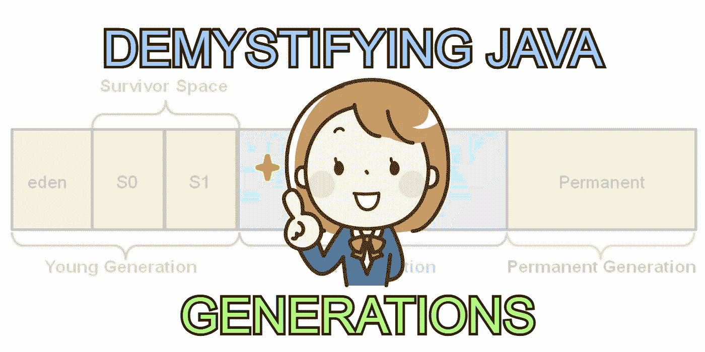
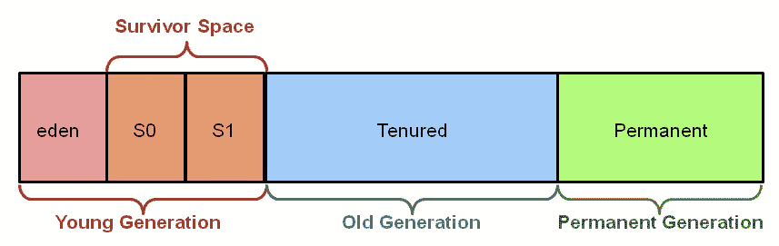
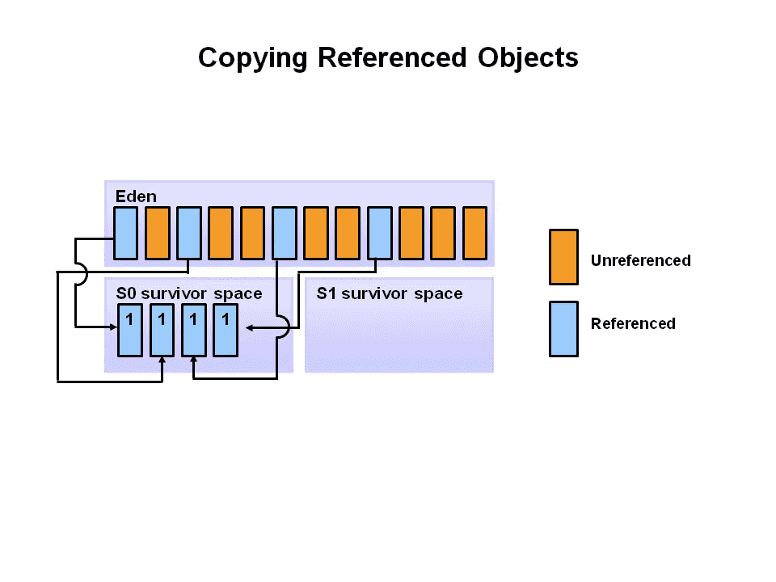
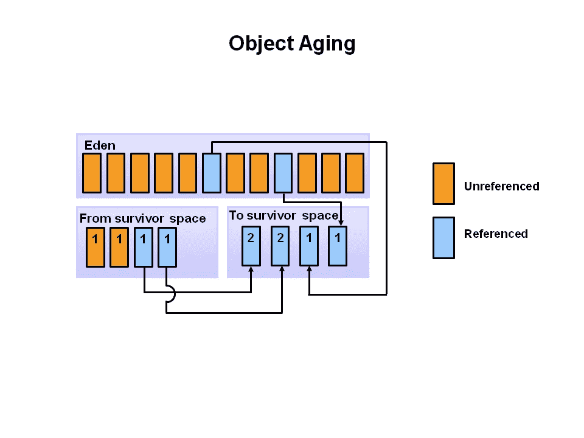
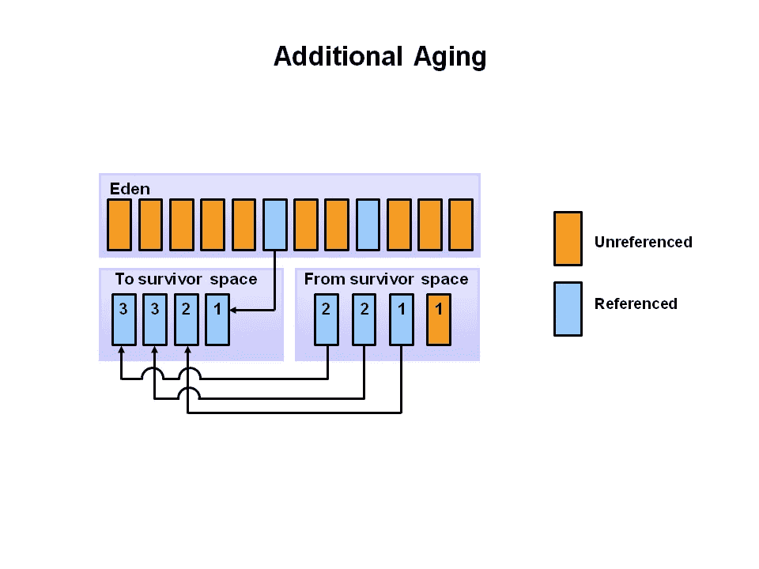
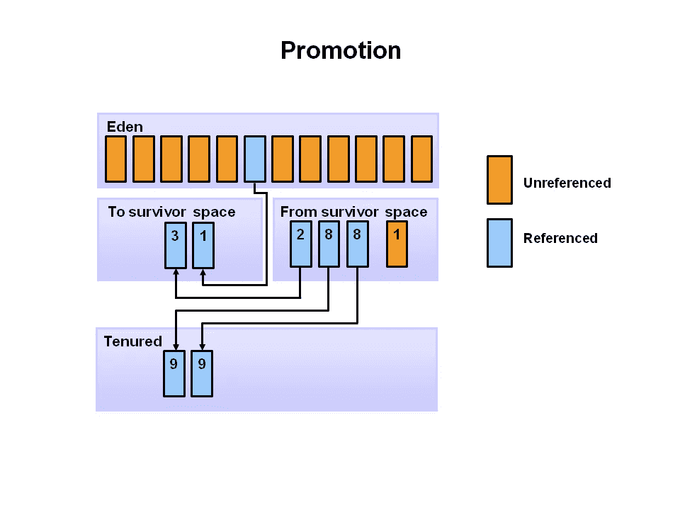

# Java 垃圾收集:什么是年轻一代、老一代和永久一代？

> 原文：<https://blog.devgenius.io/java-garbage-collection-what-is-the-young-generation-old-generation-and-permanent-generation-953462ae2598?source=collection_archive---------1----------------------->

如果你正在寻找关于 Java 的年轻一代、老一代和永久一代的基本概念，那么你来对地方了。

# 几代人？我们在这里谈论什么？

这些术语似乎更适合人，而不是软件概念，但是继续读下去，希望它们会更有意义。

本质上，我们在这里讨论的范围是 **Java 垃圾收集**。

# 垃圾收集和 Java

在像 C 这样的编程语言中，开发人员必须通过相应地分配和释放内存来密切关注内存。

另一方面，Java 有自己的**自动垃圾收集**，其理念是大多数开发人员不必太担心这种手动内存任务，如果有的话。

简而言之，Java 中的对象被分配在一个**堆**(也称为**堆内存**)中。Java 的垃圾收集算法然后**遍历堆**并且**标记被 JVM 使用的对象**，然后稍后**返回并回收任何未被标记的对象的内存**。

该算法的细节将在另一篇文章中讨论，但是重要的是标记本身以及堆被分配成更小的部分，称为**代**的事实。

礼遇[甲骨文](https://www.oracle.com/webfolder/technetwork/tutorials/obe/java/gc01/index.html)。

在上图中，我们终于看到了“年轻一代”、“老一代”、“永久一代”这些术语。如果看起来吓人，不用担心；基本概念实际上非常直观。

# 年轻一代

从高层次来看，**年轻一代**是所有新对象开始的地方。一旦它们在 Java 代码中被分配，它们就会被专门分配到这个叫做**伊甸园**的子部分。

最终，伊甸园空间充满了物品。此时，发生了一个**小垃圾收集**事件。

这就是我之前描述的**标记算法**发挥作用的地方。有些对象(被**引用**的对象)被标记，有些对象(未被**引用**的对象)没有被标记。那些被标记的然后移动到年轻一代的另一个子部分，称为**幸存者空间**的 **S0** (注意幸存者空间本身被分成两部分，S0 和 S1)。Java 的自动垃圾收集会清除掉那些未被标记的。

礼遇[甲骨文](https://www.oracle.com/webfolder/technetwork/tutorials/obe/java/gc01/index.html)。

它保持这种方式，直到伊甸园空间再次填满；此时，一个新的周期开始了。前一段的事件**再次发生**，但是在这个循环中，又有点不一样了。 **S0** 被填充，所以所有从伊甸园空间和 S0 幸存下来的被标记的对象实际上都去了幸存者空间的第二部分，称为 **S1。**在下图中，我们看到它们分别被标记为来自幸存者空间的**和来自幸存者空间**的**。**

礼遇[甲骨文](https://www.oracle.com/webfolder/technetwork/tutorials/obe/java/gc01/index.html)。

需要注意的一件非常重要的事情是，任何进入幸存者空间**的物体都会被贴上一个年龄计数器**的标签。该算法将对此进行检查，以查看它是否满足阈值，从而进入下一阶段:老一代。在后面的章节中会有更多的介绍。

好了，让我们在这里深呼吸，因为在下一个垃圾收集周期中，它变得有点奇怪，但还不算太糟糕。本质上，当**伊甸园空间再次填满**并触发**另一个小的垃圾收集**时，我们并没有将所有被标记(引用)的对象放入**S1**；相反，从幸存者空间和到幸存者空间被交换。

礼遇[甲骨文](https://www.oracle.com/webfolder/technetwork/tutorials/obe/java/gc01/index.html)。

希望上面的图表说明了从幸存者空间到幸存者空间的切换。我个人从这里学到的是，物体没有必要从幸存者空间的 **S0** 到 **S1** 。实际上，它们只是随着每个小的垃圾收集事件交替切换到它们切换到的位置。

老实说，这是相当深入的本质。只要知道**基本上所有新对象都从伊甸园空间**开始，然后**在垃圾收集周期中幸存下来，最终进入幸存者空间**就足够了。

# 老一代人

老一代可以被认为是**长寿对象所在的地方**。基本上，如果对象**在年轻一代**中的多次垃圾收集事件之后达到某个年龄阈值 **，那么它们可以被移动到老一代。**

当对象从老一代中收集垃圾时，一个**主要垃圾收集事件**发生。

让我们看看一个**从年轻一代的幸存者空间晋升到老一代**是什么样子的。

礼貌[神谕](https://www.oracle.com/webfolder/technetwork/tutorials/obe/java/gc01/index.html)。

在上面的例子中，**任何达到 8 个周期的年龄阈值**的幸存对象——这只是一个例子，所以不要特别记住这个数字——都被算法**移动到老一代**。

老一代人只由一个被称为**终身任期一代**的部分组成。这就是为什么在谈话或阅读中，有时这两个术语变得可以互换。

导致清除老一代的事件—同样是一个主要的垃圾收集事件— **可能会有所不同**，了解它们并不在本文的范围之内。我们继续吧。

# 永久的一代

这是一个大问题。当旧代的对象达到某个阈值时，永久代**不*被填充，然后被移动(提升)到永久代。还是那句话，不是这样的！***

相反，JVM 会在运行时用代表应用程序的**类和方法的元数据**立即填充永久生成。****

JVM 有时会遵循某些规则来清除永久代，当它这样做时，它被称为**完全垃圾收集**。

# 什么是“停止世界”事件？

一个“停止世界”的事件听起来很戏剧化，但是从 Java 应用程序是世界的角度来考虑它。

当有一个**小垃圾收集**(记住:对于年轻一代)或一个**大垃圾收集**(对于老一代)，那么世界就停止了；换句话说，所有应用程序线程都完全停止，必须等待垃圾收集事件完成。

# 就这些了，伙计们

读完这篇文章后，我希望您对年轻一代、老一代和永久一代背后的 Java 自动垃圾收集过程有一个更好的了解。内部细节并不那么简单，但是我认为从这个角度熟悉这些术语和一般概念并不是一个坏主意。

 [## 通过我的推荐链接加入媒体

### 作为一个媒体会员，你的会员费的一部分会给你阅读的作家，你可以完全接触到每一个故事…

tremaineeto.medium.com](https://tremaineeto.medium.com/membership) 

# 来源

*   Oracle， [*Java 收藏基础知识*](https://www.oracle.com/webfolder/technetwork/tutorials/obe/java/gc01/index.html)