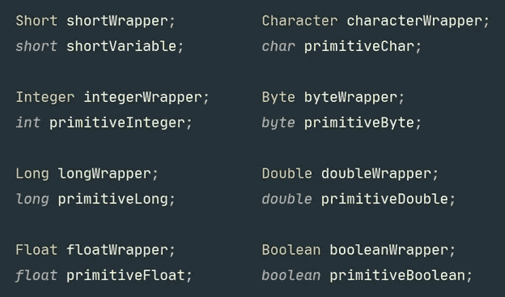
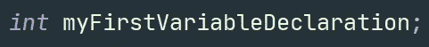
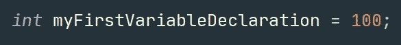
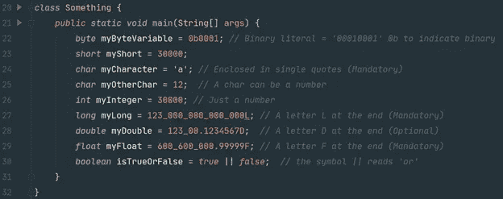
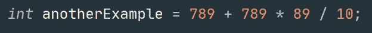

# Java —文字、原语、对象、表达式和语句。(简介)

> 原文：<https://blog.devgenius.io/java-literals-primitives-objects-expressions-and-statements-introduction-to-java-7199b9e0c695?source=collection_archive---------6----------------------->

卡斯帕·卡米尔·鲁宾在 [Unsplash](https://unsplash.com?utm_source=medium&utm_medium=referral) 上的照片

# **字面意思。**

文字是以特定格式存储在计算机中的特定值。我们可以存储数字、文本、特定字符、像购物清单这样的值列表以及许多其他东西。每个都有自己的格式和大小。根据字面意思，我们可以对其执行一系列操作。如果您有数字，您可以对这些数字文字进行加、减和许多数学运算。如果你有文本，你可以搜索特定的信息，用一些句子替换一些其他的文本，统计字数等。如果你有布尔型，你可以问是非问题。比如，你有没有和两个女人/男人在床上？只有两个选项是真或假。如果你把字母表储存在电脑里，这将会是一个字符列表，如果你愿意，你可以用一个数字来映射每个字母。

在 Java 中有 8 种基本文字。每一个都对应一个基本类型。

# **原始值**

基本类型应该用小写写(你的第一条语法规则)。并且分别是， **byte，char，boolean，short，int，long，double** ，以及 **float** 。

每一个文字或数值都会占用**随机存取存储器的一定空间。随着对这种语言越来越熟悉，你将学会何时用一种语言代替另一种语言。文字是存储在计算机中的实际值。它非常熟悉**数据类型**定义**。**但是数据类型是我们发送给计算机的注释，所以它知道它将使用什么类型的值。就像一个标签，用来分类存放不同物品的盒子。**

在 Java 中，我们需要区分原始值、数据类型和文字。每个文字都有其原始值，原始值定义了特定的数据类型。Java 中存在大量的数据类型，但只有 8 个原始值。

# **整数原语类型**

以下类型设计用于处理数字。虽然有一点例外，char 可以存储数字，但是这些数字是用来表示符号、字母和数字的，它们将作为文本显示在你的屏幕上。

**字节:**

*   它使用 8 位(1 字节)。
*   它用于表示[-128，+127]范围内的数字。
*   这是相当快的处理加法，减法等。

**字符**

*   它使用 16 位(12 字节)。
*   它用于表示[0，65535]范围内的数字。
*   它用来表示 **Unicode 字符**
*   Unicode 字符是代表符号、字母或数字的数字
*   它可以用作数字，但被创建为字符并在屏幕上显示相应的符号。

**简称:**

*   它使用 16 位(2 字节)。
*   它用于表示[-32 768，+32 767]范围内的数字。
*   这是转换成一个字符很容易每当你想要它。
*   这是相当快的处理加法，减法等。

**int**

*   它使用 32 位(4 字节)。
*   它用于表示[-2，147，483，648，+2，147，483，6487]范围内的数字。
*   这是表示数字的常见基本类型之一。

**长**

*   它使用 64 位(8 字节)。
*   它用来表示一个很大的数字范围

[-9,223,372,036,854,775,808, +9,223,372,036,854,775,807].

*   你应该小心使用这种类型。它会让你的电脑变慢。

# **十进制原始类型**

创建 Float 和 double 是为了处理十进制数。在编程中，它们被称为浮点数。

**双**

*   它使用 32 位(4 字节)
*   它用于表示十进制数，并执行除法、数字的平方根等运算。

**浮动**

*   它使用 64 位(8 字节)
*   它用于表示十进制数，并执行除法、数字的平方根等运算。

# **两种特殊的原始类型**

**布尔型**

*   它使用 8 位(1 字节)。
*   它是用来回答是非问题的。
*   虽然它有 8 位，但它只存储 2 个值，真或假。
*   在内部 **00000000** 与 false 相同。
*   内部 **11111111** 也是一样的真实。

**作废**

*   它是一种类型，用来表达根本没有存储的价值。
*   我们不能在变量定义中使用它。
*   通常在创建一些函数时使用。

# **超越原始类型**

除了基本类型，我们还有对象和数据类型。这是一个很大的课题，也是面向对象编程的基础 **(OPP)** 。

值得一提的是，每个基本类型都有自己的对象包装器。我们将在以后的课程中看到更多细节。

原始类型用小写字母书写，名称缩写，而它们对应的**包装对象**大写，并且总是用完整的单词书写。两者都用于在内存 ram 中存储信息。基本类型存储文字，数据类型存储对象(以后你会知道更多关于对象的知识)。

基本类型与对象(两者都是数据类型)

要在 RAM 中存储信息，您需要创建一个变量。每个变量都应该定义它将存储的数据类型和值本身(文字)，让我们把重点放在基本类型上。创建一个变量，定义一个变量，或者声明一个变量是一回事。我们按照下面的步骤声明变量:

1.选择一个原语类型，并将其写在源代码(文本文件)中。java)。

2.为变量选择一个名称。

3.在行尾使用分号。分号意味着你已经完成了一个专门的指令。

还有第二种方法。您可以创建一个变量并立即给它赋值(文字)。

让我们来看看在同一行中赋值的所有基元类型声明。仔细检查它们。

# **进一步介绍**

**指令**是计算机将为我们做的事情。指令是**语句**和**程序**的组成部分。语句是我们可以用 Java 语言告诉计算机的更基本和更专门的指令。所有的 Java 语句也是表达式。每一个表达式都被求值，它给我们一个结果。

例如，4 + 5 是一个表达式，结果是数字 9。编程语言中的结果值称为返回值。该值可以存储在变量中或打印到**控制台**上，控制台是一个可视化工具，它以图形方式在我们的计算机屏幕上显示信息。

声明一个变量也是一个语句。如果我们赋值，符号“=”右边的元素就是一个表达式。我们可以这样做:

首先 java 编译器会计算 189+789 * 89/10；该表达式的结果将存储在名为“anotherExample”的变量中。返回值为文字，数据类型为原始类型 integer，缩写为 **int** 。

随着我们获得更多的表达和陈述的例子，我们将会主导它们之间的区别。掌握这两个概念对于成为一名自信的程序员以及以后的许多其他事情都很重要。

**永远记住的关键词**:表达式、语句、声明变量、赋值、原始值、数据类型、对象、类、文字、int、float、short、long、double、boolean、char、byte、Integer、Character、Boolean、Double、Long、Short、Byte、Float。

不要强迫自己一次记住所有这些，读两遍甚至更多遍。在互联网、视频、博客、训练营中寻找其他的视角。永远不要停止复习和练习这些单词，直到你掌握它们。

感谢阅读！如果你被困在某个地方，请留言。我将用不同的方式解释它。

*   天使 V. G。
*   angel.vkz@outlook.com