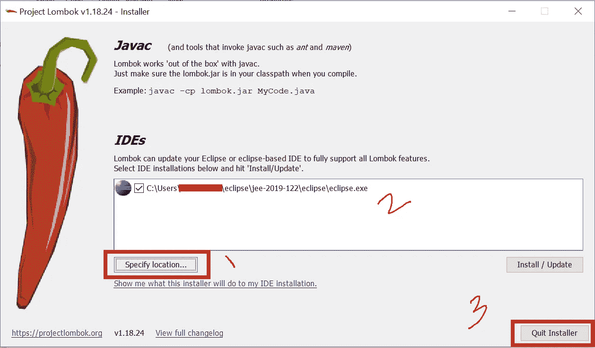
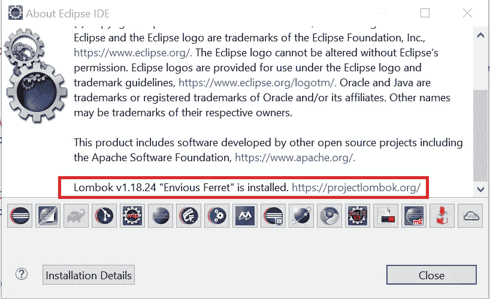

# 爪哇龙目岛

> 原文：<https://blog.devgenius.io/java-lombok-4c8bc48ab1cc?source=collection_archive---------3----------------------->

龙目岛听起来相当复杂。但是，在现实世界中，它是开发人员友好的，并且实际上帮助开发人员避免编写样板文件。

**Lombok** 是一个 Java 库，帮助我们最小化样板代码。

在 Java 中有很多地方我们可以写样板代码，比如 setters、getters、toString、constructor 等等。

Lombok 为我们提供了大量的注释来避免编写样板代码，同时帮助我们保持 Java 类的整洁。

**Java 编译器根据我们包含的注释**，帮助我们在编译时生成或包含样板代码。如果我们已经在课堂上手动编写了代码，Lombok 将不会在运行时生成样板代码。例如，如果 ToString()方法已经在 java 类中编写，则@ToString Lombok 批注不会创建样板代码。

在 **pom.xml** 中包含以下 maven 依赖项，以使用 Lombok 注释。

```
<dependency>
  <groupId>org.projectlombok</groupId>
  <artifactId>lombok</artifactId>
  <version>1.18.24</version>
  <scope>provided</scope>
</dependency>
```

下面是一个有 Lombok 注释的**Student.java**类的例子，比如 **@ToString、@Getter、@Setter、@NoArgsConstructor、@AllArgsConstructor。**

```
import lombok.AllArgsConstructor;
import lombok.Getter;
import lombok.NoArgsConstructor;
import lombok.NonNull;
import lombok.Setter;
import lombok.ToString;

@ToString
@NoArgsConstructor
@AllArgsConstructor
public class Student {

 @ToString.Exclude
 @NonNull
 @Setter
 @Getter
 private String firstName;

 @Setter
 @Getter
 private String lastName;

 @Setter
 @Getter
 private int age;

}
```

**@Getter** 和 **@Setter** 注释帮助我们生成下面的样板代码。

```
public String getFirstName() {
  return firstName;
}

public void setFirstName(String firstName) {
  this.firstName = firstName;
}
```

**@ToString** 允许我们创建包含所有字段的 **toString()** 。

```
@Override
 public String toString() {
  return "Student [firstName=" + firstName + ", "
    + "lastName=" + lastName + ", age=" + age + "]";
 }
```

@NoArgsConstructor 允许我们创建空的构造函数。

```
public Student() {
  super();
}
```

@AllArgsConstructor 允许我们创建参数化的构造函数。

```
public Student(String firstName, String lastName, int age) {
  super();
  this.firstName = firstName;
  this.lastName = lastName;
  this.age = age;
 }
```

下面 **@Data** Lombok 注释自动生成@Getter、@Setter、@ToString、@RequiredArgsConstrutor 和@EqualsAndHashcode 注释。

```
import lombok.Data;

@Data
public class Student {

 private String firstName;
 private String lastName;
 private int age;

}
```

**@Data** 等同于@ Getter @ Setter @ ToString @ RequiredArgsConstrutor @ EqualsAndHashcode

# 在 Eclipse 中配置 Lombok

按照以下步骤在 IDE 或 Eclipse 中配置 Lombok。下面的例子是在 Eclipse 中安装 Lombok。

1.  访问[链接](https://projectlombok.org/download)下载 jar 文件。
2.  双击下载的 jar 并指定 IDE 或 eclipse **。exe** 文件的位置如下所示。



3.点击安装/更新按钮。

上面的安装将只包括下面的条目在 **eclipse.ini** 文件中:
-Java agent:C:\ Users \ imrankhan 5 \ eclipse \ JEE-2019–122 \ eclipse \ lombok . jar

4.打开 Eclipse，在顶部菜单中点击 **help → About Eclipse IDE** ，确认 Lombok 设置是否成功完成。



我希望你发现这篇文章有趣且内容丰富。请分享给你的朋友来传播知识。

你可以关注我即将发布的博客[关注](https://medium.com/@toimrank)。
谢谢！