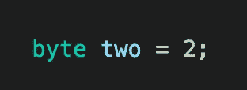

# Java 原始数据类型

> 原文：<https://blog.devgenius.io/java-primitive-data-types-db964d9ad8d3?source=collection_archive---------3----------------------->

马库斯·斯皮斯克在 [Unsplash](https://unsplash.com?utm_source=medium&utm_medium=referral) 上的照片

# **简介**

我和一位招聘人员进行了一次对话，我们讨论了我的经历，她问我是否了解 Java，并且说他们的很多客户都在寻找 Java 开发人员。我告诉她，我对 Java 不太熟悉，但我对 JavaScript 很了解，而且它们非常相似，所以我告诉她，我可以在周末学到一些东西，也许我可以做一个项目给她看，她告诉我，她会给我发一份评估。

一个周末真的能学会 Java 吗？嗯，我正在尝试，你知道吗，我也写了一篇关于它的博客。

我注意到 JavaScript 的一个主要区别是数据类型的声明方式，所以我想为什么不写出来呢？

# 什么是数据类型？

数据类型基本上就是我们在程序中分离数据的方式。我们人类知道如何区分数字和字母，但对于计算机来说，数字和字母都只是一串 1 和 0。那么我们如何告诉我们的计算机一个数字是一个数字，一个字母是一个字母呢？我们使用数据类型。

java 中有两种数据类型，原始的和非原始的。在这篇博客中，我将只讨论原始数据类型；下周我将讨论非原始数据类型。

# 原始数据类型

我一直认为这些数据类型被称为原语，因为它们是程序中可以找到的最简单的数据形式。这些数据类型用于指向非常具体的东西，如数字、字母、字母数字值、布尔值、十进制数和其他值。大多数原始数据类型都是数值型的。值得注意的是，在 Java 中，我们对内存堆栈有更多的控制权，每种数据类型都将使用特定数量的内存。

## 1.-夏尔

**大小:2 字节*

当我们想要定义字符时，我们使用 char。我们只能将单个字符存储到一个带 char 的变量中。如果我们想一起存储多个字符，char 不是一个选项。我们总是想把我们的价值观用单引号括起来。现在它们是我们存储字符的其他方式，比如数字。如果你将一个数字存储到 char 中，这个数字将代表一个字符，而不是一个数字。让我们看一个例子。

我们可以看到，数字 65 指的是“A”这个字。

## 2.-布尔值

*大小:1 位

布尔值只能存储两个值:“真”或“假”。我喜欢认为布尔就像是我们程序的开关，它们为我们创造了一种创造流程的方式。我们可以编写代码，只在满足特定标准的情况下执行，如果某个条件为“真”，那么程序将执行代码的一部分，如果为“假”，那么它将执行其他部分。

# 数字数据类型

大多数基本数据类型都是数字，有两种数字数据类型:整数和浮点数，浮点数意味着它们是小数或分数。

# 整数数据类型

你可能想知道为什么它们有许多不同的数据类型来表示整数，原因是内存效率。我们可能希望存储一个 2 位数或 10 位数的数字，如果我们只有一种数据类型，那么 1 位数将比 10 位数占用相同的内存量，这就是为什么我们有不同类型的不同大小。

## 3.-INT

**大小:4 字节*

Int 是 integer 的缩写。当我们想要存储整数时，我们使用 int，重要的是要记住，当我们使用 int 时，我们不能存储任何十进制值，只能存储整数。现在 int 也可以存储负数和正数，范围从-2，147，483，648 到 2，147，483，647。

如果我们决定实际上要存储一个小数字，那么也许我们可以使用另一种使用更少内存的数据类型，称为 short。

## 4.-短

**大小:2 字节*

Short 也用于存储整数，int 和 short 的区别在于，short 只能存储-32，768 到 32，767 之间的数字，使用的内存少了 2 个字节。我们是这样使用它的:

甚至还有另一种数据类型可以存储更小的数字，它被称为字节。

## 5.-字节

**大小:1 字节*

字节也是另一种数字数据类型，它允许我们以最高的内存效率存储较小的数字。字节可以是从-128 到 127 的数字。

也许你想储存一个更大的数字，为此我们将不得不使用长。

## 6.表示“在…期间”:lifelong

**大小:8 字节*

当我们想要存储一个大于 int 范围的数时，使用 Long，long 的范围可以从-9，223，372，036，854，775，808 到 9，223，372，036，854，775，807，long 具有最大的存储容量。每当我们要写一个很长的数字时，我们必须确保在数字的末尾加上一个“L ”,就像这样:

# 浮点数字数据类型

有两种类型的浮点数据类型，这两种类型的区别在于小数点后的位数。我们也可以用浮点数来写科学数字。

## 7.-浮动

**大小:4 字节*

浮点数是十进制数，小数点后最多可容纳 7 位数字。要声明一个 float，我们必须在数字后面加一个“f”。

## 8.双份

**大小:8 字节*

双精度浮点数小数点后最多可以有 15 位，比浮点数多 7 位。当我们声明一个 double 时，我们必须确保在数字后面加一个“d”。

# 结论

看到像 Javascript 或 Ruby 这样的其他语言在存储变量时有更大的灵活性真的很酷，但是看到我们如何基于内存选择数据类型也很有趣。我希望这篇文章是有用的感谢阅读！