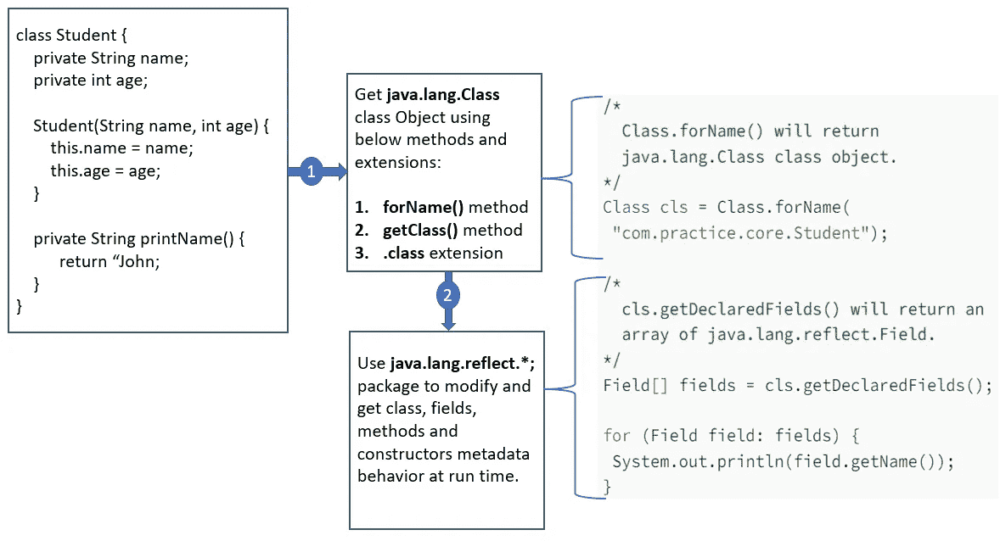
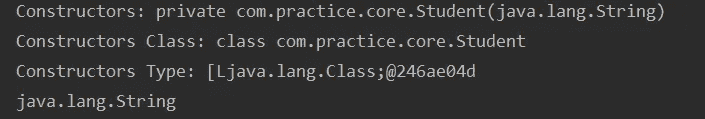

# Java 反射

> 原文：<https://blog.devgenius.io/java-reflection-5545c9503f54?source=collection_archive---------4----------------------->

我相信我们大多数人都听说过 **Java 反射** **API** ，并打算阅读或收集关于它的信息。这个博客肯定会帮助我们理解 Java 反射的一切。

**Java 反射**帮助我们在运行时读取或修改与类、字段、方法和构造函数相关的元数据。

它允许我们获取元数据信息，如范围、修饰符、名称、参数、方法调用等。与类、字段、构造函数和方法相关。

**java.lang.reflect** 包拥有**字段、方法、构造函数**类，这为我们提供了获取或修改与类、字段、构造函数和方法相关的公共和私有元数据的能力。

isInterface()、getSuperclass()、getName()、getClass()、getMethods()、getFields()、。getConstructors()是从 **java.lang.Class** 类中获取或提取元数据的一些常用和最常用的方法。

下面是使用反射获取或读取元数据的步骤:

1.  获取 **java.lang.Class** 类对象
2.  在运行时使用类对象获取或提取类元数据。



它需要一个 **java.lang.Class** 类对象来使用反射获取元数据。下面是允许我们使用反射获取元数据的方法:

## 1.forName()方法:

**forName()** 来自 **java.lang.Class** 类的静态方法允许我们创建或获取类对象。

```
class Student { }

public class Test{    

 public static void main(String args[]) throws Exception {

   // Access Student using static Student class.
   Class cls = Class.forName("com.practice.core.Student");
 }
}
```

## 2.getClass()方法:

**getClass()** native final 方法从 **java.lang.Object** 类也允许我们获取 **java.lang.Class** 类对象。

```
class Student { }

public class Test{    

 public static void main(String args[]) throws Exception {
   // Create an instance of Student class
   Student student = new Student();

   // getClass() method allow us to get class metadata using reflection.
   Class cls = student.getClass();
 }
}
```

## 3.使用。班级

。类扩展还允许我们获得如下所示的 **java.lang.Class** 类对象:

```
class Student { }

public class Test{    

 public static void main(String args[]) throws Exception {

   // .class extension also allow us to get Class class Objec.
   Class cls = Student.class;
 }
}
```

## 使用反射的字段元数据

下面是一个访问类字段元数据的示例，如字段名、修饰符、获取或设置值等。使用**反射**。

```
package com.practice.core;

import java.lang.reflect.Field;

class Student {
 private String firstName;
 private String lastName;
 private int age;
}

public class Test{    

 public static void main(String args[]) throws Exception {

  /* 
    Class.forName() will return 
    java.lang.Class class object.
  */
  Class cls = Class.forName(
   "com.practice.core.Student");

  /* 
    cls.getDeclaredFields() will return an 
    array of java.lang.reflect.Field.
  */
  Field[] fields = cls.getDeclaredFields();

  for (Field field: fields) {
   System.out.println(field.getName());
  }
 }
}
```

**输出:**
名字
姓氏
年龄

下面是从**学生**类访问**私有字段名称**的**反射**示例。

```
class Student {

  private String name;

  public Student(String name) {
    this.name = name;
  }
}

public class Test{    

 public static void main(String args[]) throws Exception {

  Student student = new Student("John");

  // Access name private field
  Field field = Student.class.getDeclaredField("name");

  // set field accessible as true
  field.setAccessible(true);

  String name = (String)field.get(student);

  // Print name private field as 'John'
  System.out.println("Name = " + name);

  // Check for an interface
  System.out.println("Is Interface = "+cls.isInterface());
 }

}
```

**输出** 名称=约翰
接口=假

下面是使用反射设置学生类的**年龄**字段值的示例:

```
package com.practice.core;

import java.lang.reflect.Field;

class Student {
 public int age;
}

public class Test{    

  public static void main(String args[]) throws Exception {
    try {
     Class cls = Class.forName("com.practice.core.Student");

     // Access age field of Student class
     Field field = cls.getField("age");
     Student student = new Student();
     System.out.println("age before = " + student.age);

     // Set 12 value as an age
     field.setInt(student, 12);
     System.out.println("age after = " + student.age);
    } catch (Throwable e) {
   System.err.println(e);
  }
 }
}
```

**输出**
年龄= 0
年龄= 12

## 使用反射的方法元数据

下面是一个使用**反射**访问方法元数据的例子，比如方法名、参数及其类型、修饰符、方法调用。

```
package com.practice.core;

import java.lang.reflect.Method;

class Student {

 private void getStudentName(String name) {
  System.out.println("test");
 }

}

public class Test{    

 public static void main(String args[]) throws Exception {

  // Access Student class using package.
  Class c = Class.forName("com.practice.core");

  // Get all declare methods inside Student class. 
  Method m[] = c.getDeclaredMethods();
  for (int i = 0; i < m.length; i++) {

   // Get method details.
   System.out.println("Method: "+m[i].toString());

   // Get method's class name.
   System.out.println("Declaring Class: "+m[i].getDeclaringClass());

   // Get parameter type.
   System.out.println("Parameter Type: "+m[i].getParameterTypes().toString());

   // Get return type
   System.out.println("Return Type: "+m[i].getReturnType());
  }
 }
}
```

**输出:**
方法:private void com . practice . core . student . getstudentname(Java . lang . string)
声明类:com.practice.core.Student
参数类型:【ljava . lang . Class； [@246ae04d](http://twitter.com/246ae04d)
返回类型:void

下面是一个使用 **Class.forName()** 方法调用使用**反射**方法的示例:

```
package com.practice.core;

import java.lang.reflect.Method;

class Student {

 public String printName() {
  System.out.println("Inside PrintName() method");
  return "John";
 }

}

public class Test{ 
  public static void main(String args[]) throws Exception {

  // Access Student class using package.
  Class c = Class.forName("com.practice.core.Student");

  // Access method printName
  Method m = c.getMethod("printName");

  // Create Student instance
  Student st = new Student();

  // invoke printName method from Student class
  Object obj = m.invoke(st);

  // Print method output
  System.out.println((String)obj);
 }
}
```

## 使用反射的构造函数元数据

下面是一个使用**反射**访问**构造函数**并获取其元数据的示例，例如构造函数名称、参数及其类型、修饰符。

```
package com.practice.core;

import java.lang.reflect.Constructor;
import java.lang.reflect.Parameter;

class Student {
 private Student(String name) { }
}

public class Test{    

 public static void main(String args[]) throws Exception {

  // Access Student class using package.
  Class c = Class.forName("com.practice.core.Student");

  // Get all declare methods inside Student class.
  Constructor[] constructors = c.getDeclaredConstructors();
  for (int i = 0; i < constructors.length; i++) {

   // Get constructor details.
   System.out.println("Constructors: "+constructors[i].toString());

   // Get constructor's class name.
   System.out.println("Constructors Class: "+constructors[i].getDeclaringClass());

   // Get constructor parameter type.
   System.out.println("Constructors Type: "+constructors[i].getParameterTypes().toString());

   // Access all constructor parameters
   Parameter[] parameters = constructors[i].getParameters();
   for (Parameter parameter: parameters) {
    System.out.println(parameter.getType().getName());
   }
  }
 }
}
```

**输出**



## 反射 API 的缺点:

下面是使用反射 API 的一些缺点:

1.  它使系统变慢。
2.  当类名绑定在运行时发生时，它可能会导致或结束意外错误。
3.  它可能是应用程序的安全威胁，因为反射允许我们访问私有和公共的字段和方法。

我希望你发现这篇文章有趣且内容丰富。请鼓掌分享给你的朋友，传播知识。

你可以[关注](https://medium.com/@toimrank)我的博客。谢谢你！