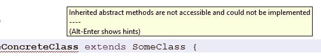
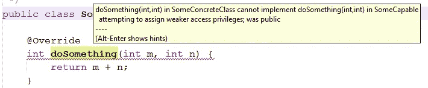
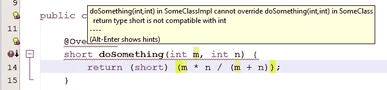

# Java 提醒:覆盖可以缩小返回类型，但不能缩小访问范围

> 原文：<https://blog.devgenius.io/java-reminder-overrides-can-narrow-return-type-but-not-access-63cc926bf26b?source=collection_archive---------11----------------------->


Christina Kirschnerova 在 [Unsplash](https://unsplash.com?utm_source=medium&utm_medium=referral) 上拍摄的照片

当抱怨 Java 如何冗长时，几乎没有人提到默认访问修饰符。对于 Java 来说，这可能是一个更详细的好地方。

考虑这个玩具例子:

虽然`SomeClass`可以从其他包中被引用(因为它被标记为 public)，但是它不能在包外被扩展，因为子类必须覆盖`doSomething()`或者自己是抽象的。

例如，下面是当我试图从`edu.example`包中扩展`SomeClass`时，在 Apache NetBeans 中发生的事情:



Apache NetBeans 显示了一个错误，是关于一个类试图扩展另一个包中的一个类。

这是因为在 Java 类中，缺少访问修饰符意味着包是私有的。

相比之下，在 Scala 中，如果你真的希望访问级别是包私有的，你必须显式地写“`private[org.example]`”——用相关包的名称替换“`org.example`”。

有时会让 Java 程序员，甚至是更有经验的程序员感到困惑，因为默认的访问修饰符在接口的花括号中意味着别的东西。这是一个界面的玩具示例:

由于接口被显式标记为 public，所以它可以在`org.example`包之外实现。如果我们在“`interface`”之前省略“`public`”，那么“`SomeCapable`”将是一个包私有接口。

但是`SomeCapable`的`doSomething()`是*不是*包私有。事实上，它是公共的，可以由`org.example`包之外的类实现。

问题是，当您将“方法签名”复制到实现类时，您可能会忘记放入“`public`”。这个错误我已经犯了好几次了。

程序不会编译，你会得到一个错误信息。



Apache NetBeans 显示了一个错误，该错误与试图从接口实现公共函数的类有关。

无意中将访问从 public 缩小到 package private 会导致错误，这是有道理的。抽象函数的目的是促进多态性。

如果对象 *X* 是类型 *T* 的一个实例，并且 *T* 具有我们需要的 *X* 的所有特征，那么我们可能并不真正关心 *X* 是否实际上是专门化子类型 *U* 的一个实例。

但是如果类型 *T* 中声明的函数 *f* 的访问在 *U* 中更窄，那么 *U* 真的可以说是 *T* 的一个子类型吗？编译器别无选择，只能将其作为错误拒绝。

顺便说一下，我认为编译器警告中的术语“较弱的访问权限”是一个糟糕的选择。我应该写“更严格的访问权限”。

通过在编译器期望的地方添加“`public`”，可以很容易地修复这种错误缩小的访问。然而，这感觉像是 Java 语言规范中的一个矛盾或杂质。

Scala 没有这种不一致性:如果在可以指定访问级别的地方没有指定访问级别，那么它就是公共的，无论是在类中还是在 trait 中(Scala trait 有时可以像 Java 接口一样编译)。

然而，在 Scala 中，就像在 Java 中一样，不能缩小覆盖的访问范围，但是可以缩小返回类型。

对于玩具示例，让我们将这一行添加到`SomeClass`:

```
 abstract Object doSomething(Object obj);
```

然后让我们创建一个实现类:

```
package org.example;

import java.math.BigInteger;

public class SomeClassImpl extends SomeClass {

    @Override
    int doSomething(int m, int n) throws ArithmeticException {
        return m * n / (m + n);
    }

    @Override
    BigInteger doSomething(Object obj) {
        BigInteger hash = BigInteger.valueOf(obj.hashCode());
        return hash.multiply(hash);
    }

}
```

缩小的返回类型不会给调用者带来任何问题。如果他们调用一个`SomeClassImpl`实例作为一个`SomeClass`实例，他们将从单参数`doSomething()`中获得一个`Object`实例。

但是如果这些调用者显式地将单参数的`doSomething()`作为`SomeClassImpl`实例调用，那么他们在为`doSomething()`的返回值进行类型声明时会更加谨慎。

然后在`SomeClassImplTest`中，不必编写断言单参数`doSomething()`返回一个`BigInteger`的测试。

```
 @Test
    public void testDoSomethingReturnType() {
        SomeClassImpl instance = new SomeClassImpl();
        Object result = instance.doSomething("For testing purposes only");
        assert result instanceof BigInteger;
    }
```

IntelliJ IDEA 可能会给你一个警告，这个测试是没有意义的，特别是这个实例被明确声明为`SomeClassImpl`而不是一般的`SomeClass`。

即使可以缩小返回类型，也不能缩小参数类型，因为同样的原因，也不能缩小访问级别。

如果返回类型是原语，缩小覆盖的返回类型的能力就不太适用。例如，如果期望的是一个`int`(一个 32 位有符号整数)，您不能将返回类型缩小到一个`short`(一个 16 位有符号整数)。



显示 Apache NetBeans 将尝试将返回类型更改为短整数标记为错误的屏幕截图

鉴于我在这里只展示了玩具示例，你可能会问这些东西的实际用途是什么，这是一个合理的问题。

你不太可能真的需要从`Object`中重写`clone()`，但是如果你这么做了，你就有理由将`clone()`的返回类型缩小到你正在处理的类。比我想的要复杂得多。

如果您的项目中有两个密切相关的子层次结构，则更有可能需要缩小重写的返回类型。

我将从我自己的一个项目中给出一个实际的例子，但是对你来说它可能仍然像一个玩具例子，特别是如果你喜欢尽可能地保持你的继承层次结构。

在[我的代数整数计算器项目](https://github.com/Alonso-del-Arte/algebraic-integer-calculator)中，`IntegerRing`是由`QuadraticRing`、`CubicRing`、`QuarticRing`等类实现的接口。同样，`AlgebraicInteger`接口也是由`QuadraticInteger`、`CubicInteger`、`QuarticInteger`等类实现的。

`AlgebraicInteger`接口定义了`getRing()`函数，该函数应该返回一个`IntegerRing`。由于从`QuadraticInteger`实例返回`CubicRing`或`QuarticRing`对`getRing()`来说没有多大意义，所以`QuadraticInteger`类将`getRing()`的返回类型缩小到`QuadraticRing`。

我在一两个其他项目中使用了这种缩小功能。这是那些你并不总是需要的东西之一，但是知道它什么时候适用是有好处的。