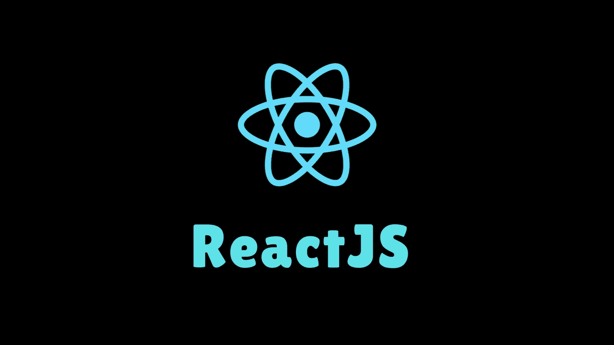
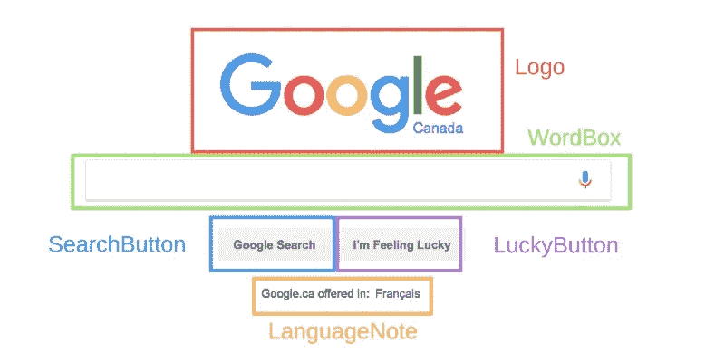

# Java Script:让我们谈谈 React 基础知识

> 原文：<https://blog.devgenius.io/java-script-lets-talk-react-basics-322629bb6e62?source=collection_archive---------3----------------------->



[https://abcn technologies . com/WP-content/uploads/2019/12/react js . png](https://abcntechnologies.com/wp-content/uploads/2019/12/reactjs.png)

# 什么是反应？

[React](https://reactjs.org/) 是一个用于构建用户界面的 JavaScript 库。React 是由脸书和 Instagram 开发的。React 在 [MVC](https://en.wikipedia.org/wiki/Model%E2%80%93view%E2%80%93controller) (模型—视图—控制器)中处理视图。React 是声明性的，而不是命令性的。[声明式](https://codeburst.io/declarative-vs-imperative-programming-a8a7c93d9ad2)代码(如 HTML)是一种表达*做什么而不描述 ***如何*** 的编程范式。*

# ***为什么反应？***

*React 为您提供了与 DOM 交互的工具，比原始的 JavaScript 或 jQuery 更加简洁有效。HTML、CSS、JavaScript 可以放在一个组件中，它们就像“超级强大”的 HTML 标签。它速度快，支持代码模块化和重用。*

# ***反应概念***

*有许多[反应概念](https://reactjs.org/docs/introducing-jsx.html)都服务于重要性。为了保持这篇文章简洁明了，我们将讨论列出的基本原则。*

1.  *成分*
2.  *JSX*
3.  *渲染元素*
4.  *功能 vs 类组件和道具*
5.  *状态和处理事件*

*还有更多更深入的主要概念。这篇文章试图在高层次上总结一些主要概念。*

# ***React 是基于组件的***

*组件是编写应用程序的基础。想象一下你的 UI(一个网页应用程序)，它可以被分割成独立的、可重用的部分。孤立地考虑每一件作品。每一块都是一个 [**组件**](https://www.w3schools.com/react/react_components.asp) 如下图所示。*

**

*[https://cdn-media-1 . freecodecamp . org/images/1 * bvQNHjZOXcl-ds 9 a4 awy VG . png](https://cdn-media-1.freecodecamp.org/images/1*bvQNHjZOXcl-ds9A4AWYVg.png)*

*每个组件都是一个 JavaScript 函数，向屏幕(DOM)返回(呈现)React 元素。*

# *React 需要 JSX 吗？*

*[JSX](https://reactjs.org/docs/jsx-in-depth.html) 是 JavaScript 的语法扩展。React 使用这种语言来描述 UI 应该是什么样子。它看起来像 HTML，但具有 JavaScript 的全部功能。请参见示例语法。*

```
*const element = <h1>Hello, world!</h1>;*
```

*使用 React 不需要 JSX。然而，JSX 使它非常方便。看出区别。*

*不使用 JSX 的代码:*

```
*class Hello extends React.Component {
  render() {
    return React.createElement('div', null, `Hello ${this.props.toWhat}`);
  }
}

ReactDOM.render(
  React.createElement(Hello, {toWhat: 'World'}, null),
  document.getElementById('root')
);*
```

*用 JSX 写的代码:*

```
*class Hello extends React.Component {
  render() {
    return <div>Hello {this.props.toWhat}</div>;
  }
}

ReactDOM.render(
  <Hello toWhat="World" />,
  document.getElementById('root')
);*
```

*尝试更多 Babel 在线工具[中的片段来欣赏 JSX ES6 语法。](https://babeljs.io/repl/#?presets=react&code_lz=GYVwdgxgLglg9mABACwKYBt1wBQEpEDeAUIogE6pQhlIA8AJjAG4B8AEhlogO5xnr0AhLQD0jVgG4iAXyJA)*

*在 JSX，任何有效 JavaScript 表达式都放在花括号内。默认情况下，React DOM 在渲染之前会对 JSX 中嵌入的任何值进行转义。这防止了 XSS 的攻击。*

# ***渲染元素***

*一个元素描述了在屏幕上看到的内容。React 元素是普通对象， [React DOM](https://reactjs.org/docs/react-dom.html#render) 用它们来更新实际的 DOM。元素是组成组件的东西。*

*在 HTML 文件中，确定您想要放置 react 元素或组件的位置。例如，在 HTML 文件中有:*

```
*<div id="app"></div>*
```

*这个`<div>`中的一切都将由 React DOM 管理。用 just React 构建的应用程序只有一个根 DOM 节点。如果将 React 集成到现有的应用程序中，可能会有不同的根 DOM 节点。*

*要渲染 React 元素或组件，请使用 [ReactDOM.render()](https://reactjs.org/docs/react-dom.html#render) :*

```
*ReactDOM.render(element, placeWeWantToPutElementOrComponent)// example
const element = <h1>Hello, world</h1>;
ReactDOM.render(element, document.getElementById('app'));*
```

*React 只更新必要的内容。React DOM 将元素及其子元素与之前的元素进行比较，并且只应用必要的 DOM 更新。*

# ***功能 vs 类组件和道具***

*我们将在下一节讨论状态。功能组件和类组件之间的主要区别是:*

*   *功能组件是无状态的(只是接受数据并将它们显示给 UI)*
*   *类组件是有状态的(通过实现逻辑和状态变得更加复杂)*

*让我们把第一个组件写成功能性的。下面是 ES6 语法中的一个简单的功能组件，展示了如何将 React 组件放入另一个组件中。*

***注意:组件名称总是以大写字母开头。** React 将小写字母的组件视为 DOM 标签`<div />`，`<Container />`代表一个组件。*

*组件可以接受任意输入(称为“props”，代表属性)并返回一个 React 元素。这是一种将数据传递给组件的方式，使它们更具动态性和可重用性。属性是不可变的，一旦从父级传入就不能更改。*

```
*const Component = () => (     
  <h1>I am a child component!</h1> 
);const Container = (props) => (
<div>
  <h1>I am parent {props.name} component!</h1>
  <Component />
</div>
);ReactDOM.render(<Container name="Container" />, document.getElementById('app'));*
```

*我们可以用 Java Script 的 ES6 类将容器组件重写为类组件，以使事情更加动态。*

```
*class Container extends React.Component {
  render() {
    return (      
      <div>
        <h1>
           I am the parent {this.props.name} component!
        </h1>
       <Component /> 
     </div>    
    );  
  }
}const Component = () => (     
  <h1>I am a child component!</h1> 
);ReactDOM.render(<Container name="Container" />, document.getElementById('app'));*
```

*上面的例子:*

**

*上面示例中的 HTML 呈现*

1.  *`ReactDOM.render()`将`<Container name="Container" />`渲染到 DOM 中。容器组件有`{name="Container"}`作为它的道具。*
2.  *`<Container />`组件返回一个带有`<h1 >`和内部`<Component />`的`<div >`*
3.  *React DOM 更新 DOM 来匹配这个*

*类组件必须有一个名为`render()`的函数。从 React 的角度来看，上面的两个`<Container />`组件(函数和类)是等价的。你应该使用功能组件而不是类组件，除非你需要组件"[状态](https://reactjs.org/docs/state-and-lifecycle.html)"在后面的章节中讨论。状态让 React 组件改变它们的输出，以响应用户动作、网络响应和其他任何事情。*

# ***状态***

*为了使应用程序具有交互性，我们的组件需要做的不仅仅是接收道具。类组件可以拥有关于它们当前状态的信息，这被称为存储在 Java 脚本对象中的状态。状态可用于更新和重新呈现数据更改。状态仅在类组件上可用。组件内部的关键字`this`指的是它所在的组件。*

*下面这个简单的例子有一个`ToDoList`组件，它的当前状态是 NOT done(设置为 false)。*

```
*class ToDoList extends React.Component {
  constructor(props) {
    super(props);
    this.state = {
      done: false,
    };
  } render() {
    const status = this.state.done ? 'Good Work' : 'YOU HAVE WORK';
    return (      
      <div>
        <h1>
           {status}
        </h1>
     </div>    
    );  
  }
}ReactDOM.render(<Container name="Container" />, document.getElementById('app'));*
```

*一旦状态被初始化，更新状态的方法是使用`setSate()`。不要直接修改状态。唯一可以分配`this.state`的地方是构造函数。*

*让我们与组件交互，让它知道我们已经完成了`ToDoList`并显示正确的状态。假设有一个按钮，我们可以点击通知这一变化。*

# *事件处理*

*用 React 元素处理[事件](https://reactjs.org/docs/handling-events.html)类似于处理 DOM 元素上的事件。有一些不同。*

*   *React 事件使用大小写，而不是小写*
*   *在 JSX 中传递一个花括号内的函数作为事件处理程序，而不是一个字符串*
*   *不能返回 false 以防止默认行为，必须`preventDefault()`显式*
*   *Reference [由 React 定义的合成事件](https://reactjs.org/docs/events.html#clipboard-events)的引用*
*   *小心`this`在 JSX 的回调。默认情况下，不绑定类方法。进入`onClick`前记得绑定`this.eventHandleMethod.bind(this)`或 ES6 箭头功能。*

*让我们添加一种用户可以通过点击按钮与组件交互的方式。当他们单击按钮时，让我们用`setSate()`将状态 done 更新为 true，这样就更新了状态。*

```
*class ToDoList extends React.Component {
  constructor(props) {
    super(props);
    this.state = {
      done: false,
    };
  } handleClick(event) {
    if (!this.state.done) {
      this.setState({ done: true });
    } else {
      this.setState({ done: false });
    } 
  }; render() {
    const status = this.state.done ? 'Good Work' : 'YOU HAVE WORK';
    return (      
      <div>
        <h1>
           {status}
        </h1>
        <button onClick={this.handleClick.bind(this)}>
           Done
        </button>
      </div>    
    );  
  }
}ReactDOM.render(<Container name="Container" />, document.getElementById('app'));*
```

*现在，当用户单击这个完成按钮时，`ToDoList`组件会更新新的状态，从而呈现一个新的状态来显示。*

*使用嵌套组件的道具和事件，我们可以在嵌套组件之间进行更多的交流。道具不一定只是信息，它们也可以是功能。我们还可以将参数传递给事件处理程序。还有其他资源可以展示这些简单的[示例](https://reactjs.org/docs/handling-events.html)。*

*我希望这提供了 React 中一些基本概念的简单概述。这些概念有更多的深度，还有其他一些我没有讨论的强有力的概念。React 的网站是我的资源，并有惊人的教程和指南，以进一步发现。*

*[](https://reactjs.org/docs/getting-started.html) [## 开始行动-做出反应

### 用于构建用户界面的 JavaScript 库

reactjs.org](https://reactjs.org/docs/getting-started.html)* 

*我已经完成了第六周的黑客反应堆，我们用 React 制作了一个 YouTube 视频播放器。使用与 YouTube 的数据 API 的交互。我们接下来要做的是 Redux/React。希望这个指南对外面的人有用！*