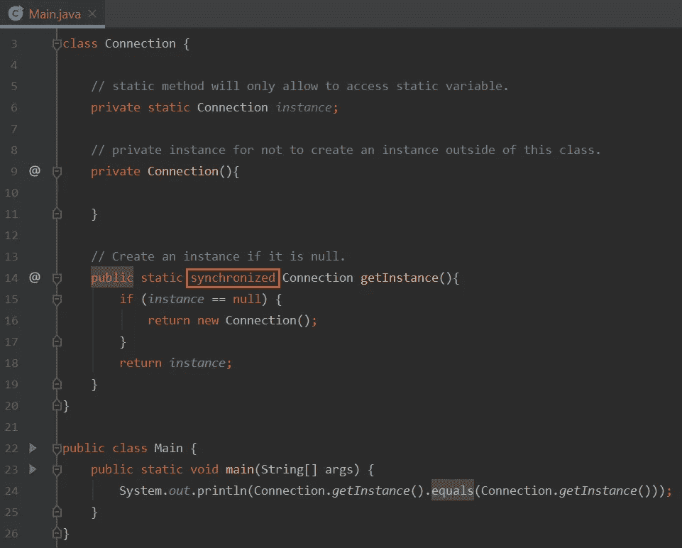

# Java Singleton 是理解起来最重要的特性

> 原文：<https://blog.devgenius.io/java-singleton-is-most-important-feature-to-understand-cca2411047fb?source=collection_archive---------2----------------------->

Singleton 是一种设计模式，其中一个类在每个应用程序中只能有一个实例。

日志记录、驱动程序对象、缓存等。是单例设计模式的一些例子。

单例类在大多数时候会遵循以下三条规则:

1.  它总是有一个**私有默认构造函数**，它永远不允许在单例类之外创建实例。
2.  静态变量来分配实例。
3.  静态方法来访问或单例类外部的单例类实例。

**注意:**单例类将总是返回类的同一个实例。

创建单例实例有两种方法:

**急切加载**是在类加载的时候创建一个实例。

**延迟加载**是在需要的时候创建一个实例。

# 急切装载

按照下面的内联步骤创建急切加载单例类实例。

1.  在第 6 行创建的静态实例变量将在编译或加载时执行。
2.  将默认构造函数声明为 private，这将有助于我们避免在 Singleton 类之外创建实例。
3.  现在，为了访问一个实例，我们需要一个静态方法，因为实例变量和构造函数都是私有的。
4.  返回在第 6 行创建的私有实例变量，作为静态方法的一部分。

输出
真

输出为真，因为这个类是单例的，并且将总是返回相同的实例。

# 惰性装载

按照下面内联的 4 个步骤来创建延迟加载单例类实例。

1.  创建连接类的静态对象。
2.  将默认构造函数声明为 private，这将有助于我们避免在 Singleton 类之外创建实例。
3.  现在，创建静态方法来创建和返回类的一个实例。
4.  返回在第 6 行创建的私有实例变量，作为静态方法的一部分。

输出
真

输出为真，因为这个类是单例的，并且将总是返回相同的实例。

# 线程安全单例类

对于线程安全的单例类，同一时间只有一个线程可以访问单例类实例。

在 **static getInstance()** 方法中添加 **synchronized** 关键字会将上面的惰性加载单例类转换为同步或线程安全单例类，如下图所示，以红色突出显示。

输出
为真

输出为真，因为这个类是单例的，并且将总是返回相同的实例。

我希望你发现这篇文章有趣且内容丰富。请分享给你的朋友来传播知识。

你可以关注我即将发布的博客[关注](https://medium.com/@toimrank)。
谢谢！