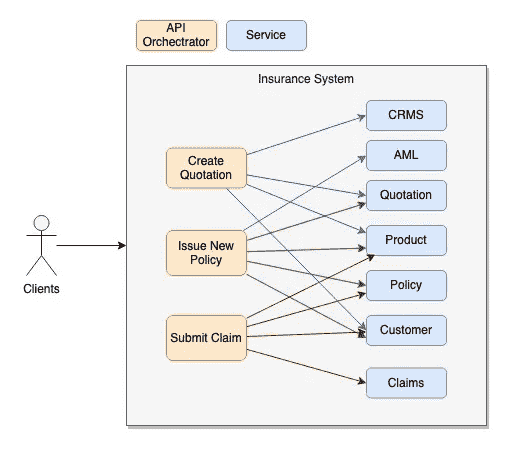
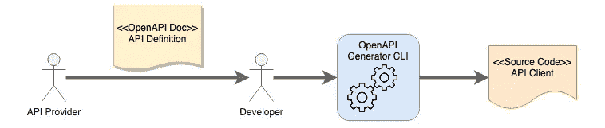
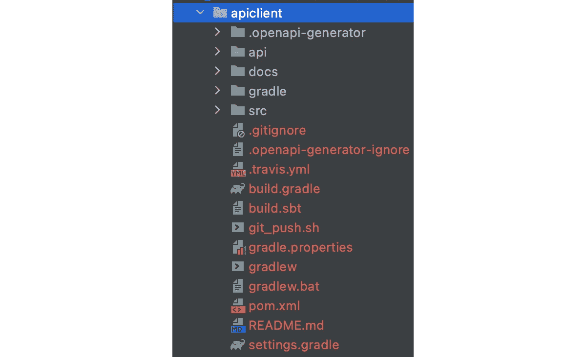
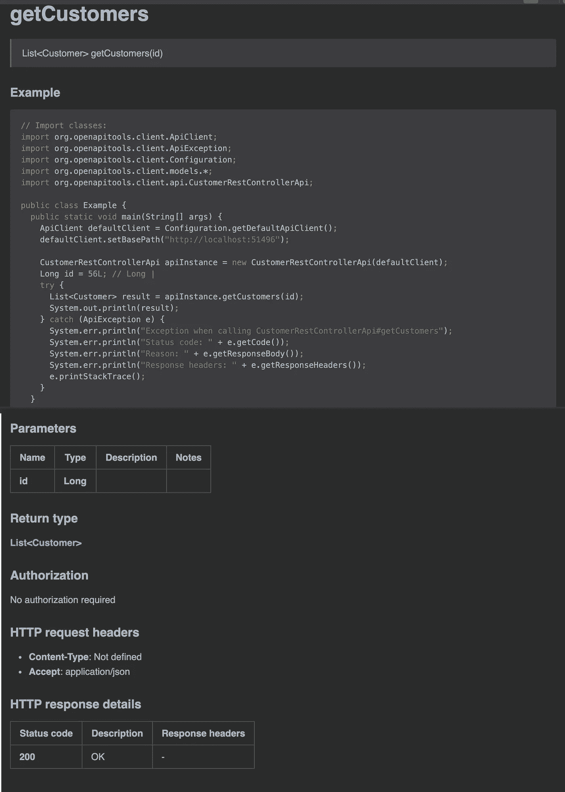
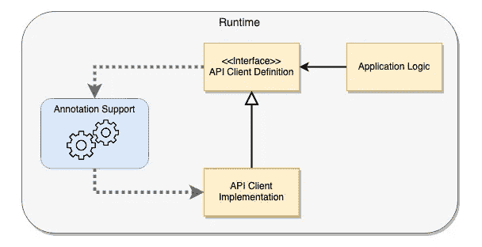

# Java Spring Boot——轻松集成 REST APIs

> 原文：<https://blog.devgenius.io/java-spring-boot-rest-apis-integration-without-hassle-f1130a92253d?source=collection_archive---------0----------------------->

## 让我们探索创建 REST API 客户端的不同方法


夏洛特·哈里逊在 [Unsplash](https://unsplash.com?utm_source=medium&utm_medium=referral) 上的照片

在微服务架构时代，系统基本上是由多个独立的服务组成的。每个服务都是一个独立的单元，负责一个业务领域或逻辑。业务用例通过协调服务之间的输入和输出来执行。

例如，您可以看到下图中的示例保险系统由许多服务组成。每个业务功能都由一个名为 orchestrator 的专用服务来处理，该服务集成并协调底层服务。当涉及到 API 集成的开发时，问题就出现了。因为为 API 消费构建代码需要花费精力，这意味着您将花费时间为所有服务构建客户端代码。更糟糕的是，如果这 3 个业务职能由不同的团队来处理，工作量可能会增加两倍。随着更多业务功能和服务的实现，总工作量可能会呈指数级增长。



基于服务的保险系统示例(我自己创建的图表)

除了编写构建 API 客户端的代码之外，还有其他选项可以加快开发速度并节省您的精力。因此，如果您掌握了为 API 集成创建客户端代码的方法，您就可以轻松有效地完成开发工作。在本文中，我将通过示例代码分享这些方法，这样您将找到适合您的开发的正确方法。

# 有哪些可用的方法？

由于 REST API 的流行，大多数现代 API 都符合某些模式，比如 HTTP 方法和状态代码的使用。使用 JSON 作为通用数据格式，Gson 和 Jackson 等流行的库可用于数据序列化/反序列化。

下面是一个 API 客户端的典型代码片段。第一个是通过客户 id 获取客户记录

另一个例子是通过产品 id 获取产品记录

这两个示例看起来很相似，唯一的区别只是 URL 路径和数据类型。您观察的 API 客户端代码越多，您就越能发现适用于其他方法类型(如 PUT、POST 和 DELETE)的常见模式。

为什么不生成代码而每次都要写呢？也许，你可能有同样的想法。好消息是，在代码开发期间以源代码的形式或者在运行时以动态供应的形式生成 API 客户端是可行的。我将探索以下方法:

*   生成 API 客户端源代码
*   在运行时提供 API 客户端
*   构建您自己的 API 客户端

当然，没有一种解决方案可以放之四海而皆准。选择适合您需求的方法取决于您。

# 生成 API 客户端源代码— OpenAPI 生成器

为了与其他系统集成，在实际编码之前，首先要做的就是达成系统接口协议。对于消费者和提供者来说，对系统如何交互和数据结构有一个共同的理解是必不可少的一步。

使用 [OpenAPI 定义](https://swagger.io/specification/)(原名 Swagger)作为 REST API 的规范，多年来已经成为业界惯例。提供者使用 OpenAPI 定义来记录他们的 API，open API 定义为每个 API 操作指定了 URL 路径、HTTP 方法、输入&输出数据格式。

由于 OpenAPI 定义是 YAML 或 JSON 的格式，规范可由程序代码读取，社区中的人们创建了一个令人敬畏的命令行工具— [OpenAPI 生成器 CLI](https://github.com/OpenAPITools/openapi-generator-cli) ，旨在基于 API 规范生成基于 API 客户端的源代码。



从 OpenAPI 定义生成 API 客户端源代码(自己画的图)

例如，下面的 YAML API 定义是 2 个 API 端点的规范:

*   [GET] /customers/{customerId} —按记录 Id 提取客户记录
*   [POST]/客户—插入新的客户记录

要生成 API 客户端，您需要首先安装生成器 CLI

```
npm install @openapitools/openapi-generator-cli
```

然后运行客户端代码生成命令行

```
openapi-generator-cli -i **<OpenAPI definition file>** -g **<generator>** -o **<location of the generated source code>**
```

要用 java 生成源代码，可以为生成器参数指定“Java”。如果您更喜欢用其他语言生成的 API 客户机，您可以在 generator 参数中指定它。该工具支持多种编程语言，如 javascript、go、ruby 等。该命令行显示了受支持的生成器的完整列表。

```
openapi-generator-cli list
```

生成的 Java 代码是一个独立的 maven 项目，它不仅包含源代码，还包含 markdown 格式的综合文档，并带有显示 API 客户端用法的示例。



OpenAPI 生成器 CLI —生成的 Maven 项目



OpenAPI 生成器 CLI —生成的 API 文档

代码生成器显然对 API 提供者有利，因为该工具可以通过提供不同编程语言的 API 客户端库来帮助他们推广 API，而无需在编码方面付出努力。

从消费者的角度来看，代码生成器的使用节省了 API 客户端的开发工作。然而，生成的客户机只不过是 HTTP 协议处理的逻辑。它不提供配置的灵活性，如超时处理，否则，您将花费精力研究和修改源代码。此外，维护生成的代码会有点麻烦。

如果您正在寻找具有更多功能和与 Spring Boot 更好集成的 API 客户端，那么使用具有运行时供应的声明式 API 客户端将是一个更好的选择。

# 运行时 API 客户端供应— OpenFeign

另一个选择是在程序运行时提供 API 客户端，它利用开源项目 [OpenFeign](https://github.com/OpenFeign/feign) 。这是一个强大的框架，最初是由网飞创建的。

API 客户端被定义为带有注释的 Java 接口，然后 OpenFeign framework 将自动识别接口，并在应用程序启动期间根据注释中指定的配置提供实现。



OpenFeign API 客户端供应(图表由我自己创建)

Spring Boot 提供了一个与 OpenFeign 的奇妙集成，使其对开发人员友好，具有自动配置能力和符合 Spring 编程模型的注释。

让我向您展示如何使用 OpenFeign 进行 Spring Boot 应用程序开发。首先，您需要在 Maven pom.xml 中包含依赖关系

```
<dependency>
  <groupId>org.springframework.cloud</groupId>
  <artifactId>spring-cloud-starter-openfeign</artifactId>
</dependency>
```

然后，通过添加 annotation @EnableFeignClients 来配置 Spring Boot 以启用 OpenFeign 的特性。

好了，现在你可以马上定义一个 API 客户端了。定义 API 客户端的工作简单易行。参考下面的示例 API 客户端，API 客户端有两个接口方法，分别使用 GET 和 POST API 进行客户记录检索和更新。

第一行的 ***@FeignClient*** 注释是声明它是一个 OpenFeign API 客户端。URL 属性将您的客户端指向 API 端点。请注意，在启用了服务发现的环境(如 Enreka)中，可以省略 URL 属性，因为 OpenFeign API 客户端能够通过名称自动查找 API 端点。

```
[@FeignClient](http://twitter.com/FeignClient)(name = "customer-srv", url = "[http://localhost:8103](http://localhost:8103)")
public interface CustomerSrvClient { ....}
```

如果您习惯于使用 Spring framework 构建后端控制器，您可能会发现这些注释与后端 API 的注释非常相似。这就是 Spring 框架的魅力所在，Spring 开发团队设计集成的方式是将相同的注释应用到 OpenFeign 客户端。因此，开发人员可以快速掌握用法并构建 API 客户端，而无需花费时间学习新的注释。

Spring 在运行时使用 ***@Autowired*** 自动将 OpenFeign API client 的实现类注入到应用程序代码中，就好像一个原始组件一样。

## **高度可配置**

OpenFeign 是高度可配置的，它的行为可以作为 Spring Boot 应用程序的一部分进行定制

*   连接超时
*   请求/响应时的数据压缩
*   底层 HTTP 客户端的选择— Apache HTTP 客户端、Apache HTTP 客户端 5、OK HTTP 客户端

如果您有兴趣了解更多信息，请参考[配置属性](https://docs.spring.io/spring-cloud-openfeign/docs/current/reference/html/appendix.html)列表。

## **无功支援**

尽管 Spring open 在编写时假装是一个阻塞的客户端，但是 Spring 团队建议开源项目[假装反应](https://github.com/Playtika/feign-reactive)作为一种在 Spring 特性可用之前启用非阻塞 API 客户端的方式。

只需不到一分钟的时间，您就可以将现有的 OpenFeign 客户端转换为非阻塞客户端。首先，加入反应性佯 maven 依赖。

```
<dependency>
  <groupId>com.playtika.reactivefeign</groupId>
  <artifactId>feign-reactor-spring-cloud-starter</artifactId>
  <version>3.0.0</version>
  <type>pom</type>
</dependency>
```

接下来，将头标注从 ***@FeignClient*** 切换到***@ reactivefeign client***。对于反应式实现，所有方法的返回数据类型都将包装在 Flux / Mono 中，而***@ request mapping***注释保持不变。一切都结束了！

使用 OpenFeign 的 API 客户端实现是一种非常好的方法，与使用 API 客户端生成器相比，它提供了更多的灵活性和额外的特性。然而，它可能无法满足所有要求。例如，它不支持 API 响应和重试的缓存。因此，您最后的办法是构建自己的 API 客户端。

# 构建您自己的 API 客户端

如果 API 客户端生成器和 OpenFeign 不符合你的需求，那么编码 API 客户端是你唯一的选择。幸运的是，有现成的 web 客户端库可供您使用。我将演示流行的 web 客户端库——Spring Web Client 和 OK HTTP Client 的使用。

## Spring WebClient

很长一段时间以来， ***RestTemplate*** 一直是 Spring 框架中的标准 web 客户端，但是，请注意，对于新的开发不再推荐使用 ***RestTemplate*** ，因为 Spring 团队已经将他们的重点转移到一个名为 ***WebClient*** 的 HTTP 客户端的非阻塞版本。

***WebClient*** 的设计很直观，你很快就能学会它的用法。下面的示例代码展示了如何提交 GET 和 POST 请求。 ***WebClient*** 是一个使用 Reactor Core API 实现的非阻塞 HTTP 客户端，这意味着所有的返回数据都包装在 Mono 或 Flux 数据类型内。

如果您的应用程序不支持异步进程，那么 block()方法是一种将非阻塞进程转换为阻塞进程的方法，因为该方法会一直等到获得数据。

由于 ***WebClient*** 基于 Reactor Core 构建，支持重试等多种特性。下面的客户记录检索示例代码演示了重试的机制。使用 reryWhen()语句， ***WebClient*** 最多重试 3 次，时间间隔分别为 3 秒、6 秒和 9 秒。可以访问[网站](https://projectreactor.io/)了解更多。

**HTTP GET —获取客户记录**

**HTTP POST —保存客户记录**

## OK HTTP 客户端

越来越多的人在谈到 web 客户端开发时，会谈到 OK Http Client 的使用。根据[对 Java Http 客户端库](https://www.mocklab.io/blog/which-java-http-client-should-i-use-in-2020/)的比较，似乎 Http 客户端提供了所有 Java Http 客户端中最多的特性。因此，它值得我们关注，这里是客户记录检索和提交的示例代码，供您快速参考

**HTTP GET —获取客户记录**

**HTTP POST —保存客户记录**

# 最后的想法

REST API 消费是现代系统中最常见的集成模式。除了为每个服务编写 API 客户端代码之外，代码生成和运行时供应是自动化 API 客户端创建的重要选项，可以节省您大量的开发工作。

对于 Spring Boot 应用程序开发来说，使用 OpenFeign 是一个非常值得推荐的选择，因为它与框架的集成对开发人员来说非常友好。API 客户端的创建非常简单，注释与 Spring web 控制器非常相似。尽管如此，OpenFeign client 支持自动服务发现，使其成为云微服务部署的理想 API 客户端。