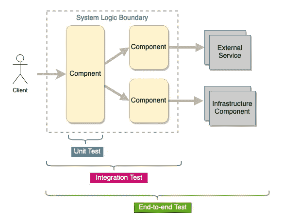
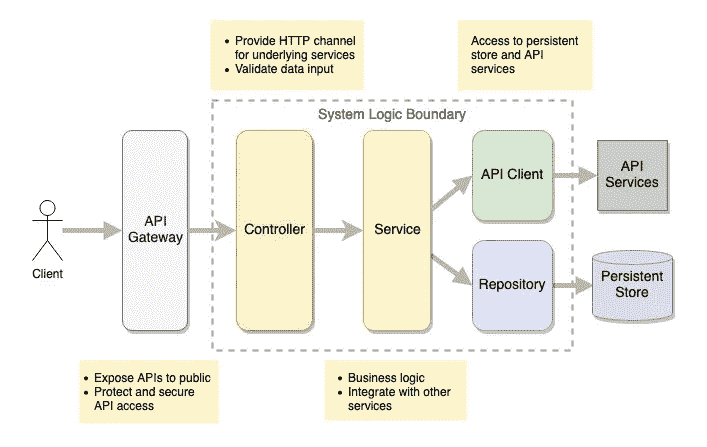
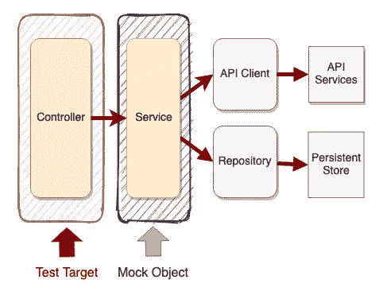
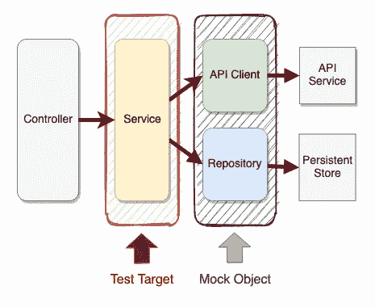
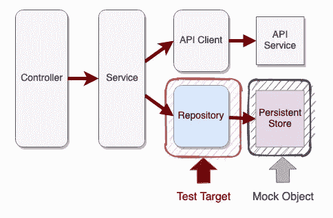
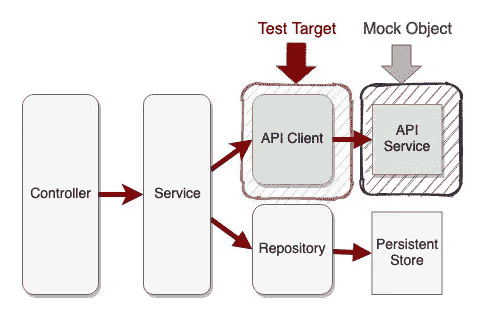
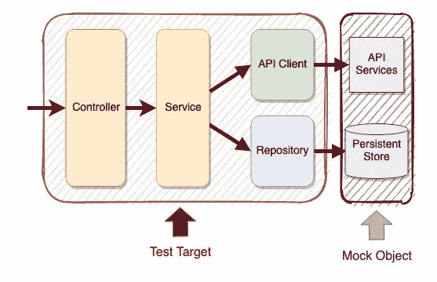
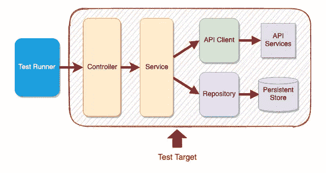

# Java Spring——现代软件质量保证的最佳实践

> 原文：<https://blog.devgenius.io/java-spring-the-best-practice-of-modern-software-quality-assurance-e5aa66466627?source=collection_archive---------0----------------------->

## 确保软件质量的全面指南

肖恩·奥尔登多夫在 [Unsplash](https://unsplash.com?utm_source=medium&utm_medium=referral) 上拍摄的照片

没有经过测试就没有高质量的软件。交付有缺陷的软件不仅没用，而且是浪费精力，只会损害个人和公司的声誉。因此，在通常的项目管理实践中，项目成本的大部分被分配给质量保证。一些公司甚至成立了专门的团队，专门负责所有类型的测试。

然而，并不是每个人都热衷于做测试。不知何故，测试是一项枯燥的工作，因为它涉及乏味和重复的任务——坐在屏幕前，根据测试脚本遵循步骤，键入数据并记录结果。当你再次重复相同的测试用例来验证一个 bugfix，但仍然失败时，你可能会感到失望，认为这是浪费你的时间。

如今，在软件开发行业中，许多人利用机器人来执行测试用例以运行测试。得益于机器的高执行速度，它极大地提高了生产率，因为运行一整套测试用例所需的时间可以从数周缩短到数小时。

即使现在的机器可以帮助你完成测试工作，如果没有合适的测试方法，硬件什么也做不了。你需要一个策略来有效地测试你的软件。在这篇文章中，我将与你分享测试的结构，并通过一个 Spring Boot 应用程序的例子来说明测试的概念。

## **需要更早地测试你的代码**

想象一下，你的任务是建立一个电子商务门户，你夜以继日地努力工作，最后你完成了所有的编码。您确定您的门户可以正常工作，将产品放入购物车并成功发布付款交易吗？如果您在开发过程中不运行任何测试，成功的机会很低。如果出现任何问题，你需要付出巨大的努力来检查每个组件，并寻找根本原因。

原因是系统是由许多组件组成的。系统功能在很大程度上依赖于每个组件的功能和相互之间的正确交互。因此，您将对您的系统更有信心，因为您已经单独测试了每个组件，以确保每个组件作为开发的一部分都工作良好。

## **左移**

事实是，我们越早发现开发生命周期中的缺陷，修复它的成本就越低。有人称这种战略为“左移”。在从开始(左)到结束(右)的软件开发周期中，我们不是在开发结束时进行测试，而是将测试活动移到左边，以便作为编码的一部分更早地进行测试。

## 测试方法

测试方法是首先验证每个组件，然后检查整个系统，最后连同外部服务基础设施组件一起测试一切。

1.  **单元测试** —验证每个单独组件的行为。
2.  **集成测试** —在不插入外部组件的情况下，整体检查系统功能。
3.  **端到端测试** —测试系统以及所有基础设施组件和外部服务。

测试方法(我自己创建的图表)

# Spring Boot 应用程序示例——外汇交易 API

让我通过一个示例 WebFlux Spring Boot 应用程序向您展示它是如何工作的。这是一个简单的 API 服务，允许客户进行外汇交易。如果您对使用案例和技术设计感兴趣，可以参考下面的链接:

 [## spring——一种在定义良好的结构中构建生产就绪 API 的更快方法

### 以可维护且一致的结构构建您的应用程序

medium.com](https://medium.com/dev-genius/spring-a-faster-way-to-build-production-ready-api-in-a-well-defined-structure-5b1730fa81dd) 

这个示例应用程序是基于分层架构构建的。传入的 API 请求到达一个控制器，该控制器翻译 HTTP 协议并调用底层服务来执行业务逻辑。服务组件运行业务逻辑，并与其他服务和存储库集成以实现业务功能。

外汇交易服务—组件图(自己创建的图)

该应用程序使用由 *api.exchangeratesapi.io* 提供的 API 来获取最新的汇率。

 [## 带货币转换的外汇汇率 API

### 获取最新的外汇参考汇率。获取 https://api.exchangeratesapi.io/latest HTTP/1.1 获取…

www.exchangeratesapi.io](https://www.exchangeratesapi.io/) 

## **Github 库**

您可以在我的 Github 资源库中获得整个应用程序的源代码以及测试代码:

 [## gavinklfong/无功-弹簧-外汇-贸易

### 创建这个库的目的是展示 Spring framework 的主流非阻塞技术…

github.com](https://github.com/gavinklfong/reactive-spring-forex-trade) 

# **单元测试**

当谈到 Java 技术领域的测试自动化时，JUnit 是事实上的框架。如果你已经掌握了如何单独测试组件的关键概念，那么自动化测试用例的开发是简单的。

将组件隔离是单元测试的主要思想，目的是通过模拟所有依赖组件和外部服务来验证目标组件的系统逻辑。

## **控制器—验证 HTTP 接口的行为**

控制器负责处理 HTTP 协议，并调用服务组件来执行业务逻辑。目的是验证控制器是否可以正确地公开 API，将传入的 HTTP 请求转换为 Java 数据对象，调用服务组件，然后以 JSON 格式返回响应。

单元测试—控制器(我自己创建的图)

查看下面的源代码，我们利用 Spring 测试框架和 Mockito 库来模拟使用 **@MockBean** 注释的贸易服务。我们设置了模拟对象的预期输入和输出。然后，Spring framework 将模拟 bean 注入控制器，就像一个真实的 bean 对象一样。因此，我们可以模拟不同的场景来验证控制器的行为是否符合预期。

Spring Boot 应用程序上下文将包含许多组件，为每个测试用例加载一个完整的 Spring Boot 应用程序上下文确实需要时间。相反，您可以通过使用注释 **@WebFluxTest** 为目标控制器类加载一部分 Spring 上下文来加快测试的执行。

样本代码—控制器单元测试

## **服务——验证核心业务逻辑**

同样的技术可以应用于服务组件的单元测试。这一次，我们需要模拟一些 beans 作为汇率服务，例如，依赖于客户库、汇率库和外汇汇率 API 客户端。

单元测试—服务(我自己创建的图)

**@SpringJUnitConfig** 和 **@ContextConfiguration** 有助于部分加载 Spring 上下文，用于测试服务组件。

样本代码—服务单元测试

## **存储库——内存数据库的使用**

储存库是通向持久存储的桥梁。它抽象出了数据访问的实现细节。Spring JPA 使得数据访问的实现简单得可笑，你可以定义扩展 Spring 接口 **CrudRepository** 的接口。然后，Spring 将在运行时生成实现。因此，除非您有自定义的数据访问查询，否则不需要单元测试。

在这个例子中，我们有一个定制的查询方法 **findByCustomerId()** ，它按照客户 Id 检索交易列表。因此，我们的单元测试就是为了验证这种方法。

单元测试—存储库(我自己创建的图表)

在分层体系结构中，除了底层持久存储之外，存储库通常不依赖于其他组件。我们使用 H2 内存数据库来模拟数据存储，当加载测试用例时，用测试数据初始化数据存储。

**@DataJpaTest** 加载部分 Spring 上下文用于 JPA 测试，而 **@Sql** 指定 Sql 文件用于测试数据加载。

样本代码—存储库单元测试

## **API 客户端——模拟 API 服务器的使用**

类似于 H2 内存数据库，模拟 api 服务器是模拟外部 API 服务的有用工具，它对 API 客户端是透明的，因为测试用例设置在测试用例初始化期间将客户端指向模拟服务器。

单元测试— PI 客户端(我自己创建的图表)

这个模拟服务器功能强大且易于使用，它提供 Maven 集成、Spring 集成，并接受 OpenAPI 规范进行模拟设置。如果你想了解更多，请点击这里的链接。

 [## 模拟服务器

### 对于您通过 HTTP 或 HTTPS 集成的任何系统，MockServer 可以用作:一个配置为返回特定…

www.mock-server.com](https://www.mock-server.com/) 

这个示例代码展示了如何使用注释 **@MockServerTest** 与模拟服务器集成。您不需要担心端口冲突，因为模拟服务器会自动选择一个未使用的端口，然后端口号可以被注入到 API 客户端的单元测试代码中，以指向模拟服务器供 API 使用。

下面的代码利用 OpenAPI 规范“getLatestRates.json”进行模拟，它指定 operation id“getlatestates”作为请求匹配器，并使用状态代码为“200”的示例响应作为模拟响应。

示例代码—外汇 API 客户端单元测试

你可以在 OpenAPI spec 文件中看到示例数据，这些数据被用作 API 模拟响应。

使用示例数据获取最新费率的 OpenAPI 定义

# **集成测试**

在这里，我们将集成测试称为整个系统的测试，同时模拟所有外部依赖系统和基础设施组件。基本上，目的是验证系统在组件连接在一起时是否正常工作。

集成测试(我自己创建的图表)

当整个系统启动测试时， **@SpringBootTest** 注释被用来加载一个完整的 Spring 上下文，其中包含随机未使用的端口。系统将指向用于持久存储的内存中的 H2 数据库，并使用模拟 API 服务器来代替真正的外部 API 服务。

由于控制器是接收测试请求的入口点，集成测试用例将覆盖所有控制器的 API 端点。

样本代码—速率控制器集成测试

# **端到端测试**

恭喜你！在您完成单元测试和集成测试之后，系统已经为最终测试做好了准备。端到端测试是将真实的外部系统连接到目标应用程序。因此，我们将把外汇汇率 API 客户端指向外部 API 服务，并将 H2 内存数据库替换为 MySQL 服务器的持久性存储。

测试用例运行程序可以是一个 HTTP 客户端，它向端点提交请求并断言响应。更重要的是，端到端测试的准备工作是确保外部系统启动并运行测试数据。

# 最后的想法

由于测试框架和模拟工具的进步，如今开发人员可以更容易地实现自动化测试。在机器为我们运行测试用例的帮助下，开发人员可以频繁地运行测试，以便在开发的早期发现任何可能的缺陷或中断的更改，从而提高质量并降低开发成本。

软件测试的核心概念是隔离组件进行测试，测试范围从单元测试、集成测试发展到端到端测试。由于这种技术与编程语言无关，您可以应用测试方法，而不仅限于 Java 技术，还可以应用其他技术，如 Node JS、React JS 和 Python。

## Github 知识库

您可以在我的 Github 资源库中获得整个应用程序的源代码以及测试代码:

 [## gavinklfong/无功-弹簧-外汇-贸易

### 创建这个库的目的是展示 Spring framework 的主流非阻塞技术…

github.com](https://github.com/gavinklfong/reactive-spring-forex-trade)