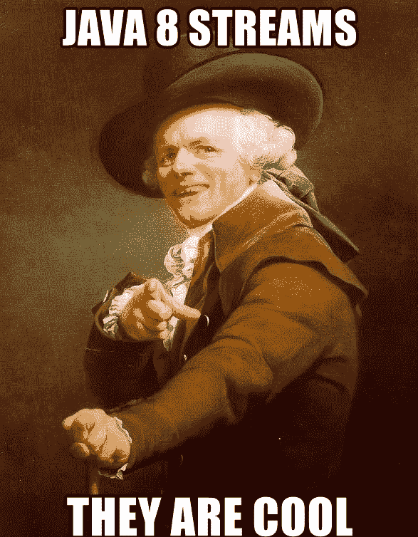

# Java 流

> 原文：<https://blog.devgenius.io/java-streams-43e6361dbba3?source=collection_archive---------4----------------------->

**“啊 Sh**** ！**又来了”**这是我每次看到有人用流代替循环时的反应。

Java 8 有很多特性，其中最受欢迎的是 lambdas 和 Java stream API。许多团队升级到 Java 8 只是为了利用甜蜜的 lamdas。然而，我注意到自己和许多其他人使用 Java 8 或更高版本，不包括 Streams API。
让我们试着理解溪流。

随机[迷因](http://memegenerator.net/)来自[memegenerator.net](http://memegenerator.net/)

# 什么是流？

流表示从源派生的一系列对象，可以在这些对象上执行聚合操作。

好的，它们和收藏品有什么不同？

当我们开始在网飞或 Youtube 上观看视频时，视频的一小部分首先被加载，然后播放。我们不必下载完整的视频就可以开始观看。这被称为*流*。这个类比帮助我们区分 Java 流和 Java 集合。

***集合*** 是内存中的数据结构。每个元素在添加到集合之前都需要计算。 ***流*** 是一种固定的数据结构，其中的元素是按需计算的。

流的存在是为了从源提取数据，处理数据，并将数据推送到目的地。源可以是集合、阵列或 I/O 资源。

流的剖析定义为:

1.  获取来源(source)
2.  流程(中间操作)
3.  得到结果(终端操作)

# 如何获取一个流？

嗯，有相当多的选择

1.  **(val 1，val2，…)**
2.  **List.stream()**
3.  **(arrayOfElements)**
4.  **字符串字符**或**字符串令牌**

从源获取流

# 流操作

*   中间操作是转换或过滤流中数据的操作。中间操作总是返回一个新的流。
*   终端操作是返回单个值的操作。

流水管道

让我们先构建一个集合，看看操作是如何进行的。

初始收集(我们的来源)

## **中间操作**

1.  **Stream.filter()**

。过滤器()

**。stream()** 从源(numbers list)获取流。
**。filter()** 提供了过滤掉所有长度超过 3 的字符串的条件。
*作为一个中间操作，这使我们能够调用另一个流操作(本例中为 forEach)*
**。forEach()** 也是一个中间操作，为流中的每个元素调用 print 函数。

> **输出:** 三
> 四
> 五

2. **Stream.map()**

。地图()

**。map()** 使用给定的函数将每个元素转换成另一个对象。在这个例子中，它将每个字符串转换成大写的字符串。

> **输出:
> 三**四
> 五

3. **Stream.sorted()**

。已排序()

**。sorted()** 创建一个排序的流。 ***但是，它不对数字列表进行排序。***

> **输出:** 五
> 四
> 三

## ***终端操作***

终端操作返回一个值而不是一个流。

1. **Stream.forEach()**

。过滤器()。forEach()

**。forEach()** 遍历流中的所有元素，并对每个元素执行一些操作。该操作作为参数传递给函数。

> **输出:** 三
> 四
> 五

2. **Stream.collect()**

。收集()

**。collect()** 方法是一个终端操作，它启动元素的内部迭代，并将流中的元素收集到任何数据类型的集合或对象中。

> **输出:** 【一、二、三、四、五】

3. **Stream.match()**

。匹配()

> **输出:** 真
> 假
> 假

更多流操作参考文件。

# 流的模式

执行模式是流的一个属性。最初选择顺序或并行执行来创建流。
*collection . stream()*创建顺序流，*collection . parallel stream()*创建并行流。

我们用一个例子来理解这个。让我们创建一个整数列表。

流的模式

> **输出:** 输入列表= [0，1，2，3，4，5，6，7，8，9]

> **输出:** 线程=主
> 线程=主
> 线程=主
> 线程=主
> 线程=主
> 串行流= [0，2，4，6，8]

> **输出:** Thread = main
> Thread = forkjoinpool . common pool-worker-19
> Thread = forkjoinpool . common pool-worker-27
> Thread = forkjoinpool . common pool-worker-5
> Thread = forkjoinpool . common pool-worker-9
> 并行流= [6，2，0，8，4]

**BaseStream.isParallel()** 方法用于检查是否要执行一个终端操作，是否会并行执行？

> **输出:**
> 是串行流并行:假
> 是并行流并行:真

如果需要，稍后可以使用 **sequential()** 将流转换为顺序模式，或者使用 **parallel()** 方法将流转换为并行模式。

# 资源

*   [Java 文档](https://docs.oracle.com/javase/8/docs/api/java/util/stream/Stream.html)
*   Baeldung 博客
*   [詹科夫博客](http://tutorials.jenkov.com/java-functional-programming/streams.html#terminal-and-non-terminal-operations)