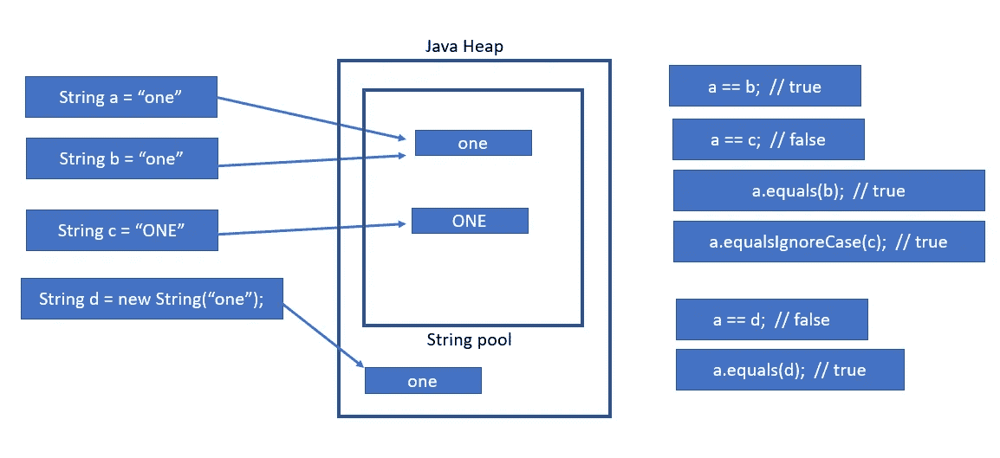

# Java 字符串和字符串池

> 原文：<https://blog.devgenius.io/java-string-and-string-pooling-2ed4b4b39d31?source=collection_archive---------10----------------------->

# 线

字符的集合称为字符串。字符串是不可变的，这意味着它不能被改变，在内部它存储在 char 数组中。String 属于 java.lang 包。

创建字符串的方法:

1.  **字符串文字:**

下面是创建字符串对象的最常见的方法。

字符串对象像在字符串池中一样存储在堆内存中。Java 字符串池就是存储在堆内存中的字符串集合。在创建每个字符串对象时，字符串池首先检查字符串池中是否存在相同的字符串。如果字符串池中存在字符串，它将返回引用，否则将创建一个新对象。

String str = "这是我的第一个博客"；

**2。带新运算符的字符串:**

用 new 关键字定义的字符串不会检查该值是否存在于字符串池中。每次 new 关键字都会在字符串池中创建一个新的引用和新鲜对象。

String str = new String("这是我的第一篇博客")；

如下图所示，使用字符串文字的字符串创建值**和**将在字符串池中创建。如果程序试图创建一个全新的字符串，其值为**，使用字符串文字的一个**将指向字符串池中的相同字符串值。

使用与上述**和**具有相同值的新运算符创建的字符串不会作为字符串池的一部分创建，将始终指向新位置。



# String 类中重要且最常用的预定义方法:

## 字符串长度:

字符串长度可以在 length()方法的帮助下确定，并返回字符数作为结果。

```
String a = "three";
System.out.println(a.length());**OUTPUT:** 
5
```

## 大写()和小写():

方法会将字符串转换成完整的小写和大写。

```
String a = "Three";
System.out.println(a.toLowerCase());
System.out.println(a.toUpperCase());**OUTPUT:**
three
THREE
```

## Equals()和 equalIgnoreCase():

**Equals() - >** equals 方法不忽略大小写，为我们提供了比较两个字符串并返回 true 和 false 结果的能力。

**equalIgnoreCase()->**equals 方法忽略大小写，为我们提供了比较两个字符串并返回 true 和 false 结果的能力。

```
String a = "ONE", b = "One";
System.out.println(a.equals(b));
System.out.println(a.equalsIgnoreCase(b));**OUTPUT:**
False
True
```

## charAt():

这将返回方法中传递的特定字符的第一个匹配项。

大多数时候，我们会弄不清第一个字符是在 charAt(0)还是 charAt(1)之间。这总是从零索引开始。

```
String a = "Hello World";
System.out.println(a.charAt(6));**OUTPUT:**  
W
```

注意:Java 从零开始计数，它也计算空白。

## indexOf()和 lastIndexOf():

**indexOf() :** indexOf 方法将返回单词的位置和第一次出现的位置。

**lastIndexOf():**lastIndexOf 方法将返回函数参数中给定的单词的位置和最后一次出现的位置。

```
String str = "the is my home. home sweat home";
System.out.println("Index Of "+str.indexOf("home"));
System.out.println("Last Index Of "+str.lastIndexOf("home"));**OUTPUT:**
Index Of 10
Last Index Of 27
```

# 字符串串联:

在 Java 中，运算符重载只能用于字符串。使用+(加)运算符，我们可以连接两个字符串。

```
String a = "Hello ", b = "World";
System.out.println(a + b);**OUTPUT:**
Hello World
```

## Concat():

串联也可以借助于字符串预定义函数 concat()来完成。

```
String a = "Hello ", b = "World";
System.out.println(a.concat(b));**OUTPUT:**  
Hello World
```

## 包含():

这个函数检查字符串是否包含子串。如果找到子串，它将返回 true，否则返回 false。这也将检查是否区分大小写。

```
String a = "Hello World";
        System.out.println("hello = "+a.contains("hello"));
        System.out.println("Hello = "+a.contains("Hello"));OUTPUT:
        hello = false
        Hello = true
```

## endsWith():

如果字符串以传递的子字符串结尾，将返回 true。

```
String a = "Hello World";
System.out.println("World = "+ a.endsWith("World"));
System.out.println("world = "+ a.endsWith("world"));OUTPUT:
World = true
world = false
```

## 开始于():

如果字符串以传递的子字符串开始，将返回 true。

```
String a = "Hello World";
System.out.println("Hello = "+ a.startsWith("Hello"));
System.out.println("hello = "+ a. startsWith("hello"));OUTPUT:
Hello = true
hello = false
```

我希望你发现这篇文章有趣且内容丰富。请分享给你的朋友来传播知识。

您可以关注我即将发布的博客[关注](https://medium.com/@toimrank)。
谢谢你！