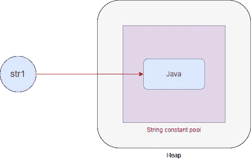
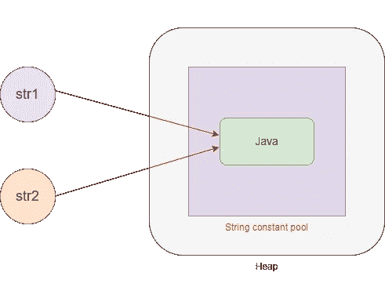
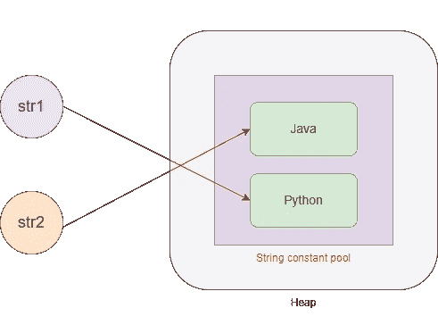
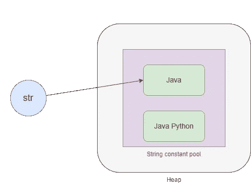

# Java 字符串是不可变的——它实际上意味着什么？

> 原文：<https://blog.devgenius.io/java-string-is-immutable-what-does-it-actually-mean-6c7e9194a007?source=collection_archive---------5----------------------->


由 [Merlene Goulet](https://unsplash.com/@merlenegoulet?utm_source=unsplash&utm_medium=referral&utm_content=creditCopyText) 在 [Unsplash](https://unsplash.com/s/photos/java?utm_source=unsplash&utm_medium=referral&utm_content=creditCopyText) 上拍摄的照片

" Java 字符串是不可变的."是 Java 世界中一个众所周知的流行说法。但是为什么会这样呢？我们来探索一下。

简单地说，字符串是不可变的意味着一旦我们创建了一个字符串变量，我们就不能修改它。Java 中的对象是在堆内存中创建的。所以字符串对象也是在堆中创建的。但是事情是这样的，Java 中有一个特殊的内存区域来存储字符串，称为**字符串常量池**。

假设我们创建一个字符串变量，如下所示。

```
String str1 = "Java";
```

这就是它在内存中的存储方式。



引用存储在一个叫做堆栈的内存区域。因此“**str”**将被放入堆栈中，“ **Java** ”将被存储在字符串常量池中。而 **str1** 指的是 string 对象 **Java** 。

现在，如果我们添加具有相同值“ **Java** ”的 **str2** 变量，会发生什么？会不会创建另一个对象为" **Java"** 来引用 **str2** ？

```
String str1 = "Java";
String str2 = "Java";
```

实际上没有。str2 还将引用堆内存中的同一个字符串对象" **Java"** 。无论使用已经包含在字符串常量池中的同一个字符串对象创建多少个变量，它都将始终引用同一个字符串对象。



那么把变量 **str1** 赋给一个新的字符串为“ **Python** ”怎么样？对象“ **Java** ”会被“ **Python** ”替换吗？

```
String str1 = "Java";
String str2 = "Java";
Str1 = "Python";
```

将创建一个新的字符串对象“ **Python** ”，并引用 **str1** 。 **str2** 还在引用“ **Java** ”。



想想这个。字符串“ **Java** ”没有被新字符串“ **Python** ”替换。所以，这里改变的是引用，而不是实际的对象。这就是为什么字符串是不可变的。一旦我们创建了一个字符串对象，我们就不能改变它。

让我们也从不同的角度来看这个问题。

让我们有一个字符串作为“ **Java** ”。然后我们使用 concat()方法将" **Python** "连接到它。

```
String str = "Java";
str.concat(" Python")
System.out.println(str);
```

你期望结果会是什么？是不是要打印“ ***Java Python*** ”。

让我们来看看它是如何存储在内存中的。然后你会意识到将要发生什么。



在字符串常量池中会创建一个新的字符串对象“***”Java Python***”。但是“Java”字符串对象没有发生任何变化，并且 **str** 仍然在引用它。所以输出会是“ **Java** ”而不是“ **Java Python** ”。

同样，这意味着我们不能改变字符串对象。

## Java 字符串禁止可变性吗？

实际上没有。借助 Java 中的 StringBuffer 和 StringBuilder，我们可以拥有可变字符串。

## 但是为什么 Java 字符串是不可变的呢？

最大的好处是同一个字符串对象将被多个引用共享。这可以节省大量内存，从而有效利用内存。

感谢阅读。希望这对您有所帮助！