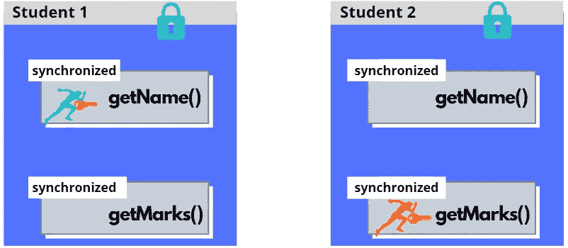

# Java 同步——第 2 部分

> 原文：<https://blog.devgenius.io/java-synchronization-part-2-2101e9620017?source=collection_archive---------20----------------------->


# 竞态条件

欢迎回到 JAVA 同步！希望你看过我之前的[文章](https://medium.com/@sachinthahewawasam_20059/java-synchronization-part-1-abcabac56cf7)。

说起**的种族状况，**是什么？当我们必须同时访问某些数据时，就会出现竞争情况。好吧，那么并发访问数据是什么意思？这仅仅意味着两个不同的线程可能会读取同一个变量或同一个 Java 类中定义的同一个字段，甚至是同一个数组。让我们以这个流行的设计模式“Singleton”为例，看看这里的竞争条件是如何发生的。

```
public class Singleton{
    private static Singleton *instance*;
    private Singleton() {}
    public static Singleton getInstance() {
        if(*instance* == null) {
            *instance* = new Singleton();
        }
        return *instance*;
    }
}
```

两个线程正在尝试执行此代码块。考虑这样一种情况，线程 1 (T1)在“if”块中暂停，然后 T2 启动并继续运行，并完成“if”块，创建“静态单例实例”，然后 T1 启动并销毁由 T2 创建的“静态单例实例”。

> 那么，如何才能防止这种情况发生呢？正是**同步**防止了一个代码块同时被多个线程执行。

```
public class Singleton{
    private static Singleton *instance*;
    private Singleton() {}
    public static synchronized Singleton getInstance() {
        if(*instance* == null) {
            *instance* = new Singleton();
        }
        return *instance*;
    }
}
```

所以同步会拯救世界，对吗？是的，会的。现在让我们通过一个图表来看看它的作用。也就是；**同步**键如何保护方法。

这里我提供了一些图像，以便更好的可视化。“人”将代表一个线程。看看这个人是如何索要钥匙并进入方法的，以及他们在离开之前是如何归还钥匙的。以便其他人(即线程)必须等待获取密钥。很简单的机制，对吧？


事实上，我已经解释过，我们需要一个对象来保存同步工作的密钥。在上面的例子中，我们将 synchronized 关键字放在了**公共静态方法上。那么在这种情况下，JVM 用什么来处理锁呢？它的 **Singleton.class** 对象。同样，在非静态方法的同步中，它使用它所在的特定实例作为同步对象。**

```
public synchronized String getName() {
        return *this.name*;
    }
```

# 让我们使用一个显式对象来进行同步

我们可以使用一个显式对象来进行同步，如下面的代码块所示。可以，只有对象类本身就够了。我想你已经知道原因了。我们可以不同步“getName()”方法，而是在这个方法中使用 synchronized 块，并将这个 key 对象作为这个 synchronized 关键字的参数传递。请记住，这总是一个好主意！

```
public class Organization {
    private final Object key = new Object();
    public String getName() {
        synchronized(key) {
            //do something
        }
    }
}
```

# 同步多个方法

假设我们有一个包含两个同步方法“getName()”和“getMarks()”的学生类。JVM 使用的锁对象是学生对象本身。所以当一个特定的线程想要执行" getName()" **，**时，它会取锁对象，从而防止另一个线程同时执行" getName()" **，**方法。因为我们没有在方法的同步上声明任何显式对象，所以将使用相同的对象键。现在你可以理解，为了同时(独立地)执行这两个方法，我们需要在**学生**类中创建两个锁对象，并同步来自这两个锁的两个代码块(两个不同的对象)。

现在假设我们有两个**学生**类的实例，**学生 1，**和**学生 2。**同步多个方法将使用两个键锁定对象。


对于执行" getName()" **Studnet1** 对象的线程，不阻止线程执行 **Studnet2** 对象中的" getMask()"。



并且不会干扰另一个线程执行 **Student2** 对象中相同的“getName()”方法。我认为这些图片非常有助于理解这一点。


那么，如果我们想防止两个线程在所有的 **Student** 类实例中同时执行这个“getName()”方法呢？

> 现在你很清楚我们需要一个不绑定到我们的学生类的任何实例的锁对象。，而是对类本身对吗？那么它必须是类的静态字段。


到目前为止，您可以理解执行**Student 1 "**getName()"同时持有键的线程将阻止其他线程执行 **Student2** 实例中的 **Student** 类的方法。


# 锁是“可重入”的吗？

再想想我们有两个**学生**类的实例，有多个**同步的**块。

> 同样的钥匙一定能打开同样的锁，对吗？


这两个实例中的“方法 1()”和“方法 3()”由同一个**红色锁**保护，您需要完全相同的**红色钥匙**。同样“方法 4()”和“方法 1()”。因此，在 **Studnet1** 对象中运行“method1()”的线程获得了密钥，并且在某个时候，它将进入 **Studnet2** 实例中的同步“method3()”。因为它已经持有正确的密钥，所以运行另一个方法是受欢迎的。

> 当一个线程持有一个锁时，它可以进入一个与它持有的锁同步的块。

感谢您阅读本博客！你有什么改进这篇文章的建议，请告诉我你的回复。