# Java 虚拟机体系结构

> 原文：<https://blog.devgenius.io/java-virtual-machine-architecture-9009d864fc72?source=collection_archive---------2----------------------->


图片:www.techgeekbuzz.com

作为一名 Java 开发人员，理解 Java 虚拟机(JVM)是如何工作的非常重要。在本文中，我将简要介绍 JVM 及其工作原理。

## 什么是 Java

Java 是一种编程语言，由 Sun Microsystems 于 1995 年发布。它用于开发桌面和移动应用程序、大数据处理、嵌入式系统等等。

在深入 Java 虚拟机(JVM)之前，我们必须首先了解 Java 开发工具包(JDK)、Java 运行时环境(JRE)和 JVM 之间的区别。

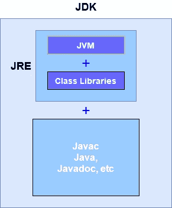

JVM、JRE 和 JDK 之间的关系

## Java 开发工具包(JDK)

JDK 是开发 Java 应用程序所需的软件开发工具包。它包含 JRE 和一些开发工具，如 JavaDoc、Javac、Java Debugger 等。

## Java 运行时环境

JRE 是 JDK 的一部分，它创建了运行 Java 应用程序的环境。JRE 包含 Java 类库、Java 虚拟机(JVM)和运行 Java 应用程序所需的其他组件。

在进入 JVM 之前，我们先来看看虚拟机(VM)。

## 什么是虚拟机

虚拟意味着不在现实中。虚拟模拟环境，使其感觉真实。虚拟机是在物理硬件系统上充当虚拟计算机系统的虚拟环境。有两种类型的虚拟机。

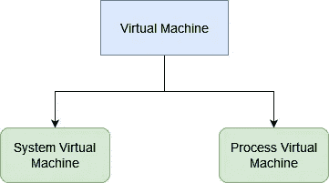

虚拟机的类型

## 系统虚拟机

这些类型的虚拟机为我们提供了完整的虚拟操作系统。基于系统的虚拟机允许我们在一台物理计算机上运行一个或多个具有自己的操作系统的独立虚拟机。

示例:Hyper-V、Xen

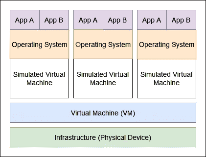

系统虚拟机架构

## 进程虚拟机

它也被称为应用程序虚拟机。Process VMs 在使用一些应用程序或程序时创建虚拟环境，一旦任务完成，或者我们退出该应用程序，这个环境就会被破坏。

示例:Java 虚拟机(JVM)、公共语言运行时(CLR)、Parrot 虚拟机

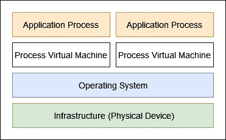

进程虚拟机架构

## Java 虚拟机(JVM)

现在让我们看看 Java 虚拟机(JVM)。JVM 是一种规范。JVM 是一个引擎，它提供运行 Java 应用程序的运行时环境。JVM 是 JRE 自带的。它负责将字节码转换成机器语言。

与其他编程语言不同，Java 同时使用编译器和解释器来完成不同的任务。

Java 编译器(`javac`)将源代码(`.java` 文件)编译成字节码，生成类文件(`.class`文件)。

Java 解释器更准确的名称是 JVM。它读取字节码并将其转换成汇编语言(机器语言)。

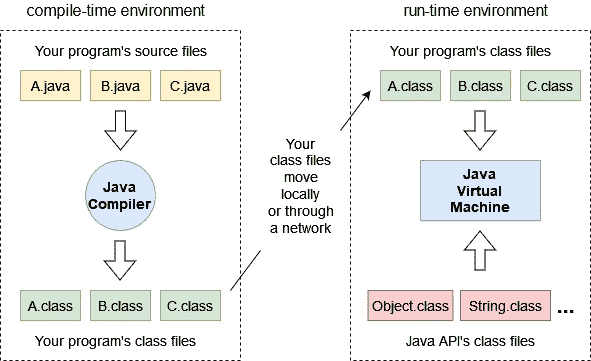

Java 编程环境(来源:JAVA 2 虚拟机内部——Bill Venners)

例如，让我们考虑有一个名为“**Test.java**的 Java 文件。为了编译这个源文件，我们需要在命令提示符下使用下面的命令。

```
javac Test.java
```

Java 编译器将读取 Java 代码，并将其编译成字节码类文件。它将生成一个类文件(`Test.class`)。要运行这段代码，我们需要使用下面的命令和类名。

```
java Test
```

当“ **java** ”关键字被调用时，它将请求操作系统创建一个 JVM 实例。操作系统将创建一个 demon-thread 并执行代码，然后字节码将被编译成机器码。

对于每个 Java 程序，都会创建一个 JVM 实例。如果一台机器上运行着三个程序，那么就会有三个 JVM 进程在运行。

在这些情况下，JVM 将被销毁。

1.  通过调用`System.exit ()`方法。当 Java 程序结束时，JVM 实例将被销毁。
2.  JVM 中有两种线程:恶魔线程和非恶魔线程。恶魔线程是 JVM 自己使用的线程。非恶魔线程一般是 Java 程序的线程。如果没有非恶魔线程存在，JVM 将被销毁。

## Java 虚拟机体系结构

Java 虚拟机分为三个子系统:

1.  类装入器
2.  运行时内存/数据区
3.  执行引擎

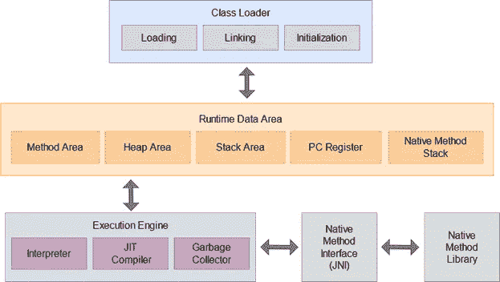

Java 虚拟机体系结构

## 类装入器

当你编译一个源文件(`.java`文件)时，它被转换成一个字节码文件(`.class`文件)。当你试图运行程序时，类装入器将它装入主存。

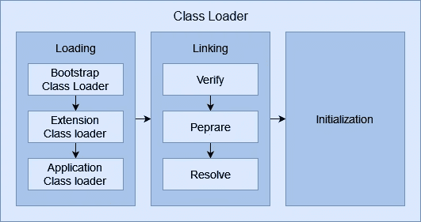

类装入器执行三个主要功能:

*   装货
*   连接
*   初始化

## 装货

这个过程从加载主类(包含 **main ()** 方法的类)开始。类加载器读取类文件(`.class`文件)，然后 JVM 在内存区域存储以下信息。

*   加载的类的完全限定名
*   可变信息
*   直接父信息
*   无论是类、接口还是枚举

**Java 中有三个内置的类装入器:**

1.  **引导类加载器** —这是根类加载器。它负责加载 `$JAVA_HOME/jre/lib` 目录下最基础最重要的类(比如`rt.jar`)。
2.  **扩展类加载器** — 这个负责将标准 Java 库的扩展加载到内存的`$JAVA_HOME/jre/lib/ext`目录下。
3.  **应用程序类加载器** —负责将系统类路径中指定的库加载到内存中。默认情况下，类路径设置为应用程序的当前目录。

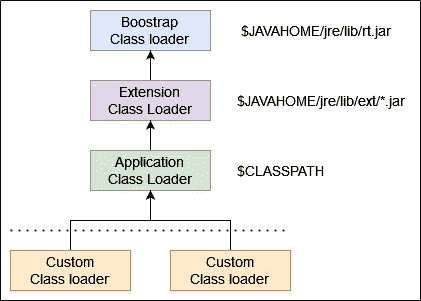

类装入器的层次结构

**Java 类装入器基于三个原则:**

1.  **唯一性** —这个原则允许你加载一个类一次。它确保子类装入器不会重新装入已经被父类装入的类。这确保了没有重复的类。
2.  **委托** —将类加载请求转发给父类加载器。如果父类装入器找不到一个类，它就把工作委托给子类装入器。如果最后一个子类装入器不能装入类，它抛出`ClassNotFoundException`异常。

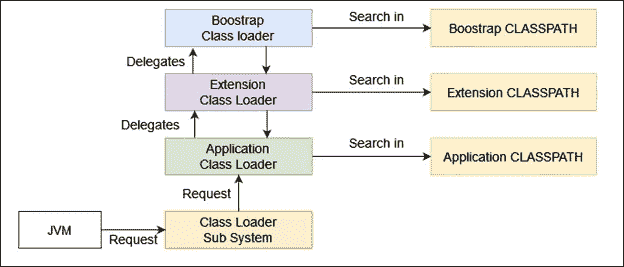

类装入器的工作

3.**可见性** —这个原则允许子类装入器看到父类装入的类，但是父类装入器看不到子类装入的类。

## 连接

当一个类被加载到内存中后，它会经历链接过程。链接过程可以分为三个主要部分。

1.  **验证** —该阶段验证生成的字节码是否正确。如果验证失败，我们得到一个`VerifyException`。
2.  **准备** —这个阶段为类的静态变量分配内存，并给它们分配默认值。

例如，假设您已经在类中声明了以下变量:

```
Private static boolean status=true;
```

JVM 为变量 status 分配内存，并将其值设置为布尔值的默认值，该值为 false。

3.**解决** —所有符号内存引用都被替换为方法区域中的原始引用。

## 初始化

这是类加载的最后阶段。初始化包括执行类或接口的初始化方法(`clinit`)。在这个阶段，所有静态变量将被赋予它们的原始值，静态块将被执行。

例如，在准备阶段，变量“**状态**”被设置为默认值 false。在这个初始化阶段，这个变量的实际值为 true。

```
Private static boolean status=true;
```

## 运行时数据区

运行时数据区分为五个部分。

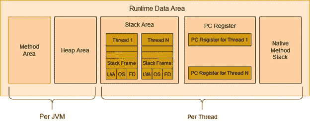

## **1。方法区域**

JVM 方法区域存储所有类级别的数据，如元数据、常量运行时池以及方法和构造函数的代码。

```
public class Student { private int id;
      private String name; public Employee(int id, String name) {
          this.id = id;
          this.name = name;
      }}
```

在上面的代码示例中，字段级数据“ **name** ”和“ **id** ”以及构造函数细节被加载到方法区域中。

## 2.堆区域

所有对象、它们相关的实例变量和数组都存储在堆中。

让我们以下面的代码示例为例。

```
Student student = new Student();
```

在上面的代码示例中，创建了一个**学生**的实例，并将其加载到堆区域。

## 3.堆栈区

Java 语言堆栈存储局部变量及其部分结果。每个线程都有自己的 JVM 栈，在创建线程的同时创建。

## 4.PC 寄存器

PC 寄存器存储当前正在执行的 Java 虚拟机指令的地址。在 Java 中，每个线程都有自己的 PC 寄存器。

## 本机方法堆栈

本机方法堆栈包含本机代码的指令，这些指令取决于本机库。它是用另一种语言而不是 Java 写的。对于每个新线程，还会分配一个单独的本机方法堆栈。

## 执行引擎

执行引擎通过执行每个类中的代码来运行应用程序。

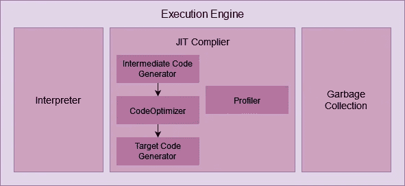

执行引擎的组件

1.  **解释器** —解释器逐行读取并执行字节码指令。它解释字节码的速度较快，但执行速度较慢。解释器的另一个缺点是，当一个方法被多次调用时，每次都需要新的解释。
2.  **JIT 编译器**—JIT 编译器中和了解释器的缺点。执行引擎将在解释器的帮助下转换字节码，但是当它发现重复的代码时，它将使用 JIT 编译器。

JIT 编译器编译整个字节码，并将其改为本机代码。这些本机代码将直接用于重复的方法调用，从而提高系统的性能。

JIT 编译器有四个组件。

1.  **中间代码生成器** —生成中间代码

2.**代码优化器** —负责优化上述生成的中间代码。

3.**目标代码生成器** —负责生成机器码或本机码

4.**分析器**–负责寻找热点(重复执行的代码)

3.**垃圾收集器** —它收集并移除未被引用的对象。垃圾收集可以通过调用`System.gc()`来触发，但是不能保证执行。

## **Java 本地接口(JNI)**

Java 本地接口将与本地方法库交互，并提供执行引擎所需的本地库。JNI 是允许其他编程语言支持包的桥梁。

## **本地方法库**

这是执行引擎所需的本地库的集合。

## **参考文献**

为了写这篇文章，我参考了下面的 YouTube 播放列表和文章。

[https://www.youtube.com/watch?v=bUtIIWbaFKc](https://www.youtube.com/watch?v=bUtIIWbaFKc)

https://www.geeksforgeeks.org/classloader-in-java/

[https://www . freecodecamp . org/news/JVM-tutorial-Java-virtual-machine-architecture-explained-for-初学者/](https://www.freecodecamp.org/news/jvm-tutorial-java-virtual-machine-architecture-explained-for-beginners/)