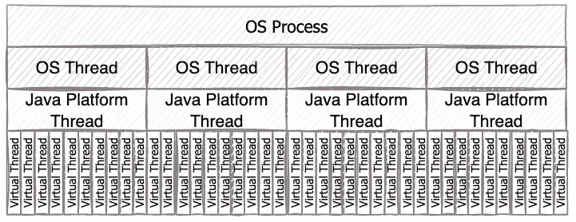

# Java 虚拟线程

> 原文：<https://blog.devgenius.io/java-virtual-threads-715c162c6c39?source=collection_archive---------3----------------------->

## 我们将不再编写丑陋的异步代码。也许吧。

[JDK 19](https://github.com/openjdk/jdk19) 已经在前一周分叉，虚拟线程 API(最初由[项目 Loom](https://wiki.openjdk.org/display/loom/Main) 引入)是一个部分实现的特性，将成为下一个版本的一部分。


约翰·安维克在 [Unsplash](https://unsplash.com?utm_source=medium&utm_medium=referral) 上的照片

> 在所有重要的方面，虚拟线程的性能类似于平台线程，但足够便宜，你可以拥有数百万个以上的线程。这为您提供了异步编程模型的可伸缩性和同步代码的简单性。[https://www.youtube.com/watch?v=UG9nViGZCEw](https://www.youtube.com/watch?v=UG9nViGZCEw)

*   一个标准的 **Java 平台线程**是一个**操作系统线程上的一个薄薄的包装器，它与它的生命周期严格相关。**平台线程的数量因此受限于操作系统线程的数量。
*   一个**虚拟线程不附属于任何特定的操作系统线程，一旦被 JDK 识别为阻塞(例如，当它正在运行 I/O 操作时),就会自动从其底层操作系统线程**分离。虚拟线程的数量可以远大于操作系统线程的数量。



虚拟线程与平台线程

**虚拟线程只有在 CPU 上执行计算时才会消耗 OS 线程。**许多虚拟线程可以依赖同一个操作系统线程，有效地共享它。我们获得的结果是与异步风格编程时相同的可伸缩性，只是这是透明地实现的。*预期结果(理论上)是，有了虚拟线程，我们将不再需要使用异步代码或基于事件的模式来“将应用的吞吐量限制在与底层硬件所能支持的同等水平”，因为这将由 JDK 透明地完成。换句话说，没有更难听的* [*无功编程*](/an-epic-tale-comparing-jdbc-and-r2dbc-in-a-real-world-scenario-a536db512834) *废话。*

为了实现这种从 OS 线程(称为载体线程)的解耦和快速安装-卸载，虚拟线程被实现为廉价的。事实上，它们太便宜了，不应该像我们在标准 Java 多线程应用程序中通常做的那样，将它们放在一起。虽然平台线程需要将其整个堆栈存储在内存中，预先预留大约 20MBs，但虚拟线程存储在垃圾收集堆中，该堆可以根据需要增长和收缩，以容纳任意深度的堆栈。这个深度将比一个标准平台线程的完整调用堆栈更容易被占用，因为我们将使用虚拟线程来执行短期任务。

# JDK 螺纹 API 的主要变化

JDK19 将出货`**Executors.newVirtualThreadPerTaskExecutor()**`

```
try (var executor = **Executors.newVirtualThreadPerTaskExecutor()**) {
    IntStream.range(0, 10_000).forEach(i -> {
        executor.submit(() -> {
            Thread.sleep(Duration.ofSeconds(1));
            return i;
        });
    });
}  // executor.close() is called implicitly, and waits
```

和`**Thread.startVirtualThread(Runnable)**`方法。

```
var vThread = Thread.startVirtualThread(() -> {
    System.out.println("Hello from the virtual thread");         
});
```

# 还缺少什么

绝大多数开发人员并不直接使用线程。我们 90%依赖于实现“每个请求一个线程”模型的 web 服务器。线程是由 web 服务器自动为我们创建的。

这就是为什么 [JEP 425](https://openjdk.org/jeps/425) 的第一个基本目标是“**使以简单的每请求线程风格编写的服务器应用程序能够以接近最优的硬件利用率进行扩展”**，第二个目标是“使使用 `**java.lang.Thread**` **API 的现有代码能够以最小的改变采用虚拟线程”。**

听起来不错，但行不通。

**虚拟线程当前的一个巨大限制是，使用同步代码块会导致锁定操作系统线程。**钉住一个线程意味着承载线程很忙，在监视器被释放之前不能用于其他虚拟线程。长时间频繁固定会损害应用程序的可伸缩性。即使 JEP 声明“不需要替换不经常使用的`synchronized`块和方法(例如，只在启动时执行)或者保护内存操作的方法”，我们也应该尽可能地使用 [ReentrantLock](https://docs.oracle.com/en/java/javase/18/docs/api/java.base/java/util/concurrent/locks/ReentrantLock.html) 。

这个[实验](https://github.com/mp911de/spring-boot-virtual-threads-experiment)的目的是在 Tomcat 中使用虚拟线程，它总结了`synchronized`在包含的库中使用的次数。

*   光:12 人
*   Tomcat(嵌入式内核):576
*   PGJDBC: 134
*   春季数据:13
*   弹簧框架:329

# 结论

依我拙见，OS Java 社区已经带来了一个已经实现的伟大特性，并且在其他多线程语言(比如 Go 或 Erlang)中取得了巨大成功。

同步限制是即将到来的 JDK 版本应该真正解决的问题。如果 JDK 不能直接解决这一限制，我们将不会从虚拟线程的使用中获得很大的好处，因为与遗留代码的集成将带来大量“同步”的代码块。