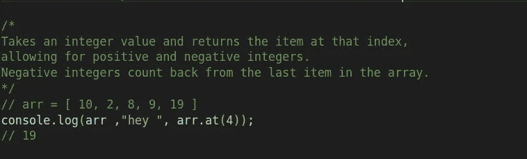

# Javascript 1O1 系列:数组的方法和迭代器第一部分，方法。

> 原文：<https://blog.devgenius.io/javascript-1o1-series-arrays-methods-and-iterators-part-1-methods-cfd22d194cb?source=collection_archive---------9----------------------->

## 了解无缝处理数组的最重要方法。我们将在另一篇文章中讨论迭代和迭代器。


从[cleverbeagle.com](https://www.google.com/url?sa=i&url=https%3A%2F%2Fcleverbeagle.com%2Fblog%2Farticles%2Fwhat-is-a-javascript-array&psig=AOvVaw3d9ES8U7ykl-Pisnlqtslg&ust=1650776254479000&source=images&cd=vfe&ved=0CA0QjhxqFwoTCOjvhsPNqfcCFQAAAAAdAAAAABAT)

## 目录:

[插入和移除:](#477d)
∘ [移位:](#23c2)
∘ [未移位:](#c5b6)
∘ [推送:](#f017)
∘ [弹出:](#e407)
[子数组:](#1fb5)
∘ [切片:](#fce8)
∘ [拼接:](#020c)
[重新排序:](#cebd)
∘ [反转](#3c50) [添加和组合数组:](#9239)
∘[concat:](#fd16)
[数组到字符串的转换:](#6289)
∘[tostring:](#9953)
[其他情况:](#0767)

∘ [参考文献:](#6851)

## 您将了解到:

一些有用的数组方法使处理数组变得很容易，我希望从现在开始你不会发现任何处理数组操作的问题。

# 插入和移除:

## 移位:

shift()用于移除数组的第一个元素。

```
Array.shift()
```


变化

## 未换档:

unshift 用于将一个元素插入数组，unshift 会将该元素添加到数组的开头


松开打字机或键盘的字型变换键

## 推送:

push 用于将元素添加到数组中(添加到末尾)


推送()

## 流行音乐:

pop 用于弹出(移除)数组的最后一个元素


流行音乐

# 子阵列:

## 切片:

slice 用于复制特定范围内的元素。

例如，你有一个数组，你想得到索引 1 和索引 3 之间的元素


薄片

如果没有定义 end 参数，切片将扩展到数组的末尾

```
let slicedArr2 = arr.slice(1)// [2,3,4,5,6,7,8,9]
```

## 拼接:

slice 用于从数组中移除元素。


拼接()


[切片拼接](https://www.google.com/url?sa=i&url=https%3A%2F%2Fdasha.ai%2Fen-us%2Fblog%2Fjavascript-arrays-slice-and-splice&psig=AOvVaw1tdKMulcoQ3FIJYQ8mgcSO&ust=1650776076087000&source=images&cd=vfe&ved=0CA0QjhxqFwoTCOCD_vnMqfcCFQAAAAAdAAAAABAE)

# 重新排序:

## 反转:

用于反转数组的元素。


反面的

## 排序:

> 默认情况下，`*sort()*`函数将值排序为**字符串**。
> 
> 这对字符串很有效(“苹果”在“香蕉”之前)。
> 
> 但是，如果数字按字符串排序，“25”比“100”大，因为“2”比“1”大。
> 
> 因此，`*sort()*`方法在对数字排序时会产生不正确的结果。
> 
> 您可以通过提供一个**比较函数**来解决这个问题

所以没有**比较函数**，sort()就没那么有用了。

关于**排序的更多信息:**

[](https://www.w3schools.com/js/js_array_sort.asp) [## JavaScript 数组排序

### sort()方法按字母顺序对数组进行排序:自己试试“reverse()方法将数组中的元素反转…

www.w3schools.com](https://www.w3schools.com/js/js_array_sort.asp) [](https://developer.mozilla.org/en-US/docs/Web/JavaScript/Reference/Global_Objects/Array/sort) [## array . prototype . sort()—JavaScript | MDN

### 方法对数组的元素进行排序，并返回排序后的数组。默认的排序顺序是升序，建立在…

developer.mozilla.org](https://developer.mozilla.org/en-US/docs/Web/JavaScript/Reference/Global_Objects/Array/sort) 

## 搜索和排序:

## 包括:

用于检查元素是否存在。


包含

## 在:

简单地说，你传递一个索引，然后在这个索引中获取值。



在

## 索引:

indexOf()与 at()相反，传递一个值并获取该值在数组中的索引。


索引 Of

## 排序:

这里也可以使用排序

> 默认情况下，`*sort()*`函数将值排序为**字符串**。
> 
> 这对字符串很有效(“苹果”在“香蕉”之前)。
> 
> 但是，如果数字按字符串排序，“25”比“100”大，因为“2”比“1”大。
> 
> 因此，`*sort()*`方法在对数字排序时会产生不正确的结果。
> 
> 您可以通过提供一个**比较函数**来解决这个问题


所以没有**比较函数**，sort()就没那么有用了。

更多关于**排序:**

[](https://www.w3schools.com/js/js_array_sort.asp) [## JavaScript 数组排序

### sort()方法按字母顺序对数组进行排序:自己试试“reverse()方法将数组中的元素反转…

www.w3schools.com](https://www.w3schools.com/js/js_array_sort.asp) [](https://developer.mozilla.org/en-US/docs/Web/JavaScript/Reference/Global_Objects/Array/sort) [## array . prototype . sort()—JavaScript | MDN

### 方法对数组的元素进行排序，并返回排序后的数组。默认的排序顺序是升序，建立在…

developer.mozilla.org](https://developer.mozilla.org/en-US/docs/Web/JavaScript/Reference/Global_Objects/Array/sort) 

# 添加和组合数组:

## 串联:

用于组合(相加)两个或多个数组，组合后的数组都不会被修改，concat()将返回一个新的数组。


结合

# 数组到字符串的转换:

## toString:

用于以字符串格式表示数组。


toString

还有 toLocalString()，作为练习搜索一下，了解 toString()和 toLocalString()之间的区别

# 其他情况:

## 扁平:

当你有一个嵌套的数组，并想把所有这些嵌套的数组取出来组成一个新的数组时，就使用 flat()。

flat()不修改数组，而是返回一个新数组。


平的

## 填充:

用于用特定值填充整个或部分数组。


充满

## 参考资料:

[](https://javascript.plainenglish.io/all-about-arrays-in-javascript-4d8267fe7ef8) [## JavaScript 数组深度

### 数组核心概念的分解，并让初学者也能理解。

javascript.plainenglish.io](https://javascript.plainenglish.io/all-about-arrays-in-javascript-4d8267fe7ef8) [](https://www.oreilly.com/library/view/javascript-the-definitive/9781491952016/) [## JavaScript:权威指南，第 7 版

### JavaScript 是网络编程语言，如今被更多的软件开发人员使用

www.oreilly.com](https://www.oreilly.com/library/view/javascript-the-definitive/9781491952016/) [](https://www.w3schools.com/js/js_array_methods.asp) [## JavaScript 数组方法

### JavaScript 方法 toString()将一个数组转换成一个(用逗号分隔的)数组值的字符串。结果…

www.w3schools.com](https://www.w3schools.com/js/js_array_methods.asp) [](https://javascript.info/array-methods) [## 数组方法

### 数组提供了很多方法。为了方便起见，在本章中，他们被分成了几个组。我们已经知道…

javascript.info](https://javascript.info/array-methods)  [## JavaScript 数组方法

### 在 JavaScript 中，Array 是一个内置的全局对象，允许您一次存储多个元素。在本参考中…

www.programiz.com](https://www.programiz.com/javascript/library/array) [](https://developer.mozilla.org/en-US/docs/Web/JavaScript/Reference/Global_Objects/Array) [## 数组— JavaScript | MDN

### 在 JavaScript 中，数组不是原语，而是具有以下核心特征的数组对象:创建…

developer.mozilla.org](https://developer.mozilla.org/en-US/docs/Web/JavaScript/Reference/Global_Objects/Array) [](https://www.geeksforgeeks.org/javascript-basic-array-methods/) [## JavaScript 基本数组方法— GeeksforGeeks

### 建议在 JavaScript 中遍历数组。我们将讨论下面的数组函数:Array.push()…

www.geeksforgeeks.org](https://www.geeksforgeeks.org/javascript-basic-array-methods/) [](https://livecodestream.dev/post/15-must-know-javascript-array-methods/) [## 15 个必须知道的 JavaScript 数组方法

### 数组是奇妙的，也是 JavaScript 中非常特殊的一种类型。有许多有用的内置属性和方法…

livecodestream.dev](https://livecodestream.dev/post/15-must-know-javascript-array-methods/) 

感谢您的阅读，如果您有任何关于 javascript 或本系列的问题，请随时提问，我非常感谢您对我的内容的任何反馈。

在 [Twitter](https://twitter.com/Osam1010) 、 [Github](https://github.com/osama865/) 和 [my portfolio](http://o-portfolio.netlify.com/) 上找到我。