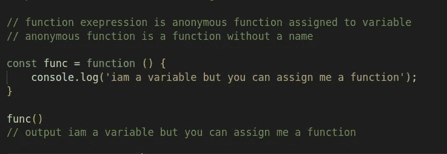

# Javascript 1O1 系列:函数

> 原文：<https://blog.devgenius.io/javascript-1o1-series-functions-e02308cd675c?source=collection_archive---------9----------------------->

鸣谢:[今晚教程](https://www.google.com/url?sa=i&url=https%3A%2F%2Fwww.tutorialstonight.com%2Fjs%2Fjs-function.php&psig=AOvVaw0cihR-l8V7Fe19orQJr0p_&ust=1650260119283000&source=images&cd=vfe&ved=0CA0QjhxqFwoTCJi15PPKmvcCFQAAAAAdAAAAABAD)

## 您将了解到:

H 如何声明和定义函数，传递自变量和参数以及函数末尾的返回值，以及使用匿名函数。

## 什么是功能:

> JavaScript 函数是为执行特定任务而设计的代码块。
> 
> 一个 JavaScript 函数在“某物”调用它时被执行。w3schools。
> 
> 函数是 JavaScript 的基本构件之一。JavaScript 中的函数类似于过程——一组执行任务或计算值的语句。MDN

函数只是编写一次的代码块，但可以多次使用。

**语法:**

函数名(参数){

函数逻辑在这里；

}

函数关键字，作为函数名称的标识符，括号，它可以包含参数，也可以不包含参数，然后是花括号，里面包含代码。

## 为什么我们需要使用函数:

当我们编写 javascript 代码时，任何语句或表达式都将只执行一次，除非是在循环或条件语句中，如果我们需要使用特定的语句，我们将不得不一次又一次地编写所有需要的语句。使用函数时，我们只需将一些代码或语句放入一个代码块中，并给它一个唯一的名字，然后我们就可以随时通过调用它的名字来重用这个代码块。

没有功能

如你所见，如果我们像这样编码，这是非常困难和痛苦的，甚至是没有意义的，所以让我们看看我们如何使用函数。

带功能

**参数和自变量:**

每个功能都做特定的任务，这些任务可能需要一些来自外部的数据来完成。如果我们的函数需要一些数据，而这些数据都在函数中，那么我们如何将需要的数据传递给函数呢？
我为你介绍参数

因素

参数是简单的变量，用于存储来自函数外部的数据，并使函数可以使用这些数据。

想象一下，有人想送你东西，你会怎么做？，通常你会张开双手从那个人那里把它拿走，还有函数有参数来存储已经发送给它的数据，以便用它来执行一些操作。

# 参数规则

> JavaScript 函数定义不指定参数的数据类型。
> 
> JavaScript 函数不对传递的参数执行类型检查。
> 
> JavaScript 函数不检查收到的参数数量。w3 学校

## 如何声明参数:

好的一面是，参数变量不需要像 var、let 或 const 等其他变量那样以显式方式声明，您只需命名所需的参数，它们将是函数体内可用的变量。

## 什么是争论:

我们声明用来接收函数数据的函数变量称为参数，这些传递的参数值称为自变量。

所以用来保存外部数据的函数变量是 parameter，从外部传递给函数的值是 argument，好吗？

关于参数和自变量的更多信息:

 [## JavaScript |函数参数- GeeksforGeeks

### 函数参数是在函数定义中定义的名称和传递给函数的实数值

www.geeksforgeeks.org](https://www.geeksforgeeks.org/javascript-function-parameters/)  [## JavaScript 函数参数

### JavaScript 函数不对参数值(自变量)进行任何检查。在本教程的前面，您…

www.w3schools.com](https://www.w3schools.com/js/js_function_parameters.asp) 

## 函数表达式:

JavaScript 函数也可以使用一个**表达式**来定义。

函数表达式可以存储在变量中:

更多函数表达式:

 [## 函数表达式- JavaScript | MDN

### function 关键字可用于在表达式中定义函数。您也可以使用…来定义函数

developer.mozilla.org](https://developer.mozilla.org/en-US/docs/Web/JavaScript/Reference/Operators/function) 

## **匿名功能:**

> 是一个没有任何关联名称的函数。通常我们在函数名前使用*函数*关键字来定义 JavaScript 中的函数，然而，在 JavaScript 的匿名函数中，我们只使用*函数*关键字而不使用函数名。 [**极客为极客**](https://www.geeksforgeeks.org/javascript-anonymous-functions/)

存储在变量中的函数不需要函数名。它们总是使用变量名来调用。

你也可以使用匿名函数的新语法，箭头函数

## 箭头功能:

> 箭头函数表达式是传统[函数表达式](https://developer.mozilla.org/en-US/docs/Web/JavaScript/Reference/Operators/function)的紧凑替代，但有局限性，不能在所有情况下使用。
> 
> *箭头功能*和*传统功能*有区别，也有一些局限性:
> 
> 箭头函数没有自己到`[this](https://developer.mozilla.org/en-US/docs/Web/JavaScript/Reference/Operators/this)`或`[super](https://developer.mozilla.org/en-US/docs/Web/JavaScript/Reference/Operators/super)`的绑定，不应该作为`[methods](https://developer.mozilla.org/en-US/docs/Glossary/Method)`使用。
> 
> 箭头函数不能访问`[new.target](https://developer.mozilla.org/en-US/docs/Web/JavaScript/Reference/Operators/new.target)`关键字。
> 
> 箭头函数不适用于`[call](https://developer.mozilla.org/en-US/docs/Web/JavaScript/Reference/Global_Objects/Function/call)`、`[apply](https://developer.mozilla.org/en-US/docs/Web/JavaScript/Reference/Global_Objects/Function/apply)`和`[bind](https://developer.mozilla.org/en-US/docs/Web/JavaScript/Reference/Global_Objects/Function/bind)`方法，这些方法通常依赖于建立一个[范围](https://developer.mozilla.org/en-US/docs/Glossary/Scope)。
> 
> 箭头函数不能用作[构造函数](https://developer.mozilla.org/en-US/docs/Glossary/Constructor)。
> 
> 箭头函数不能在其主体内使用`[yield](https://developer.mozilla.org/en-US/docs/Web/JavaScript/Reference/Operators/yield)`。 [MDN](https://developer.mozilla.org/en-US/docs/Web/JavaScript/Reference/Functions/Arrow_functions)

## **什么是退货单？**

> [说明](https://developer.mozilla.org/en-US/docs/Web/JavaScript/Reference/Statements/return#description):当`return`语句在函数体中使用时，函数停止执行。如果指定，将给定值返回给函数调用方。 [MDN](https://developer.mozilla.org/en-US/docs/Web/JavaScript/Reference/Statements/return)

为了重用一些代码或逻辑，我们将它们封装在一个函数中，但是如果我们也要重用这个函数的输出呢？比如在一个循环中使用它的值，或者在条件语句中使用它，或者把它传递给另一个函数，或者其他什么东西
然后你需要使用 return
return 做的只是简单地计算一些值，然后把它作为函数值
如果我在一个函数中返回 5，我们可以说这个函数的值是 5，并不完全是这样的只是假设它是这样理解如何使用 RETURN，也就是 RETURN 停止执行函数，这样任何在 RETURN 之后的代码都不会被执行。

返回语句

## 参考资料和有用的链接:

 [## javascript 中的函数(有 15 个例子)

### 在本教程中，你将学习 javascript 函数，如何定义它们，如何使用它们，为什么要使用它们，等等…

www.google.com](https://www.google.com/url?sa=i&url=https%3A%2F%2Fwww.tutorialstonight.com%2Fjs%2Fjs-function.php&psig=AOvVaw0cihR-l8V7Fe19orQJr0p_&ust=1650260119283000&source=images&cd=vfe&ved=0CA0QjhxqFwoTCJi15PPKmvcCFQAAAAAdAAAAABAD)  [## JavaScript 函数

### JavaScript 函数是为执行特定任务而设计的代码块。JavaScript 函数在以下情况下执行…

www.w3schools.com](https://www.w3schools.com/js/js_functions.asp)  [## 函数- JavaScript | MDN

### 函数是 JavaScript 的基本构件之一。JavaScript 中的函数类似于…

developer.mozilla.org](https://developer.mozilla.org/en-US/docs/Web/JavaScript/Guide/Functions)  [## JavaScript 函数

### 概要:在本教程中，您将学习 JavaScript 函数，以及如何使用它们将代码组织成…

www.javascripttutorial.net](https://www.javascripttutorial.net/javascript-function/)  [## JavaScript 函数和函数表达式

### 函数是执行特定任务的代码块。假设你需要创建一个程序来创建一个圆…

www.programiz.com](https://www.programiz.com/javascript/function) 

感谢您的阅读，如果您有任何关于 javascript 或本系列的问题，请随时提问，我非常感谢您对我的内容的任何反馈。

在 [twitter](https://twitter.com/Osam1010) 、 [github](https://github.com/osama865/) 和[我的作品集](http://o-portfolio.netlify.com/)上找到我。