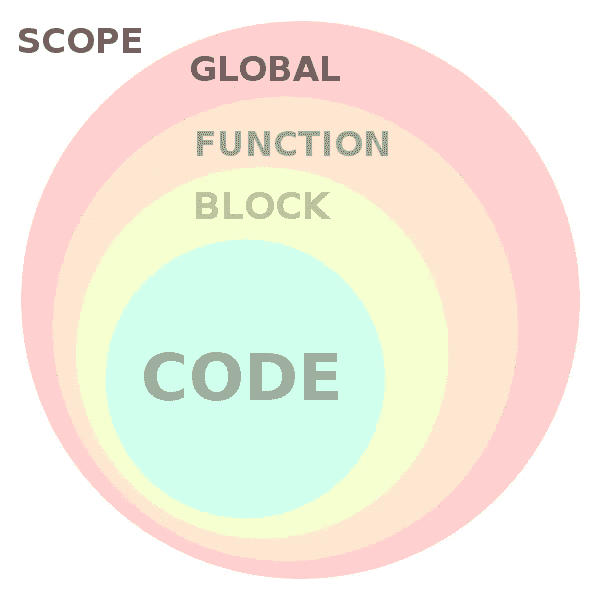
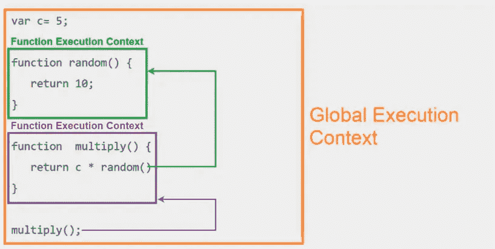
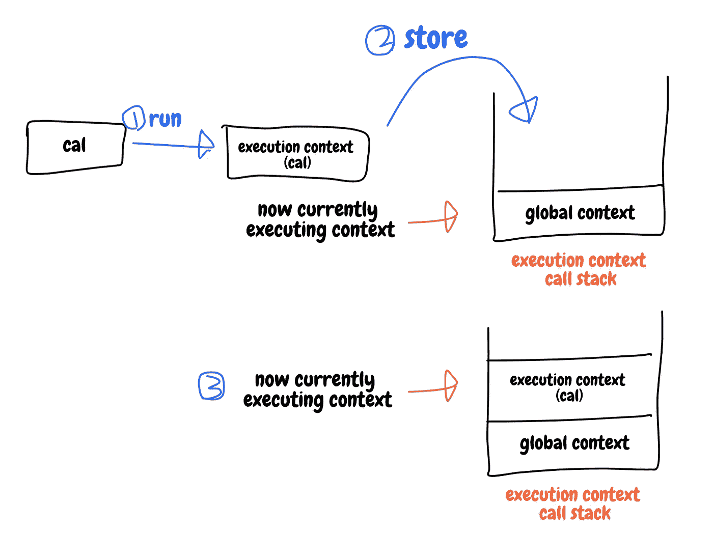
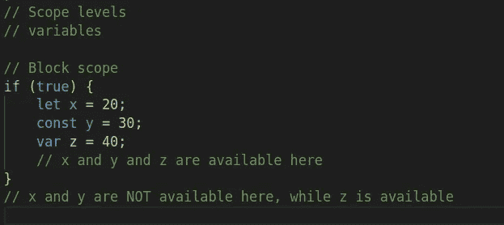
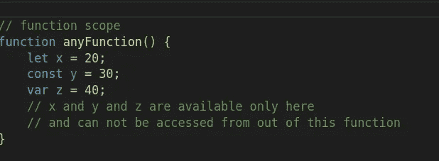
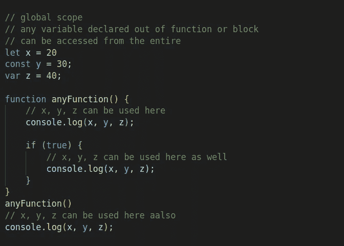

# Javascript 1O1 系列:作用域和执行上下文。

> 原文：<https://blog.devgenius.io/javascript-1o1-series-scopes-and-execution-contexts-d4df43f007b4?source=collection_archive---------9----------------------->

## 了解 javascript 代码是如何执行的。

从[史蒂夫开发](https://www.google.com/url?sa=i&url=https%3A%2F%2Fwww.stevethedev.com%2Fblog%2Fprogramming%2Fjavascript-scope-primer&psig=AOvVaw3vmn5n3SwCg4r4OUigty9Y&ust=1650601476133000&source=images&cd=vfe&ved=0CA0QjhxqFwoTCPjo6bTCpPcCFQAAAAAdAAAAABAD)

## 目录:

∘[JavaScript 中什么作用域:](#b5d1)
∘ [块作用域(从 ES6 开始):](#b67e)
∘ [函数作用域:](#51e7)
∘ [全局作用域:](#515e)
∘ [块 vs 函数 vs 全局:](#3ced)
∘ [引用:](#90b7)

## 您将了解到:

关于 javascript 中的三个作用域级别，块作用域、函数作用域、全局作用域和执行上下文，以及 javascript 代码是如何执行的。

## javascript 中的作用域是什么:

作用域决定了变量和表达式在程序中的可见性和可用性，在作用域内定义的变量只能在作用域内访问，在作用域外不可访问

> 执行的当前上下文。[值](https://developer.mozilla.org/en-US/docs/Glossary/Value)和表达式“可见”或可被引用的上下文。MDN

简而言之，范围就是变量和表达式在哪里可以访问，在哪里不可以。

它有三个层次，分别是块范围、函数级和全局级，每个层次都有自己的执行上下文。

## 执行上下文:

来自[自由代码营](https://www.google.com/imgres?imgurl=https%3A%2F%2Fmiro.medium.com%2Fmax%2F1400%2F1*lcTk7Ev0gp_H3Krup6G1EA.png&imgrefurl=https%3A%2F%2Flevelup.gitconnected.com%2Flearn-javascript-fundamentals-scope-context-execution-context-9fe8673b3164&tbnid=lksXO_eSDJt7eM&vet=12ahUKEwiMj8KulKX3AhWiwCkDHSxiDJYQMygHegUIARDAAQ..i&docid=Q7rwivEY4uqhwM&w=1161&h=673&q=execution%20context%20javascript&ved=2ahUKEwiMj8KulKX3AhWiwCkDHSxiDJYQMygHegUIARDAAQ)

> 执行上下文**包含当前正在运行的代码，以及帮助其执行的一切**。在执行上下文运行时，解析器解析特定的代码，变量和函数存储在内存中，生成可执行字节码，然后执行代码。[自由代码营](https://www.google.com/imgres?imgurl=https%3A%2F%2Fmiro.medium.com%2Fmax%2F1400%2F1*lcTk7Ev0gp_H3Krup6G1EA.png&imgrefurl=https%3A%2F%2Flevelup.gitconnected.com%2Flearn-javascript-fundamentals-scope-context-execution-context-9fe8673b3164&tbnid=lksXO_eSDJt7eM&vet=12ahUKEwiMj8KulKX3AhWiwCkDHSxiDJYQMygHegUIARDAAQ..i&docid=Q7rwivEY4uqhwM&w=1161&h=673&q=execution%20context%20javascript&ved=2ahUKEwiMj8KulKX3AhWiwCkDHSxiDJYQMygHegUIARDAAQ)

简而言之，把 javascript 引擎想象成一个人，这个人有很多事情要做，完成事情的最合适的方式是把相关的事情组合在一起，然后完成它，继续下一组。把执行环境想象成一组需要完成的相关事情

javascript 引擎在开始执行代码之前，它定义执行上下文，然后从全局上下文中的其他上下文单独执行任何上下文。

**全局执行上下文(GEC):**

> 每当 JavaScript 引擎接收到一个脚本文件时，它首先创建一个默认的执行上下文，称为`Global Execution Context (GEC)`。
> 
> GEC 是基本/默认的执行上下文，所有不在函数内部的 JavaScript 代码都在这里执行。

**函数执行上下文(FEC)**

> 每当调用一个函数时，JavaScript 引擎都会在 GEC 中创建一种不同类型的执行上下文，称为函数执行上下文(FEC ),以评估和执行该函数中的代码。
> 
> 因为每个函数调用都有自己的 FEC，所以在一个脚本的运行时可以有不止一个 FEC。

[来自](https://www.google.com/url?sa=i&url=https%3A%2F%2Fmorioh.com%2Fp%2F92f2e71c3d4e&psig=AOvVaw1xZjczCvf1PKh6XUY7kTcS&ust=1650631406221000&source=images&cd=vfe&ved=0CA0QjhxqFwoTCJC52_WxpfcCFQAAAAAdAAAAABAJ)

## 阻止范围(从 ES6 开始):

在块范围内用 const 和 let 关键字定义的变量只能在块内使用，只有用 var 定义的变量才能从块外访问

## 功能范围:

在函数作用域(定义在函数体内部)中定义的任何变量只能被该函数访问，在任何情况下都不能从外部访问。

> 在函数中声明的变量是函数的局部变量

## 全球范围:

如果变量没有在任何范围内定义，它会使该变量的范围成为全局的

这意味着可以从任何内部范围访问该变量

全球范围

全局作用域是最外层的作用域级别，在这个作用域内定义的任何变量都可以从任何其他内部作用域(块作用域或函数作用域)访问。

## 块与函数与全局:

你经常在函数作用域或块作用域内定义变量，除非你需要，否则不要定义全局作用域变量，为什么？在全局作用域中定义的变量在代码中随处可见，这使得重写变得容易，并使测试任务变得痛苦。

> 关于全局的一些其他问题:
> 
> 在 Javascript 中访问它们比访问局部变量慢，因为它们是解释器在可能存在的各种范围中查找给定变量名时最后找到的。通常不是一个显而易见的问题，但需要注意。这里有一个 [jsperf](http://jsperf.com/global-var-speed-test) 展示了差别有多大。
> 
> 如果您有修改全局变量的异步代码或修改全局变量的计时器驱动的代码，并且多个异步操作可以同时运行，则多个异步操作可以通过修改相同的全局变量而相互影响。
> 
> 全局变量通常不在使用点附近声明，因此阅读代码可能更具挑战性。
> 
> 全局变量通常不会自动显示在调试器中(像局部变量一样),这使得调试变得不太方便。
> 
> IE 根据 DOM 中的一些名字自动定义了一堆全局变量，这些名字可能会在你没有意识到的情况下与你自己的全局变量发生冲突。
> 
> 在局部变量上简单地省略关键字“var ”,就会使它成为一个全局变量，如果这个名称已经被用作一个预定的全局变量，就会使代码混乱。我以前在`for (i = 0; i < m.length; i++)`结构上见过这种情况。很难找到问题所在。
> 
> 全局变量在脚本的生命周期内持续存在。如果使用一个全局变量来保存一个在脚本生命周期中不需要存在的对象引用，这会导致脚本使用更多的内存。
> 
> 浏览器中的全局变量存在于`window`对象的范围内，因此它们不仅会与其他全局变量冲突，还会与窗口对象上的任何其他对象冲突。 [Stackoverflow](https://stackoverflow.com/questions/6989903/why-shouldnt-i-use-global-variables-in-javascript-for-something-thats-constant#:~:text=Some%20other%20issues,the%20window%20object.)

## 参考资料:

 [## JavaScript 范围

### W3Schools 提供所有主要网络语言的免费在线教程、参考资料和练习。覆盖…

www.w3schools.com](https://www.w3schools.com/js/js_scope.asp)  [## JavaScript 执行上下文——JS 如何在幕后工作

### 所有 JavaScript 代码都需要在某种环境中托管和运行。在大多数情况下，那个环境会是一个…

www.freecodecamp.org](https://www.freecodecamp.org/news/execution-context-how-javascript-works-behind-the-scenes/)  [## 范围- MDN 网络文档词汇表:网络相关术语的定义

### 执行的当前上下文。值和表达式“可见”或可被引用的上下文。如果一个…

developer.mozilla.org](https://developer.mozilla.org/en-US/docs/Glossary/Scope)  [## JavaScript 中作用域的简单解释

### 范围是管理变量可用性的一个重要概念。范围是在基地关闭…

dmitripavlutin.com](https://dmitripavlutin.com/javascript-scope/)  [## JavaScript 变量范围

### 范围是指代码的某些部分中变量和函数的可用性。在 JavaScript 中，变量有…

www.programiz.com](https://www.programiz.com/javascript/variable-scope)  [## JavaScript 变量范围

### 摘要:在本教程中，您将了解 JavaScript 变量作用域，它决定了可见性和

www.javascripttutorial.net](https://www.javascripttutorial.net/javascript-variable-scope/) 

感谢您的阅读，如果您有任何关于 javascript 或本系列的问题，请随时提问，我非常感谢您对我的内容的任何反馈。

在 [Twitter](https://twitter.com/Osam1010) 、 [Github](https://github.com/osama865/) 和 [my portfolio](http://o-portfolio.netlify.com/) 上找到我。