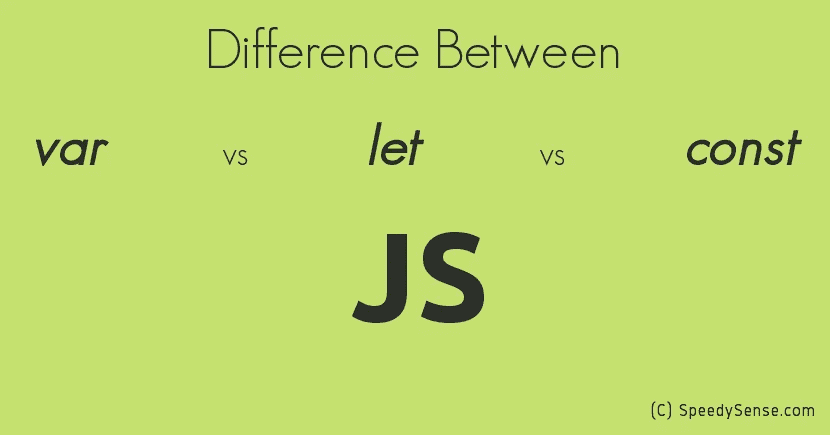
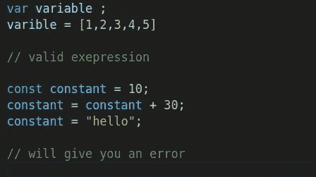
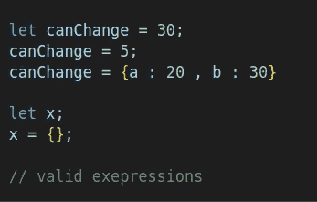

# Javascript 1O1 系列:变量 vs 常量，以及 Let 关键字。

> 原文：<https://blog.devgenius.io/javascript-1o1-series-variables-vs-constants-and-let-keyword-457bd6105b4c?source=collection_archive---------15----------------------->

## 了解何时使用 Var、const 和 let 关键字以及它们之间的区别。

[速度感](https://www.google.com/url?sa=i&url=https%3A%2F%2Fspeedysense.com%2Fvar-vs-let-vs-const-in-javascript%2F&psig=AOvVaw2ccMzLMwHptSED3DZ23w0b&ust=1650356866915000&source=images&cd=vfe&ved=0CA0QjhxqFwoTCNjFuJiznfcCFQAAAAAdAAAAABAP)

## 您将了解到:

关于 const 和 const 关键字和用 let 关键字声明的变量以及这些变量类型之间的区别。

## 常数:

我们都知道变量，它是在程序执行过程中保存特定值的容器，这个值可以根据程序员的需要随时更改。

常量是一样的，但唯一的区别是常量值在代码执行期间不能改变，当我们声明常量时初始化的值将一直保持不变。

> 常量是块范围的，很像使用`[let](https://developer.mozilla.org/en-US/docs/Web/JavaScript/Reference/Statements/let)`关键字声明的变量。常量的值不能通过重新赋值(即使用[赋值操作符](https://developer.mozilla.org/en-US/docs/Web/JavaScript/Reference/Operators/Assignment))改变，也不能重新声明(即通过[变量声明](https://developer.mozilla.org/en-US/docs/Web/JavaScript/Guide/Grammar_and_types#declarations))。然而，如果一个常量是一个[对象](https://developer.mozilla.org/en-US/docs/Web/JavaScript/Reference/Global_Objects/Object)或[数组](https://developer.mozilla.org/en-US/docs/Web/JavaScript/Reference/Global_Objects/Array)，它的属性或项目可以被更新或删除。MDN
> 
> `const`关键字在 [ES6 (2015)](https://www.w3schools.com/js/js_es6.asp) 中引入。
> 
> 用`const`定义的变量不能重新声明。
> 
> 用`const`定义的变量不能被重新分配。w3 学校

**语法:**

`*const identifier = anyValue;
const x = 10 ;*`

常量关键字、标识符、赋值运算符、任何值

由 const 关键字声明的变量，它的值不能被改变(对象的属性和数组的元素仍然可以被更新或删除)，它不能被重新声明，最后它的作用域将被阻塞-Scope。

您将在后面的教程中了解范围

## **Let 关键字:**

> `let`语句声明了一个块范围的局部变量，可以选择将其初始化为一个值。MDN

用 let 关键字声明的变量和用 var 声明的变量做同样的事情，它们是变量，其规则几乎相同，关键区别是它们的作用域限制，var 是函数作用域，而 let 是阻塞作用域。

如果你想看懂什么是范围。

 [## JavaScript 范围

### W3Schools 提供所有主要网络语言的免费在线教程、参考资料和练习。覆盖…

www.w3schools.com](https://www.w3schools.com/js/js_scope.asp) 

**let 变量的规则:**

> `let`关键字是在 [ES6 (2015)](https://www.w3schools.com/js/js_es6.asp) 中引入的。
> 
> 用`let`定义的变量不能重新声明。
> 
> 用`let`定义的变量必须在使用前声明。
> 
> 用`let`定义的变量有块范围。w3 学校

**语法:**

`*let identifier = anyValue;
let x ;*`

let 关键字、标识符、赋值运算符和给定值。

你可以在声明 let 变量时删除初始值，也可以在以后赋值，当没有值赋给 let 变量时，缺省值将是未定义的。表情。

## Let vs Var vs Const:

let 和 var 变量可以重新赋值，const 不能

var 变量可以重声明，let 和 const 不能

let 和 const 是阻塞范围，而 var 是函数范围

let 和 var 可以不用初值声明，const 不行

没有初始化值字母和变量默认值将是未定义的

**更多:**

 [## JavaScript 中 var、let 和 const 关键字的区别

### 创作者:哈什·贾恩

www.educative.io](https://www.educative.io/edpresso/difference-between-var-let-and-const-keyword-in-javascript) 

## 参考资料和有用的链接:

 [## Var，Let，和 Const -有什么区别？

### ES2015 (ES6)推出了许多闪亮的新功能。现在，既然已经是 2020 年了，假设很多 JavaScript…

www.freecodecamp.org](https://www.freecodecamp.org/news/var-let-and-const-whats-the-difference/)  [## JavaScript - GeeksforGeeks 中 var、let 和 const 关键字的区别

### 在 JavaScript 中，用户可以使用 var、let 和 const 这三个关键字来声明一个变量。在本文中，我们将看到…

www.geeksforgeeks.org](https://www.geeksforgeeks.org/difference-between-var-let-and-const-keywords-in-javascript/)  [## Javascript 中的 Const vs Let vs Var。你应该用哪一个？

### 查看 Const Let 和 Var 之间的主要差异，以及您应该避免的一些常见错误。

levelup.gitconnected.com](https://levelup.gitconnected.com/const-vs-let-vs-var-in-javascript-which-one-should-you-use-c56cf9b9e2a3) 

感谢您的阅读，如果您有任何关于 javascript 或本系列的问题，请随时提问，我非常感谢您对我的内容的任何反馈。

在 [twitter](https://twitter.com/Osam1010) 、 [github](https://github.com/osama865/) 和 [my portfolio](http://o-portfolio.netlify.com/) 上找到我。