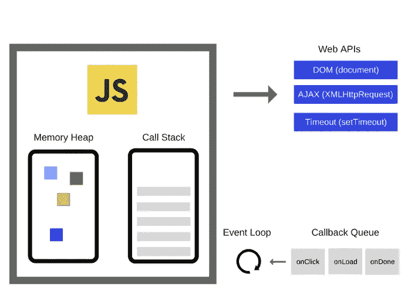
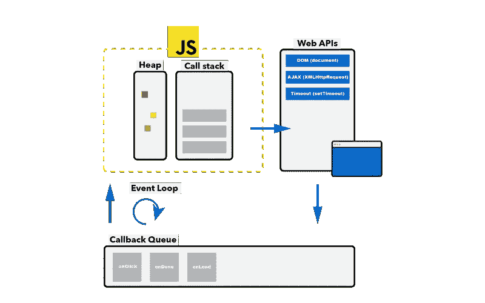
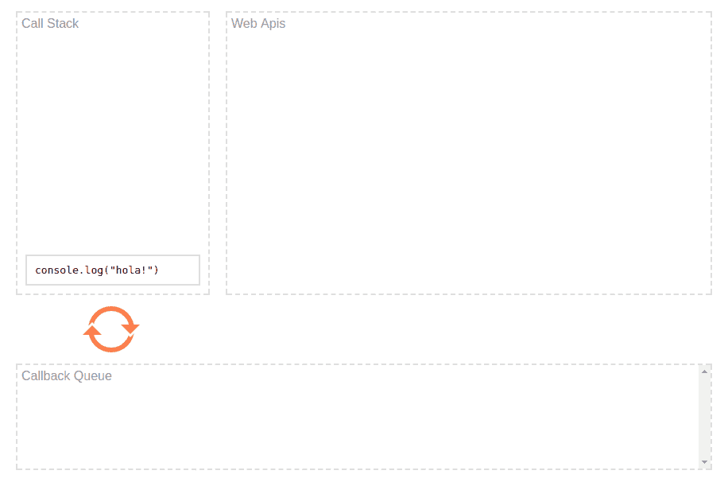

# Javascript 和事件循环

> 原文：<https://blog.devgenius.io/javascript-and-the-event-loop-2bc6d7594971?source=collection_archive---------3----------------------->


关于 Javascript、执行的生命周期、事件循环和示例的介绍性文章。

# Javascript 解释器

也称为 Javascript 引擎。它是一个可以在运行时分析和处理源代码的计算机程序。完全消除了其他编程语言中的编译过程。

今天最著名的 Javascript 引擎之一是著名的 **V8** 引擎，内置于谷歌 Chrome 浏览器并包含在 Nodejs 中。

V8 发动机的操作架构如下:


架构元素:

*   **内存堆** : Javascript 内存管理器。
*   **调用栈**:函数和任务的调用栈。

# 在单线程上工作

我们必须强调，Javascript 只适用于单个线程。这是因为浏览器默认只占用一个主线程来执行所有的 Javascript。因此 Javascript 被限制为一次只能运行一个任务。

因此，Javascript 使用非阻塞异步模型。这个模型使用它在网络上执行多种操作，处理用户交互，同时保持平滑的界面。

重要的是不要阻塞主线程，因为它是我们执行任务的唯一线程。如果我们阻止它，就有可能堵塞我们的系统。

**注意:**有一个规范叫做 web workers，它允许我们在 Javascript 中创建多线程，但本文并不涉及它。

# 非阻塞异步模型

为了能够以非阻塞的异步方式编程，我们需要依赖 Javascript 引擎外部的特性，这些特性是由 web 浏览器提供的。Javascript 语言的操作是基于引擎 **+** web API 的总和。

V8 引擎和导航器包含以下操作架构:



架构元素:

*   **Web API**:浏览器提供的一组 API。
*   **回调队列**:浏览器解析的代码队列。
*   **事件循环**:验证和转移机制。

提到浏览器提供的所有功能都将在另一个线程中执行，并且绝大多数是以异步方式执行的。同时，它与事件循环协作，以免阻塞在主线程中执行的调用堆栈。

# 事件循环和回调队列

这两个特性基本上是引擎和浏览器 API 之间的连接桥梁。回调队列负责解析，而事件循环负责验证和分派返回代码。

执行周期如下:



## 运行周期示例

在下面的例子中，我们将使用一个属于浏览器的 web APIS 的定时器，名为 setTimeout。这将在 1 秒钟后执行一个代码。

```
console.log('Execution 1');setTimeout(() => {
  console.log('Execution 2');
}, 1000);console.log('Execution3');
```

这段代码的结果是:

```
Execution 1
Execution 3
Execution 2
```

## 结果解释

1.  setTimeout 是异步处理的，而主线程运行其执行任务的过程。
2.  一旦异步操作被解决，它就被传递给队列回调。
3.  回调队列必须等待事件循环来检测调用堆栈是否繁忙。
4.  一旦调用堆栈不忙，事件循环就会传递解决代码。

这里有一个动画示例:



# Javascript 资源和事件循环

*   [**讲解事件循环视频**](https://www.youtube.com/watch?v=8aGhZQkoFbQ) :菲利普·罗伯茨在 JSconf 的演讲。
*   [**Web API 文档**](https://developer.mozilla.org/en-US/docs/Web/API):Web API 及特性列表。
*   [**Web workers 规范**](https://developer.mozilla.org/en-US/docs/Web/API/Web_Workers_API/Using_web_workers) :后台运行的文档和特性。

感谢你远道而来，如果你觉得这很有用，别忘了鼓掌👏。订阅以接收更多内容🔔。

如果你需要额外的帮助，请联系我🤠。

*   ✉️ [**给我发邮件**](mailto:dcortes.net@gmail.com)
*   🤝 [**在 LinkedIn 上联系我**](https://www.linkedin.com/in/dcortesnet/)
*   📮 [**在推特上联系我**](https://twitter.com/dcortes_net)

非常感谢您的阅读，我感谢您的时间。