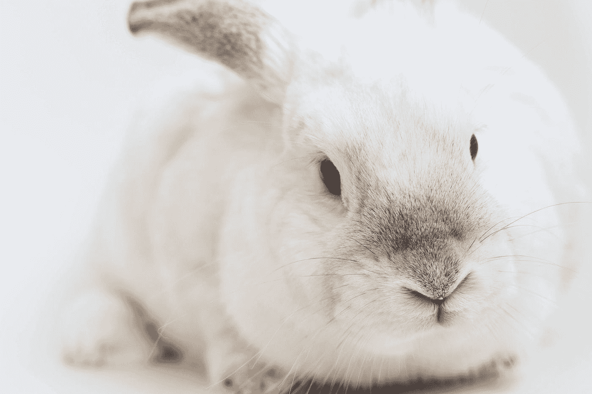

# JavaScript 和 Web——处理事件

> 原文：<https://blog.devgenius.io/javascript-and-the-web-handling-events-47cc526c1793?source=collection_archive---------36----------------------->


照片由 [Waranya Mooldee](https://unsplash.com/@anyadiary?utm_source=medium&utm_medium=referral) 在 [Unsplash](https://unsplash.com?utm_source=medium&utm_medium=referral) 上拍摄

JavaScript 是世界上最流行的编程语言之一。为了有效地使用它，我们必须了解它的基本知识。

在本文中，我们将看看如何在 JavaScript 中处理事件。

# 事件处理程序

我们可以添加事件处理程序来监听用户事件。

事件包括输入和鼠标点击。

例如，我们可以写:

```
window.addEventListener("click", () => {
  console.log("clicked");
});
```

然后，我们监听浏览器选项卡上的点击，并记录是否有东西被点击。

`addEventListener`用于收听我们选择的事件。

# 事件和 DOM 节点

我们还可以调用`addEventListener`来监听由 DOM 节点触发的事件。

例如，给定以下 HTML:

```
<button>Click me</button>
```

我们可以写:

```
const button = document.querySelector("button");
button.addEventListener("click", () => {
  console.log("clicked.");
});
```

侦听按钮的点击事件。

然后，当我们单击 Click me 按钮时，我们会看到`'clicked'`已登录。

还有一个`removeEventListener`方法，它将一个事件监听器作为移除它的参数。

例如，我们可以写:

```
const button = document.querySelector("button");
const clickOnce = () => {
  console.log("Done.");
  button.removeEventListener("click", clickOnce);
}
button.addEventListener("click", clickOnce);
```

然后`clickOnce`监听器将只运行一次，然后它不会再运行，因为我们用它作为参数调用了`removeListener`。

# 事件对象

事件对象被传入事件监听器，我们可以用它来获得关于事件的更多信息。

例如，我们可以写:

```
const button = document.querySelector("button");
button.addEventListener("mousedown", event => {
  if (event.button === 0) {
    console.log("left");
  } else if (event.button === 1) {
    console.log("middle");
  } else if (event.button === 2) {
    console.log("right");
  }
});
```

现在我们来听按钮的`mousedown`事件。

当我们点击按钮时它就会被触发。

如果`button`属性为 0，则单击左键。

如果是 1，那么点击中间的按钮。

如果是 2，那么点击右键。

因此，当我们左键单击时，我们得到`'left'`记录，当我们右键单击时，我们得到`'right'`记录。

`type`属性将拥有标识事件的字符串，例如`'click'`或`'mousedown'`。

# 传播

在 JavaScript 中，事件从原始元素一直向外传播到浏览器窗口。

如果默认情况下存在父级、祖父级等的事件处理程序，它们都将运行。

为了停止这种情况，我们可以在事件对象上调用`stopPropagation`方法。

例如，我们可以写:

```
const button = document.querySelector("button");
button.addEventListener("mousedown", event => {
  event.stopPropagation();
  if (event.button == 0) {
    console.log("left");
  } else if (event.button == 1) {
    console.log("middle");
  } else if (event.button == 2) {
    console.log("right");
  }
});
```

现在它不会传播到父母，祖父母，等等。

我们还可以使用`target`属性来添加一个监听器，它可以监听来自多个元素的动作。

例如，给定以下 HTML:

```
<button>foo</button>
<button>bar</button>
<button>baz</button>
```

我们可以写:

```
window.addEventListener("mousedown", event => {
  if (event.target.nodeName == "BUTTON") {
    console.log(event.target.textContent)
  }
});
```

然后我们根据哪个按钮记录了`'foo'`、`'bar'`、`'baz'`，因为`textContent`有按钮的内容。

# 默认操作

默认操作与许多事件相关联。

为了防止默认动作，我们可以调用`preventDefault()`来阻止它的发生。

事件处理程序在行为发生之前被调用，所以我们可以在那里调用它。

例如，如果我们有以下 HTML:

```
<a href='http://example.com'>example</a>
```

然后，我们可以通过写下以下内容来阻止人们点击链接进入该页面:

```
const link = document.querySelector("a");
link.addEventListener("click", event => {
  console.log("stopped");
  event.preventDefault();
});
```

`event.preventDefault();`停止默认动作，即转到带有 URL 的页面。

# 关键事件

当我们按下一个键时触发`keydown`事件，当一个键被释放时触发`keyup`事件。

例如，如果我们有下面的 HTML:

```
<p>
  foo
</p>
```

我们可以写:

```
window.addEventListener("keydown", event => {
  if (event.key === "g") {
    document.body.style.background = "green";
  }
});
window.addEventListener("keyup", event => {
  if (event.key === "g") {
    document.body.style.background = "";
  }
});
```

然后当我们按下 G 键时，背景会变成绿色。

当我们释放它的时候它会变回白色。

`key`属性具有被按下的键。



由 [Gustavo Zambelli](https://unsplash.com/@zamax?utm_source=medium&utm_medium=referral) 在 [Unsplash](https://unsplash.com?utm_source=medium&utm_medium=referral) 上拍摄的照片

# 结论

我们可以用`event`对象检测鼠标和键盘事件。

此外，我们可以通过传入事件侦听器来添加和删除 DOM 对象中的侦听器。