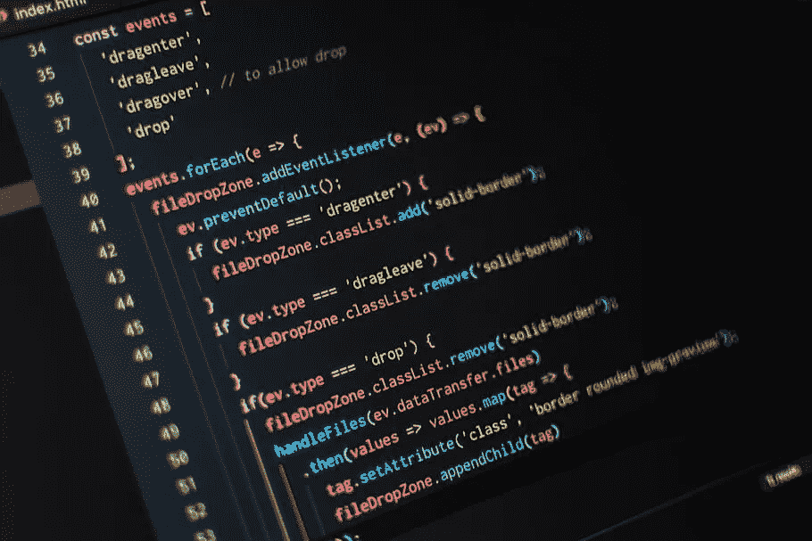

# 每个开发人员都应该学习的 Javascript 数组方法

> 原文：<https://blog.devgenius.io/javascript-array-methods-every-developer-should-learn-145f91cfefd?source=collection_archive---------14----------------------->

数组是编程中最基本和最有用的数据结构之一。它们是应用程序的构建块，是更高级的数据结构的基础。

每个认真的程序员都应该努力掌握数组。

javascript 编程语言对数组方法有很强的支持。让我们看看 javascript 中内置的一些“必须知道”的数组方法。

# 为每一个

forEach 方法简单而强大:您提供一个函数，它将按升序对每个数组元素执行一次。

举个例子来说明:

如上所示，forEach 方法主要用于您想要循环访问数组的时候。

# 分类

sort 方法对数组的元素进行排序。默认的排序顺序是升序。

重要:数组元素首先被转换成字符串，然后根据 UTF-16 代码单元值进行比较。

如前所述，数字没有“正确”排序的原因是因为 javascript 根据 UTF-16 代码单元顺序来比较这些数字。

为了修改这种默认行为，我们可以提供一个 compare()函数，并牢记以下几点:

*   如果 compare(a，b)返回小于 0 的值，则将 a 排序到比 b 低的索引(a 应该在 b 之前)。
*   如果 compare(a，b)返回 0，则 a 和 b 具有相同的优先级，顺序保持不变。
*   如果 compare(a，b)返回大于 0 的值，则将 b 排序到比 a 低的索引(b 应该在 a 之前)。

示例:

当然，compare()函数可以修改为:

*   按降序排序。
*   对对象排序。

# 地图

map 函数创建一个新数组，作为对数组中每个元素按升序调用回调函数的结果。

一个例子:

map()和 forEach()的区别在于 map()返回回调函数返回的值。而 forEach()不会对回调返回的值做任何事情。

filter 函数返回一个新的元素数组，该数组通过了由所提供的函数实现的测试。

# 结论

我们刚刚介绍了 JavaScript 数组的一些实用方法。还有更多可用的方法，您可以在官方的 [MDN 文档](https://developer.mozilla.org/en-US/docs/Web/JavaScript/Reference/Global_Objects/Array)中查看。如果你有什么建议，请随意写在下面。

如果您喜欢本教程，并想了解更多，我建议您阅读我的关于构建在数组之上的二进制堆数据结构的帖子。

[https://medium . com/dev-genius/how-to-implementation-a-binary-heap-JavaScript-d3a 0c 54112 fa](https://medium.com/dev-genius/how-to-implement-a-binary-heap-javascript-d3a0c54112fa)

*原载于*[*https://luispreciado . blog*](https://luispreciado.blog/posts/programming/javascript/javascript-arrays)*。*