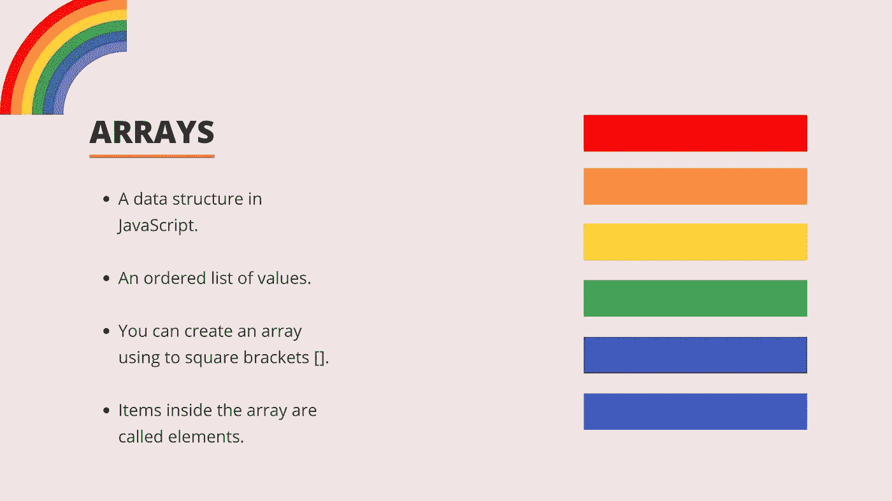
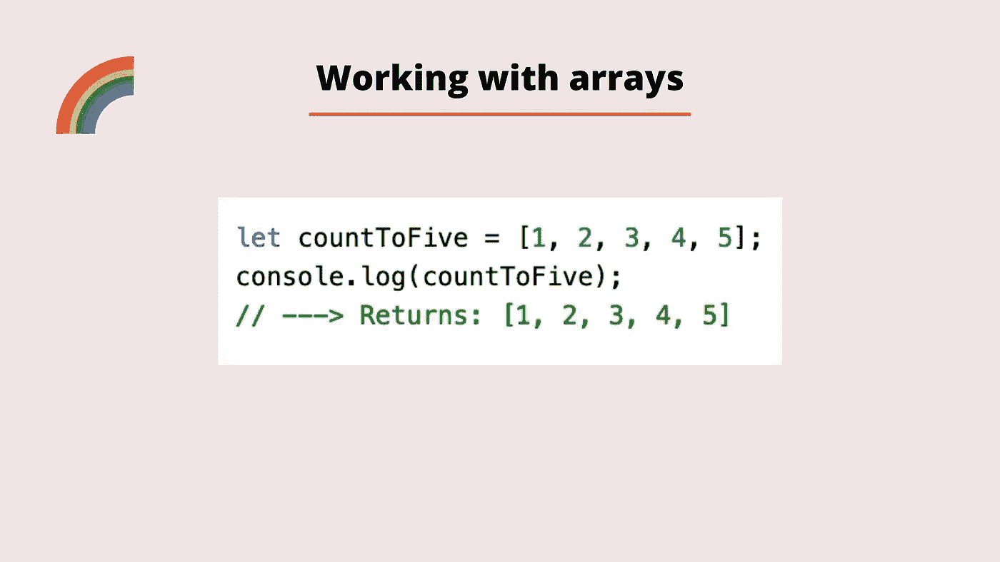
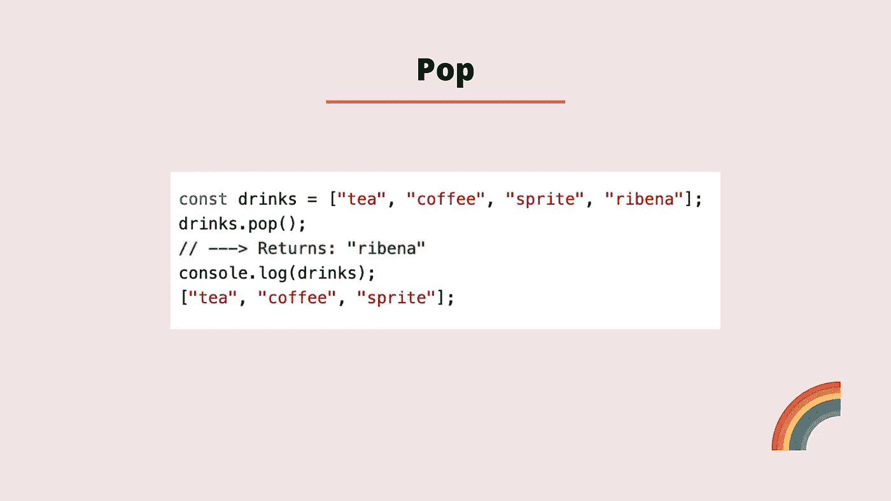
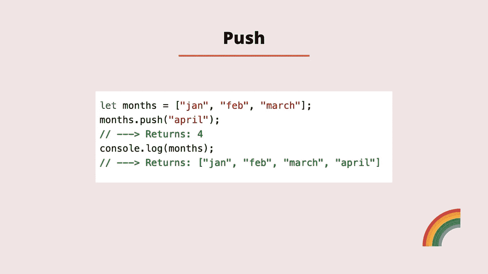
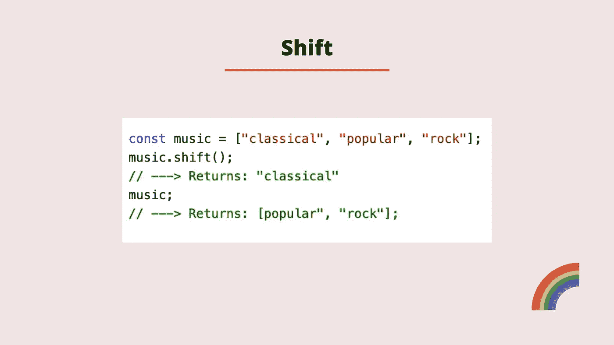
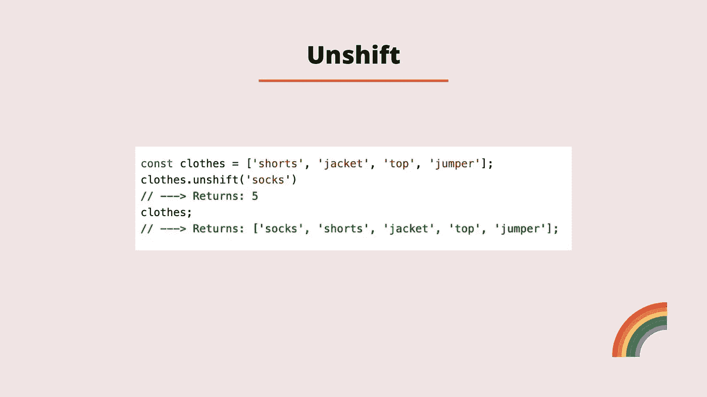
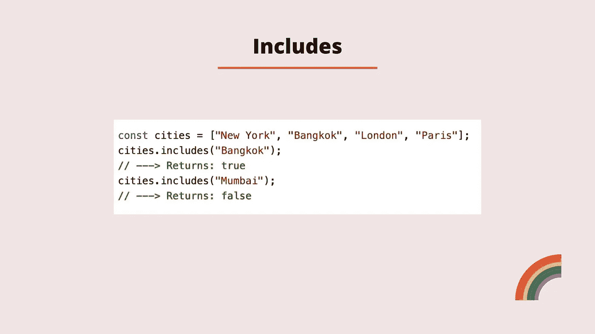
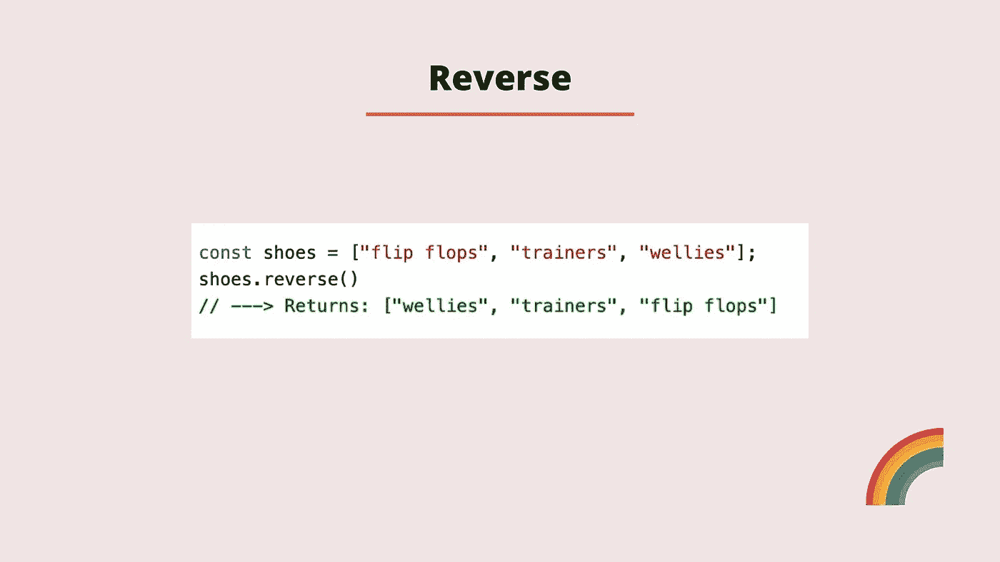
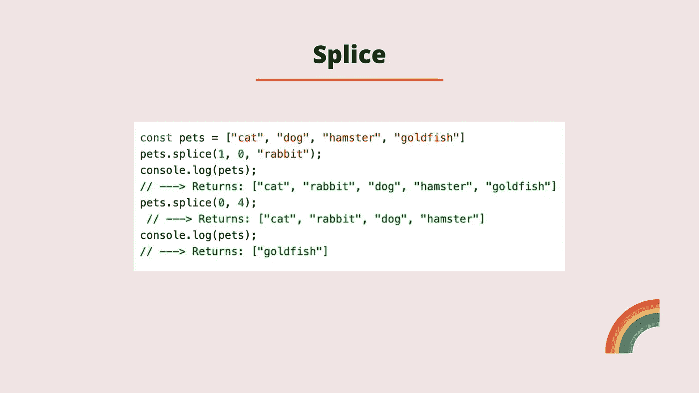
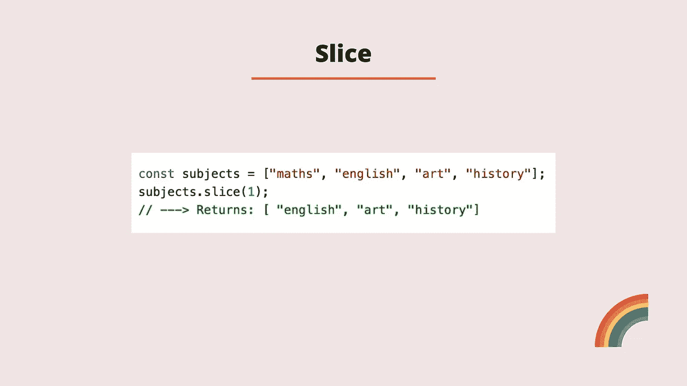

# 初学者应该知道的 JavaScript 数组的十种方法

> 原文：<https://blog.devgenius.io/javascript-array-walkthrough-with-methods-every-beginner-should-know-cf0c4531a75?source=collection_archive---------11----------------------->



## 什么是数据结构？

在计算机科学中，我们使用术语**数据结构**来描述我们存储数据和组织数据的方式。数组是 Javascript 中的一种数据结构。数组可以存储在一个变量中，在数组中我们可以存储任何原始值，数组也可以存储其他数组。数组的特殊之处在于它是一个**有序列表**。

如果我们有需要保持顺序的数据，那么我们会希望使用数组。一周中的日子可能是一个很好的例子，但另一个例子可能是按日期顺序显示的社交媒体帖子。

## **介绍阵列**

我们使用两个方括号来创建一个数组 *[]。*如果你熟悉字符串，与数组类似，数组中的每一项都被称为一个**元素。**这些元素中的每一个都有一个编号位置，称为**索引。**索引从零开始计数，因此对于字符串，我们可以说数组是**零索引的**。



上面的例子展示了一个数组文本的例子，它包含存储在变量 *countToFive* 中的数字。我们可以轻松地创建一个混合数据类型的数组，如下所示:

```
let countToFive = [1, null, “hi”, false];
```

## 数组索引

正如我前面提到的，数组中的元素有一个索引，就像处理字符串一样。索引从零开始，您可以使用方括号以完全相同的方式访问数组元素。如果我们想要访问 *countToFive* 数组的第一个元素，我们将执行以下操作:

```
let countToFive = [1, null, “hi”, false];
countToFive[0]// ---> Returns 1
```

## 长度

我们可以通过使用数组的名称和 length 属性来获得数组的长度。对于 *countToFive* 数组，我们将执行以下操作:

```
let countToFive = [1, null, “hi”, false];
countToFive.length// ---> Returns 4
```

## 易变性

不像字符串是不可变的，这意味着它们不能被改变，数组是可变的，这意味着我们可以改变它们。这意味着如果我们想改变一个数组元素，我们可以直接访问和更新它。因此，在新版本的 *countToFive* 数组中，如果我们想要将最后一个元素(false)改为 true，我们将执行以下操作:

```
let countToFive = [1, null, “hi”, false];
countToFive[3] = trueconsole.log(countToFive);

// ---> Returns [1, null, 'hi', true]
```

如果您熟悉 JavaScript 中的原始数据类型，如数字、布尔值、字符串、null 和 undefined，您可能会知道，当您在变量中存储这些数据类型之一时，它们是按值存储的，因此存储的是值本身。

## 参考类型

数组(和对象)要大得多，可以使用更多的内存，所以我们称之为**引用类型**。当您使用引用类型时，它是对存储在内存中的数据的引用。这有点像说你有你住的地方的地址。它是存储在计算机内存中的数据的地址，而不是存储的数据本身。由于这个事实，我们可以改变数组中存储的数据，这就是为什么我们说数组是**可变的，**我们可以使用 const 创建一个数组，然后改变数组中的数据。下面是上面例子的重复，之前使用了 *let* ，但是这次我们使用了 *const* ，你可以看到它仍然工作*。*

```
const countToFive = [1, null, “hi”, false];
countToFive[3] = true;console.log(countToFive);

// ---> Returns [1, null, 'hi', true]
```

这也意味着当我们使用一个数组方法时，该方法将直接影响数组，而不是当你使用字符串时，你必须手动保存更改。

用 const 创建数组时，唯一不能做的事情是改变整个数组。如果你想这样做，那么你必须用 let 创建数组。

```
const sizes = [9, 12, 13];
sizes = [1, 2, 3];// ---> Returns Uncaught TypeError: Assignment to constant variable.
    at <anonymous>:1:7
```

如果我们再重复一次，但是这次使用 let，你可以看到，因为数组是用 let 而不是 const 创建的，所以这次我们可以这样做。

```
let sizes = [9, 12, 13];
sizes = [1, 2, 3];// ---> [1, 2, 3];
```

## 方法

JavaScript 也有一些内置的方法，使得处理数组更加容易，现在我们来看看其中的一些。

## 索引 Of

方法参数的*index 获取我们正在寻找的值，并返回该值的从零开始的索引。如果该值在数组中多次出现，该方法将只返回元素的第一个实例的索引。如果该值不存在，该方法将返回-1。我们可以传递一个可选的第二个参数，它是要查看的索引。*


在上面的例子中，我们首先将一组数字存储在一个名为 *countdown* 的变量中。接下来我们调用传入 4 的方法的*index。coundown 数组中索引为 4 的元素是 1，这是我们得到的返回值。*

我们再次尝试，但这次传递的是索引 10。在这个索引处没有元素，所以我们得到-1 作为返回值。

我们再次重复这个过程，将 4 作为我们要寻找的值，将 3 作为索引。因为我们从索引 3 开始查看，元素 4 只存在于索引 1，所以我们得到-1 作为返回值。

## 流行音乐

要从数组末尾移除一个元素，JavaScript 为我们提供了一个叫做 *pop* 的方法。

pop 方法不接受任何参数。它将从数组末尾移除最后一个元素，返回值是由方法移除的值。



在上面的例子中，我们将创建一个名为 *drinks* 的数组，在这个数组中，我们添加了元素 tea、coffee、sprite 和 Ribena。我们想从饮料数组中删除 Ribena，所以我们使用 pop 方法。Ribena 是方法的返回值。当我们 console.log 饮料数组时，它现在只有三个元素，并且 Ribena 已被删除。

## 推

*push* 方法允许我们将项目添加到数组的末尾。该方法可以接受一个或多个用逗号分隔的参数。然后将参数*(()*)*中的*的值追加(添加)到数组的末尾。返回值将是新的元素被推入后数组中的元素数。



在上面的例子中，我们创建了一个名为 *months* 的数组，并在这个数组中添加了元素 jan、feb 和 march。我们想要添加一个额外的元素 april，所以我们使用方法 *push* 。

返回值是 4，因为数组现在包含 4 个元素。当我们 console . log months 数组时，它现在在数组中包含了 april。

## 变化

*shift* 方法将从数组中移除第一个元素。该方法与 pop 方法非常相似，但它移除第一个元素，而不是最后一个元素。返回值是从数组中移除的值。



在上面的例子中，我们创建了一个包含一些音乐流派的数组，存储在一个名为 *music 的变量中。*我们在数组上调用 *shift* 方法，移除数组的第一个元素并返回它。现在，当我们回忆音乐数组时，它只包含两个元素，字符串“classic*”*已被删除。

## 松开打字机或键盘的字型变换键

我们可以使用 *unshift* 方法在数组的开头添加条目。该方法与 push 方法非常相似，只是将项目添加到数组的开头。该方法的返回值是该方法运行后数组中的元素数。



在上面的例子中，我们创建了一个*衣服*数组，用一些字符串表示衣服的项目。接下来，我们调用 *unshift* 方法，并传入字符串“socks”*。unshift 方法的返回值是该方法运行后的元素数，因此我们得到 5。当我们调用衣服数组时，我们得到的更新后的数组的第一个元素是“socks”。*

## 包含

*includes* 方法允许我们查看一个数组是否包含一个特定的元素。该方法的返回值将总是布尔值(真或假)。该方法允许您选择性地将希望查看的位置的索引作为参数传入。如果没有向参数传递索引，那么将检查整个数组。



在上面的例子中，我们首先创建一个名为 *cities* 的变量，并存储一个包含城市名称字符串的数组。接下来，我们调用城市数组上的 includes 方法来检查该数组是否包含曼谷*。*因为城市数组包含曼谷，所以返回值为 true。

我们再次重复这一点，但这次我们寻找孟买。city 数组不包含这个字符串，所以我们得到 false 作为返回值。

## 反面的

为了反转数组中的元素，我们可以使用*反转*方法。该方法的参数中不包含任何内容。返回值将是所有元素逆序排列的数组。



在上面的例子中，我们创建了一个名为 shoes 的变量，它存储了一个字符串数组。然后我们调用 reverse 方法，我们得到返回给我们的数组，但是顺序相反。

## 加入

有时我们可能希望将数组的元素转换成字符串。 *join* 方法使我们能够做到这一点。该方法的返回值是一个包含所有连接的数组元素的字符串。我们可以选择向方法中传递一个参数，这将作为元素的分隔符。例如，*join("-"*)将返回由连字符分隔的元素，而*join(" "*)将使用空格分隔元素。


在示例中，我们创建了一个名为 laugh 的变量，它存储了一些字符串的数组。然后我们用一个空字符串调用 join 方法。这将所有未分离的字符串连接在一起。稍后我们重复这个，但是这次我们添加了一些空格作为分隔符。我们得到返回的字符串，但是每个元素之间有空格。

## 接合

*splice* 方法在数组中添加或删除元素。

*   该方法的第一个参数是该方法应开始更改数组的索引。
*   第二个参数是可选的，是应该删除的元素数量。
*   第三个参数也是可选的，它是要添加到数组中的元素。

方法返回包含已移除元素的数组。如果没有删除任何元素，则返回一个空数组。



在这个例子中，我们创建了一个 *pets* 变量来存储一个字符串数组。我们从调用拼接方法开始。这个函数的返回值将是一个空数组，因为我们没有删除任何元素。我们说过，在索引 1 处，不删除任何元素，但添加字符串 rabbit。当我们 console.log 出 pets 数组时，我们可以看到 rabbit 元素已经被添加到索引位置 1。

接下来，我们再次使用 splice 方法，但是这次使用参数 0 和 4。通过这样做，我们说，从索引 0 开始，删除 4 个元素。因为我们这次要移除元素，所以该方法返回一个包含四个已移除元素的数组。当我们注销这个宠物元素时，它只包含金鱼。

## 薄片

*slice* 方法让我们复制现有数组的一部分。该方法可以接受两个参数。

*   如果只有一个值被传递到参数中，则返回的数组将从该元素开始，一直到数组的末尾。
*   如果有两个值被传入参数，那么返回的数组将从第一个值开始，一直到第二个值的索引，但不包括第二个值的索引。
*   如果您向参数传递一个负值，那么该方法将倒计数该数量的索引。
*   如果您没有向该方法传递任何参数，那么将返回整个数组。



在上面的例子中，我们首先创建一个字符串数组，并存储在一个名为*主题*的变量中。我们在 subjects 数组上调用 slice 方法，传递一个值 1。该方法返回从索引 1 到数组末尾的所有元素，因为我们没有为第二个参数传入停止点。

如果我们包含第二个参数，我们将得到以下输出:

```
const subjects = ["maths", "english", "art", "history"];
subjects.slice(1, 2);// Returns ---> ["english"]
```

## 结论

请随时张贴任何意见，问题或反馈！

你可以在下面找到介绍这篇文章的视频。

我还有一门 [Udemy](https://www.udemy.com/course/learn-javascript-in-90-minutes/?couponCode=9992CF77401A9D8471E1) 课程，涵盖了这个话题以及更多。

下次见！