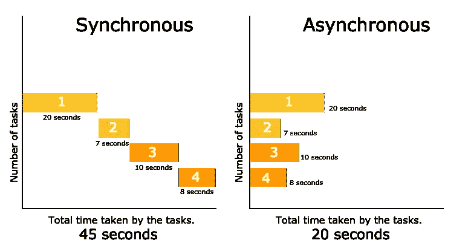
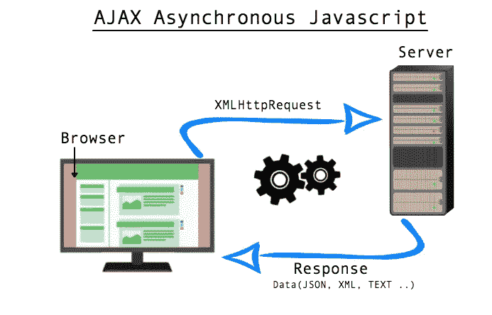
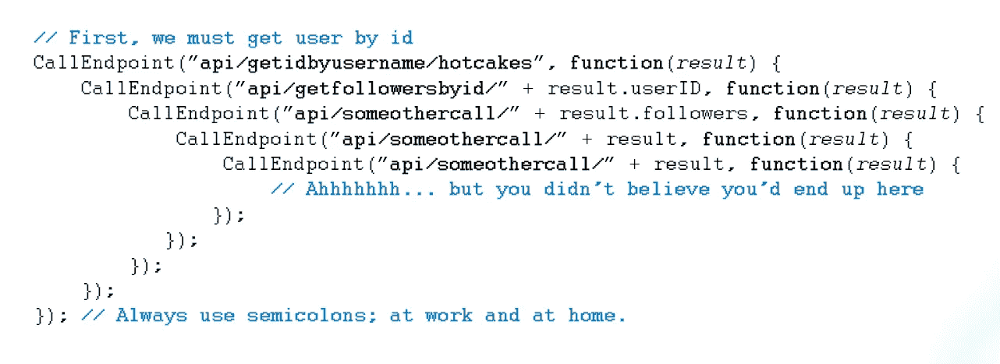

# JavaScript 异步操作—使用回调或承诺读取文件目录

> 原文：<https://blog.devgenius.io/javascript-asynchronous-operation-read-file-directory-with-callback-or-promises-9d74a236a928?source=collection_archive---------3----------------------->


Maksym Kaharlytskyi 在 [Unsplash](https://unsplash.com?utm_source=medium&utm_medium=referral) 上的照片

# **异步操作——我们为什么要关心？**

JavaScript 是一种同步、阻塞、单线程的语言。同步单线程意味着 JavaScript 等待任务完成，然后才能继续下一个任务。然而，如果每个任务都需要很长时间，那么异步 JavaScript 会让它变得更快！可以有独立的线程同时启动任务，而不是预先等待任务继续执行。



[http://www . phpmind . com/blog/2017/05/synchronous-and-asynchronous/](http://www.phpmind.com/blog/2017/05/synchronous-and-asynchronous/)

在计算机编程世界中，同步和异步可能仍然被认为是人类时间中的“快”。但是，让我们设想一个场景，如果发送了一个读取整个文件数据库的请求，而其中的文件非常大，因此需要很长时间来读取。与其等待，不如我们同时开始读取目录中的其他文件。这是异步 JavaScript。

# 异步操作—代码风格

在 JavaScript 中，函数是一等公民。这意味着函数可以像其他类型的值一样对待。函数可以作为参数传递给其他函数，作为值从其他函数返回，并存储在变量中。

异步操作被放入在主线程完成处理后运行的事件队列中，这样它们就不会停止后续 JavaScript 的运行。

JavaScript 使用两个主要的异步概念来利用函数一等公民:

1.  异步回调
2.  承诺

对于其他示例，帮助您进一步巩固对这两个概念的理解。

[](https://developer.mozilla.org/en-US/docs/Learn/JavaScript/Asynchronous/Introducing) [## 异步 JavaScript 简介

### 在这篇文章中，我们简要回顾了与同步 JavaScript 相关的问题，并先看一看一些…

developer.mozilla.org](https://developer.mozilla.org/en-US/docs/Learn/JavaScript/Asynchronous/Introducing) [](https://scotch.io/courses/10-need-to-know-javascript-concepts/callbacks-promises-and-async) [## 回调、承诺和异步

### JavaScript 中的同步操作需要让操作的每一步都等待前一步执行…

scotch.io](https://scotch.io/courses/10-need-to-know-javascript-concepts/callbacks-promises-and-async) 

让我们考虑一个对服务器的 AJAX(异步 JavaScript 和 XML)请求。



[http://www . phpmind . com/blog/2017/05/synchronous-and-asynchronous/](http://www.phpmind.com/blog/2017/05/synchronous-and-asynchronous/)

用户单击浏览器，这导致向服务器发送 HTTP 请求以读取整个目录，这可能需要一些时间。不是让浏览器停止运行任何其他函数并等待响应，而是设置另一个函数来等待该响应并在收到响应时做出反应。

让我们看看如何编写这些异步操作。

# **异步回调**

并非所有回调都是异步的。在这个上下文中使用`.map()`的回调没有被延迟。

```
[1,2,3].map((i) => i + 5)
```

另一方面，等待用户点击以调用功能。等待回调在特定时间执行。这个回调(第二个参数)是一个异步回调。一旦事件监听器(' click ')被听到，回调将执行。

```
$('#btn').on('click', () =>
  console.log('Callbacks are everywhere')
)
```

已发送 GET 请求来读取整个目录。让我们阅读所有文件。现在，我们将只读取文件名(由于额外的复杂性，不读取文件内容)并返回数据。回调使用一种叫做[延续传递风格](https://medium.com/@b.essiambre/continuation-passing-style-patterns-for-javascript-5528449d3070#:~:text=Continuation%20Passing%20Style%20basically%20means,the%20last%20parameter%20of%20functions.)的模式。还要注意，我们遵循 nodejs 社区采用的[错误优先回调](https://hashnode.com/post/whats-an-error-first-callback-in-nodejs-ciibz8ehi00lwj3xt257d72rt)模式。

```
const fs = require('fs');
const path = require('path');exports.readAll = (callback) => {
  var data = [];
  fs.readdir(`${exports.dataDir}`, (err, files) => {
    if (err) {
      throw 'error reading dir';
    } else {
      files.forEach((file) => {
        id = file.slice(0, 5);
        data.push({ id: id, text: id });
      });
      callback(null, data);
    }
  });
};exports.readOne = (id, callback) => { 
  fs.readFile(`${exports.dataDir}/${id}.txt`, 'utf8', 
  (err, text) => {
    if (err) {
      callback(new Error(`No item with id: ${id}`));
    } else {
      callback(null, { id, text });
    }
  });
};
```

不幸的是，如果我们添加更多的回调层，这导致嵌套回调中的嵌套回调，我们就进入了“回调地狱”的世界。



[https://medium . com/@ js _ tut/the-great-escape-from-callback-hell-3006 fa 2c 82e](https://medium.com/@js_tut/the-great-escape-from-callback-hell-3006fa2c82e)

帮助我们解决“回调地狱”的一个常见方法是很好地模块化我们的代码。这有助于提高“回调地狱”的可读性，但是要跟踪正在发生的事情仍然非常困难。

# **承诺**

Promises 是异步代码的新风格，专门用于处理异步操作。如果回应是真实的，许诺将执行你的请求。如果没有，承诺就不会。承诺有三种状态:

*   **待定** —操作(请求)开始前承诺的初始状态
*   **完成** —操作(请求)完成
*   **拒绝** —操作(请求)未完成，出现错误

构建承诺使用了`new`关键字，创建了一个`Promise`的`new`实例。Promise 构造函数接受一个单参数(回调)函数，该函数将`resolve`和`reject`作为其参数。

```
const promise = new Promise(function(resolve, reject) {
  // promise description
})
```

`resolve`允许我们更新承诺兑现的状态。

`reject`允许我们将承诺的状态更新为已拒绝。

promise 是一个普通的 JavaScript 对象，有可以调用的`.then`和`.catch`方法。如果承诺兑现，传入`.then`的函数将被调用。否则，如果承诺被拒绝(异步请求失败)，传递给`.catch` 的函数将被调用。

# 连锁承诺

`.then`和`.catch`将返回一个允许我们链接承诺的新承诺。这是对我们“回调地狱”场景的改进。我们可以更有顺序地思考。

```
function getPromise () {
  return new Promise((resolve) => {
    setTimeout(resolve, 2000)
  })
}

function logA () {
  console.log('A')
}

function logB () {
  console.log('B')
}

function logCAndThrow () {
  console.log('C')

  throw new Error()
}

function catchError () {
  console.log('Error!')
}

getPromise()
  .then(logA) // A
  .then(logB) // B
  .then(logCAndThrow) // C
  .catch(catchError) // Error!
```

# 许诺和承诺。所有

允诺是一种简单的转变。本质上，这是一个函数的转换，它有一个错误优先的回调风格，并返回它作为一个承诺。具有正确格式的基于回调的函数和库可以被“预先声明”。参见节点的`fs`模块中的异步`readFile`示例。

```
var readFile = Promise.promisify(require("fs").readFile);

readFile("myfile.js", "utf8").then(function(contents) {
    return eval(contents);
}).then(function(result) {
    console.log("The result of evaluating myfile.js", result);
}).catch(function(e) {
    console.log("Error reading file", e);
});
```

用`.promisifyAll`转换整个对象将保证整个对象遍历对象的属性，并在对象及其原型链上创建每个函数的异步等价物。原始方法不会被覆盖，但新的承诺方法将带有后缀`Async`。

```
var fs = Promise.promisifyAll(require("fs"));

fs.readFileAsync("myfile.js", "utf8").then(function(contents) {
    console.log(contents);
}).catch(function(e) {
    console.log("Error reading file", e);
});
```

使用`Promise.all()`,我们可以在一个数组(一个 iterable)中聚集一组承诺作为输入，并返回一个解析为结果数组的单个`Promise`。

*   当每个输入承诺都已解决时解决
*   拒绝任何已拒绝的输入承诺

此方法对于聚合多个承诺的结果非常有用，并在多个异步任务相互依赖才能成功完成时使用。

现在我们知道了所有关于承诺的知识，让我们用承诺异步操作来阅读我们的目录。

```
const fs = require('fs');
const path = require('path');
const Promise = require('bluebird');
const fsAsync = Promise.promisifyAll(fs);exports.readOne = (id, callback) => {
  return fsAsync
    .readFileAsync(`${exports.dataDir}/${id}.txt`, 'utf8')
    .then((text) => callback(null, { id, text }))
    .catch((err) => callback(new Error(`No item with id: ${id}`)))
};exports.readAll = (callback) => {
  var readFileAsync = Promise.promisify(exports.readOne);
  var promises = [];
  return fsAsync
    .readdirAsync(`${exports.dataDir}`).then((files) => {
      _.each(files, (file) => {
        var id = file.slice(0, 5);
        promises.push(readFileAsync(id));
      });
      Promise.all(promises)
        .then((promise) => callback(null, promise))
        .catch((err) => callback(
          new Error('error reading directory'))
        );
  });
};
```

有了承诺，我们现在可以使用`Promise.all()`异步读取目录中每个文件的内容。当我们读这个动作时，每个文件现在都被作为一个 promise 读取，并被推入 promise 数组。如果成功读取了所有文件，服务器中 RESTful 路由(Read all route)中的回调将会运行。

异步操作非常强大。这将由我们根据手头的任务来决定是同步还是异步运行代码。如果一项操作像浏览数据库一样耗时，那么让另一个线程异步完成这项任务可能会更好。