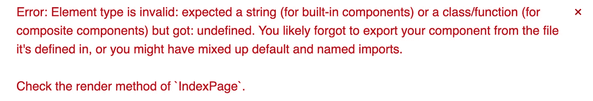
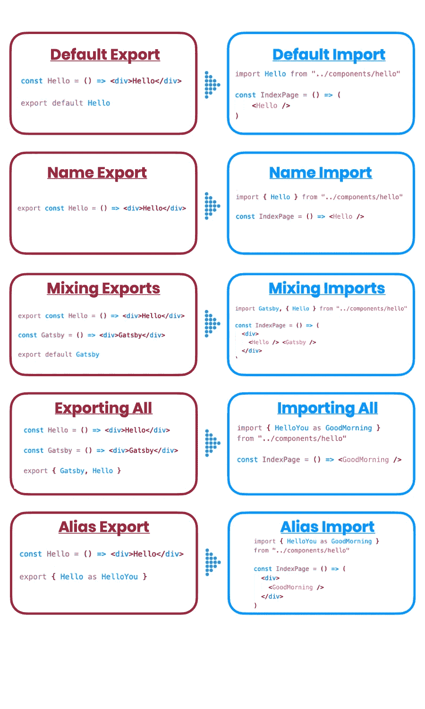

# 正确导出和导入的 Javascript 备忘单

> 原文：<https://blog.devgenius.io/javascript-cheat-sheet-on-exporting-importing-correctly-35b9a966456e?source=collection_archive---------6----------------------->

我曾经纠结于记住导入和导出，以及如何正确地做。我总是以一个错误结束，这就是为什么我做了一个小抄。

照片由[在](https://unsplash.com/@freetousesoundscom?utm_source=unsplash&utm_medium=referral&utm_content=creditCopyText) [Unsplash](https://unsplash.com/s/photos/wrong?utm_source=unsplash&utm_medium=referral&utm_content=creditCopyText) 上免费使用声音

但是，我们为什么要出口/进口呢？JavaScript 中的导入和导出语句帮助您在多个文件之间共享代码。而且，你可以[分配给 JavaScript 变量](https://www.robinwieruch.de/javascript-variable)的任何东西都可以被导入或导出。

照片由 Unsplash 上免费使用声音

未正确导出或导入将导致以下错误:

> 错误:元素类型无效:应为字符串(对于内置组件)或类/函数(对于复合组件)，但得到:未定义。您可能忘记了从定义组件的文件中导出组件，或者您可能混淆了默认导入和命名导入。

**有就要查:**

*   你没有忘记导出你的组件。
*   你确实正确地输入了它。
*   您的导入路径是正确的。恰巧我用了 vs 代码自动导入功能，路径不正确。
*   您正在导入一个不存在的组件。比方说，你注释了一个组件，而这个组件在页面上被调用。但是你忘了评论它的重要性。

不要误会我，我还是会犯那些愚蠢的进出口错误。所以，这是我的小抄:

我的 JS ES6 导入/导出备忘单

# 🕵️‍♂️走得更远:

 [## ES6 中的命名导出与默认导出

### ES6 允许我们导入一个模块并在其他文件中使用它。严格地说，在 React 术语中，可以使用无状态…

medium.com](https://medium.com/@etherealm/named-export-vs-default-export-in-es6-affb483a0910)